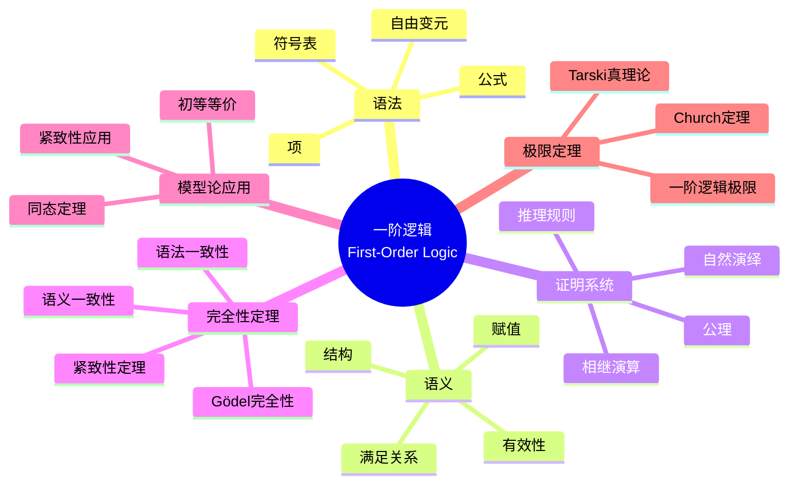

msc_primary: "00A99"
msc_secondary: ['00-XX']
---

# 一阶逻辑 (First-Order Logic)

## 思维导图

---

## 一、中心概念精确定义

### 1.1 一阶语言

**定义**：一阶语言 $\mathcal{L}$ 由以下部分组成：

1. **逻辑符号**：
   - 变元：$x, y, z, \ldots$（可数无穷多）
   - 联结词：$\neg$（非），$\wedge$（且），$\vee$（或），$\to$（蕴含），$\leftrightarrow$（等价）
   - 量词：$\forall$（全称），$\exists$（存在）
   - 等号：$=$（可选）
   - 标点：$(, ), ,$

2. **非逻辑符号**（符号表）：
   - 常元符号：$c_1, c_2, \ldots$
   - 函数符号：$f_1, f_2, \ldots$（每个有元数）
   - 谓词符号：$P_1, P_2, \ldots$（每个有元数）

### 1.2 项与公式

**项（Terms）**递归定义：
1. 每个变元和常元是项
2. 若 $t_1, \ldots, t_n$ 是项，$f$ 是 $n$ 元函数符号，则 $f(t_1, \ldots, t_n)$ 是项

**原子公式**：
- $P(t_1, \ldots, t_n)$，其中 $P$ 是 $n$ 元谓词，$t_i$ 是项
- $t_1 = t_2$（若语言含等号）

**公式（Formulas）**递归定义：
1. 每个原子公式是公式
2. 若 $\phi, \psi$ 是公式，则 $\neg\phi$，$\phi \wedge \psi$，$\phi \vee \psi$，$\phi \to \psi$ 是公式
3. 若 $\phi$ 是公式，$x$ 是变元，则 $\forall x \phi$，$\exists x \phi$ 是公式

**自由变元**：变元 $x$ 在公式中**自由**，如果它不在任何量词 $\forall x$ 或 $\exists x$ 的辖域内。

**句子（Sentence）**：没有自由变元的公式。

---

## 二、核心要素

### 2.1 结构 (Structures)

**定义**：语言 $\mathcal{L}$ 的**结构** $\mathcal{M} = (M, \mathcal{I})$ 包括：

1. **论域** $M$：非空集合
2. **解释函数** $\mathcal{I}$：
   - 常元 $c$：$\mathcal{I}(c) \in M$
   - $n$ 元函数符号 $f$：$\mathcal{I}(f): M^n \to M$
   - $n$ 元谓词符号 $P$：$\mathcal{I}(P) \subseteq M^n$

**记号简化**：直接用 $c^\mathcal{M}$，$f^\mathcal{M}$，$P^\mathcal{M}$ 表示解释。

### 2.2 语义解释

**赋值（Assignment）**：函数 $s: \text{Var} \to M$，给变元赋予论域中的值。

**项的解释** $\overline{s}(t)$：
- $\overline{s}(x) = s(x)$（变元）
- $\overline{s}(c) = c^\mathcal{M}$（常元）
- $\overline{s}(f(t_1, \ldots, t_n)) = f^\mathcal{M}(\overline{s}(t_1), \ldots, \overline{s}(t_n))$

**满足关系** $\mathcal{M} \models_s \phi$（结构 $\mathcal{M}$ 在赋值 $s$ 下满足 $\phi$）：

**原子公式**：
- $\mathcal{M} \models_s P(t_1, \ldots, t_n)$  iff  $(\overline{s}(t_1), \ldots, \overline{s}(t_n)) \in P^\mathcal{M}$
- $\mathcal{M} \models_s t_1 = t_2$  iff  $\overline{s}(t_1) = \overline{s}(t_2)$

**复合公式**：
- $\mathcal{M} \models_s \neg\phi$  iff  $\mathcal{M} \not\models_s \phi$
- $\mathcal{M} \models_s \phi \wedge \psi$  iff  $\mathcal{M} \models_s \phi$ 且 $\mathcal{M} \models_s \psi$
- $\mathcal{M} \models_s \phi \to \psi$  iff  $\mathcal{M} \models_s \phi$ 蕴含 $\mathcal{M} \models_s \psi$
- $\mathcal{M} \models_s \forall x \phi$  iff  对所有 $a \in M$，$\mathcal{M} \models_{s[x/a]} \phi$
- $\mathcal{M} \models_s \exists x \phi$  iff  存在 $a \in M$，$\mathcal{M} \models_{s[x/a]} \phi$

其中 $s[x/a]$ 是将 $x$ 赋值为 $a$，其余与 $s$ 相同的赋值。

### 2.3 有效性、可满足性与逻辑蕴涵

**有效性（Validity）**：公式 $\phi$ 是**有效的**，如果对所有结构 $\mathcal{M}$ 和所有赋值 $s$，$\mathcal{M} \models_s \phi$。记作 $\models \phi$。

**可满足性（Satisfiability）**：公式 $\phi$ 是**可满足的**，如果存在结构 $\mathcal{M}$ 和赋值 $s$，使得 $\mathcal{M} \models_s \phi$。

**逻辑蕴涵**：公式集 $\Gamma$ **逻辑蕴涵** $\phi$（记作 $\Gamma \models \phi$），如果对所有 $\mathcal{M}$ 和 $s$，若 $\mathcal{M} \models_s \gamma$ 对所有 $\gamma \in \Gamma$ 成立，则 $\mathcal{M} \models_s \phi$。

**逻辑等价**：$\phi$ 和 $\psi$ **逻辑等价**，如果 $\phi \models \psi$ 且 $\psi \models \phi$。

### 2.4 希尔伯特式证明系统

**公理模式**（对任意公式 $\phi, \psi, \chi$）：

**命题公理**：
1. $\phi \to (\psi \to \phi)$
2. $(\phi \to (\psi \to \chi)) \to ((\phi \to \psi) \to (\phi \to \chi))$
3. $(\neg\phi \to \neg\psi) \to (\psi \to \phi)$

**量词公理**：
4. $\forall x \phi \to \phi[x/t]$（$t$ 对 $x$ 在 $\phi$ 中可代入）
5. $\phi[x/t] \to \exists x \phi$（$t$ 对 $x$ 在 $\phi$ 中可代入）

**等词公理**（若语言含等号）：
6. $x = x$
7. $x = y \to (\phi[x/z] \to \phi[y/z])$

**推理规则**：
- **假言推理（MP）**：从 $\phi$ 和 $\phi \to \psi$ 推出 $\psi$
- **概括规则（Gen）**：从 $\phi$ 推出 $\forall x \phi$（$x$ 不在假设中自由出现）

### 2.5 自然演绎系统

**自然演绎**（Gentzen 系统）的特点：
- 更符合数学实践
- 引入和消去规则配对
- 允许临时假设

**主要规则**：

| 联结词 | 引入规则 | 消去规则 |
|--------|----------|----------|
| $\wedge$ | 从 $\phi, \psi$ 得 $\phi \wedge \psi$ | 从 $\phi \wedge \psi$ 得 $\phi$ 或 $\psi$ |
| $\to$ | 假设 $\phi$，证 $\psi$，得 $\phi \to \psi$ | 从 $\phi \to \psi$ 和 $\phi$ 得 $\psi$ |
| $\forall$ | 从 $\phi[x/c]$（$c$ 新常元）得 $\forall x \phi$ | 从 $\forall x \phi$ 得 $\phi[x/t]$ |
| $\exists$ | 从 $\phi[x/t]$ 得 $\exists x \phi$ | 从 $\exists x \phi$ 和 $\phi[x/y] \to \psi$ 得 $\psi$ |

---

## 三、性质与定理

### 定理 3.1：可靠性定理（Soundness）

若 $\Gamma \vdash \phi$（$\phi$ 可从 $\Gamma$ 证明），则 $\Gamma \models \phi$（$\Gamma$ 逻辑蕴涵 $\phi$）。

**意义**：证明系统中推出的结论在语义上确实有效。

**证明**：对证明长度归纳，验证每条公理有效且推理规则保持有效性。

### 定理 3.2：Gödel 完全性定理（1929）

若 $\Gamma \models \phi$，则 $\Gamma \vdash \phi$。

**等价形式**：
- 每个一致的公式集可满足
- 公式 $\phi$ 有效当且仅当可证

**证明概要**：
1. 添加新常元构造见证
2. 使用 Lindenbaum 引理扩充为极大一致集
3. 构造项模型（Henkin 模型）

### 定理 3.3：紧致性定理

公式集 $\Gamma$ 可满足当且仅当每个有限子集可满足。

**等价形式**：若 $\Gamma \models \phi$，则存在有限 $\Gamma_0 \subseteq \Gamma$ 使得 $\Gamma_0 \models \phi$。

**证明**：由完全性，证明论版本的紧致性（有限证明）蕴含语义紧致性。

**应用**：非标准模型、图的染色、代数闭域等。

### 定理 3.4：Löwenheim-Skolem 定理

**下降形式**：若语言 $\mathcal{L}$ 可数且 $\mathcal{L}$-结构 $\mathcal{M}$ 无穷，则存在可数初等子结构 $\mathcal{N} \preceq \mathcal{M}$。

**上升形式**：若 $\mathcal{M}$ 无穷，$\kappa \geq |\mathcal{L}|$ 是基数，则存在初等扩张 $\mathcal{N} \succeq \mathcal{M}$ 使得 $|\mathcal{N}| = \kappa$。

**意义**：一阶逻辑无法刻画无穷基数。

### 定理 3.5：Church 不可判定性定理

一阶逻辑的有效性问题是不可判定的，即不存在算法判定任意公式是否有效。

**等价表述**：
- 停机问题可归约到一阶逻辑有效性
- 算术的真理论不可判定（由 Gödel 定理）

---

## 四、典型例子

### 例子 4.1：群论的一阶公理化

**群的语言**：$\mathcal{L}_{\text{gp}} = \{e, \cdot, ^{-1}\}$（常元、二元运算、一元运算）

**群公理**：
1. 结合律：$\forall x \forall y \forall z ((x \cdot y) \cdot z = x \cdot (y \cdot z))$
2. 单位元：$\forall x (x \cdot e = x \wedge e \cdot x = x)$
3. 逆元：$\forall x (x \cdot x^{-1} = e \wedge x^{-1} \cdot x = e)$

**Abel 群**：添加 $\forall x \forall y (x \cdot y = y \cdot x)$

**挠群**：对每个 $n$，$\forall x (x^n = e \to x = e)$ 不能有限公理化。

### 例子 4.2：算术的一阶公理化

**Peano 算术语言**：$\mathcal{L}_{\text{PA}} = \{0, S, +, \cdot\}$

**Peano 公理**（一阶版本）：
1. $\forall x (Sx \neq 0)$
2. $\forall x \forall y (Sx = Sy \to x = y)$
3. $\forall x (x + 0 = x)$
4. $\forall x \forall y (x + Sy = S(x + y))$
5. $\forall x (x \cdot 0 = 0)$
6. $\forall x \forall y (x \cdot Sy = x \cdot y + x)$
7. **归纳模式**：对任意公式 $\phi(x)$：
$$\phi(0) \wedge \forall x (\phi(x) \to \phi(Sx)) \to \forall x \phi(x)$$

### 例子 4.3：紧致性定理的应用

**定理**：若图 $G$ 的每个有限子图可 $k$-染色，则 $G$ 可 $k$-染色。

**证明**：
1. 语言：顶点常元 $\{c_v : v \in V\}$，$k$ 个颜色谓词
2. 对每个有限子图可染色的条件写为公式
3. 有限可满足，由紧致性整体可满足

**非标准模型**：由紧致性，Peano 算术有非标准模型（含"无穷大"自然数）。

---

## 五、关联概念

### 5.1 直接关联

| 概念 | 关联描述 |
|------|----------|
| **模型论** | 研究逻辑语义的分支 |
| **证明论** | 研究形式证明系统的分支 |
| **可计算性** | 一阶逻辑的可判定性/不可判定性 |
| **集合论** | 一阶逻辑的模型基础 |

### 5.2 扩展关联

| 概念 | 关联描述 |
|------|----------|
| **高阶逻辑** | 允许量化谓词和函数 |
| **模态逻辑** | 增加模态算子（必然、可能） |
| **直觉主义逻辑** | 构造性数学基础 |
| **类型论** | 一阶逻辑的扩展，计算机科学应用 |

### 5.3 应用领域

- **数学基础**：公理化方法的形式基础
- **计算机科学**：形式验证、程序逻辑
- **人工智能**：知识表示、自动推理
- **语言学**：形式语义学

---

## 六、深入阅读与参考

### 推荐教材

1. **Enderton, H. B.** - *A Mathematical Introduction to Logic* (2nd ed., Academic Press, 2001)
   - 标准教材，全面介绍一阶逻辑

2. **van Dalen, D.** - *Logic and Structure* (5th ed., Springer, 2013)
   - 清晰的介绍，适合自学

3. **Hodges, W.** - *A Shorter Model Theory* (Cambridge, 1997)
   - 模型论的优秀教材

4. **Mendelson, E.** - *Introduction to Mathematical Logic* (6th ed., CRC Press, 2015)
   - 经典教材，详细证明

5. **Boolos, G. S., Burgess, J. P., & Jeffrey, R. C.** - *Computability and Logic* (5th ed., Cambridge, 2007)
   - 逻辑与可计算性的联系

### 经典论文

- **Gödel, K.** (1929) - "Über die Vollständigkeit des Logikkalküls"（博士论文）
- **Gentzen, G.** (1934) - "Untersuchungen über das logische Schließen"
- **Church, A.** (1936) - "An Unsolvable Problem of Elementary Number Theory"

---

## 七、总结

一阶逻辑是现代逻辑的基石：

1. **表达能力**：足够表达数学结构，又有良好的元逻辑性质
2. **完全性**：语法与语义的完美对应
3. **局限性**：紧致性和 Löwenheim-Skolem 定理表明其限制
4. **应用广泛**：数学、计算机科学、哲学的通用语言

**历史发展**：
- Frege (1879)：一阶逻辑的雏形
- Hilbert & Ackermann (1928)：系统表述
- Gödel (1929)：完全性定理
- Gentzen (1934)：自然演绎和相继演算
- Tarski (1930s)：语义学的形式化

**元逻辑性质对比**：

| 性质 | 命题逻辑 | 一阶逻辑 | 二阶逻辑 |
|------|----------|----------|----------|
| 完全性 | 是 | 是 | 否 |
| 紧致性 | 是 | 是 | 否 |
| Löwenheim-Skolem | 平凡 | 是 | 否 |
| 可判定性 | 是 | 否 | 否 |

**未解决问题**：
- 更高效的自动推理算法
- 一阶逻辑与高阶逻辑的关系
- 证明复杂性的理论

---

*文档版本：1.0*  
*创建日期：2026年4月*  
*对齐标准：逻辑学标准教材*
