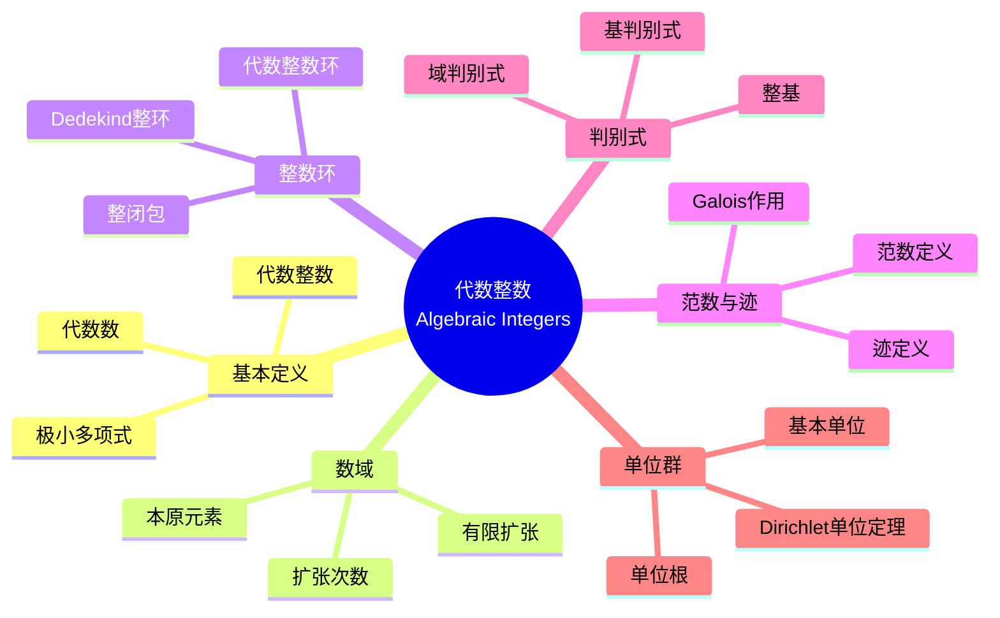

msc_primary: "00A99"
msc_secondary: ['00-XX']
---

# 代数整数 (Algebraic Integers)

## 思维导图

---

## 一、中心概念精确定义

### 1.1 代数数与代数整数

**定义 1.1.1（代数数）**：复数 $\alpha \in \mathbb{C}$ 称为**代数数**，如果存在非零多项式 $f(x) \in \mathbb{Q}[x]$ 使得 $f(\alpha) = 0$。

**定义 1.1.2（代数整数）**：复数 $\alpha \in \mathbb{C}$ 称为**代数整数**，如果存在首一多项式 $f(x) \in \mathbb{Z}[x]$ 使得 $f(\alpha) = 0$。

**基本性质**：
- 代数整数是代数数
- 有理代数整数恰好是普通整数 $\mathbb{Z}$
- 代数整数构成环（非显然！）

### 1.2 极小多项式

**定义**：代数数 $\alpha$ 的**极小多项式**是满足 $f(\alpha) = 0$ 的最低次数首一不可约多项式 $f(x) \in \mathbb{Q}[x]$。

**性质**：
- 极小多项式唯一
- 极小多项式的次数称为 $\alpha$ 的**次数**
- $\alpha$ 是代数整数当且仅当其极小多项式属于 $\mathbb{Z}[x]$

---

## 二、核心要素

### 2.1 数域 (Number Fields)

**定义**：**数域** $K$ 是 $\mathbb{Q}$ 的有限域扩张，即 $[K : \mathbb{Q}] < \infty$。

**本原元素定理**：每个数域可表示为 $K = \mathbb{Q}(\alpha)$，其中 $\alpha$ 为某代数数。

**例子**：
- 二次域：$K = \mathbb{Q}(\sqrt{d})$，$d$ 为无平方因子整数
- 分圆域：$K = \mathbb{Q}(\zeta_n)$，$\zeta_n = e^{2\pi i/n}$

**嵌入**：数域 $K$ 到 $\mathbb{C}$ 的域同态有恰好 $n = [K:\mathbb{Q}]$ 个，记为 $\sigma_1, \ldots, \sigma_n$。

### 2.2 整数环 (Ring of Integers)

**定义**：数域 $K$ 的**整数环** $\mathcal{O}_K$ 是 $K$ 中所有代数整数的集合。

**基本性质**：
1. $\mathcal{O}_K$ 是 $K$ 的子环
2. $\mathcal{O}_K \cap \mathbb{Q} = \mathbb{Z}$
3. $\mathcal{O}_K$ 是有限生成 $\mathbb{Z}$-模（秩为 $n$）

**具体例子**：

| 数域 $K$ | 整数环 $\mathcal{O}_K$ |
|----------|------------------------|
| $\mathbb{Q}$ | $\mathbb{Z}$ |
| $\mathbb{Q}(\sqrt{d})$, $d \equiv 2, 3 \pmod{4}$ | $\mathbb{Z}[\sqrt{d}]$ |
| $\mathbb{Q}(\sqrt{d})$, $d \equiv 1 \pmod{4}$ | $\mathbb{Z}\left[\frac{1+\sqrt{d}}{2}\right]$ |
| $\mathbb{Q}(\zeta_n)$ | $\mathbb{Z}[\zeta_n]$ |

### 2.3 范数与迹 (Norm and Trace)

**定义**：设 $K/\mathbb{Q}$ 为次数 $n$ 的扩张，$\alpha \in K$。

**范数**：
$$N_{K/\mathbb{Q}}(\alpha) = \prod_{i=1}^{n} \sigma_i(\alpha)$$

**迹**：
$$\text{Tr}_{K/\mathbb{Q}}(\alpha) = \sum_{i=1}^{n} \sigma_i(\alpha)$$

**性质**：
- $N_{K/\mathbb{Q}}(\alpha) \in \mathbb{Q}$，若 $\alpha \in \mathcal{O}_K$ 则属于 $\mathbb{Z}$
- $\text{Tr}_{K/\mathbb{Q}}(\alpha) \in \mathbb{Q}$，若 $\alpha \in \mathcal{O}_K$ 则属于 $\mathbb{Z}$
- 范数是积性的：$N(\alpha\beta) = N(\alpha)N(\beta)$
- 迹是线性的：$\text{Tr}(a\alpha + b\beta) = a\text{Tr}(\alpha) + b\text{Tr}(\beta)$

**二次域示例**：$K = \mathbb{Q}(\sqrt{d})$，$\alpha = a + b\sqrt{d}$
- $N(\alpha) = a^2 - db^2$
- $\text{Tr}(\alpha) = 2a$

### 2.4 判别式 (Discriminant)

**定义**：设 $\alpha_1, \ldots, \alpha_n$ 是 $K$ 的 $\mathbb{Q}$-基，**判别式**为：
$$\Delta(\alpha_1, \ldots, \alpha_n) = \det(\text{Tr}_{K/\mathbb{Q}}(\alpha_i \alpha_j))_{i,j} = \det(\sigma_i(\alpha_j))^2$$

**整基**：$\mathcal{O}_K$ 作为 $\mathbb{Z}$-模的基 $\{\omega_1, \ldots, \omega_n\}$ 称为**整基**。

**域判别式**：整基的判别式 $d_K = \Delta(\omega_1, \ldots, \omega_n)$ 是良定义的（不依赖于整基选择）。

**重要判别式**：

| 数域 $K$ | 域判别式 $d_K$ |
|----------|----------------|
| $\mathbb{Q}(\sqrt{d})$ | $d$ (若 $d \equiv 1 \pmod{4}$)，$4d$ (若 $d \equiv 2, 3 \pmod{4}$) |
| $\mathbb{Q}(\zeta_p)$, $p$ 奇素数 | $(-1)^{(p-1)/2} p^{p-2}$ |

### 2.5 单位群与 Dirichlet 单位定理

**定义**：$\mathcal{O}_K^\times = \{\alpha \in \mathcal{O}_K : \exists \beta \in \mathcal{O}_K, \alpha\beta = 1\}$ 是整数环的单位群。

**Dirichlet 单位定理**：设 $K$ 是次数为 $n$ 的数域，有 $r_1$ 个实嵌入和 $r_2$ 对复嵌入（$n = r_1 + 2r_2$），则：
$$\mathcal{O}_K^\times \cong \mu_K \times \mathbb{Z}^{r_1 + r_2 - 1}$$

其中 $\mu_K$ 是 $K$ 中单位根的有限循环群。

**秩**：单位群的自由秩为 $r = r_1 + r_2 - 1$。

**基本单位系**：生成自由部分的单位 $\varepsilon_1, \ldots, \varepsilon_r$ 称为**基本单位**。

---

## 三、性质与定理

### 定理 3.1：代数整数构成环

若 $\alpha, \beta$ 是代数整数，则 $\alpha + \beta$、$\alpha - \beta$、$\alpha \beta$ 也是代数整数。

**证明思路**：利用 $\mathbb{Z}[\alpha, \beta]$ 是有限生成 $\mathbb{Z}$-模，以及整性在扩张下的传递性。

### 定理 3.2：整基存在性

数域 $K$ 的整数环 $\mathcal{O}_K$ 存在整基，即存在 $\omega_1, \ldots, \omega_n \in \mathcal{O}_K$ 使得：
$$\mathcal{O}_K = \mathbb{Z}\omega_1 + \cdots + \mathbb{Z}\omega_n$$

**证明**：利用 $\mathcal{O}_K$ 是有限生成无挠 $\mathbb{Z}$-模（秩为 $n = [K:\mathbb{Q}]$）。

### 定理 3.3：Dedekind 整环性质

整数环 $\mathcal{O}_K$ 是 **Dedekind 整环**：
1. Noether 环
2. 整闭
3. 非零素理想极大

**推论**：$\mathcal{O}_K$ 中每个非零理想可唯一分解为素理想的乘积。

### 定理 3.4：范数的乘性

设 $K/\mathbb{Q}$ 是次数为 $n$ 的扩张，$\alpha \in K^\times$，则：
$$N_{K/\mathbb{Q}}(\alpha \mathcal{O}_K) = |N_{K/\mathbb{Q}}(\alpha)|$$

其中左边是理想 $\alpha\mathcal{O}_K$ 的范数（商环的大小），右边是元素的范数。

### 定理 3.5：Minkowski 界

设 $K$ 是次数为 $n$ 的数域，判别式为 $d_K$，则每个理想类包含代表元 $\mathfrak{a}$ 满足：
$$N(\mathfrak{a}) \leq \frac{n!}{n^n} \left(\frac{4}{\pi}\right)^{r_2} \sqrt{|d_K|}$$

**应用**：可用于计算类数，证明类群有限。

---

## 四、典型例子

### 例子 4.1：二次域 $\mathbb{Q}(\sqrt{-1})$

**整数环**：$\mathcal{O}_K = \mathbb{Z}[i]$（高斯整数环）

**单位群**：$\mathbb{Z}[i]^\times = \{1, -1, i, -i\} \cong \mu_4$

**范数**：$N(a + bi) = a^2 + b^2$

**判别式**：$d_K = -4$

**重要性**：研究两平方和定理，费马大定理 $n=4$ 情形。

### 例子 4.2：二次域 $\mathbb{Q}(\sqrt{-5})$

**整数环**：$\mathcal{O}_K = \mathbb{Z}[\sqrt{-5}]$

**非唯一分解**：
$$6 = 2 \cdot 3 = (1 + \sqrt{-5})(1 - \sqrt{-5})$$

验证：$N(2) = 4$，$N(3) = 9$，$N(1 \pm \sqrt{-5}) = 6$，这些都是不可约元但非素元。

**类数**：$h_K = 2$，类群为 $\mathbb{Z}/2\mathbb{Z}$。

**重要性**：Kummer 发现这一反例，引入理想理论。

### 例子 4.3：分圆域 $\mathbb{Q}(\zeta_p)$

设 $p$ 为奇素数，$\zeta_p = e^{2\pi i/p}$。

**整数环**：$\mathcal{O}_K = \mathbb{Z}[\zeta_p]$

**次数**：$[K : \mathbb{Q}] = \phi(p) = p - 1$

**判别式**：$d_K = (-1)^{(p-1)/2} p^{p-2}$

**单位群结构**：
- $r_1 = 0$，$r_2 = (p-1)/2$
- 单位秩 $r = (p-3)/2$

**重要性**：Kummer 利用分圆域证明费马大定理对某些指数成立。

---

## 五、关联概念

### 5.1 直接关联

| 概念 | 关联描述 |
|------|----------|
| **理想分解** | 代数整数环中理想的素理想分解理论 |
| **类数** | 整数环的理想类群大小，衡量唯一分解的偏离程度 |
| **单位定理** | 描述代数整数环单位群的结构 |
| **判别式** | 反映数域算术性质的核心不变量 |

### 5.2 扩展关联

| 概念 | 关联描述 |
|------|----------|
| **局部域** | 数域在素理想处的完备化 |
| **Adele 环** | 数域的整体结构，连接所有局部信息 |
| **类域论** | 描述 Abel 扩张与理想类群的关系 |
| **Diophantine 方程** | 利用代数整数研究整数解 |

### 5.3 应用领域

- **密码学**：椭圆曲线密码、数域筛法
- **编码理论**：代数几何码
- **计算数论**：整数分解、素性测试
- **数学物理**：弦论中的 Calabi-Yau 流形算术

---

## 六、深入阅读与参考

### 推荐教材

1. **Marcus, D. A.** - *Number Fields* (Springer, 1977)
   - 适合入门的经典教材，例题丰富

2. **Neukirch, J.** - *Algebraic Number Theory* (Springer, 1999)
   - 现代综合教材，涵盖局部-整体原理

3. **Lang, S.** - *Algebraic Number Theory* (2nd ed., Springer, 1994)
   - 经典高级教材，类域论部分详细

4. **Milne, J. S.** - *Algebraic Number Theory* (v3.08, 2020)
   - 优秀讲义，可在作者网站免费获取

5. **Washington, L. C.** - *Introduction to Cyclotomic Fields* (Springer, 1997)
   - 分圆域的权威参考书

### 在线资源

- **Number Theory Web**: 数论资源门户
- **LMFDB (L-functions and Modular Forms Database)**: 数域数据查询
- **PARI/GP**: 数域计算软件

---

## 七、总结

代数整数理论是代数数论的基础，其核心贡献包括：

1. **数的概念扩展**：从普通整数到代数整数，拓展了数论的研究范围
2. **理想理论**：解决唯一分解失效问题，引入理想概念
3. **整体-局部原理**：通过嵌入理解数域的结构
4. **算术不变量**：范数、迹、判别式等工具刻画数域性质

**历史意义**：Kummer（1840s）为证明费马大定理引入理想概念，Dedekind 和 Kronecker 建立现代代数数论框架。

**未解决问题**：
- 类数问题：确定给定类数的虚二次域
- 单位群的有效计算
- 代数整数环的结构问题

---

*文档版本：1.0*  
*创建日期：2026年4月*  
*对齐标准：MIT 18.782 Introduction to Arithmetic Geometry*
