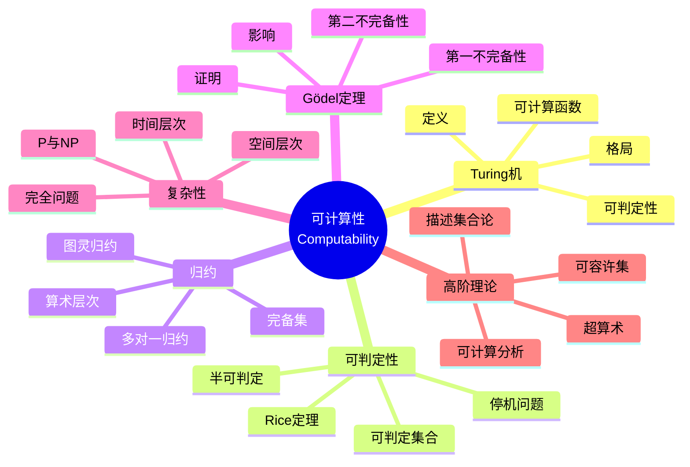

msc_primary: "00A99"
msc_secondary: ['00-XX']
---

# 可计算性 (Computability)

## 思维导图

---

## 一、中心概念精确定义

### 1.1 Turing 机

**定义**：Turing 机是七元组 $M = (Q, \Sigma, \Gamma, \delta, q_0, q_{\text{accept}}, q_{\text{reject}})$：
- $Q$：有限状态集
- $\Sigma$：输入字母表（不含空白符 $\sqcup$）
- $\Gamma$：带字母表，$\Sigma \subseteq \Gamma$，$\sqcup \in \Gamma$
- $\delta: Q \times \Gamma \to Q \times \Gamma \times \{L, R\}$：转移函数（偏函数）
- $q_0 \in Q$：初始状态
- $q_{\text{accept}}, q_{\text{reject}} \in Q$：接受和拒绝状态（互异）

**格局（Configuration）**：三元组 $(q, w, i)$，表示状态 $q$，带内容 $w$，读写头位置 $i$。

**计算**：格局序列 $C_1 \vdash C_2 \vdash \cdots$，由 $\delta$ 确定。

### 1.2 可计算函数与可判定性

**部分可计算函数**：函数 $f: \Sigma^* \to \Gamma^*$ 是**部分可计算的**，如果存在 Turing 机 $M$，对输入 $w$：
- 若 $f(w)$ 有定义，$M$ 停机且带上为 $f(w)$
- 若 $f(w)$ 无定义，$M$ 不停机

**全可计算函数**：部分可计算且对所有输入停机的函数。

**可判定集合**：语言 $L \subseteq \Sigma^*$ 是**可判定的**，如果其特征函数可计算。

**半可判定（递归可枚举）**：语言 $L$ 是**半可判定的**，如果存在 Turing 机接受 $L$（对 $w \in L$ 停机接受，对 $w \notin L$ 不停机或拒绝）。

---

## 二、核心要素

### 2.1 Church-Turing 论题

**论题**：任何直观上可计算的函数都是 Turing 可计算的。

**意义**：为可计算性提供精确定义。

**证据**：
- 多种计算模型等价（Turing 机、lambda 演算、递归函数、Post 系统等）
- 所有尝试定义可计算的合理模型都与 Turing 机等价
- 无反例已知

### 2.2 停机问题

**定义**：停机语言
$$A_{\text{TM}} = \{\langle M, w \rangle : M \text{ 是 TM 且 } M \text{ 接受 } w\}$$

**定理**：$A_{\text{TM}}$ 是不可判定的。

**证明**（对角线法）：假设 $H$ 判定 $A_{\text{TM}}$，构造 $D$：
- $D$ 在输入 $\langle M \rangle$ 上模拟 $H$ 在 $\langle M, \langle M \rangle \rangle$ 上
- 若 $H$ 接受，$D$ 拒绝；若 $H$ 拒绝，$D$ 接受

则 $D$ 在 $\langle D \rangle$ 上行为矛盾。

**意义**：计算的基本极限，证明存在不可判定问题。

### 2.3 归约 (Reductions)

**多对一归约（Many-One）**：$A \leq_m B$，如果存在可计算函数 $f$ 使得：
$$w \in A \iff f(w) \in B$$

**图灵归约**：$A \leq_T B$，如果 $A$ 可被访问 $B$ 的 oracle 的 Turing 机判定。

**性质**：
- 若 $B$ 可判定且 $A \leq_m B$，则 $A$ 可判定
- 若 $A \leq_m B$ 且 $A$ 不可判定，则 $B$ 不可判定（证明不可判定性的主要方法）

### 2.4 完备集与算术层次

**Rice 定理**：关于 Turing 机语言的任何非平凡性质都是不可判定的。

形式化：设 $P$ 是递归可枚举语言的非平凡性质，则
$$L_P = \{\langle M \rangle : L(M) \in P\}$$
是不可判定的。

**算术层次**：
- $\Sigma_1^0$：递归可枚举集（存在量词开头）
- $\Pi_1^0$：补递归可枚举集（全称量词开头）
- $\Delta_1^0 = \Sigma_1^0 \cap \Pi_1^0$：可判定集
- 更高层次：交替量词

**Post 定理**：$A \in \Delta_{n+1}^0$ 当且仅当 $A \leq_T B$ 对某 $B \in \Sigma_n^0$。

### 2.5 Gödel 不完备性定理

**第一不完备性定理**：任何一致、足够强的可公理化理论 $T$（如 PA）是不完备的，即存在句子 $\phi$ 使得 $T \not\vdash \phi$ 且 $T \not\vdash \neg\phi$。

**证明思路**：
1. Gödel 编码：将公式和证明编码为自然数
2. 自指：构造句子 $G$ 表示G在T中不可证
3. 若 $T \vdash G$，则 $T$ 不一致
4. 若 $T \vdash \neg G$，则 $T$ 证明 $G$ 可证，但 $G$ 说不可证，矛盾

**第二不完备性定理**：若 $T$ 一致，则 $T$ 不能证明自身的一致性 $\text{Con}(T)$。

---

## 三、性质与定理

### 定理 3.1：可判定集的特征

集合 $A$ 可判定当且仅当 $A$ 和 $\overline{A}$ 都是递归可枚举的。

**证明**：
- $(\Rightarrow)$：可判定 $\implies$ 显然递归可枚举
- $(\Leftarrow)$：并行模拟两台机器，一台接受 $A$，一台接受 $\overline{A}$

### 定理 3.2：停机问题的完备性

$A_{\text{TM}}$ 是递归可枚举完备的（$\Sigma_1^0$-完备）：
- $A_{\text{TM}} \in \Sigma_1^0$
- 对所有 $B \in \Sigma_1^0$，$B \leq_m A_{\text{TM}}$

### 定理 3.3：Tarski 不可定义性定理

算术真理论是不可定义的，即不存在公式 $\text{True}(x)$ 使得对所有句子 $\phi$：
$$\mathbb{N} \models \text{True}(\ulcorner \phi \urcorner) \leftrightarrow \phi$$

**意义**：真理不能在算术中定义。

### 定理 3.4：时间层次定理

**确定型时间层次**：对时间可构造函数 $f(n)$：
$$\text{DTIME}(o(f(n))) \subsetneq \text{DTIME}(f(n))$$

**推论**：$\text{P} \subsetneq \text{EXP}$。

### 定理 3.5：Cook-Levin 定理

SAT 是 NP-完备的：
- SAT $\in$ NP
- 对所有 $L \in$ NP，$L \leq_p$ SAT

**意义**：NP-完备性的第一个例子，复杂性理论的基石。

---

## 四、典型例子

### 例子 4.1：不可判定问题列表

| 问题 | 描述 | 归约来源 |
|------|------|----------|
| 停机问题 | $A_{\text{TM}}$ | 对角线法 |
| 空集问题 | $E_{\text{TM}} = \{\langle M \rangle : L(M) = \emptyset\}$ | Rice 定理 |
| 等价问题 | $EQ_{\text{TM}} = \{\langle M_1, M_2 \rangle : L(M_1) = L(M_2)\}$ | $E_{\text{TM}} \leq_m EQ_{\text{TM}}$ |
| Post 对应问题 | PCP | $A_{\text{TM}} \leq_m$ PCP |
| 字问题 | 群的字问题 | Post, Novikov, Boone |
| Hilbert 第10问题 | 丢番图方程可解性 | Matiyasevich 定理 |

### 例子 4.2：PCP 问题

**Post 对应问题**：给定骨牌集合 $\{(x_1, y_1), \ldots, (x_k, y_k)\}$，其中 $x_i, y_i$ 是字符串，是否存在序列 $i_1, \ldots, i_n$ 使得：
$$x_{i_1} x_{i_2} \cdots x_{i_n} = y_{i_1} y_{i_2} \cdots y_{i_n}$$

**定理**：PCP 是不可判定的。

**应用**：形式语言的不可判定性证明。

### 例子 4.3：Hilbert 第10问题

**问题**（Hilbert, 1900）：是否存在算法判定任意整系数多项式是否有整数解？

**Matiyasevich 定理（1970）**：不存在这样的算法。

**证明概要**：
- 递归可枚举集 = 丢番图集（Diophantine set）
- 存在递归可枚举但非递归的集
- 故存在不可判定的丢番图集

---

## 五、关联概念

### 5.1 直接关联

| 概念 | 关联描述 |
|------|----------|
| **Turing 机** | 可计算性的标准计算模型 |
| **停机问题** | 不可判定性的典范例子 |
| **Gödel 定理** | 形式系统的根本局限性 |
| **归约** | 证明不可判定性的核心技术 |

### 5.2 扩展关联

| 概念 | 关联描述 |
|------|----------|
| **复杂性理论** | 可计算性的精细分类（时间、空间） |
| **信息论** | Kolmogorov 复杂度与随机性 |
| **证明论** | 形式证明系统的性质 |
| **描述集合论** | 超算术层次与投影层次 |

### 5.3 应用领域

- **理论计算机科学**：算法设计与分析
- **形式验证**：程序正确性证明
- **人工智能**：可计算性限制
- **数学基础**：形式主义与构造主义

---

## 六、深入阅读与参考

### 推荐教材

1. **Sipser, M.** - *Introduction to the Theory of Computation* (3rd ed., Cengage, 2012)
   - 标准教材，清晰的入门介绍

2. **Hopcroft, J. E., Motwani, R., & Ullman, J. D.** - *Introduction to Automata Theory, Languages, and Computation* (3rd ed., Pearson, 2006)
   - 自动机与可计算性经典教材

3. **Boolos, G. S., Burgess, J. P., & Jeffrey, R. C.** - *Computability and Logic* (5th ed., Cambridge, 2007)
   - 可计算性与逻辑的完美结合

4. **Cooper, S. B.** - *Computability Theory* (Chapman & Hall, 2004)
   - 现代可计算性理论教材

5. **Soare, R. I.** - *Turing Computability: Theory and Applications* (Springer, 2016)
   - 可计算性理论的高级教材

### 经典论文

- **Turing, A. M.** (1936) - "On Computable Numbers, with an Application to the Entscheidungsproblem"
- **Church, A.** (1936) - "An Unsolvable Problem of Elementary Number Theory"
- **Gödel, K.** (1931) - "Über formal unentscheidbare Sätze der Principia Mathematica und verwandter Systeme I"
- **Matiyasevich, Y. V.** (1970) - "Enumerable sets are Diophantine"
- **Cook, S. A.** (1971) - "The Complexity of Theorem-Proving Procedures"

---

## 七、总结

可计算性理论探索计算的本质与极限：

1. **计算模型**：Turing 机作为标准，多种模型等价
2. **不可判定性**：停机问题揭示计算的固有局限
3. **归约技术**：将未知问题归约到已知问题
4. **层次结构**：算术层次、复杂性层次对问题的分类
5. **深远影响**：Gödel 定理改变数学基础的面貌

**历史发展**：
- Hilbert (1900s)：判定问题与形式化纲领
- Gödel (1931)：不完备性定理
- Turing, Church (1936)：可计算性的精确定义
- Post (1940s)：归约理论与度结构
- Matiyasevich (1970)：Hilbert 第10问题的解决
- Cook, Karp (1970s)：NP-完备性理论

**未解决问题**：
- P vs NP 问题
- 复杂性层次的严格包含关系
- 可计算性与物理的关系（量子计算、超计算）

---

*文档版本：1.0*  
*创建日期：2026年4月*  
*对齐标准：逻辑学标准教材*
