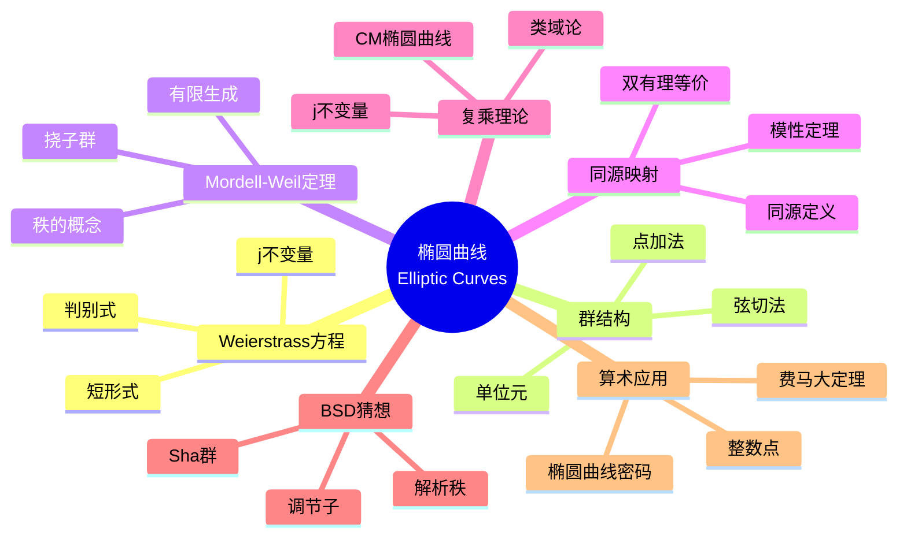

msc_primary: "00A99"
msc_secondary: ['00-XX']
---

# 椭圆曲线 (Elliptic Curves)

## 思维导图

---

## 一、中心概念精确定义

### 1.1 Weierstrass 方程

**定义**：域 $K$ 上的**椭圆曲线** $E$ 是满足 Weierstrass 方程的平面曲线：
$$E : y^2 + a_1 xy + a_3 y = x^3 + a_2 x^2 + a_4 x + a_6$$

其中 $a_i \in K$，且曲线非奇异（判别式 $\Delta \neq 0$）。

**短 Weierstrass 形式**（特征 $\neq 2, 3$）：
$$E : y^2 = x^3 + ax + b$$

**判别式**：$\Delta = -16(4a^3 + 27b^2) \neq 0$ 保证非奇异。

**j-不变量**：
$$j(E) = 1728 \cdot \frac{4a^3}{4a^3 + 27b^2}$$

$j(E)$ 在同构意义下分类椭圆曲线。

### 1.2 射影完备化

椭圆曲线在射影平面 $\mathbb{P}^2$ 中：
$$Y^2Z + a_1 XYZ + a_3 YZ^2 = X^3 + a_2 X^2Z + a_4 XZ^2 + a_6 Z^3$$

**无穷远点**：$\mathcal{O} = [0:1:0]$ 是唯一的无穷远点，作为群结构的单位元。

---

## 二、核心要素

### 2.1 群结构（弦切法）

**定理**：椭圆曲线 $E$ 上的点集 $E(K)$ 构成 Abel 群，运算由**弦切法**定义。

**点加法 $P + Q$**：
1. 画通过 $P$ 和 $Q$ 的直线（若 $P = Q$，画切线）
2. 找到直线与 $E$ 的第三个交点 $R$
3. $P + Q$ 是 $R$ 关于 $x$-轴的对称点

**坐标公式**（短形式 $y^2 = x^3 + ax + b$）：

设 $P = (x_1, y_1)$，$Q = (x_2, y_2)$：

若 $P \neq Q$：
$$\lambda = \frac{y_2 - y_1}{x_2 - x_1}$$

若 $P = Q$（倍点）：
$$\lambda = \frac{3x_1^2 + a}{2y_1}$$

则：
$$x_3 = \lambda^2 - x_1 - x_2, \quad y_3 = \lambda(x_1 - x_3) - y_1$$

**单位元**：无穷远点 $\mathcal{O}$。

**逆元**：$-(x, y) = (x, -y)$。

### 2.2 Mordell-Weil 定理

**定理（Mordell-Weil, 1922）**：设 $E$ 是数域 $K$ 上的椭圆曲线，则 $E(K)$ 是有限生成 Abel 群：
$$E(K) \cong E(K)_{\text{tors}} \times \mathbb{Z}^r$$

其中：
- $E(K)_{\text{tors}}$ 是有限挠子群（**挠部分**）
- $r \geq 0$ 是**秩**（自由部分的秩）

**秩的意义**：$r$ 度量了椭圆曲线的算术复杂性。$r = 0$ 时只有有限多个有理点。

**弱 Mordell-Weil 定理**：$E(K)/nE(K)$ 是有限群（对 $n \geq 2$）。

### 2.3 挠子群结构

**Mazur 定理（1977）**：设 $E$ 是 $\mathbb{Q}$ 上的椭圆曲线，则挠子群 $E(\mathbb{Q})_{\text{tors}}$ 同构于以下之一：
- $\mathbb{Z}/n\mathbb{Z}$，$n = 1, 2, \ldots, 10, 12$
- $\mathbb{Z}/2\mathbb{Z} \times \mathbb{Z}/2n\mathbb{Z}$，$n = 1, 2, 3, 4$

**意义**：挠子群只有 15 种可能结构，且都已实现。

### 2.4 同源映射 (Isogeny)

**定义**：椭圆曲线 $E_1$ 到 $E_2$ 的**同源**是保持单位元的有理映射 $\phi: E_1 \to E_2$，且是满射。

**性质**：
- 同源是同态（保持群结构）
- $\ker(\phi)$ 是有限群
- **次数**：$\deg(\phi) = |\ker(\phi)|$（可分情形）

**双有理等价**：同源是椭圆曲线的"正确"态射概念。

**模性定理（Wiles-Taylor 等, 1995）**：$\mathbb{Q}$ 上的椭圆曲线模性的完整证明，即对应于模形式。

### 2.5 复乘理论 (Complex Multiplication)

**定义**：椭圆曲线 $E/\mathbb{C}$ 有**复乘（CM）**，如果 End$(E) \supsetneq \mathbb{Z}$。

**等价条件**：
- End$(E) \cong \mathcal{O}$，其中 $\mathcal{O}$ 是虚二次域的序
- $j(E)$ 是代数整数

**CM 理论（Kronecker, Weber）**：设 $E$ 有 CM by $\mathcal{O}_K$，则：
- $K(j(E))$ 是 $K$ 的 Hilbert 类域
- $[K(j(E)) : K] = h_K$（类数）

**j-不变量的整性**：CM 椭圆曲线的 $j$-不变量是代数整数。

---

## 三、性质与定理

### 定理 3.1：椭圆曲线的群公理

$(E(K), +)$ 满足：
1. **封闭性**：$P + Q \in E(K)$
2. **结合律**：$(P + Q) + R = P + (Q + R)$（需验证，非平凡！）
3. **单位元**：$P + \mathcal{O} = P$
4. **逆元**：$P + (-P) = \mathcal{O}$
5. **交换律**：$P + Q = Q + P$

**结合律证明**：利用代数几何中的 Riemann-Roch 定理，或直接的坐标计算。

### 定理 3.2：Hasse 界

设 $E$ 是 $\mathbb{F}_q$ 上的椭圆曲线，则：
$$|q + 1 - \#E(\mathbb{F}_q)| \leq 2\sqrt{q}$$

**Frobenius 迹**：$a_q = q + 1 - \#E(\mathbb{F}_q)$，满足 $|a_q| \leq 2\sqrt{q}$。

**意义**：椭圆曲线的点数量近似于 $q + 1$。

### 定理 3.3：Lutz-Nagell 定理

设 $E: y^2 = x^3 + ax + b$ 为 $\mathbb{Q}$ 上的椭圆曲线，$\Delta = -16(4a^3 + 27b^2)$。

若 $P = (x, y) \in E(\mathbb{Q})_{\text{tors}}$，则：
1. $x, y \in \mathbb{Z}$
2. 要么 $y = 0$（2阶点），要么 $y^2 | \Delta$

**应用**：有效计算挠子群。

### 定理 3.4：降阶定理 (Descent Theorem)

**高度函数**：$h: E(\mathbb{Q}) \to \mathbb{R}_{\geq 0}$ 度量点的"复杂性"。

**定理**：
1. 对任意 $M > 0$，$\{P \in E(\mathbb{Q}) : h(P) \leq M\}$ 有限
2. $h(P + Q) + h(P - Q) = 2h(P) + 2h(Q) + O(1)$

**推论**：结合弱 Mordell-Weil 定理证明有限生成性。

### 定理 3.5：模性定理（谷山-志村-Weil 猜想）

**定理（Wiles, Taylor-Wiles, Breuil-Conrad-Diamond-Taylor, 1995-2001）**：$\mathbb{Q}$ 上的每条椭圆曲线都是模的，即存在权 2 的 Hecke 特征形式 $f$ 使得：
$$L(E, s) = L(f, s)$$

**应用**：Fermat 大定理的证明（Ribet + Wiles）。

---

## 四、典型例子

### 例子 4.1：同余数曲线

$$E_n : y^2 = x^3 - n^2 x$$

$n$ 是**同余数**当且仅当 $E_n(\mathbb{Q})$ 有正秩（无穷多个有理点）。

**例子**：$n = 5, 6, 7$ 是同余数，$n = 1, 2, 3$ 不是。

**点构造**：若 $(a, b, c)$ 是本原勾股数组，则 $n = ab/2$ 是同余数。

### 例子 4.2：Fermat 曲线与椭圆曲线

Fermat 大定理 $n = 3$ 情形可利用椭圆曲线：
$$E : y^2 = x^3 + 16$$

**性质**：$E(\mathbb{Q})_{\text{tors}} = \{\mathcal{O}, (0, \pm 4)\} \cong \mathbb{Z}/3\mathbb{Z}$，秩为 0。

### 例子 4.3：椭圆曲线的密码学应用

**椭圆曲线离散对数问题（ECDLP）**：给定 $P, Q \in E(\mathbb{F}_q)$，求 $n$ 使得 $Q = nP$。

**困难性**：目前无亚指数算法（与整数分解不同）。

**标准曲线**：
- Curve25519：$y^2 = x^3 + 486662x^2 + x$ over $\mathbb{F}_{2^{255}-19}$
- secp256k1：比特币使用的曲线

---

## 五、关联概念

### 5.1 直接关联

| 概念 | 关联描述 |
|------|----------|
| **Mordell-Weil 群** | 椭圆曲线上有理点的群结构 |
| **模形式** | 模性定理建立椭圆曲线与模形式的对应 |
| **BSD 猜想** | 椭圆曲线的类数公式类比 |
| **复乘** | 具有额外对称性的椭圆曲线 |

### 5.2 扩展关联

| 概念 | 关联描述 |
|------|----------|
| **阿贝尔簇** | 椭圆曲线的高维推广 |
| **模曲线** | 椭圆曲线的模空间 |
| **Galois 表示** | 椭圆曲线的 Tate 模表示 |
| **算术几何** | 算术曲面的基本对象 |

### 5.3 应用领域

- **密码学**：椭圆曲线密码体制（ECC）
- **数论**：费马大定理的证明
- **编码理论**：代数几何码
- **物理**：弦论中的 Calabi-Yau 流形

---

## 六、深入阅读与参考

### 推荐教材

1. **Silverman, J. H.** - *The Arithmetic of Elliptic Curves* (2nd ed., Springer, 2009)
   - 椭圆曲线的权威教材

2. **Silverman, J. H. & Tate, J.** - *Rational Points on Elliptic Curves* (2nd ed., Springer, 2015)
   - 适合入门的友好教材

3. **Washington, L. C.** - *Elliptic Curves: Number Theory and Cryptography* (2nd ed., Chapman & Hall, 2008)
   - 侧重密码学应用

4. **Koblitz, N.** - *Introduction to Elliptic Curves and Modular Forms* (Springer, 1993)
   - 椭圆曲线与模形式的联系

5. **Milne, J. S.** - *Elliptic Curves* (BookSurge, 2006)
   - 优秀讲义，在线可得

### 经典论文

- **Mordell, L. J.** (1922) - "On the Rational Solutions of the Indeterminate Equations of the Third and Fourth Degrees"
- **Weil, A.** (1929) - "L'arithmétique sur les courbes algébriques"
- **Wiles, A.** (1995) - "Modular Elliptic Curves and Fermat's Last Theorem"

---

## 七、总结

椭圆曲线是数论中最丰富和深刻的研究对象之一：

1. **群结构**：几何定义的群运算融合代数与几何
2. **算术性质**：Mordell-Weil 定理揭示有理点结构
3. **深刻联系**：与模形式、代数几何、表示论的广泛联系
4. **实际应用**：密码学、编码理论等领域

**历史发展**：
- Diophantus (250 AD)：椭圆曲线方程的早期研究
- Abel, Jacobi (1820s)：椭圆积分与椭圆函数
- Poincaré (1901)：有理点群结构猜想
- Mordell (1922)：Mordell-Weil 定理
- Weil (1929)：一般 Abel 簇的有限生成定理
- Wiles (1995)：模性定理与费马大定理

**未解决问题**：
- BSD 猜想的完整证明
- 秩的有界性或无界性
- 有理点的高效计算
- 椭圆曲线的平均秩问题

---

*文档版本：1.0*  
*创建日期：2026年4月*  
*对齐标准：MIT 18.782 Introduction to Arithmetic Geometry*
