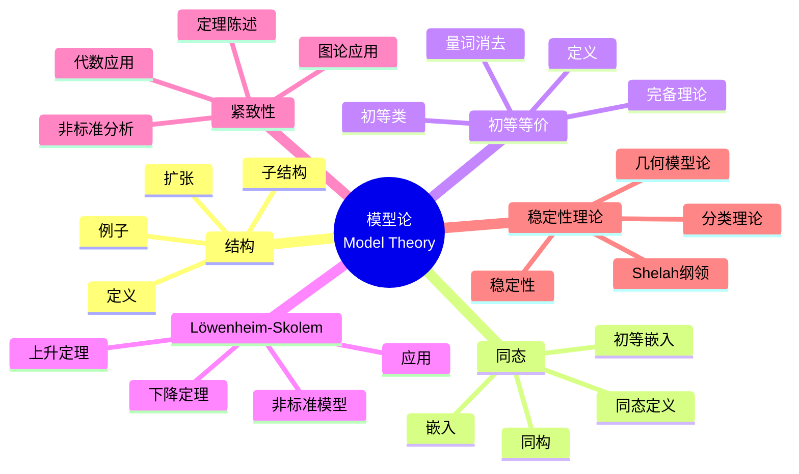

msc_primary: "00A99"
msc_secondary: ['00-XX']
---

# 模型论 (Model Theory)

## 思维导图

---

## 一、中心概念精确定义

### 1.1 结构 (Structures)

**定义**：语言 $\mathcal{L}$ 的**结构** $\mathcal{M} = (M, \mathcal{I})$ 包括：

- **论域** $M$：非空集合
- **解释** $\mathcal{I}$：给符号赋予意义
  - 常元 $c$：$c^{\mathcal{M}} \in M$
  - 函数符号 $f$：$f^{\mathcal{M}}: M^n \to M$
  - 谓词符号 $P$：$P^{\mathcal{M}} \subseteq M^n$

**例子**：群的结构 $\mathcal{G} = (G, e, \cdot, ^{-1})$，论域 $G$ 是群元素集合。

### 1.2 满足关系与真值

**满足**：结构 $\mathcal{M}$ 在赋值 $s$ 下满足公式 $\phi$，记作 $\mathcal{M} \models_s \phi$。

**真值定义**：

- 原子公式：按解释定义
- 布尔组合：递归定义
- 量词：$\forall x \phi$ 真当且仅当对所有 $a \in M$，$\phi[x/a]$ 真

**理论**：公式集 $T$ 称为**理论**，如果对某个结构类 $K$，$T$ 是在 $K$ 中真的所有句子。

---

## 二、核心要素

### 2.1 同态 (Homomorphisms)

**定义**：结构 $\mathcal{M}$ 到 $\mathcal{N}$ 的**同态** $h: M \to N$ 满足：

- $h(c^{\mathcal{M}}) = c^{\mathcal{N}}$（保持常元）
- $h(f^{\mathcal{M}}(a_1, \ldots, a_n)) = f^{\mathcal{N}}(h(a_1), \ldots, h(a_n))$（保持函数）
- $(a_1, \ldots, a_n) \in P^{\mathcal{M}} \implies (h(a_1), \ldots, h(a_n)) \in P^{\mathcal{N}}$（保持谓词）

**嵌入（Embedding）**：单射同态，且谓词双向保持。

**同构（Isomorphism）**：双射嵌入，记作 $\mathcal{M} \cong \mathcal{N}$。

### 2.2 初等映射与初等子结构

**初等映射**：$h: \mathcal{M} \to \mathcal{N}$ 是**初等的**，如果对所有公式 $\phi(x_1, \ldots, x_n)$ 和所有 $a_1, \ldots, a_n \in M$：
$$\mathcal{M} \models \phi(a_1, \ldots, a_n) \iff \mathcal{N} \models \phi(h(a_1), \ldots, h(a_n))$$

**初等子结构**：$\mathcal{M} \subseteq \mathcal{N}$ 且包含映射是初等的，记作 $\mathcal{M} \preceq \mathcal{N}$。

**Tarski-Vaught 判别准则**：$\mathcal{M} \subseteq \mathcal{N}$ 是初等子结构当且仅当对任意公式 $\exists x \phi(x, \bar{a})$，其中 $\bar{a} \in M$，若 $\mathcal{N} \models \exists x \phi(x, \bar{a})$，则存在 $b \in M$ 使 $\mathcal{N} \models \phi(b, \bar{a})$。

### 2.3 初等等价 (Elementary Equivalence)

**定义**：结构 $\mathcal{M}$ 和 $\mathcal{N}$ **初等等价**，记作 $\mathcal{M} \equiv \mathcal{N}$，如果对每个句子 $\phi$：
$$\mathcal{M} \models \phi \iff \mathcal{N} \models \phi$$

**性质**：

- 同构蕴含初等等价：$\mathcal{M} \cong \mathcal{N} \implies \mathcal{M} \equiv \mathcal{N}$
- 逆不成立（除非有限结构或特定语言）

**初等类**：结构类 $K$ 是**初等类（EC）**，如果存在理论 $T$ 使得 $K = \text{Mod}(T)$。

**广义初等类**：结构类 $K$ 是**广义初等类（EC_Δ）**，如果存在句子集 $\Sigma$ 使得 $K = \text{Mod}(\Sigma)$。

### 2.4 Löwenheim-Skolem 定理

**下降定理**：若语言 $\mathcal{L}$ 可数，$\mathcal{M}$ 无穷，则存在可数初等子结构 $\mathcal{N} \preceq \mathcal{M}$。

**上升定理**：若 $\mathcal{M}$ 无穷，$\kappa \geq |\mathcal{L}|$ 是基数，则存在初等扩张 $\mathcal{N} \succeq \mathcal{M}$ 且 $|\mathcal{N}| = \kappa$。

**意义**：

- 一阶逻辑无法区分不同无穷基数
- 存在任意大的模型

### 2.5 紧致性定理及其应用

**紧致性定理**：公式集 $\Gamma$ 可满足当且仅当每个有限子集可满足。

**应用 1：非标准模型**

Peano 算术 PA 有非标准模型 $\mathcal{N}^*$，包含无穷大自然数：

- 添加新常元 $c$ 和公理 $\{c > n : n \in \mathbb{N}\}$
- 有限可满足，故整体可满足

**应用 2：图的染色**

若图 $G$ 的每个有限子图可 $k$-染色，则 $G$ 可 $k$-染色。

**应用 3：四色定理的推广**

若每个有限平面图可 4-染色，则（通过紧致性）无限平面图也可 4-染色。

---

## 三、性质与定理

### 定理 3.1：初等等价的 Robinson 判据

$\mathcal{M} \equiv \mathcal{N}$ 当且仅当存在结构 $\mathcal{P}$ 和初等嵌入：
$$\mathcal{M} \preceq \mathcal{P} \succeq \mathcal{N}$$

### 定理 3.2：量词消去

理论 $T$ 允许**量词消去**，如果对每个公式 $\phi(x)$，存在无量词公式 $\psi(x)$ 使得：
$$T \models \forall x (\phi(x) \leftrightarrow \psi(x))$$

**意义**：

- 可判定性：若语言可判定，则理论可判定
- 完备性：量词消去 + 无穷模型 $\implies$ 完备

**例子**：

- 稠密线性序 DLO 允许量词消去
- 代数闭域 ACF 允许量词消去

### 定理 3.3：完备性判据

理论 $T$ 是**完备的**，如果对任意句子 $\phi$，$T \models \phi$ 或 $T \models \neg\phi$。

**Vaught 判别法**：若 $T$ 是 $k$-范畴的（某无穷基数 $k$ 上所有模型同构），则 $T$ 完备。

**例子**：ACF$_p$（特征 $p$ 的代数闭域）是完备的。

### 定理 3.4：插值定理 (Craig)

设 $\phi$ 和 $\psi$ 是句子，$\models \phi \to \psi$，则存在句子 $\theta$（只含 $\phi$ 和 $\psi$ 共有的符号）使得：
$$\models \phi \to \theta \text{ 且 } \models \theta \to \psi$$

### 定理 3.5：省略类型定理

设 $T$ 是可数完备理论，$\Phi(x)$ 是类型。若对每个公式 $\phi(x)$，存在 $T$ 的模型省略 $\phi(x)$，则存在 $T$ 的模型省略整个 $\Phi(x)$。

---

## 四、典型例子

### 例子 4.1：稠密线性序 (DLO)

**语言**：$\mathcal{L} = \{<\}$

**公理**：

- 线性序公理（全序、传递、反对称）
- 稠密性：$\forall x \forall y (x < y \to \exists z (x < z < y))$
- 无端点：$\forall x \exists y \exists z (y < x < z)$

**性质**：

- 允许量词消去
- 完备理论
- $\aleph_0$-范畴（Cantor 定理：可数稠密线性序同构）

### 例子 4.2：代数闭域 (ACF)

**语言**：$\mathcal{L}_{\text{ring}} = \{0, 1, +, -, \cdot\}$

**公理**：域公理 + 对每个 $n \geq 1$：
$$\forall a_0 \cdots \forall a_{n-1} \exists x (x^n + a_{n-1}x^{n-1} + \cdots + a_0 = 0)$$

**性质**：

- 允许量词消去（Tarski）
- ACF$_p$（特征 $p$）完备
- 代数闭域的理论可判定

### 例子 4.3：非标准分析

**构造**：通过紧致性构造 $\mathbb{R}$ 的非标准扩张 $^*\mathbb{R}$。

**性质**：

- $^*\mathbb{R}$ 包含无穷小和无穷大元素
- 转移原理：一阶命题在 $\mathbb{R}$ 和 $^*\mathbb{R}$ 中等价
- 使 Leibniz 的无穷小方法严格化

**无穷小**：$\varepsilon \in {}^*\mathbb{R}$ 是**无穷小**，如果对所有 $n \in \mathbb{N}$，$0 < |\varepsilon| < 1/n$。

---

## 五、关联概念

### 5.1 直接关联

| 概念 | 关联描述 |
|------|----------|
| **一阶逻辑** | 模型论的语法基础 |
| **初等等价** | 模型的逻辑等价关系 |
| **紧致性定理** | 模型论的核心工具 |
| **量词消去** | 理论的简化技术 |

### 5.2 扩展关联

| 概念 | 关联描述 |
|------|----------|
| **稳定性理论** | Shelah 发展的分类理论 |
| **o-极小性** | 几何模型论的重要方向 |
| **连续模型论** | 模型论在分析中的应用 |
| **代数几何** | 模型论与丢番图几何的联系 |

### 5.3 应用领域

- **代数**：Ax-Kochen 定理、Artin 猜想
- **分析**：非标准分析
- **组合**：正则性引理（模型论证明）
- **计算机科学**：形式验证、数据库理论

---

## 六、深入阅读与参考

### 推荐教材

1. **Hodges, W.** - *A Shorter Model Theory* (Cambridge, 1997)
   - 标准教材，平衡深度与可读性

2. **Chang, C. C. & Keisler, H. J.** - *Model Theory* (3rd ed., Dover, 2012)
   - 经典教材，内容全面

3. **Marker, D.** - *Model Theory: An Introduction* (Springer, 2002)
   - 现代视角，强调几何模型论

4. **Tent, K. & Ziegler, M.** - *A Course in Model Theory* (Cambridge, 2012)
   - 最新的教材，涵盖稳定性理论

5. **Goldrei, D.** - *Classic Set Theory* (Chapman & Hall, 1996)
   - 模型论与集合论的联系

### 经典论文

- **Morley, M.** (1965) - "Categoricity in Power"
- **Shelah, S.** (1970s-1980s) - 分类理论系列工作
- **Ax, J. & Kochen, S.** (1965) - "Diophantine Problems Over Local Fields"

---

## 七、总结

模型论研究逻辑语句与数学结构的关系：

1. **语义视角**：关注结构的性质和分类
2. **强大工具**：紧致性、Löwenheim-Skolem、量词消去
3. **深远联系**：与代数、几何、分析的广泛交叉
4. **现代发展**：稳定性理论、o-极小性、应用模型论

**历史发展**：

- Tarski (1930s-1950s)：模型论的奠基
- Robinson (1950s-1960s)：非标准分析
- Morley (1965)：范畴性定理
- Shelah (1970s-至今)：分类理论
- Hrushovski (1990s)：几何模型论应用

**未解决问题**：

- 复杂性分类的模型论方法
- 模型论与代数几何的深层联系
- 连续逻辑的发展

---

*文档版本：1.0*
*创建日期：2026年4月*
*对齐标准：逻辑学标准教材*
