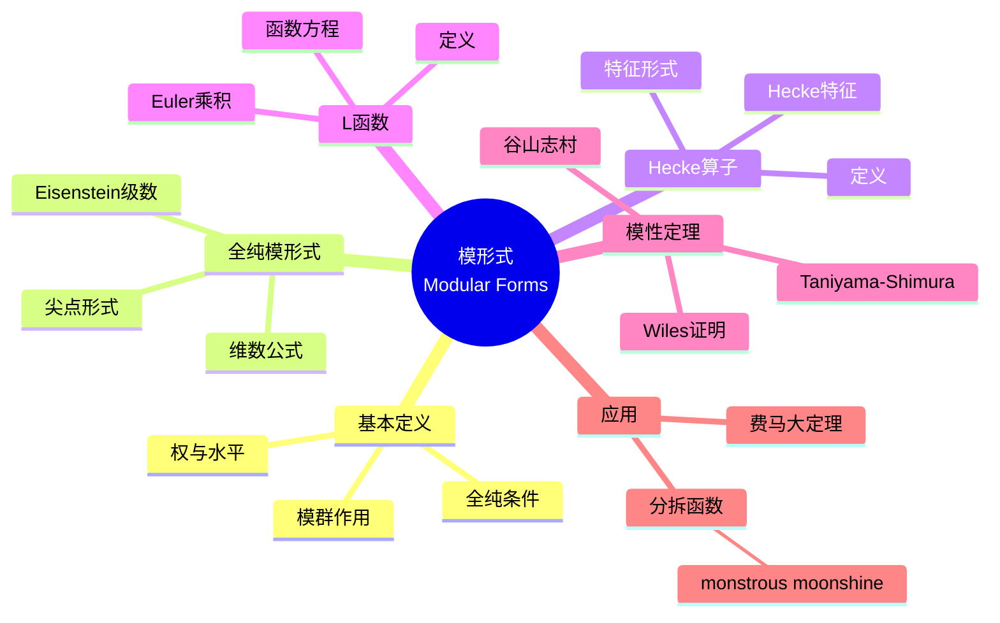

msc_primary: "00A99"
msc_secondary: ['00-00']
---

# 模形式 (Modular Forms)

## 思维导图

---

## 一、中心概念精确定义

### 1.1 模群与上半平面

**上半平面**：
$$\mathbb{H} = \{z \in \mathbb{C} : \text{Im}(z) > 0\}$$

**模群** $SL_2(\mathbb{Z})$：
$$SL_2(\mathbb{Z}) = \left\{\begin{pmatrix} a & b \\ c & d \end{pmatrix} : a, b, c, d \in \mathbb{Z}, ad - bc = 1\right\}$$

**作用**：对 $\gamma = \begin{pmatrix} a & b \\ c & d \end{pmatrix} \in SL_2(\mathbb{Z})$，
$$\gamma z = \frac{az + b}{cz + d}$$

**模群生成**：$SL_2(\mathbb{Z}) = \langle S, T \rangle$，其中：
- $S = \begin{pmatrix} 0 & -1 \\ 1 & 0 \end{pmatrix}$，$Sz = -\frac{1}{z}$
- $T = \begin{pmatrix} 1 & 1 \\ 0 & 1 \end{pmatrix}$，$Tz = z + 1$

### 1.2 模形式的定义

**定义**：设 $k \in \mathbb{Z}$。函数 $f: \mathbb{H} \to \mathbb{C}$ 称为**权 $k$ 的模形式**，如果：

1. **全纯性**：$f$ 在 $\mathbb{H}$ 上全纯
2. **模变换**：对所有 $\gamma = \begin{pmatrix} a & b \\ c & d \end{pmatrix} \in SL_2(\mathbb{Z})$：
$$f(\gamma z) = (cz + d)^k f(z)$$
3. **尖点条件**：$f$ 在 $\infty$ 处全纯（Fourier 展开无负次项）

**尖点形式**：若 $f$ 在 $\infty$ 处为零（$a_0 = 0$），则称为**尖点形式**。

**Fourier 展开**：由于 $f(z+1) = f(z)$，可展开为：
$$f(z) = \sum_{n=0}^{\infty} a_n q^n, \quad q = e^{2\pi i z}$$

---

## 二、核心要素

### 2.1 Eisenstein 级数

**定义**：权 $k \geq 4$ 的**Eisenstein 级数**定义为：
$$G_k(z) = \sum_{(m,n) \neq (0,0)} \frac{1}{(mz + n)^k}$$

**归一化 Eisenstein 级数**：
$$E_k(z) = \frac{1}{2\zeta(k)} G_k(z) = 1 - \frac{2k}{B_k} \sum_{n=1}^{\infty} \sigma_{k-1}(n) q^n$$

其中 $B_k$ 为 Bernoulli 数，$\sigma_{k-1}(n) = \sum_{d|n} d^{k-1}$。

**具体例子**：
$$E_4(z) = 1 + 240\sum_{n=1}^{\infty} \sigma_3(n) q^n$$
$$E_6(z) = 1 - 504\sum_{n=1}^{\infty} \sigma_5(n) q^n$$

**性质**：$E_k$ 生成权 $k$ 模形式空间的 Eisenstein 子空间。

### 2.2 判别式函数与模不变量

**判别式函数**（权 12 尖点形式）：
$$\Delta(z) = \frac{E_4(z)^3 - E_6(z)^2}{1728} = q \prod_{n=1}^{\infty} (1 - q^n)^{24} = \sum_{n=1}^{\infty} \tau(n) q^n$$

其中 $\tau(n)$ 是 **Ramanujan $\tau$ 函数**。

**模不变量 j**：
$$j(z) = \frac{E_4(z)^3}{\Delta(z)} = \frac{1}{q} + 744 + 196884q + \cdots$$

**性质**：
- $j$ 是权 0 模函数（在 $\infty$ 有极点）
- $j$ 给出上半平面模 $SL_2(\mathbb{Z})$ 与 $\mathbb{C}$ 的同构

### 2.3 模形式空间

**符号**：
- $M_k(SL_2(\mathbb{Z}))$：权 $k$ 模形式空间
- $S_k(SL_2(\mathbb{Z}))$：权 $k$ 尖点形式空间

**维数公式**（$k \geq 2$ 偶数）：
$$\dim M_k(SL_2(\mathbb{Z})) = \begin{cases} \lfloor k/12 \rfloor & k \equiv 2 \pmod{12} \\ \lfloor k/12 \rfloor + 1 & k \not\equiv 2 \pmod{12} \end{cases}$$

$$\dim S_k(SL_2(\mathbb{Z})) = \begin{cases} \lfloor k/12 \rfloor - 1 & k \equiv 2 \pmod{12} \\ \lfloor k/12 \rfloor & k \not\equiv 2 \pmod{12} \end{cases}$$

**维数表**：

| $k$ | 2 | 4 | 6 | 8 | 10 | 12 | 14 | 16 |
|-----|---|---|---|---|----|----|----|----|
| $\dim M_k$ | 0 | 1 | 1 | 1 | 1 | 2 | 1 | 2 |
| $\dim S_k$ | 0 | 0 | 0 | 0 | 0 | 1 | 0 | 1 |

### 2.4 Hecke 算子

**定义**：对素数 $p$，**Hecke 算子** $T_p$ 作用在权 $k$ 模形式上：
$$T_p f(z) = p^{k-1} f(pz) + \frac{1}{p} \sum_{j=0}^{p-1} f\left(\frac{z+j}{p}\right)$$

**Fourier 系数作用**：若 $f(z) = \sum_{n=0}^{\infty} a_n q^n$，则：
$$T_p f(z) = \sum_{n=0}^{\infty} (a_{pn} + p^{k-1} a_{n/p}) q^n$$

其中 $a_{n/p} = 0$ 若 $p \nmid n$。

**特征形式**：若对所有 $p$，$T_p f = \lambda_p f$，则 $f$ 称为**Hecke 特征形式**。

**性质**：
- Hecke 算子相互交换
- 可同时 diagonalize
- 特征形式的 Fourier 系数满足 $a_{mn} = a_m a_n$（当 $\gcd(m,n)=1$）

### 2.5 L-函数与函数方程

**定义**：权 $k$ Hecke 特征形式 $f(z) = \sum_{n=1}^{\infty} a_n q^n$ 的 **L-函数**：
$$L(f, s) = \sum_{n=1}^{\infty} \frac{a_n}{n^s} = \prod_p \frac{1}{1 - a_p p^{-s} + p^{k-1-2s}}$$

**Euler 乘积**：由 Hecke 关系 $a_{p^{n+1}} = a_p a_{p^n} - p^{k-1} a_{p^{n-1}}$ 得到。

**解析延拓**：$L(f, s)$ 可解析延拓到整个复平面。

**函数方程**：设 $\Lambda(f, s) = (2\pi)^{-s} \Gamma(s) L(f, s)$，则：
$$\Lambda(f, s) = (-1)^{k/2} \Lambda(f, k-s)$$

---

## 三、性质与定理

### 定理 3.1：模形式的代数结构

$$M_*(SL_2(\mathbb{Z})) = \bigoplus_{k=0}^{\infty} M_k(SL_2(\mathbb{Z})) \cong \mathbb{C}[E_4, E_6]$$

即模形式空间由 $E_4$ 和 $E_6$ 自由生成。

**推论**：$M_k(SL_2(\mathbb{Z}))$ 的基可由 $\{E_4^a E_6^b : 4a + 6b = k, a, b \geq 0\}$ 给出。

### 定理 3.2：Ramanujan 猜想（Deligne 定理）

对权 $k$ Hecke 特征形式 $f(z) = \sum a_n q^n$，有：
$$|a_p| \leq 2p^{(k-1)/2}$$

**Deligne 证明（1974）**：Weil 猜想的推论。

**权 12 情形**：$|\tau(p)| \leq 2p^{11/2}$。

### 定理 3.3：Atkin-Lehner 理论

对水平 $N$ 的模形式，定义 Atkin-Lehner 算子 $W_Q$，新的形式空间由"新形式"生成。

**新形式**：不被低水平模形式提升的 Hecke 特征形式。

**意义**：新形式理论是模性定理的核心。

### 定理 3.4：模性定理（谷山-志村-Weil 猜想）

**定理（Wiles, Taylor-Wiles, BCDT, 1995-2001）**：每条 $\mathbb{Q}$ 上的椭圆曲线 $E$ 对应于权 2 水平 $N$ 的新形式 $f$，使得：
$$L(E, s) = L(f, s)$$

其中 $N$ 是 $E$ 的导子。

**意义**：连接椭圆曲线与模形式的桥梁，费马大定理证明的关键。

### 定理 3.5： monstrous moonshine

**Borcherds 定理（1992）**：Monster 有限单群的表示理论与模函数 $j$ 的 Fourier 系数存在深刻联系。

**月光猜想（Conway-Norton）**：Monster 的不可约表示维数与 $j$ 的系数相关。

---

## 四、典型例子

### 例子 4.1：Ramanujan $\tau$ 函数

$$\Delta(z) = \sum_{n=1}^{\infty} \tau(n) q^n = q - 24q^2 + 252q^3 - 1472q^4 + \cdots$$

**性质**：
- $\tau$ 是积性函数：$\tau(mn) = \tau(m)\tau(n)$ 当 $\gcd(m,n) = 1$
- Ramanujan 猜想：$|\tau(p)| \leq 2p^{11/2}$（已证）

- Lehmer 猜想：$\tau(n) \neq 0$ 对所有 $n$（未解决）

### 例子 4.2：分拆函数与模形式

**分拆函数** $p(n)$：$n$ 的整数分拆数。

**生成函数**：
$$\sum_{n=0}^{\infty} p(n) q^n = \prod_{n=1}^{\infty} \frac{1}{1-q^n} = \frac{q^{1/24}}{\eta(z)}$$

其中 $\eta(z) = q^{1/24} \prod_{n=1}^{\infty} (1-q^n)$ 是 Dedekind $\eta$ 函数（权 1/2 模形式）。

**Ramanujan 同余式**：
$$p(5n+4) \equiv 0 \pmod{5}$$
$$p(7n+5) \equiv 0 \pmod{7}$$
$$p(11n+6) \equiv 0 \pmod{11}$$

### 例子 4.3：Theta 级数

设 $Q$ 是正定二次型，**Theta 级数**：
$$\Theta_Q(z) = \sum_{n \in \mathbb{Z}^r} q^{Q(n)}$$

**性质**：若 $Q$ 有偶数变量和偶矩阵，则 $\Theta_Q$ 是权 $r/2$ 模形式。

**例子**：$Q(x,y) = x^2 + y^2$，则：
$$\Theta_Q(z) = 1 + 4\sum_{n=1}^{\infty} \frac{q^n}{1 + q^{2n}} = 1 + 4(q + q^2 + 2q^3 + q^4 + \cdots)$$

对应于表示整数为两平方和的方式数。

---

## 五、关联概念

### 5.1 直接关联

| 概念 | 关联描述 |
|------|----------|
| **椭圆曲线** | 模性定理建立对应关系 |
| **Hecke 算子** | 模形式上的线性算子，生成 Euler 乘积 |
| **L-函数** | 模形式的解析不变量 |
| **尖点形式** | 在尖点处消失的模形式 |

### 5.2 扩展关联

| 概念 | 关联描述 |
|------|----------|
| **自守形式** | 模形式的高维推广（GL(2) 情形） |
| **Langlands 纲领** | 模形式的深远推广框架 |
| **顶点算子代数** | monstrous moonshine 的数学基础 |
| **算术几何** | 模曲线的算术性质 |

### 5.3 应用领域

- **数论**：费马大定理、分拆函数
- **物理**：弦论、共形场论
- **表示论**：moonshine 现象
- **编码理论**：模形式码

---

## 六、深入阅读与参考

### 推荐教材

1. **Diamond, F. & Shurman, J.** - *A First Course in Modular Forms* (Springer, 2005)
   - 现代模形式理论的标准教材

2. **Serre, J.-P.** - *A Course in Arithmetic* (Springer, 1973)
   - 经典教材，第7章模形式

3. **Koblitz, N.** - *Introduction to Elliptic Curves and Modular Forms* (Springer, 1993)
   - 椭圆曲线与模形式的联系

4. **Miyake, T.** - *Modular Forms* (Springer, 2006)
   - 全面的参考书籍

5. **Iwaniec, H.** - *Topics in Classical Automorphic Forms* (AMS, 1997)
   - 解析方法的视角

### 经典论文

- **Hecke, E.** (1936) - "Über die Bestimmung Dirichletscher Reihen durch ihre Funktionalgleichung"
- **Taniyama, Y.** (1956) - "Problem 12" (关于椭圆曲线的猜想)
- **Wiles, A.** (1995) - "Modular Elliptic Curves and Fermat's Last Theorem"
- **Borcherds, R.** (1992) - "Monstrous Moonshine and Monstrous Lie Superalgebras"

---

## 七、总结

模形式理论是现代数论的核心：

1. **对称性**：模群作用下的自守函数
2. **算术信息**：Fourier 系数编码深刻的数论信息
3. **深刻联系**：与椭圆曲线、表示论、物理的广泛联系
4. **未解之谜**：moonshine 现象的深层原因

**历史发展**：
- Elliptic 函数（Abel, Jacobi, 1820s）
- Eisenstein 级数（Eisenstein, 1847）
- 模群理论（Dedekind, Klein, 1870s-1880s）
- Hecke 理论（Hecke, 1930s）
- 模性定理（Wiles, 1995）
- Moonshine（Borcherds, 1992）

**未解决问题**：
- Lehmer 猜想（$\tau(n) \neq 0$）
- BSD 猜想的完整证明
- Moonshine 现象的完整解释
- Langlands 纲领的推进

---

*文档版本：1.0*  
*创建日期：2026年4月*  
*对齐标准：MIT 18.782 Introduction to Arithmetic Geometry*
