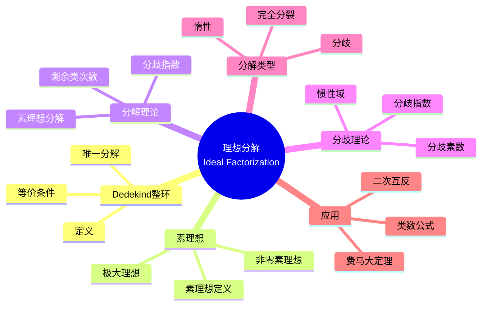

# 理想分解 (Ideal Factorization)

## 思维导图

---

## 1. 中心概念精确定义

### 1.1 Dedekind 整环

**定义**：整环 $R$ 称为 **Dedekind 整环**，如果满足：

1. **Noether 性**：$R$ 是 Noether 环（理想满足升链条件）
2. **整闭性**：$R$ 在其分式域中整闭
3. **维数条件**：$R$ 中每个非零素理想都是极大理想

**等价刻画**：Dedekind 整环等价于满足以下条件的整环：
- 每个非零理想可唯一分解为素理想的乘积
- 每个非零分式理想可逆

### 1.2 素理想与素元分解

**定义**：设 $R$ 为整环，理想 $\mathfrak{p} \subsetneq R$ 称为**素理想**，如果：
$$ab \in \mathfrak{p} \implies a \in \mathfrak{p} \text{ 或 } b \in \mathfrak{p}$$

**在 Dedekind 整环中**：非零素理想 = 极大理想

**唯一分解定理**：设 $R$ 为 Dedekind 整环，$\mathfrak{a} \subseteq R$ 为非零理想，则存在唯一（不计顺序）的素理想分解：
$$\mathfrak{a} = \mathfrak{p}_1^{e_1} \cdots \mathfrak{p}_r^{e_r}$$

其中 $\mathfrak{p}_i$ 为互异素理想，$e_i \geq 1$。

---

## 2. 核心要素

### 2.1 数域扩张中的素理想分解

设 $L/K$ 为数域的有限扩张，$\mathcal{O}_K$ 和 $\mathcal{O}_L$ 分别为整数环。

**问题**：$\mathcal{O}_K$ 中的素理想 $\mathfrak{p}$ 在 $\mathcal{O}_L$ 中如何分解？

**分解形式**：
$$\mathfrak{p}\mathcal{O}_L = \mathfrak{P}_1^{e_1} \cdots \mathfrak{P}_g^{e_g}$$

其中 $\mathfrak{P}_i$ 是 $\mathcal{O}_L$ 中位于 $\mathfrak{p}$ 上的素理想。

### 2.2 分歧指数与剩余类次数

**分歧指数（Ramification Index）**：
$$e_i = e(\mathfrak{P}_i / \mathfrak{p}) = \text{ord}_{\mathfrak{P}_i}(\mathfrak{p}\mathcal{O}_L)$$

即 $\mathfrak{p}$ 在 $\mathfrak{P}_i$ 处的分歧程度。

**剩余类次数（Inertia Degree/Residue Degree）**：
$$f_i = f(\mathfrak{P}_i / \mathfrak{p}) = [\mathcal{O}_L/\mathfrak{P}_i : \mathcal{O}_K/\mathfrak{p}]$$

即剩余类域扩张的次数。

**基本等式**：
$$\sum_{i=1}^{g} e_i f_i = [L : K] = n$$

### 2.3 分解类型分类

设 $[L:K] = n$，素理想 $\mathfrak{p}$ 的分解类型：

| 类型 | 条件 | 特征 |
|------|------|------|
| **完全分裂** | $g = n$, $e_i = f_i = 1$ | $\mathfrak{p}$ 完全分解为 $n$ 个不同素理想 |
| **惯性（惰性）** | $g = 1$, $e = 1$, $f = n$ | $\mathfrak{p}\mathcal{O}_L$ 仍为素理想 |
| **完全分歧** | $g = 1$, $e = n$, $f = 1$ | $\mathfrak{p} = \mathfrak{P}^n$ |
| **部分分歧** | 其他情况 | 中间情形 |

### 2.4 分歧理论

**分歧素数**：素理想 $\mathfrak{p}$ 在 $L/K$ 中**分歧**，如果存在 $i$ 使得 $e_i > 1$。

**分歧判别**：$\mathfrak{p}$ 分歧当且仅当 $\mathfrak{p} | \mathfrak{d}_{L/K}$，其中 $\mathfrak{d}_{L/K}$ 是**差积理想**（different）。

**分歧指数与判别式**：
$$\mathfrak{d}_{L/K} = \prod_{\mathfrak{P}} \mathfrak{P}^{e(\mathfrak{P}/\mathfrak{p}) - 1}$$

**塔性质**：对扩张塔 $M/L/K$，
$$e(\mathfrak{Q}/\mathfrak{p}) = e(\mathfrak{Q}/\mathfrak{P}) \cdot e(\mathfrak{P}/\mathfrak{p})$$
$$f(\mathfrak{Q}/\mathfrak{p}) = f(\mathfrak{Q}/\mathfrak{P}) \cdot f(\mathfrak{P}/\mathfrak{p})$$

### 2.5 Frobenius 元素与分解群

**分解群（Decomposition Group）**：对 $\mathcal{O}_L$ 的素理想 $\mathfrak{P}$，
$$D(\mathfrak{P}/\mathfrak{p}) = \{\sigma \in \text{Gal}(L/K) : \sigma(\mathfrak{P}) = \mathfrak{P}\}$$

**惯性群（Inertia Group）**：
$$I(\mathfrak{P}/\mathfrak{p}) = \{\sigma \in D(\mathfrak{P}/\mathfrak{p}) : \sigma(\alpha) \equiv \alpha \pmod{\mathfrak{P}}, \forall \alpha \in \mathcal{O}_L\}$$

**Frobenius 元素**：对非分歧素理想，$D/I \cong \text{Gal}((\mathcal{O}_L/\mathfrak{P})/(\mathcal{O}_K/\mathfrak{p}))$，Frobenius 元素 $\text{Frob}_{\mathfrak{P}}$ 是生成元。

---

## 3. 性质与定理

### 定理 3.1：Dedekind 整环的唯一分解

Dedekind 整环 $R$ 中每个非零理想可唯一表示为素理想的乘积。

**证明概要**：
1. 证明每个理想包含素理想的乘积
2. 利用分式理想的可逆性证明唯一性
3. 整闭性和 Noether 性保证分解的存在性

### 定理 3.2：素理想分解的存在性

设 $L/K$ 为数域扩张，$\mathfrak{p}$ 为 $\mathcal{O}_K$ 的素理想，则存在分解：
$$\mathfrak{p}\mathcal{O}_L = \mathfrak{P}_1^{e_1} \cdots \mathfrak{P}_g^{e_g}$$

且 $\sum e_i f_i = [L:K]$。

**证明**：利用 $\mathcal{O}_L$ 是 Dedekind 整环，以及 $\mathfrak{p}\mathcal{O}_L$ 是非零理想。

### 定理 3.3：Kummer 分解定理

设 $L = K(\alpha)$，$\alpha \in \mathcal{O}_L$，$f(x)$ 为 $\alpha$ 在 $K$ 上的极小多项式。设 $\mathfrak{p}$ 为 $\mathcal{O}_K$ 的素理想，$p \nmid [\mathcal{O}_L : \mathcal{O}_K[\alpha]]$，且：
$$\overline{f}(x) \equiv \overline{\varphi}_1(x)^{e_1} \cdots \overline{\varphi}_g(x)^{e_g} \pmod{\mathfrak{p}}$$

是 $\overline{f}$ 在 $(\mathcal{O}_K/\mathfrak{p})[x]$ 中的不可约分解，则：
$$\mathfrak{p}\mathcal{O}_L = \mathfrak{P}_1^{e_1} \cdots \mathfrak{P}_g^{e_g}$$

其中 $\mathfrak{P}_i = (\mathfrak{p}, \varphi_i(\alpha))$，且 $f(\mathfrak{P}_i/\mathfrak{p}) = \deg \overline{\varphi}_i$。

### 定理 3.4：分歧的判别式判定

素数 $p$ 在 $K/\mathbb{Q}$ 中分歧当且仅当 $p | d_K$（域判别式）。

**推论**：只有有限多个素数在数域中分歧。

### 定理 3.5：Chebotarev 密度定理

设 $L/K$ 为 Galois 扩张，$C$ 为 $\text{Gal}(L/K)$ 的一个共轭类，则：
$$\left|\left\{\mathfrak{p} : \left(\frac{L/K}{\mathfrak{p}}\right) = C, N(\mathfrak{p}) \leq x\right\}\right| \sim \frac{|C|}{|G|} \cdot \frac{x}{\ln x}$$

其中 $\left(\frac{L/K}{\mathfrak{p}}\right)$ 是 Frobenius 共轭类。

**意义**：Frobenius 元素在 Galois 群中均匀分布。

---

## 4. 典型例子

### 例子 4.1：二次域中的素数分解

设 $K = \mathbb{Q}(\sqrt{d})$，$d$ 为无平方因子整数。

**判别式**：
$$\Delta_K = \begin{cases} d & \text{if } d \equiv 1 \pmod{4} \\ 4d & \text{if } d \equiv 2, 3 \pmod{4} \end{cases}$$

**素数 $p$ 的分解**（Legendre 符号 $(\frac{\Delta_K}{p})$）：

| 类型 | 条件 | 分解形式 |
|------|------|----------|
| 分裂 | $(\frac{\Delta_K}{p}) = 1$ | $p\mathcal{O}_K = \mathfrak{p}_1 \mathfrak{p}_2$，$N(\mathfrak{p}_i) = p$ |
| 惰性 | $(\frac{\Delta_K}{p}) = -1$ | $p\mathcal{O}_K$ 为素理想，$N(p\mathcal{O}_K) = p^2$ |
| 分歧 | $p | \Delta_K$ | $p\mathcal{O}_K = \mathfrak{p}^2$，$N(\mathfrak{p}) = p$ |

**高斯整数环例子**：$K = \mathbb{Q}(i) = \mathbb{Q}(\sqrt{-1})$，$\Delta_K = -4$

- $p = 2$：$2 = (1+i)^2$，分歧（$e = 2$，$f = 1$）
- $p \equiv 1 \pmod{4}$：$p = \pi \overline{\pi}$，分裂
- $p \equiv 3 \pmod{4}$：$p$ 保持素性，惰性

### 例子 4.2：分圆域中的素数分解

设 $K = \mathbb{Q}(\zeta_n)$，$\zeta_n = e^{2\pi i/n}$。

**次数**：$[K : \mathbb{Q}] = \phi(n)$

**素数 $p$ 不整除 $n$ 的分解**：
- $f$ 是 $p$ 模 $n$ 的阶（最小正整数使得 $p^f \equiv 1 \pmod{n}$）
- $g = \phi(n)/f$
- $p\mathcal{O}_K = \mathfrak{p}_1 \cdots \mathfrak{p}_g$，$f(\mathfrak{p}_i/p) = f$

**素数 $p | n$ 的分解**：分歧，分歧指数 $e = \phi(p^k)$ 对 $p^k \| n$。

**$n = p$ 为素数**：
- $p$ 完全分歧：$p = (1 - \zeta_p)^{p-1}$
- $q \neq p$：分歧类型取决于 $q$ 模 $p$ 的阶

### 例子 4.3：三次域中的分解

设 $K = \mathbb{Q}(\sqrt[3]{2})$，$\alpha = \sqrt[3]{2}$，极小多项式 $f(x) = x^3 - 2$。

**素数 2**：
- $f(x) \equiv x^3 \pmod{2}$
- $2\mathcal{O}_K = \mathfrak{p}^3$，完全分歧，$e = 3$，$f = 1$

**素数 3**：
- $f(x) \equiv (x+1)^3 \pmod{3}$
- $3\mathcal{O}_K = \mathfrak{q}^3$，完全分歧

**素数 5**：
- $f(x) \equiv (x-3)(x^2+3x+4) \pmod{5}$
- $5\mathcal{O}_K = \mathfrak{r}_1 \mathfrak{r}_2$，分裂类型 $(1, 2)$
- $e_1 = e_2 = 1$，$f_1 = 1$，$f_2 = 2$

**素数 7**：
- $f(x)$ 在 $\mathbb{F}_7$ 中不可约
- $7\mathcal{O}_K$ 为素理想，惰性，$e = 1$，$f = 3$

---

## 5. 关联概念

### 5.1 直接关联

| 概念 | 关联描述 |
|------|----------|
| **Dedekind 整环** | 理想唯一分解的抽象框架 |
| **分歧理论** | 研究素理想扩张的局部行为 |
| **Frobenius 元素** | 连接素理想分解与 Galois 群 |
| **判别式** | 判定分歧素数的核心不变量 |

### 5.2 扩展关联

| 概念 | 关联描述 |
|------|----------|
| **类域论** | 描述 Abel 扩张中素理想分解规律 |
| **局部域** | 素理想处的完备化理论 |
| **Adele 与 Idele** | 整体数域的代数结构 |
| **模形式** | 系数与 Frobenius 元素的联系 |

### 5.3 应用领域

- **密码学**：基于数域的公钥密码体制
- **编码理论**：代数几何码的构造
- **费马大定理**：Kummer 的理想分解方法
- **算术几何**：概型上的素除子理论

---

## 6. 深入阅读与参考

### 推荐教材

1. **Marcus, D. A.** - *Number Fields* (Springer, 1977)
   - 第3章详细讨论素理想分解

2. **Neukirch, J.** - *Algebraic Number Theory* (Springer, 1999)
   - 第I.8章分解理论，第III章局部理论

3. **Lang, S.** - *Algebraic Number Theory* (Springer, 1994)
   - 第2章分解群与惯性群

4. **Milne, J. S.** - *Algebraic Number Theory* (2020)
   - 第3章素理想分解

### 经典论文

- **Kummer, E. E.** (1847) - 分圆域素理想分解的开创工作
- **Dedekind, R.** (1871) - 引入理想概念的著作

---

## 7. 总结

理想分解理论是代数数论的核心成就：

1. **唯一分解恢复**：Dedekind 通过素理想分解弥补了元素分解的唯一性缺失
2. **局部-整体联系**：素理想分解连接了局部（完备化）与整体（数域）信息
3. **Galois 对应**：Frobenius 元素建立了素理想分解与 Galois 群的深刻联系
4. **类域论基础**：Abel 扩张的算术性质由理想类群决定

**历史意义**：
- Kummer（1847）：理想概念的雏形，分圆域中的分解
- Dedekind（1871）：现代理想理论奠基
- Hilbert（1890s）：分解理论系统化
- Artin（1920s）：类域论完成

**未解决问题**：
- 给定分解类型的素数分布
- 逆 Galois 问题中的分解信息
- 高维推广（高维概型上的除子理论）

---

*文档版本：1.0*  
*创建日期：2026年4月*  
*对齐标准：MIT 18.782 Introduction to Arithmetic Geometry*
