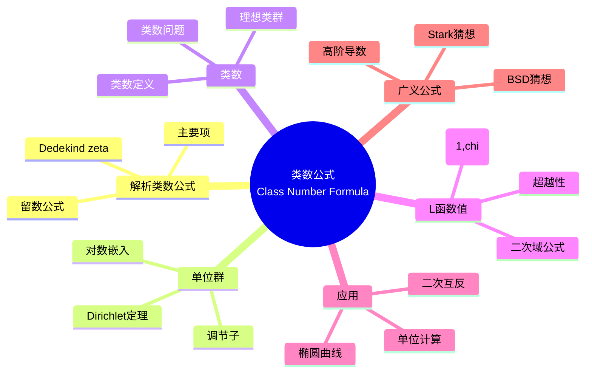

msc_primary: "00A99"
msc_secondary: ['00-00']
---

# 类数公式 (Class Number Formula)

## 思维导图

---

## 一、中心概念精确定义

### 1.1 解析类数公式

设 $K$ 为次数 $n = r_1 + 2r_2$ 的数域，$r_1$ 为实嵌入数，$r_2$ 为复嵌入对数，$w_K$ 为 $K$ 中单位根的个数，$h_K$ 为类数，$R_K$ 为调节子，$d_K$ 为判别式。

**Dedekind Zeta 函数**：
$$\zeta_K(s) = \sum_{\mathfrak{a}} \frac{1}{N(\mathfrak{a})^s} = \prod_{\mathfrak{p}} \left(1 - \frac{1}{N(\mathfrak{p})^s}\right)^{-1}$$

其中求和遍历所有非零整理想，乘积遍历所有素理想。

**解析类数公式**：
$$\text{Res}_{s=1} \zeta_K(s) = \frac{2^{r_1} (2\pi)^{r_2} h_K R_K}{w_K \sqrt{|d_K|}}$$

### 1.2 公式各要素解释

| 符号 | 名称 | 含义 |
|------|------|------|
| $h_K$ | **类数** | 理想类群的阶，$|\text{Cl}(\mathcal{O}_K)|$ |
| $R_K$ | **调节子** | 单位群几何结构的体积度量 |
| $w_K$ | **单位根数** | $K$ 中单位根群的阶 |
| $d_K$ | **判别式** | 数域的算术不变量 |
| $r_1, r_2$ | **嵌入数** | 实嵌入和复嵌入对的个数 |

---

## 二、核心要素

### 2.1 类数 (Class Number)

**定义**：数域 $K$ 的**类数** $h_K$ 是理想类群 $\text{Cl}(\mathcal{O}_K)$ 的阶。

**理想类群**：
$$\text{Cl}(\mathcal{O}_K) = \text{Frac}(\mathcal{O}_K) / \text{P}(\mathcal{O}_K)$$

其中分式理想模主分式理想。

**意义**：
- $h_K = 1$ 当且仅当 $\mathcal{O}_K$ 是主理想整环（即唯一分解整环）
- 类数度量了唯一分解的"偏离程度"

**计算**：Minkowski 界给出有效算法
$$N(\mathfrak{a}) \leq M_K = \frac{n!}{n^n} \left(\frac{4}{\pi}\right)^{r_2} \sqrt{|d_K|}$$

### 2.2 单位群与 Dirichlet 单位定理

**Dirichlet 单位定理**：
$$\mathcal{O}_K^\times \cong \mu_K \times \mathbb{Z}^{r}$$

其中 $r = r_1 + r_2 - 1$ 为**单位秩**，$\mu_K$ 为 $K$ 中单位根群。

**基本单位**：生成自由部分的单位 $\varepsilon_1, \ldots, \varepsilon_r$。

**对数嵌入**：定义对数映射 $\lambda: K^\times \to \mathbb{R}^{r_1 + r_2}$
$$\lambda(\alpha) = (\ln |\sigma_1(\alpha)|, \ldots, \ln |\sigma_{r_1}(\alpha)|, 2\ln |\tau_1(\alpha)|, \ldots, 2\ln |\tau_{r_2}(\alpha)|)$$

其中 $\sigma_i$ 为实嵌入，$\tau_j$ 为复嵌入（取一对中的一个）。

**超平面**：$\lambda(\mathcal{O}_K^\times)$ 位于超平面 $x_1 + \cdots + x_{r_1+r_2} = 0$ 上。

### 2.3 调节子 (Regulator)

**定义**：设 $\varepsilon_1, \ldots, \varepsilon_r$ 是基本单位系，**调节子**定义为：
$$R_K = |\det(\delta_i \ln |\sigma_i(\varepsilon_j)|)_{i,j=1}^{r}|$$

其中 $\delta_i = 1$ 对实嵌入，$\delta_i = 2$ 对复嵌入。

**几何意义**：$R_K$ 是单位群在对数空间中的"基本区域"的体积。

**二次域例子**：

| 域 | 单位群结构 | 调节子 |
|----|-----------|--------|
| 实二次域 $\mathbb{Q}(\sqrt{d})$ | $\{\pm 1\} \times \varepsilon^\mathbb{Z}$ | $R_K = \ln \varepsilon$，$\varepsilon > 1$ 为基本单位 |
| 虚二次域 $\mathbb{Q}(\sqrt{d})$ | 有限单位根群 | $R_K = 1$（由定义） |

### 2.4 二次域的类数公式

**虚二次域** $K = \mathbb{Q}(\sqrt{d})$，$d < 0$：

对 $d < -4$：
$$h_K = \frac{w_K \sqrt{|d_K|}}{2\pi} L(1, \chi_d)$$

其中：
- $w_K = 2$（$d < -4$），$w_{\mathbb{Q}(i)} = 4$，$w_{\mathbb{Q}(\sqrt{-3})} = 6$
- $\chi_d$ 为对应的 Kronecker 符号
- $L(1, \chi_d) = -\frac{\pi}{|d_K|^{3/2}} \sum_{a=1}^{|d_K|} a \chi_d(a)$（Dirichlet 公式）

**实二次域** $K = \mathbb{Q}(\sqrt{d})$，$d > 0$：
$$h_K = \frac{\sqrt{d_K}}{2\ln \varepsilon} L(1, \chi_d)$$

其中 $\varepsilon > 1$ 是基本单位。

### 2.5 $L(1, \chi)$ 的计算

**Dirichlet 类数公式**：对判别式为 $D$ 的二次特征 $\chi$，

**虚二次域** $(D < 0)$：
$$L(1, \chi) = \frac{2\pi h_K}{w_K \sqrt{|D|}}$$

**实二次域** $(D > 0)$：
$$L(1, \chi) = \frac{2h_K \ln \varepsilon}{\sqrt{D}}$$

**具体计算**（Dirichlet）：
$$L(1, \chi) = -\frac{\pi}{|D|^{3/2}} \sum_{a=1}^{|D|} a \left(\frac{D}{a}\right) \quad (D < 0)$$

$$L(1, \chi) = -\frac{1}{\sqrt{D}} \sum_{a=1}^{D} \left(\frac{D}{a}\right) \ln |1 - \zeta_D^a| \quad (D > 0)$$

---

## 三、性质与定理

### 定理 3.1：解析延拓与函数方程

Dedekind zeta 函数 $\zeta_K(s)$ 可亚纯延拓到 $\mathbb{C}$，在 $s=1$ 处有单极点，留数为类数公式给出的值。

**函数方程**：设 $\xi_K(s) = |d_K|^{s/2} \Gamma_{\mathbb{R}}(s)^{r_1} \Gamma_{\mathbb{C}}(s)^{r_2} \zeta_K(s)$，则：

$$\xi_K(s) = \xi_K(1-s)$$

### 定理 3.2：二次域类数公式的显式形式

**虚二次域** $K = \mathbb{Q}(\sqrt{-m})$，$m > 0$ 无平方因子：

对 $m > 4$：
$$h_K = \frac{1}{2 - \chi_D(2)} \sum_{a=1}^{|D|/2} \chi_D(a)$$

**实二次域** $K = \mathbb{Q}(\sqrt{m})$：
$$h_K = -\frac{1}{\ln \varepsilon} \sum_{a=1}^{D-1} \chi_D(a) \ln \sin\left(\frac{\pi a}{D}\right)$$

### 定理 3.3：Brauer-Siegel 定理

设 $\{K_i\}$ 为数域序列，$[K_i : \mathbb{Q}] \to \infty$，则：
$$\ln(h_{K_i} R_{K_i}) \sim \ln \sqrt{|d_{K_i}|}$$

**意义**：对高度数域，类数与调节子的乘积大致由判别式决定。

### 定理 3.4：Stark 猜想（特殊情形）

对实二次域 $K = \mathbb{Q}(\sqrt{d})$，存在单位 $\varepsilon$ 使得：
$$\zeta_K'(0) = \frac{h_K R_K}{w_K} = \ln \varepsilon$$

**意义**：导数在 0 处的值给出代数单位的对数。

### 定理 3.5：Baker-Stark 定理

虚二次域类数 1 问题的解：
$$h_K = 1 \iff d_K \in \{-3, -4, -7, -8, -11, -19, -43, -67, -163\}$$

Heegner (1952) 首次给出证明，Baker (1966) 和 Stark (1967) 独立给出严格证明。

---

## 四、典型例子

### 例子 4.1：高斯整数域 $\mathbb{Q}(i)$

**参数**：
- $d_K = -4$，$h_K = 1$，$w_K = 4$
- $\chi_{-4}(n) = \begin{cases} 1 & n \equiv 1 \pmod{4} \\ -1 & n \equiv 3 \pmod{4} \\ 0 & n \text{ 偶} \end{cases}$

**类数公式验证**：
$$h_K = \frac{4 \cdot \sqrt{4}}{2\pi} L(1, \chi_{-4}) = \frac{4}{\pi} \cdot \frac{\pi}{4} = 1$$

其中 $L(1, \chi_{-4}) = 1 - \frac{1}{3} + \frac{1}{5} - \cdots = \frac{\pi}{4}$（Leibniz 公式）。

**意义**：$\mathbb{Z}[i]$ 是唯一分解整环。

### 例子 4.2：欧几里得域 $\mathbb{Q}(\sqrt{-3})$

**参数**：
- $d_K = -3$，$h_K = 1$，$w_K = 6$
- Eisenstein 整数环 $\mathbb{Z}[\omega]$，$\omega = e^{2\pi i/3}$

**类数公式**：
$$h_K = \frac{6 \cdot \sqrt{3}}{2\pi} L(1, \chi_{-3}) = \frac{3\sqrt{3}}{\pi} \cdot \frac{\pi}{3\sqrt{3}} = 1$$

其中 $L(1, \chi_{-3}) = \frac{\pi}{3\sqrt{3}}$。

### 例子 4.3：实二次域 $\mathbb{Q}(\sqrt{5})$

**参数**：
- $d_K = 5$，$h_K = 1$
- 基本单位 $\varepsilon = \frac{1+\sqrt{5}}{2}$（黄金比例），$\ln \varepsilon \approx 0.481$

**类数公式**：
$$h_K = \frac{\sqrt{5}}{2\ln \varepsilon} L(1, \chi_5) = \frac{\sqrt{5}}{2\ln \varepsilon} \cdot \frac{2\ln \varepsilon}{\sqrt{5}} = 1$$

其中 $L(1, \chi_5) = \frac{\pi}{\sqrt{5}} \cdot \frac{\ln \varepsilon}{\pi/\sqrt{5}} = \frac{2\ln \varepsilon}{\sqrt{5}}$。

**计算验证**：
$$L(1, \chi_5) = 1 - \frac{1}{2} - \frac{1}{3} + \frac{1}{4} + \frac{1}{6} - \frac{1}{7} - \frac{1}{8} + \frac{1}{9} + \cdots \approx 0.430$$

$$\frac{2\ln \varepsilon}{\sqrt{5}} = \frac{2 \cdot 0.481}{2.236} \approx 0.430$$

---

## 五、关联概念

### 5.1 直接关联

| 概念 | 关联描述 |
|------|----------|
| **Dedekind Zeta 函数** | 类数公式的解析对象，$s=1$ 处留数 |
| **Dirichlet L-函数** | 二次域情形的核心计算对象 |
| **单位群** | 调节子反映单位群的几何结构 |
| **类群** | 类数度量唯一分解的偏离 |

### 5.2 扩展关联

| 概念 | 关联描述 |
|------|----------|
| **Stark 猜想** | 将类数公式推广到高阶导数 |
| **BSD 猜想** | 椭圆曲线的类数公式类比 |
| **岩泽理论** | 分圆 $\mathbb{Z}_p$-扩张中的类数行为 |
| **Gross-Zagier 公式** | Heegner 点与导数的联系 |

### 5.3 应用领域

- **密码学**：类群在密码协议中的应用
- **计算数论**：类数和单位的有效计算
- **算术几何**：椭圆曲线的算术性质
- **物理**：弦论中的算术结构

---

## 六、深入阅读与参考

### 推荐教材

1. **Washington, L. C.** - *Introduction to Cyclotomic Fields* (Springer, 1997)
   - 第4章详细讨论类数公式

2. **Marcus, D. A.** - *Number Fields* (Springer, 1977)
   - 第5章调节子和类数

3. **Neukirch, J.** - *Algebraic Number Theory* (Springer, 1999)
   - 第VII章 Zeta 函数与 L-函数

4. **Ireland, K. & Rosen, M.** - *A Classical Introduction to Modern Number Theory* (Springer, 1990)
   - 第16章类数公式

5. **Lang, S.** - *Cyclotomic Fields I and II* (Springer, 1990)
   - 分圆域类数理论

### 经典论文

- **Dirichlet, P. G. L.** (1839) - "Recherches sur diverses applications de l'analyse infinitésimale à la théorie des nombres"
- **Siegel, C. L.** (1935) - "Über die Classenzahl quadratischer Zahlkörper"
- **Stark, H. M.** (1967) - "A Complete Determination of the Complex Quadratic Fields of Class-Number One"

---

## 七、总结

类数公式是代数数论中最优美的结果之一：

1. **解析与代数的统一**：将算术不变量（类数、单位）与解析对象（zeta 函数）联系起来
2. **计算方法**：提供计算类数的有效途径
3. **推广框架**：BSD 猜想、Stark 猜想等现代理论的模板

**历史发展**：
- Dirichlet (1839-1840)：二次域类数公式
- Dedekind (1877)：一般数域的推广
- Hecke (1917)：函数方程与解析方法
- Siegel (1935)：Brauer-Siegel 定理

**未解决问题**：
- 实二次域类数 1 问题的完整解决（Gauss 猜想有无穷多个）
- 类数 $h$ 的虚二次域类数问题的有效算法
- Stark 猜想的完整证明
- BSD 猜想的解决

---

*文档版本：1.0*  
*创建日期：2026年4月*  
*对齐标准：MIT 18.782 Introduction to Arithmetic Geometry*
