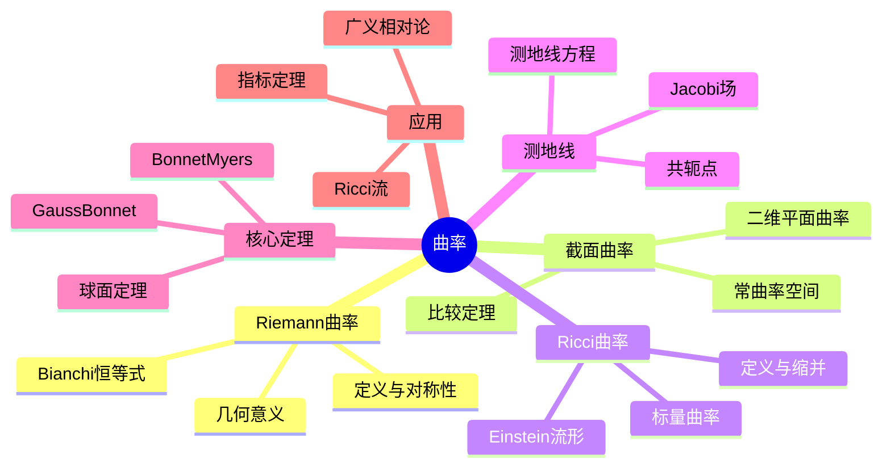

# 曲率 思维导图

## 中心概念

### 精确定义
**曲率**是刻画空间"弯曲程度"的几何量。在Riemann流形 $(M, g)$ 上，曲率通过Riemann曲率张量 $R$ 描述，它是衡量向量沿无穷小环路平行移动后变化程度的4阶张量。

### 直观理解
曲率反映空间的内蕴几何性质——"居住"在空间中而非从外部观察就能感知的弯曲。正曲率空间（如球面）三角形内角和大于 $\pi$；负曲率空间（如双曲平面）内角和小于 $\pi$；零曲率空间是平直的欧氏空间。

---

## 第一层分支：核心要素

### Riemann曲率张量
- **定义**：$R(X,Y)Z = \nabla_X\nabla_Y Z - \nabla_Y\nabla_X Z - \nabla_{[X,Y]}Z$
- **分量形式**：$R^\rho_{\sigma\mu\nu}$
- **对称性**：
  - $R_{\sigma\rho\mu\nu} = -R_{\rho\sigma\mu\nu} = -R_{\sigma\rho\nu\mu}$
  - $R_{\sigma\rho\mu\nu} = R_{\mu\nu\sigma\rho}$
  - 第一Bianchi恒等式：$R_{\sigma\rho\mu\nu} + R_{\sigma\mu\nu\rho} + R_{\sigma\nu\rho\mu} = 0$
- **几何意义**：无穷小平行四边形的"和乐"（holonomy）

### 截面曲率
- **定义**：二维平面 $\sigma = \operatorname{span}\{u, v\}$ 的截面曲率
  $$K(\sigma) = \frac{\langle R(u,v)v, u\rangle}{|u|^2|v|^2 - \langle u,v\rangle^2}$$
- **常曲率空间**：$K$ 为常数
  - $K > 0$：球面几何
  - $K = 0$：欧氏几何
  - $K < 0$：双曲几何

### Ricci曲率
- **定义**：Riemann曲率张量的缩并
  $$R_{\mu\nu} = R^\rho_{\mu\rho\nu}$$
- **几何意义**：体积元的无穷小变化率
- **标量曲率**：$R = g^{\mu\nu}R_{\mu\nu}$
- **Einstein流形**：$R_{\mu\nu} = \lambda g_{\mu\nu}$

### 测地线与Jacobi场
- **测地线方程**：$\frac{d^2x^\mu}{d\tau^2} + \Gamma^\mu_{\nu\rho}\frac{dx^\nu}{d\tau}\frac{dx^\rho}{d\tau} = 0$
- **Jacobi方程**：描述测地线变分
  $$\frac{D^2J}{d\tau^2} + R(J, \dot{\gamma})\dot{\gamma} = 0$$
- **共轭点**：Jacobi场的零点，曲率的累积效应

---

## 第二层分支：性质与定理

### 重要性质

#### 1. 曲率与拓扑的关系
- **Gauss-Bonnet定理**：2维情形，曲率积分与Euler示性数相关
  $$\int_M K dA = 2\pi\chi(M)$$
- **陈类**：高维复流形的示性类
- **Pontryagin类**：实流形的示性类

#### 2. 曲率比较定理
- **Rauch比较定理**：曲率比较下的测地线行为
- **Toponogov定理**：曲率与三角形比较
- **体积比较**：Bishop-Gromov不等式

### 核心定理

#### 1. 等距嵌入定理
- **Nash嵌入定理**：任何Riemann流形可等距嵌入欧氏空间
- **维数**：$C^1$ 嵌入 $\mathbb{R}^{n+1}$，光滑嵌入 $\mathbb{R}^{2n+1}$
- **意义**：抽象Riemann流形的"实现"

#### 2. Gauss-Bonnet-Chern定理
- **内容**：$M$ 紧致定向 $2n$ 维流形
  $$\int_M \operatorname{Pf}(\Omega) = (2\pi)^n \chi(M)$$
- **Pfaffian**：曲率形式矩阵的Pfaffian
- **Euler示性数**：拓扑不变量
- **意义**：Chern-Weil理论的核心结果

#### 3. Bonnet-Myers定理
- **内容**：Ricci曲率有正下界 $(n-1)k$ 的完备流形，直径 $\leq \pi/\sqrt{k}$
- **推论**：紧致性、有限基本群
- **应用**：拓扑与几何的联系

#### 4. Synge定理
- **内容**：正截面曲率的紧致偶维可定向流形，单连通
- **正曲率的拓扑障碍**

#### 5. 球面定理
- **Rauch-Berger-Klingenberg**：
  - $1/4$-夹紧流形同胚于球面
- **球面定理的精确形式**：截面曲率 $1/4 < K \leq 1$ $\Rightarrow$ 同胚于 $S^n$
- **微分球面定理**：$1/4$-夹紧 $\Rightarrow$ 微分同胚于 $S^n$

---

## 第三层分支：例子与应用

### 典型例子

#### 1. 常曲率空间
- **欧氏空间**：$\mathbb{R}^n$，$K = 0$
- **球面**：$S^n(R)$，$K = 1/R^2 > 0$
- **双曲空间**：$\mathbb{H}^n$，$K = -1/R^2 < 0$
- **模型**：Poincaré圆盘、上半空间模型

#### 2. 乘积流形
- **柱面**：$S^1 \times \mathbb{R}$，混合曲率
- **环面**：$T^n = S^1 \times \cdots \times S^1$，平坦（继承欧氏度规）
- **Warped乘积**：$M \times_f N$，$f$ 为warping函数

#### 3. 对称空间
- **定义**：每点都是测地对称的中心
- **紧型**：如 $S^n$，$\mathbb{CP}^n$
- **非紧型**：如 $\mathbb{H}^n$，$SL(n,\mathbb{R})/SO(n)$
- **分类**：Cartan分类

#### 4. Einstein流形
- **定义**：$R_{\mu\nu} = \lambda g_{\mu\nu}$
- **例子**：
  - $S^n$：$\lambda > 0$
  - 环面 $T^n$：$\lambda = 0$
  - Calabi-Yau流形：$\lambda = 0$，Ricci平坦

### 反例

#### 1. 无奇点的非平坦流形
- **环面**：局部平坦但整体有非平凡拓扑
- **说明**：曲率是局部的，拓扑是整体的

#### 2. 曲率与拓扑不匹配的尝试
- **不可能有正曲率的环面**：拓扑障碍
- **Cartan-Hadamard定理**：非正曲率单连通流形同胚于 $\mathbb{R}^n$

### 应用场景

#### 1. 广义相对论
- **Einstein场方程**：$G_{\mu\nu} + \Lambda g_{\mu\nu} = \frac{8\pi G}{c^4} T_{\mu\nu}$
- **Einstein张量**：$G_{\mu\nu} = R_{\mu\nu} - \frac{1}{2}Rg_{\mu\nu}$
- **真空解**：$R_{\mu\nu} = 0$（Ricci平坦）
- **Schwarzschild解**：球对称质量外部的度规
- **引力波**：曲率的波动，传播于光速

#### 2. 宇宙学
- **Friedmann方程**：宇宙膨胀的动力学
- **Robertson-Walker度规**：均匀各向同性宇宙
- **宇宙常数**：$\Lambda$，暗能量的数学描述
- **曲率与宇宙命运**：封闭（$K>0$）、平坦（$K=0$）、开放（$K<0$）

#### 3. 微分几何
- **极小子流形**：平均曲率为零的子流形
- **Willmore泛函**：曲率平方的积分
- **Yamabe问题**：共形度规下的常标量曲率
- **Ricci流**：$\frac{\partial g}{\partial t} = -2Ric$，Poincaré猜想证明

#### 4. 拓扑学
- **Chern-Weil理论**：用曲率形式表示示性类
- **指标定理**：Atiyah-Singer，分析与拓扑的联系
- **Donaldson理论**：4维流形的微分结构
- **Seiberg-Witten理论**：4维流形的简化不变量

#### 5. 材料科学
- **液晶**：曲率与缺陷
- **弹性薄壳**：Gauss曲率与可展开性
- **石墨烯**：二维材料的曲率效应

---

## 第四层分支：关联概念

### 相似概念

#### 挠率（Torsion）
- **定义**：联络的非对称部分
- **Cartan结构方程**：$\Theta^a = d\theta^a + \omega^a_b \wedge \theta^b$
- **几何意义**："扭曲"而非"弯曲"
- **Cartan几何**：允许挠率的几何

#### 射影曲率与共形曲率
- **射影曲率**：测地线（不含参数）决定的曲率
- **共形曲率**：在共形变换下不变的曲率
- **Weyl张量**：共形曲率的分量

### 对偶概念

#### 平坦联络
- **定义**：曲率为零的联络
- **完整群**：离散群（和乐群）
- **平坦丛**：向量丛配平坦联络

### 推广概念

#### Finsler几何
- **定义**：切空间上有Minkowski范数，非Riemann情形
- **应用**：相对论、生物学（生长模型）

#### 非交换几何
- **谱三元组**：$(A, H, D)$，非交换空间
- **Connes曲率**：Dirac算子的谱性质
- **应用**：标准模型、量子引力

#### 离散曲率
- **图上的曲率**：Ollivier-Ricci曲率
- **应用**：网络分析、最优传输
- **收敛性**：离散到连续的极限

#### 量子曲率
- **圈量子引力**：面积、体积的量子化
- **渐近安全**：引力在量子标度下的行为
- **全息原理**：体曲率与边界对应

---

## Mermaid思维导图

---

**参考章节**：微分几何 - 第2章 Riemann几何  
**关联文件**：流形-思维导图.md、拓扑空间-思维导图.md
