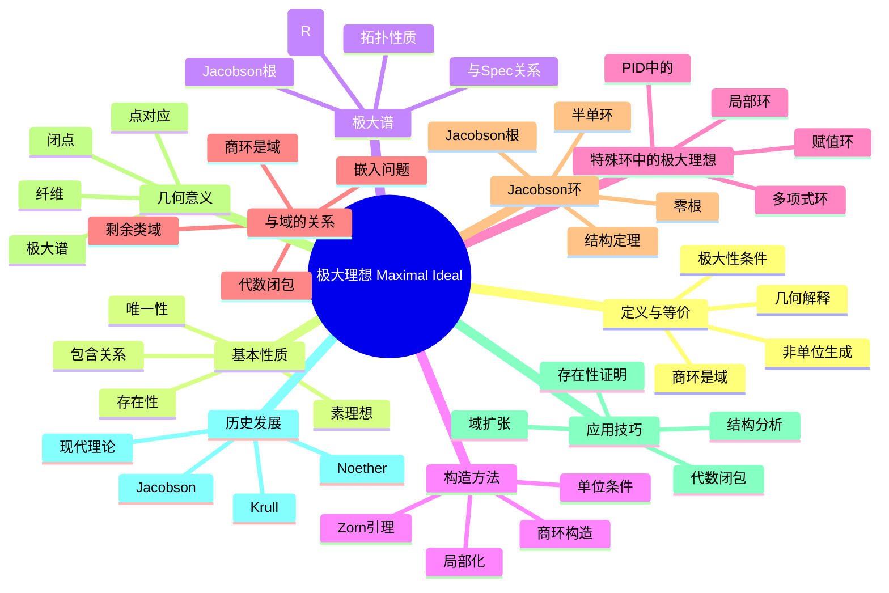

msc_primary: "00A99"
msc_secondary: ['00-XX']
---

# 极大理想 思维导图

## 中心概念
极大理想是不被任何其他真理想包含的真理想。极大理想与域的构造密切相关，因为商环 $R/M$ 是域当且仅当 $M$ 是极大理想。

## 核心分支

### 定义与等价条件
- **定义**: 真理想 $M$ 是极大的，若不存在真理想 $I$ 使得 $M \subsetneq I \subsetneq R$
- **商环条件**: $M$ 是极大理想 $\Leftrightarrow$ $R/M$ 是域
- **单位条件**: $M$ 极大当且仅当 $M$ 由所有非单位生成
- **极大性**: 在真理想集合中的极大元

### 基本性质
- **存在性**: 每个含幺非零环都有极大理想（Zorn引理）
- **素理想**: 极大理想都是素理想
- **包含关系**: 真理想总包含于某个极大理想
- **唯一性**: 局部环有唯一的极大理想

### 极大谱
- **极大谱**: $\text{Max}(R) = \{R$ 的所有极大理想$\}$
- **与素谱关系**: $\text{Max}(R) \subseteq \text{Spec}(R)$
- **Jacobson拓扑**: 极大谱上的拓扑
- **Jacobson概形**: 基于极大谱的几何理论

### Jacobson根
- **定义**: $J(R) = \bigcap_{M \in \text{Max}(R)} M$
- **等价刻画**: $J(R) = \{x \in R : 1 - xy$ 是单位，$\forall y \in R\}$
- **半单环**: $J(R) = 0$ 的环称为半单环
- **Nakayama引理**: Jacobson根的重要应用

### 核心定理
- **存在定理**: 每个非零含幺环都有极大理想
- **域构造**: $R/M$ 是域提供构造域的方法
- **Hilbert零点定理**: 代数闭域上多项式环的极大理想对应点
- **Krull定理**: 真理想可扩张为极大理想

### 重要例子
- **整数环**: $\text{Max}(\mathbb{Z}) = \{(p) : p$ 素数$\}$
- **域上多项式**: $k[x]$ 的极大理想为 $(f)$，$f$ 首一不可约
- **多元多项式**: $\mathbb{C}[x_1, \ldots, x_n]$ 的极大理想为 $(x_1-a_1, \ldots, x_n-a_n)$
- **局部环**: $\mathbb{Z}_{(p)}$ 的唯一极大理想是 $p\mathbb{Z}_{(p)}$

### 几何意义
- **闭点**: 极大理想对应概形中的闭点
- **点对应**: $k^n$ 中的点与极大理想一一对应（代数闭域情形）
- **纤维**: 概形映射的纤维与极大理想相关
- **几何点**: 极大理想的几何解释

### 构造方法
- **Zorn引理**: 证明极大理想存在性的标准方法
- **商环**: 通过商环是域来判定极大性
- **局部化**: 局部化可产生局部环和极大理想
- **扩张**: 将理想扩张为极大理想

### 相关概念
- **父概念**: [[理想]]、[[素理想]]
- **子概念**: [[Jacobson根]]、[[半单环]]、[[局部环]]
- **相邻概念**: [[域]]、[[商环]]、[[极大谱]]

### 应用领域
- **域构造**: 通过商环构造域
- **代数几何**: Hilbert零点定理，点与理想的对应
- **泛函分析**: Banach代数、C*-代数中的极大理想
- **数论**: 素理想、赋值理论

### 历史发展
- **Noether (1920s)**: 抽象理想理论中的极大理想
- **Krull (1930s)**: 局部环、赋值环理论
- **Jacobson (1940s)**: Jacobson根、Jacobson环
- **Grothendieck (1960s)**: 概形理论，极大理想的几何解释

---

**概念链接**: [[理想]] [[素理想]] [[域]] [[商环]] [[Jacobson根]] [[局部环]]
