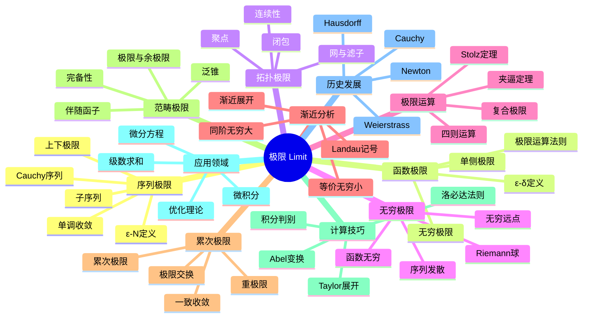

msc_primary: "00A99"
msc_secondary: ['00-00']
---

# 极限 思维导图

## 中心概念
极限是分析学的核心概念，描述了变量趋近某个值时的行为。它不仅是微积分的基础，也是拓扑空间、范畴论和渐近分析中的基本工具。

## 核心分支

### 定义与公理
- **序列极限**: $\lim_{n \to \infty} a_n = L$ 若 $\forall \epsilon > 0, \exists N, \forall n > N: |a_n - L| < \epsilon$
- **函数极限**: $\lim_{x \to a} f(x) = L$ 若 $\forall \epsilon > 0, \exists \delta > 0, 0 < |x-a| < \delta \Rightarrow |f(x) - L| < \epsilon$

- **拓扑极限**: 滤子收敛、网收敛的抽象定义
- **范畴极限**: 泛锥定义的极限对象

### 基本性质
- **唯一性**: 极限若存在则唯一（Hausdorff空间）
- **有界性**: 收敛序列必有界
- **保号性**: 极限保持不等式关系
- **Cauchy准则**: 完备空间中Cauchy列收敛

### 重要例子
- **基本极限**: $\lim_{n \to \infty} \frac{1}{n} = 0$，$\lim_{n \to \infty} (1 + \frac{1}{n})^n = e$
- **三角函数**: $\lim_{x \to 0} \frac{\sin x}{x} = 1$
- **p-级数**: $\lim_{n \to \infty} \sum_{k=1}^n \frac{1}{k^p}$（收敛/发散取决于 $p$）
- **Riemann ζ函数**: $\zeta(s) = \lim_{n \to \infty} \sum_{k=1}^n \frac{1}{k^s}$

### 核心定理
- **夹逼定理**: 若 $a_n \leq b_n \leq c_n$ 且 $\lim a_n = \lim c_n = L$，则 $\lim b_n = L$
- **单调收敛定理**: 单调有界序列必收敛
- **Cauchy收敛准则**: 序列收敛当且仅当它是Cauchy列（完备空间中）
- **Stolz定理**: 计算不定式极限的离散洛必达法则
- **Heine定理**: 函数极限与序列极限的关系

### 相关概念
- **父概念**: 实数完备性、拓扑、度量空间
- **子概念**: 无穷小、无穷大、渐近分析、范畴极限
- **相邻概念**: 连续性、导数、积分、级数

### 应用领域
- **微积分**: 导数、积分定义的基础
- **级数求和**: 收敛性判别
- **微分方程**: 渐近解、极限环
- **优化理论**: 极限点、收敛速度

### 历史发展
- **早期发展**: Newton、Leibniz的无穷小概念（17世纪）
- **严格化**:
  - 1821：Cauchy《分析教程》ε-定义
  - 1860年代：Weierstrass的严格ε-δ语言
  - 1914：Hausdorff拓扑极限概念
- **现代发展**: 范畴论极限、非标准分析

### 参考资源
- **推荐教材**: Rudin《Principles of Mathematical Analysis》、Abbott《Understanding Analysis》
- **相关论文**: Robinson《Non-standard Analysis》(1966)
- **在线资源**: 3Blue1Brown极限系列视频

---

**概念链接**: [[连续性]] [[导数]] [[级数]] [[拓扑空间]] [[渐近分析]]
