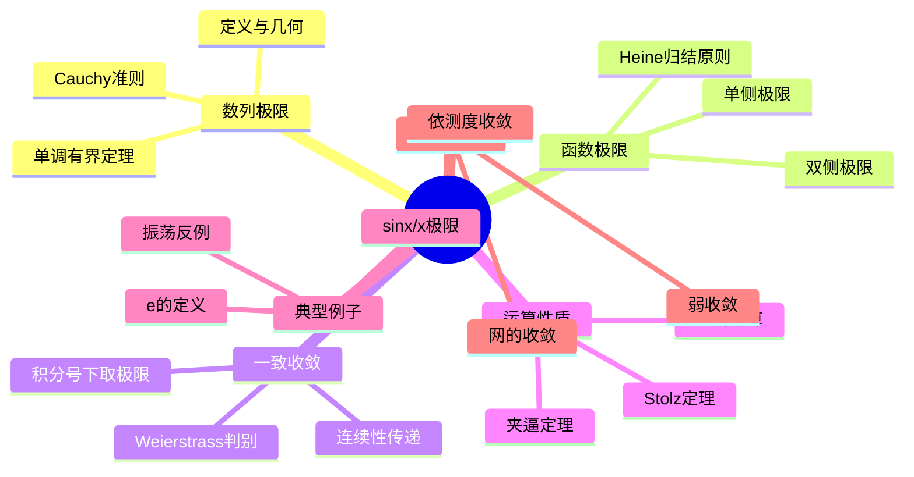

msc_primary: "00A99"
msc_secondary: ['00-XX']
---

# 极限概念 思维导图

## 中心概念

### 精确定义

**极限**是数学分析中最核心的概念，描述一个数学对象（数列、函数、序列）在某种趋近过程中的终极行为。形式上，$\lim_{x \to a} f(x) = L$ 表示：对于任意 $\epsilon > 0$，存在 $\delta > 0$，使得当 $0 < |x-a| < \delta$ 时，有 $|f(x) - L| < \epsilon$。

### 直观理解

极限捕捉的是"无限接近但未必达到"的动态过程。如同庄子"一尺之棰，日取其半，万世不竭"的哲学思想，极限刻画了数学对象在无穷过程中的稳定性态。

---

## 第一层分支：核心要素

### 数列极限

- **定义**：$\lim_{n \to \infty} a_n = L$ 表示数列 $\{a_n\}$ 无限逼近 $L$
- **几何解释**：在数轴上，除了有限项外，所有点都落在 $L$ 的任意小邻域内
- **唯一性**：若极限存在，则必唯一
- **有界性**：收敛数列必有界
- **保号性**：若 $a_n \geq 0$ 且收敛，则极限 $\geq 0$

### 函数极限

- **双侧极限**：$x \to a$ 时从左右两侧同时逼近
- **单侧极限**：左极限 $\lim_{x \to a^-} f(x)$ 与右极限 $\lim_{x \to a^+} f(x)$
- **无穷远处极限**：$\lim_{x \to +\infty} f(x)$ 和 $\lim_{x \to -\infty} f(x)$
- **无穷极限**：$\lim_{x \to a} f(x) = +\infty$（函数值无限增大）
- **极限存在判定**：双侧极限存在 $\Leftrightarrow$ 左右极限存在且相等

### 一致收敛

- **函数列一致收敛**：$\forall \epsilon > 0, \exists N \in \mathbb{N}$，使得当 $n > N$ 时，对所有 $x \in D$ 有 $|f_n(x) - f(x)| < \epsilon$

- **点态收敛 vs 一致收敛**：一致收敛蕴含点态收敛，反之不成立
- **几何意义**：整个函数图像"整体"趋近于极限函数
- **Weierstrass判别法**：若 $|f_n(x)| \leq M_n$ 且 $\sum M_n$ 收敛，则级数一致收敛

### Cauchy收敛准则

- **数列形式**：$\{a_n\}$ 收敛 $\Leftrightarrow$ $\forall \epsilon > 0, \exists N$，当 $m,n > N$ 时 $|a_m - a_n| < \epsilon$

- **函数形式**：函数极限存在 $\Leftrightarrow$ 满足相应的Cauchy条件
- **完备性体现**：Cauchy准则成立等价于空间完备

---

## 第二层分支：性质与定理

### 重要性质

#### 1. 极限的四则运算

- **加法**：$\lim(f + g) = \lim f + \lim g$（若各极限存在）
- **乘法**：$\lim(f \cdot g) = \lim f \cdot \lim g$
- **除法**：$\lim(f/g) = \lim f / \lim g$（要求分母极限不为零）
- **证明思路**：利用三角不等式和极限定义直接验证

#### 2. 夹逼定理（Squeeze Theorem）

- **内容**：若 $a_n \leq b_n \leq c_n$ 且 $\lim a_n = \lim c_n = L$，则 $\lim b_n = L$
- **应用**：求 $\lim_{n \to \infty} \frac{\sin n}{n} = 0$ 等极限
- **证明**：利用不等式传递性和极限定义

#### 3. 单调有界定理

- **内容**：单调递增有上界（或递减有下界）的数列必收敛
- **实数完备性等价表述**：该定理等价于实数的Dedekind完备性
- **应用**：证明 $e = \lim_{n \to \infty} (1 + \frac{1}{n})^n$ 存在

### 核心定理

#### 1. Heine定理（归结原则）

- **内容**：$\lim_{x \to a} f(x) = L$ $\Leftrightarrow$ 对任意满足 $x_n \to a$（$x_n \neq a$）的数列，有 $\lim_{n \to \infty} f(x_n) = L$
- **意义**：架起函数极限与数列极限的桥梁
- **应用**：证明某些函数极限不存在（找到两个趋于不同值的数列）

#### 2. Stolz定理

- **内容**：设 $\{y_n\}$ 严格单调递增趋于 $+\infty$，若 $\lim \frac{x_n - x_{n-1}}{y_n - y_{n-1}} = L$，则 $\lim \frac{x_n}{y_n} = L$
- **应用**：求 $\lim_{n \to \infty} \frac{1 + 2 + \cdots + n}{n^2} = \frac{1}{2}$
- **本质**：离散形式的L'Hôpital法则

#### 3. 一致收敛的运算性质

- **连续性传递**：若 $f_n$ 连续且一致收敛于 $f$，则 $f$ 连续
- **积分交换**：$\lim \int f_n = \int \lim f_n$（在一致收敛条件下）
- **可微性条件**：更强的条件才能保证求导与极限可交换

---

## 第三层分支：例子与应用

### 典型例子

#### 1. 经典极限

- $\lim_{n \to \infty} (1 + \frac{1}{n})^n = e$（自然对数的底）
- $\lim_{x \to 0} \frac{\sin x}{x} = 1$（微积分基本极限）
- $\lim_{n \to \infty} \sqrt[n]{n} = 1$
- $\lim_{n \to \infty} q^n = 0$（当 $|q| < 1$）

#### 2. 函数列收敛的例子

- $f_n(x) = x^n$ 在 $[0,1]$ 上点态收敛但不一致收敛
- $f_n(x) = \frac{x}{n}$ 在 $\mathbb{R}$ 上一致收敛于 0
- $f_n(x) = \frac{\sin(nx)}{\sqrt{n}}$ 一致收敛于 0

### 反例

#### 1. 极限不存在的例子

- $\lim_{x \to 0} \sin\frac{1}{x}$：在 0 附近无限振荡
- $\lim_{n \to \infty} (-1)^n$：在 -1 和 1 之间交替
- $\lim_{x \to 0} \frac{|x|}{x}$：左右极限不相等

#### 2. 点态收敛但不一致收敛

- $f_n(x) = nxe^{-nx}$ 在 $[0,1]$ 上点态收敛于 0，但积分极限不相等

### 应用场景

#### 1. 微积分基础

- **导数定义**：$f'(x) = \lim_{h \to 0} \frac{f(x+h) - f(x)}{h}$
- **定积分定义**：Riemann和的极限
- **Taylor展开**：$f(x) = \sum_{n=0}^{\infty} \frac{f^{(n)}(a)}{n!}(x-a)^n$

#### 2. 迭代算法收敛性

- **Newton迭代法**：$x_{n+1} = x_n - \frac{f(x_n)}{f'(x_n)}$ 的收敛分析
- **梯度下降**：学习率与收敛速度的关系
- **不动点迭代**：压缩映射原理

#### 3. 概率论

- **大数定律**：$\frac{1}{n}\sum_{i=1}^n X_i \to E[X]$（各种意义下的收敛）
- **中心极限定理**：标准化和的分布收敛于正态分布

---

## 第四层分支：关联概念

### 相似概念

#### 上极限与下极限

- **定义**：$\limsup_{n \to \infty} a_n = \lim_{n \to \infty} \sup_{k \geq n} a_k$
- **意义**：刻画数列极限点的"最大"和"最小"可能值
- **关系**：极限存在 $\Leftrightarrow$ 上极限 = 下极限
- **应用**：处理振荡数列的渐近行为

#### 聚点（极限点）

- **定义**：$a$ 是数列 $\{a_n\}$ 的聚点，若存在子列收敛于 $a$
- **Bolzano-Weierstrass定理**：有界数列必有收敛子列
- **联系**：上、下极限分别是最大和最小聚点

### 对偶概念

#### 无穷小量

- **定义**：极限为 0 的量
- **阶的比较**：高阶、同阶、等价无穷小
- **符号表示**：$o$ 记号（高阶无穷小）、$O$ 记号（同阶有界）
- **应用**：渐近分析、误差估计

#### 无穷大量

- **定义**：绝对值趋于无穷的量
- **比较**：不同无穷大量的"增长速度"比较
- **关系**：非零无穷小量的倒数是无穷大量

### 推广概念

#### 网收敛（Net Convergence）

- **背景**：一般拓扑空间中序列不足以刻画极限
- **定义**：定向集上的映射的收敛
- **应用**：一般拓扑空间、滤子收敛

#### 依范数收敛 / 弱收敛

- **依范数收敛**：$\|x_n - x\| \to 0$

- **弱收敛**：对所有连续线性泛函 $f$，有 $f(x_n) \to f(x)$
- **关系**：范数收敛蕴含弱收敛，反之一般不成立

#### 几乎处处收敛 / 依测度收敛

- **几乎处处收敛**：除去零测集外处处收敛
- **依测度收敛**：收敛集的测度趋于全空间
- **Egorov定理**：几乎处处收敛蕴含几乎一致收敛（在有限测度集上）

---

## Mermaid思维导图

---

**参考章节**：数学分析I - 第2章 极限与连续
**关联文件**：连续性-思维导图.md、级数-思维导图.md
