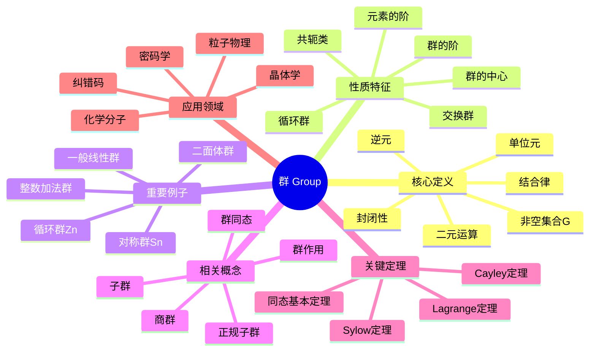
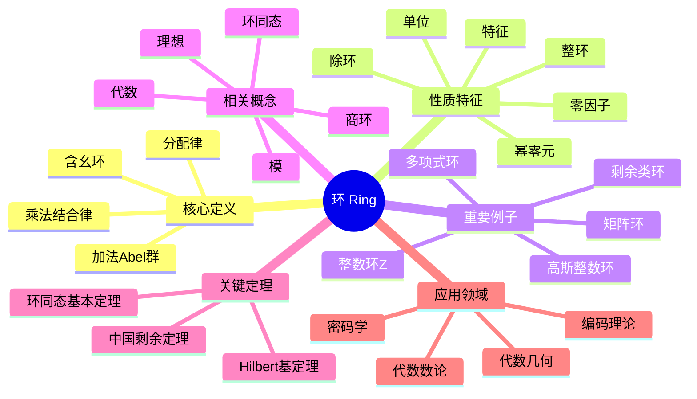
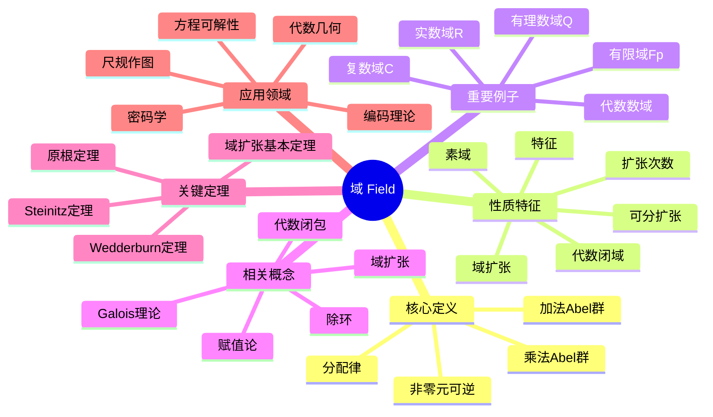
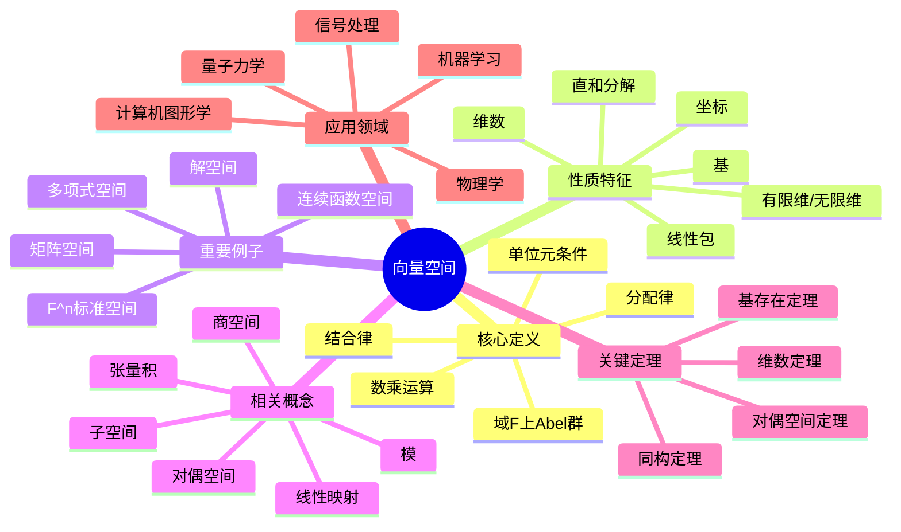
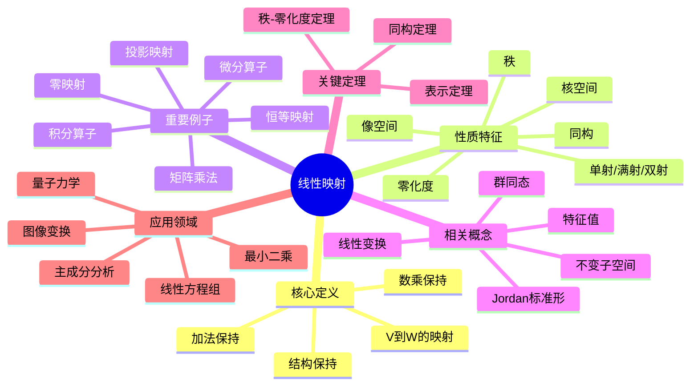
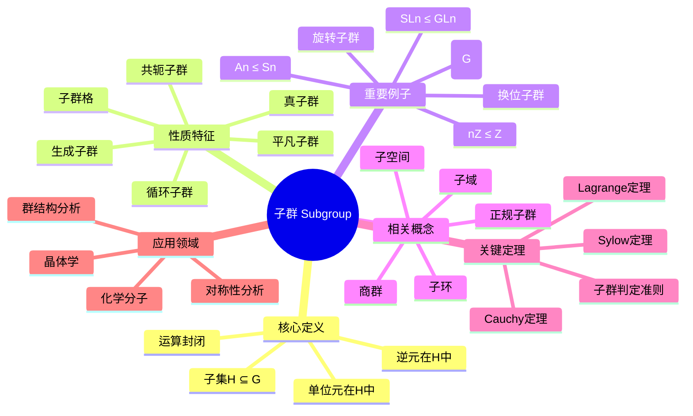
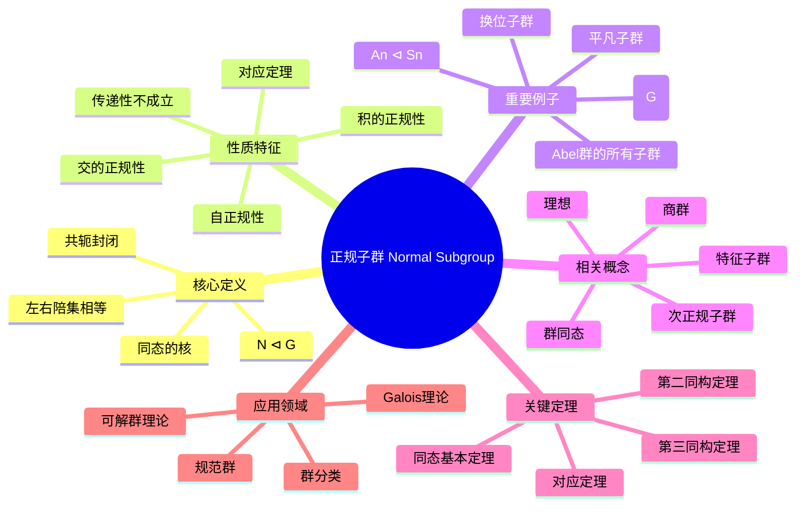

# FormalMath 核心概念思维导图集

> **文档版本**: 1.0
> **创建日期**: 2026年4月3日
> **概念数量**: 100个
> **覆盖领域**: 代数、分析、几何、拓扑、数论

---

## 目录

### 第一部分：代数（20个概念）

1. [群（Group）](#概念1群group)
2. [环（Ring）](#概念2环ring)
3. [域（Field）](#概念3域field)
4. [向量空间](#概念4向量空间)
5. [线性映射](#概念5线性映射)
6. [特征值](#概念6特征值)
7. [子群](#概念7子群)
8. [正规子群](#概念8正规子群)
9. [商群](#概念9商群)
10. [群同态](#概念10群同态)
11. [理想](#概念11理想)
12. [商环](#概念12商环)
13. [整环](#概念13整环)
14. [唯一分解整环](#概念14唯一分解整环)
15. [模](#概念15模)
16. [张量积](#概念16张量积)
17. [代数](#概念17代数)
18. [李代数](#概念18李代数)
19. [表示](#概念19表示)
20. [范畴](#概念20范畴)

### 第二部分：分析（20个概念）

1. [极限](#概念21极限)
2. [连续性](#概念22连续性)
3. [导数](#概念23导数)
4. [积分](#概念24积分)
5. [级数](#概念25级数)
6. [一致连续性](#概念26一致连续性)
7. [一致收敛](#概念27一致收敛)
8. [幂级数](#概念28幂级数)
9. [泰勒级数](#概念29泰勒级数)
10. [傅里叶级数](#概念30傅里叶级数)
11. [反常积分](#概念31反常积分)
12. [含参变量积分](#概念32含参变量积分)
13. [欧拉积分](#概念33欧拉积分)
14. [Stieltjes积分](#概念34stieltjes积分)
15. [数项级数](#概念35数项级数)
16. [函数项级数](#概念36函数项级数)
17. [无穷乘积](#概念37无穷乘积)
18. [函数序列](#概念38函数序列)
19. [稠密性](#概念39稠密性)
20. [完备性](#概念40完备性)

### 第三部分：几何（20个概念）

1. [欧几里得空间](#概念41欧几里得空间)
2. [内积空间](#概念42内积空间)
3. [度量空间](#概念43度量空间)
4. [等距映射](#概念44等距映射)
5. [双曲空间](#概念45双曲空间)
6. [球面几何](#概念46球面几何)
7. [射影空间](#概念47射影空间)
8. [流形](#概念48流形)
9. [切空间](#概念49切空间)
10. [向量场](#概念50向量场)
11. [张量场](#概念51张量场)
12. [微分形式](#概念52微分形式)
13. [黎曼度量](#概念53黎曼度量)
14. [联络](#概念54联络)
15. [曲率](#概念55曲率)
16. [测地线](#概念56测地线)
17. [指数映射](#概念57指数映射)
18. [Jacobi场](#概念58jacobi场)
19. [完备黎曼流形](#概念59完备黎曼流形)
20. [变分法](#概念60变分法)

### 第四部分：拓扑（20个概念）

1. [拓扑空间](#概念61拓扑空间)
2. [开集与闭集](#概念62开集与闭集)
3. [邻域](#概念63邻域)
4. [内部与闭包](#概念64内部与闭包)
5. [边界](#概念65边界)
6. [基与子基](#概念66基与子基)
7. [连续映射](#概念67连续映射)
8. [同胚](#概念68同胚)
9. [连通性](#概念69连通性)
10. [道路连通](#概念70道路连通)
11. [紧致性](#概念71紧致性)
12. [可数性公理](#概念72可数性公理)
13. [分离性公理](#概念73分离性公理)
14. [乘积拓扑](#概念74乘积拓扑)
15. [商拓扑](#概念75商拓扑)
16. [同伦](#概念76同伦)
17. [基本群](#概念77基本群)
18. [覆叠空间](#概念78覆叠空间)
19. [单纯同调](#概念79单纯同调)
20. [胞腔同调](#概念80胞腔同调)

### 第五部分：数论（20个概念）

1. [整除](#概念81整除)
2. [最大公约数](#概念82最大公约数)
3. [同余](#概念83同余)
4. [剩余类](#概念84剩余类)
5. [完全剩余系](#概念85完全剩余系)
6. [简化剩余系](#概念86简化剩余系)
7. [欧拉函数](#概念87欧拉函数)
8. [素数](#概念88素数)
9. [算术基本定理](#概念89算术基本定理)
10. [素数分布](#概念90素数分布)
11. [一次同余方程](#概念91一次同余方程)
12. [孙子定理](#概念92孙子定理)
13. [二次剩余](#概念93二次剩余)
14. [Legendre符号](#概念94legendre符号)
15. [Jacobi符号](#概念95jacobi符号)
16. [原根](#概念96原根)
17. [离散对数](#概念97离散对数)
18. [丢番图方程](#概念98丢番图方程)
19. [Pell方程](#概念99pell方程)
20. [Farey序列](#概念100farey序列)

---

## 第一部分：代数

---

## 概念1：群（Group）

### 核心定义（中心节点）

**正式定义**：群 $(G, \cdot)$ 是一个非空集合 $G$ 配备一个二元运算 $\cdot: G \times G \to G$，满足以下四条公理：

1. **封闭性**：$\forall a, b \in G, a \cdot b \in G$
2. **结合律**：$\forall a, b, c \in G, (a \cdot b) \cdot c = a \cdot (b \cdot c)$
3. **单位元**：$\exists e \in G, \forall a \in G, e \cdot a = a \cdot e = a$
4. **逆元**：$\forall a \in G, \exists a^{-1} \in G, a \cdot a^{-1} = a^{-1} \cdot a = e$

**直观理解**：群是描述"对称性"的数学结构。任何一个保持某种结构不变的变换集合，在复合运算下都构成群。群论被称为"对称性的语言"，因为它抽象地刻画了各种数学对象和物理系统的对称性质。

### 分支1：性质与特征

- **群的阶**：有限群的元素个数，无限群的阶为无穷
- **元素的阶**：使 $a^n = e$ 成立的最小正整数 $n$
- **交换群（Abel群）**：满足交换律 $ab = ba$ 的群
- **循环群**：由一个元素生成的群，记作 $\langle a \rangle$
- **群的中心**：$Z(G) = \{z \in G : zg = gz, \forall g \in G\}$
- **共轭类**：在共轭作用下等价的元素集合

### 分支2：例子与反例

**正例**：

- 整数加法群 $(\mathbb{Z}, +)$
- 非零有理数乘法群 $(\mathbb{Q}^*, \times)$
- $n$ 次单位根群 $\mu_n$
- 对称群 $S_n$（$n$ 个元素的所有置换）
- 循环群 $\mathbb{Z}/n\mathbb{Z}$
- 一般线性群 $GL_n(\mathbb{R})$
- 正 $n$ 边形的二面体群 $D_n$

**反例**：

- 自然数集 $\mathbb{N}$ 不是群（缺少逆元）
- 整数集配乘法不是群（2没有乘法逆元）
- 矩阵集合配乘法一般不是群（奇异矩阵无逆）

### 分支3：相关概念

**前置概念**：集合、二元运算、函数、映射
**后继概念**：子群、正规子群、商群、群同态、群作用、直积群
**平行概念**：半群、幺半群、拟群、环、域

### 分支4：定理与应用

**关键定理**：

- **Lagrange定理**：子群的阶整除群的阶
- **Cayley定理**：每个群都同构于某个对称群的子群
- **Sylow定理**：有限群中 $p$-子群的存在性与共轭性
- **同态基本定理**：$G/\ker \varphi \cong \text{Im}\,\varphi$
- **类方程**：$|G| = |Z(G)| + \sum [G:C_G(x_i)]$

**应用场景**：

- 晶体学中的230种空间群
- 粒子物理中的规范群
- 密码学中的椭圆曲线群
- 化学分子对称性分析
- 纠错码理论

### 分支5：推广与变形

**推广形式**：

- 群胚（Groupoid）：允许部分定义的乘法
- 广群（Groupoid）：每个态射可逆的范畴
- 拓扑群：具有拓扑结构的群
- 李群：具有光滑流形结构的群

**特殊情况**：

- 平凡群：只含单位元的群
- 单群：没有非平凡正规子群的群
- 可解群：具有正规列且因子都是Abel群
- 幂零群：下中心列终止于平凡群



---

## 概念2：环（Ring）

### 核心定义（中心节点）

**正式定义**：环 $(R, +, \cdot)$ 是一个非空集合 $R$ 配备两个二元运算加法 $+$ 和乘法 $\cdot$，满足：

1. $(R, +)$ 是Abel群
2. 乘法满足结合律：$(ab)c = a(bc)$
3. 乘法对加法满足分配律：$a(b+c) = ab + ac$, $(b+c)a = ba + ca$

若乘法有单位元 $1$ 满足 $1 \cdot a = a \cdot 1 = a$，则称为**含幺环**。

**直观理解**：环是同时具有"加法结构"（群）和"乘法结构"（半群）的代数系统。它是整数、多项式、矩阵等数学对象的共同抽象，在数论、代数几何和编码理论中有广泛应用。

### 分支1：性质与特征

- **零因子**：$a \neq 0, b \neq 0$ 但 $ab = 0$
- **整环**：无零因子的交换含幺环
- **除环**：非零元素都有乘法逆的环
- **特征**：使 $n \cdot 1 = 0$ 的最小正整数 $n$
- **幂零元**：存在 $n$ 使 $a^n = 0$
- **单位**：有乘法逆元的元素

### 分支2：例子与反例

**正例**：

- 整数环 $\mathbb{Z}$
- 有理数域 $\mathbb{Q}$（也是环）
- 多项式环 $\mathbb{Z}[x]$
- 矩阵环 $M_n(\mathbb{R})$
- 模 $n$ 剩余类环 $\mathbb{Z}/n\mathbb{Z}$
- 高斯整数环 $\mathbb{Z}[i]$
- 四元数环 $\mathbb{H}$

**反例**：

- 自然数集 $\mathbb{N}$ 不是环（减法不封闭）
- 仅含偶数的集合不是环（无乘法单位元）

### 分支3：相关概念

**前置概念**：群、Abel群、二元运算
**后继概念**：理想、商环、环同态、模、代数
**平行概念**：域、格、半环

### 分支4：定理与应用

**关键定理**：

- **环同态基本定理**：$R/\ker \varphi \cong \text{Im}\,\varphi$
- **中国剩余定理**：关于同余方程组的解
- **Hilbert基定理**：诺特环上的多项式环仍是诺特环
- **Wedderburn小定理**：有限除环必是域

**应用场景**：

- 代数数论中的整数环
- 代数几何中的坐标环
- 编码理论中的循环码
- 密码学中的RSA算法

### 分支5：推广与变形

**推广形式**：

- 非结合环：乘法不要求结合律
- 非交换环：乘法不要求交换律
- graded环：具有分次结构的环

**特殊情况**：

- 布尔环：满足 $a^2 = a$
- 诺特环：理想满足升链条件
- Artin环：理想满足降链条件
- 主理想整环：每个理想都是主理想



---

## 概念3：域（Field）

### 核心定义（中心节点）

**正式定义**：域 $(F, +, \cdot)$ 是一个非空集合 $F$ 配备两个二元运算，满足：

1. $(F, +)$ 是Abel群，单位元记为 $0$
2. $(F^*, \cdot)$ 是Abel群，其中 $F^* = F \setminus \{0\}$
3. 乘法对加法满足分配律

**直观理解**：域是"最好"的代数结构，在其中可以进行加、减、乘、除（除零外）四则运算。有理数、实数、复数都是域的典型例子。域论是代数学的核心分支，与方程论、数论、代数几何密切相关。

### 分支1：性质与特征

- **特征**：$\text{char}(F)$ 是使 $n \cdot 1 = 0$ 的最小正整数，或0
- **素域**：不含真子域的域，同构于 $\mathbb{Q}$ 或 $\mathbb{F}_p$
- **代数闭域**：每个多项式都有根
- **域扩张**：$K/F$ 表示 $K$ 是 $F$ 的扩域
- **扩张次数**：$[K:F] = \dim_F K$
- **可分扩张**：极小多项式无重根

### 分支2：例子与反例

**正例**：

- 有理数域 $\mathbb{Q}$
- 实数域 $\mathbb{R}$
- 复数域 $\mathbb{C}$
- 有限域 $\mathbb{F}_p = \mathbb{Z}/p\mathbb{Z}$（$p$ 素数）
- 有限域 $\mathbb{F}_{p^n}$
- 代数数域 $\mathbb{Q}(\sqrt{2})$
- 有理函数域 $\mathbb{Q}(x)$

**反例**：

- 整数环 $\mathbb{Z}$ 不是域（2无乘法逆元）
- 矩阵环 $M_n(\mathbb{R})$ 不是域（非零矩阵可能无逆）
- $\mathbb{Z}/4\mathbb{Z}$ 不是域（2是零因子）

### 分支3：相关概念

**前置概念**：群、环、Abel群
**后继概念**：域扩张、Galois理论、代数闭包、赋值论
**平行概念**：除环、整环、格

### 分支4：定理与应用

**关键定理**：

- **域扩张基本定理**：中间域与Galois群子群的对应
- **Wedderburn定理**：有限除环是域
- **Steinitz定理**：每个域都有代数闭包
- **Wedderburn小定理**：有限整环是域
- **原根定理**：有限域的乘法群是循环群

**应用场景**：

- 方程的可解性（Galois理论）
- 尺规作图问题
- 编码理论（有限域上的码）
- 密码学（椭圆曲线密码）
- 代数几何

### 分支5：推广与变形

**推广形式**：

- 除环（斜域）：乘法不要求交换的域
- 近域：弱化分配律的代数结构
- 形式域：具有序结构的域

**特殊情况**：

- 代数闭域：复数域 $\mathbb{C}$
- 实闭域：实数域 $\mathbb{R}$
- 局部域：$p$-进数域
- 整体域：数域和函数域
- 完美域：特征 $p$ 时 Frobenius 是自同构



---

## 概念4：向量空间

### 核心定义（中心节点）

**正式定义**：设 $F$ 是域，$V$ 是Abel群。若存在数乘运算 $F \times V \to V$ 满足：

1. $1 \cdot v = v$
2. $(ab) \cdot v = a \cdot (b \cdot v)$
3. $a \cdot (u + v) = a \cdot u + a \cdot v$
4. $(a + b) \cdot v = a \cdot v + b \cdot v$

则称 $V$ 是 $F$ 上的向量空间。

**直观理解**：向量空间是几何向量的代数抽象，是线性代数的基本研究对象。它提供了一个框架，在其中可以讨论线性相关性、基、维数等核心概念，是物理学、工程学和数据科学的基础工具。

### 分支1：性质与特征

- **维数**：基的元素个数，记作 $\dim_F V$
- **有限维/无限维**：根据维数是否有限
- **基**：线性无关的生成集
- **坐标**：向量关于基的表示系数
- **线性包**：子集生成的子空间
- **直和分解**：$V = U \oplus W$

### 分支2：例子与反例

**正例**：

- $F^n$：$n$ 维标准向量空间
- $M_{m \times n}(F)$：$m \times n$ 矩阵空间
- $F[x]$：多项式空间（无限维）
- $F[x]_{\leq n}$：次数不超过 $n$ 的多项式
- $C[a,b]$：连续函数空间
- 域扩张 $K/F$：$K$ 是 $F$ 上的向量空间
- 解空间：齐次线性方程组的解集

**反例**：

- 自然数集不是向量空间（无加法逆元）
- 仅含整数坐标的 $\mathbb{Z}^n$ 不是 $\mathbb{R}$-向量空间

### 分支3：相关概念

**前置概念**：域、Abel群、群作用
**后继概念**：线性映射、子空间、商空间、对偶空间、张量积
**平行概念**：模、代数、李代数

### 分支4：定理与应用

**关键定理**：

- **基存在定理**：每个向量空间都有基
- **维数定理**：$\dim U + \dim W = \dim(U+W) + \dim(U \cap W)$
- **同构定理**：同维数向量空间同构
- **对偶空间定理**：$V \cong V^{**}$（有限维）
- **商空间维数**：$\dim(V/U) = \dim V - \dim U$

**应用场景**：

- 物理学中的状态空间
- 计算机图形学
- 机器学习中的特征空间
- 信号处理
- 量子力学

### 分支5：推广与变形

**推广形式**：

- 模：环上的向量空间
- 分级向量空间：具有分次结构
- 拓扑向量空间：具有拓扑结构

**特殊情况**：

- 内积空间：具有内积结构的向量空间
- 赋范空间：具有范数的向量空间
- Banach空间：完备的赋范空间
- Hilbert空间：完备的内积空间



---

## 概念5：线性映射

### 核心定义（中心节点）

**正式定义**：设 $V, W$ 是 $F$-向量空间，映射 $T: V \to W$ 称为线性映射，如果：

1. $T(u + v) = T(u) + T(v)$（加法保持）
2. $T(av) = aT(v)$（数乘保持）

等价地：$T(au + bv) = aT(u) + bT(v)$

**直观理解**：线性映射是向量空间之间的"结构保持"映射，它保持加法和数乘运算。线性映射是研究向量空间之间关系的基本工具，其矩阵表示架起了抽象代数与具体计算之间的桥梁。

### 分支1：性质与特征

- **单射/满射/双射**：作为集合映射的性质
- **同构**：双射线性映射
- **核**：$\ker T = \{v \in V : T(v) = 0\}$
- **像**：$\text{Im}\,T = \{T(v) : v \in V\}$
- **秩**：$\text{rank}(T) = \dim(\text{Im}\,T)$
- **零化度**：$\text{nullity}(T) = \dim(\ker T)$

### 分支2：例子与反例

**正例**：

- 零映射：$T(v) = 0$
- 恒等映射：$I(v) = v$
- 投影映射：$P(x,y) = (x,0)$
- 微分算子：$D(f) = f'$
- 积分算子：$T(f) = \int_a^b f(t)dt$
- 矩阵乘法：$T_A(x) = Ax$
- 旋转矩阵：$R_\theta = \begin{pmatrix} \cos\theta & -\sin\theta \\ \sin\theta & \cos\theta \end{pmatrix}$

**反例**：

- 平移映射：$T(v) = v + c$（$c \neq 0$）
- 平方映射：$T(x) = x^2$
- 仿射变换（一般情况）

### 分支3：相关概念

**前置概念**：向量空间、映射、矩阵
**后继概念**：线性变换、特征值、不变子空间、Jordan标准形
**平行概念**：群同态、环同态、模同态

### 分支4：定理与应用

**关键定理**：

- **秩-零化度定理**：$\dim V = \text{rank}(T) + \text{nullity}(T)$
- **同构定理**：$V/\ker T \cong \text{Im}\,T$
- **维数定理**：$\dim(V \oplus W) = \dim V + \dim W$
- **表示定理**：有限维时，线性映射对应矩阵

**应用场景**：

- 线性方程组的求解
- 最小二乘拟合
- 主成分分析（PCA）
- 图像变换（旋转、缩放）
- 量子力学中的可观测量

### 分支5：推广与变形

**推广形式**：

- 模同态：环上模的线性映射
- 多重线性映射：多变量线性映射
- 半线性映射：与域自同构相容的映射

**特殊情况**：

- 线性变换：$V \to V$ 的线性映射
- 线性泛函：$V \to F$ 的线性映射
- 自同态：$V \to V$ 的线性映射
- 自同构：可逆的自同态



---

## 概念6：特征值

### 核心定义（中心节点）

**正式定义**：设 $T: V \to V$ 是线性变换，若存在 $\lambda \in F$ 和非零向量 $v \in V$ 使得：
$$T(v) = \lambda v$$

则称 $\lambda$ 为 $T$ 的**特征值**，$v$ 为对应的**特征向量**。

矩阵情形：$Av = \lambda v$，即 $(A - \lambda I)v = 0$ 有非零解。

**直观理解**：特征向量是在线性变换下保持方向（或反向）的"特殊方向"，特征值是该方向的伸缩因子。特征值问题是线性代数的核心，在物理、工程、数据分析中无处不在。

### 分支1：性质与特征

- **特征多项式**：$p_T(\lambda) = \det(A - \lambda I)$
- **代数重数**：特征根在特征多项式中的重数
- **几何重数**：特征子空间的维数
- **谱**：所有特征值的集合 $\sigma(T)$
- **特征子空间**：$E_\lambda = \{v : T(v) = \lambda v\}$
- **可对角化**：存在由特征向量组成的基

### 分支2：例子与反例

**正例**：

- 投影矩阵：特征值0和1
- 旋转矩阵（$\mathbb{R}^2$）：无实特征值（有复特征值）
- 对角矩阵：对角元即为特征值
- 置换矩阵：特征值是单位根
- 实对称矩阵：特征值都是实数
- 正定矩阵：特征值都是正数

**反例**：

- 幂零矩阵 $N$：唯一特征值0，但 $N \neq 0$
- 某些矩阵在实数域上无特征值

### 分支3：相关概念

**前置概念**：线性变换、行列式、特征多项式
**后继概念**：对角化、Jordan标准形、谱分解、奇异值分解
**平行概念**：特征函数、本征值、谱理论

### 分支4：定理与应用

**关键定理**：

- **代数基本定理**：复矩阵总有特征值
- **Cayley-Hamilton定理**：矩阵满足其特征多项式
- **谱定理**：正规矩阵可酉对角化
- **Gershgorin圆盘定理**：特征值位置估计
- **Perron-Frobenius定理**：正矩阵的最大特征值性质

**应用场景**：

- 振动分析（特征频率）
- 主成分分析
- 马尔可夫链的稳态分布
- Google的PageRank算法
- 量子力学的能级
- 图像压缩

### 分支5：推广与变形

**推广形式**：

- 广义特征值：$Av = \lambda Bv$
- 算子谱理论：无穷维空间上的推广
- 数值范围：特征值的推广概念

**特殊情况**：

- 实对称矩阵：特征值实，特征向量正交
- 酉矩阵：特征值模为1
- 正规矩阵：可酉对角化
- 正定矩阵：特征值全正

```mermaid
mindmap
  root((特征值))
    核心定义
      T(v) = λv
      特征向量非零
      伸缩因子
      特殊方向
    性质特征
      特征多项式
      代数重数
      几何重数
      谱
      特征子空间
      可对角化
    重要例子
      投影矩阵
      旋转矩阵
      对角矩阵
      置换矩阵
      实对称矩阵
      正定矩阵
    相关概念
      对角化
      Jordan标准形
      谱分解
      奇异值分解
      特征函数
    关键定理
      Cayley-Hamilton
      谱定理
      Gershgorin定理
      Perron-Frobenius
    应用领域
      振动分析
      主成分分析
      马尔可夫链
      PageRank
      量子力学
      图像压缩
```

---

## 概念7：子群

### 核心定义（中心节点）

**正式定义**：设 $G$ 是群，$H \subseteq G$ 非空。若 $H$ 在 $G$ 的运算下也构成群，则称 $H$ 是 $G$ 的**子群**，记作 $H \leq G$。

等价判定：$H \leq G$ 当且仅当：

1. $e \in H$
2. $a, b \in H \Rightarrow ab \in H$
3. $a \in H \Rightarrow a^{-1} \in H$

或简化为：$a, b \in H \Rightarrow ab^{-1} \in H$

**直观理解**：子群是群中的"子结构"，保持原群的运算封闭。研究子群是理解群结构的基本方法，通过分析子群及其关系可以揭示群的整体性质。

### 分支1：性质与特征

- **平凡子群**：$\{e\}$ 和 $G$ 本身
- **真子群**：$H \subsetneq G$
- **生成子群**：$\langle S \rangle$ 是包含 $S$ 的最小子群
- **循环子群**：$\langle a \rangle = \{a^n : n \in \mathbb{Z}\}$
- **共轭子群**：$gHg^{-1}$ 是 $H$ 的共轭
- **子群格**：所有子群在包含关系下的格

### 分支2：例子与反例

**正例**：

- $n\mathbb{Z} \leq \mathbb{Z}$（$n$ 的倍数）
- $A_n \leq S_n$（交错群）
- $SL_n(F) \leq GL_n(F)$（特殊线性群）
- 旋转子群 $\langle r \rangle \leq D_n$
- 中心 $Z(G) \leq G$
- 换位子群 $[G,G] \leq G$

**反例**：

- 自然数 $\mathbb{N} \subseteq \mathbb{Z}$ 不是子群（无逆元）
- 偶置换和奇置换的并集不是子群

### 分支3：相关概念

**前置概念**：群、群运算、逆元
**后继概念**：正规子群、商群、Lagrange定理、Sylow定理
**平行概念**：子环、子域、子空间

### 分支4：定理与应用

**关键定理**：

- **Lagrange定理**：$|G| = [G:H] \cdot |H|$
- **子群判定准则**：单步判定法
- **Cauchy定理**：若 $p \mid |G|$，则存在 $p$ 阶子群
- **Sylow定理**：$p$-子群的存在性和共轭性

**应用场景**：

- 群的结构分析
- 对称性分析
- 晶体学中的点群
- 化学分子对称性

### 分支5：推广与变形

**推广形式**：

- 子半群、子幺半群
- 特征子群：在所有自同构下不变
- 全不变子群：在所有自同态下不变

**特殊情况**：

- 极大子群：无真包含它的真子群
- 极小子群：不包含真子群的非平凡子群
- Hall子群：阶与指数互素的子群



---

## 概念8：正规子群

### 核心定义（中心节点）

**正式定义**：子群 $N \leq G$ 称为**正规子群**（或不变子群），记作 $N \trianglelefteq G$，如果满足以下等价条件之一：

1. $\forall g \in G, gN = Ng$（左右陪集相等）
2. $\forall g \in G, gNg^{-1} = N$（共轭封闭）
3. $N$ 是某个群同态的核

**直观理解**：正规子群是在群的共轭作用下"对称"的子群。正规子群的重要性在于它可以构造商群——通过将正规子群的元素"等同"为单位元，可以得到一个新的群结构。

### 分支1：性质与特征

- **自正规性**：$N \trianglelefteq G$ 时，$N \trianglelefteq N_G(N)$
- **传递性**：$K \trianglelefteq H \trianglelefteq G$ 不蕴含 $K \trianglelefteq G$
- **交的性质**：正规子群的交仍是正规子群
- **积的性质**：$N_1 N_2$ 若子群则正规
- **对应定理**：商群的子群与原群含 $N$ 的子群对应

### 分支2：例子与反例

**正例**：

- 所有群的平凡子群 $\{e\}$ 和 $G$
- Abel群的所有子群
- 中心 $Z(G) \trianglelefteq G$
- 换位子群 $[G,G] \trianglelefteq G$
- $A_n \trianglelefteq S_n$（$n \geq 2$）
- $SL_n(F) \trianglelefteq GL_n(F)$

**反例**：

- $\{e, (12)\} \leq S_3$ 不是正规子群
- 一般地，非Abel群的真子群常不正规

### 分支3：相关概念

**前置概念**：子群、陪集、共轭
**后继概念**：商群、群同态基本定理、合成列
**平行概念**：理想（环论中对应概念）

### 分支4：定理与应用

**关键定理**：

- **正规子群与商群**：$N \trianglelefteq G \Rightarrow G/N$ 是群
- **同态基本定理**：$G/\ker \varphi \cong \text{Im}\,\varphi$
- **第二同构定理**：$HN/N \cong H/(H \cap N)$
- **第三同构定理**：$(G/N)/(H/N) \cong G/H$
- **对应定理**：子群格之间的对应

**应用场景**：

- 群的分类（通过正规列）
- 可解群、幂零群理论
- Galois理论
- 物理学中的规范群

### 分支5：推广与变形

**推广形式**：

- 次正规子群：存在正规列连接
- 特征子群：在所有自同构下不变
- 全特征子群：在所有自同态下不变

**特殊情况**：

- 极小正规子群
- 极大正规子群
- 主群列中的因子



---

## 概念9：商群

### 核心定义（中心节点）

**正式定义**：设 $N \trianglelefteq G$ 是正规子群。商群 $G/N$ 定义为所有陪集的集合：
$$G/N = \{gN : g \in G\}$$

运算定义为：$(gN)(hN) = (gh)N$

单位元是 $N = eN$，逆元是 $(gN)^{-1} = g^{-1}N$。

**直观理解**：商群是通过"模去"正规子群得到的简化结构。将 $N$ 中所有元素视为"零"或"单位元"，商群描述了群 $G$ 关于 $N$ 的"粗粒度"结构。这是构造新群、研究群结构的基本工具。

### 分支1：性质与特征

- **阶**：$|G/N| = [G:N] = |G|/|N|$（Lagrange）
- **典范映射**：$\pi: G \to G/N, g \mapsto gN$ 是满同态
- **核**：$\ker \pi = N$
- **单性**：$G/N$ 是单群当且仅当 $N$ 是极大正规子群
- **交换性**：$G/N$ Abel 当且仅当 $[G,G] \subseteq N$

### 分支2：例子与反例

**正例**：

- $\mathbb{Z}/n\mathbb{Z}$：整数模 $n$ 加法群
- $S_n/A_n \cong \mathbb{Z}/2\mathbb{Z}$（符号同态）
- $GL_n(F)/SL_n(F) \cong F^*$（行列式同态）
- $G/Z(G)$：内自同构群
- $\mathbb{R}/\mathbb{Z} \cong S^1$（圆群）
- $\mathbb{C}^*/\mathbb{R}^+ \cong S^1$

**反例**：

- $H$ 不正规时，$G/H$ 无自然的群结构

### 分支3：相关概念

**前置概念**：正规子群、陪集、群同态
**后继概念**：群扩张、半直积、直积
**平行概念**：商环、商空间、商模

### 分支4：定理与应用

**关键定理**：

- **商群良定性**：运算与代表元选取无关
- **同态基本定理**：任何同态像都同构于某商群
- **对应定理**：$G/N$ 的子群与含 $N$ 的子群对应
- **Jordan-Hölder定理**：合成列的唯一性

**应用场景**：

- 模算术（$\mathbb{Z}/n\mathbb{Z}$）
- 伽罗瓦理论
- 同调代数
- 拓扑中的覆叠空间
- 表示论

### 分支5：推广与变形

**推广形式**：

- 商半群、商幺半群
- 商广群
- 商范畴

**特殊情况**：

- 平凡商群：$G/\{e\} \cong G$
- 单位商群：$G/G \cong \{e\}$
- 导商群：$G/[G,G]$（最大Abel商）

```mermaid
mindmap
  root((商群 Quotient Group))
    核心定义
      N ⊲ G的陪集
      G/N = {gN}
      陪集乘法
      典范投影
    性质特征
      阶|G/N|=[G:N]
      典范映射
      核等于N
      单性条件
      交换性条件
    重要例子
      Z/nZ
      Sn/An
      GLn/SLn
      G/Z(G)
      R/Z ≅ S¹
    相关概念
      正规子群
      群同态
      商环
      商空间
      商模
    关键定理
      良定性
      同态基本定理
      对应定理
      Jordan-Hölder
    应用领域
      模算术
      Galois理论
      同调代数
      覆叠空间
      表示论
```

---

## 概念10：群同态

### 核心定义（中心节点）

**正式定义**：设 $G, H$ 是群，映射 $\varphi: G \to H$ 称为**群同态**，如果：
$$\varphi(ab) = \varphi(a)\varphi(b), \quad \forall a, b \in G$$

即保持群运算的映射。

**分类**：

- **单同态**（嵌入）：单射同态
- **满同态**：满射同态
- **同构**：双射同态，记作 $G \cong H$
- **自同态**：$G \to G$ 的同态
- **自同构**：可逆的自同态

**直观理解**：群同态是群之间的"结构保持"映射，它保持乘法关系。通过研究群同态，可以比较不同群的结构，建立群之间的联系，是群论的核心工具。

### 分支1：性质与特征

- **保持单位元**：$\varphi(e_G) = e_H$
- **保持逆元**：$\varphi(a^{-1}) = \varphi(a)^{-1}$
- **保持幂次**：$\varphi(a^n) = \varphi(a)^n$
- **核**：$\ker \varphi = \{g \in G : \varphi(g) = e_H\}$
- **像**：$\text{Im}\,\varphi = \{\varphi(g) : g \in G\}$

### 分支2：例子与反例

**正例**：

- 零同态：$\varphi(g) = e_H$
- 嵌入映射：$\mathbb{Z} \hookrightarrow \mathbb{Q}$
- 行列式：$\det: GL_n(F) \to F^*$
- 符号映射：$\text{sgn}: S_n \to \{\pm 1\}$
- 指数映射：$\exp: (\mathbb{R}, +) \to (\mathbb{R}^+, \times)$
- 模 $n$ 约化：$\mathbb{Z} \to \mathbb{Z}/n\mathbb{Z}$

**反例**：

- 平移：$\varphi(g) = ga$（$a \neq e$）
- 平方映射（一般群）
- 非线性映射

### 分支3：相关概念

**前置概念**：群、映射、子群
**后继概念**：同态基本定理、群作用、表示
**平行概念**：环同态、线性映射、函子

### 分支4：定理与应用

**关键定理**：

- **同态基本定理**：$G/\ker \varphi \cong \text{Im}\,\varphi$
- **单射判定**：$\varphi$ 单 $\Leftrightarrow \ker \varphi = \{e\}$
- **第一同构定理**（已包含在基本定理中）
- **自同构群**：$\text{Aut}(G)$ 构成群

**应用场景**：

- 群分类（通过同态像）
- 表示论
- Galois理论
- 同调代数
- 密码学

### 分支5：推广与变形

**推广形式**：

- 广群同态
- 拓扑群连续同态
- 李群光滑同态

**特殊情况**：

- 典范投影：$G \to G/N$
- 内自同构：$\varphi_g(x) = gxg^{-1}$
- 特征标：$G \to \mathbb{C}^*$

```mermaid
mindmap
  root((群同态 Group Homomorphism))
    核心定义
      φ(ab) = φ(a)φ(b)
      保持运算
      单/满/同构
      自同态
      自同构
    性质特征
      保持单位元
      保持逆元
      保持幂次
      核ker φ
      像Im φ
    重要例子
      零同态
      嵌入映射
      行列式
      符号映射
      指数映射
      模n约化
    相关概念
      同态基本定理
      群作用
      表示
      环同态
      函子
    关键定理
      同态基本定理
      单射判定
      自同构群
    应用领域
      群分类
      表示论
      Galois理论
      同调代数
      密码学
```
