# FormalMath 核心概念思维导图集

> **文档版本**: 1.0
> **创建日期**: 2026年4月3日
> **概念数量**: 100个
> **覆盖领域**: 代数、分析、几何、拓扑、数论

---

## 目录

### 第一部分：代数（20个概念）

1. [群（Group）](#概念1群group)
2. [环（Ring）](#概念2环ring)
3. [域（Field）](#概念3域field)
4. [向量空间](#概念4向量空间)
5. [线性映射](#概念5线性映射)
6. [特征值](#概念6特征值)
7. [子群](#概念7子群)
8. [正规子群](#概念8正规子群)
9. [商群](#概念9商群)
10. [群同态](#概念10群同态)
11. [理想](#概念11理想)
12. [商环](#概念12商环)
13. [整环](#概念13整环)
14. [唯一分解整环](#概念14唯一分解整环)
15. [模](#概念15模)
16. [张量积](#概念16张量积)
17. [代数](#概念17代数)
18. [李代数](#概念18李代数)
19. [表示](#概念19表示)
20. [范畴](#概念20范畴)

### 第二部分：分析（20个概念）

1. [极限](#概念21极限)
2. [连续性](#概念22连续性)
3. [导数](#概念23导数)
4. [积分](#概念24积分)
5. [级数](#概念25级数)
6. [一致连续性](#概念26一致连续性)
7. [一致收敛](#概念27一致收敛)
8. [幂级数](#概念28幂级数)
9. [泰勒级数](#概念29泰勒级数)
10. [傅里叶级数](#概念30傅里叶级数)
11. [反常积分](#概念31反常积分)
12. [含参变量积分](#概念32含参变量积分)
13. [欧拉积分](#概念33欧拉积分)
14. [Stieltjes积分](#概念34stieltjes积分)
15. [数项级数](#概念35数项级数)
16. [函数项级数](#概念36函数项级数)
17. [无穷乘积](#概念37无穷乘积)
18. [函数序列](#概念38函数序列)
19. [稠密性](#概念39稠密性)
20. [完备性](#概念40完备性)

### 第三部分：几何（20个概念）

1. [欧几里得空间](#概念41欧几里得空间)
2. [内积空间](#概念42内积空间)
3. [度量空间](#概念43度量空间)
4. [等距映射](#概念44等距映射)
5. [双曲空间](#概念45双曲空间)
6. [球面几何](#概念46球面几何)
7. [射影空间](#概念47射影空间)
8. [流形](#概念48流形)
9. [切空间](#概念49切空间)
10. [向量场](#概念50向量场)
11. [张量场](#概念51张量场)
12. [微分形式](#概念52微分形式)
13. [黎曼度量](#概念53黎曼度量)
14. [联络](#概念54联络)
15. [曲率](#概念55曲率)
16. [测地线](#概念56测地线)
17. [指数映射](#概念57指数映射)
18. [Jacobi场](#概念58jacobi场)
19. [完备黎曼流形](#概念59完备黎曼流形)
20. [变分法](#概念60变分法)

### 第四部分：拓扑（20个概念）

1. [拓扑空间](#概念61拓扑空间)
2. [开集与闭集](#概念62开集与闭集)
3. [邻域](#概念63邻域)
4. [内部与闭包](#概念64内部与闭包)
5. [边界](#概念65边界)
6. [基与子基](#概念66基与子基)
7. [连续映射](#概念67连续映射)
8. [同胚](#概念68同胚)
9. [连通性](#概念69连通性)
10. [道路连通](#概念70道路连通)
11. [紧致性](#概念71紧致性)
12. [可数性公理](#概念72可数性公理)
13. [分离性公理](#概念73分离性公理)
14. [乘积拓扑](#概念74乘积拓扑)
15. [商拓扑](#概念75商拓扑)
16. [同伦](#概念76同伦)
17. [基本群](#概念77基本群)
18. [覆叠空间](#概念78覆叠空间)
19. [单纯同调](#概念79单纯同调)
20. [胞腔同调](#概念80胞腔同调)

### 第五部分：数论（20个概念）

1. [整除](#概念81整除)
2. [最大公约数](#概念82最大公约数)
3. [同余](#概念83同余)
4. [剩余类](#概念84剩余类)
5. [完全剩余系](#概念85完全剩余系)
6. [简化剩余系](#概念86简化剩余系)
7. [欧拉函数](#概念87欧拉函数)
8. [素数](#概念88素数)
9. [算术基本定理](#概念89算术基本定理)
10. [素数分布](#概念90素数分布)
11. [一次同余方程](#概念91一次同余方程)
12. [孙子定理](#概念92孙子定理)
13. [二次剩余](#概念93二次剩余)
14. [Legendre符号](#概念94legendre符号)
15. [Jacobi符号](#概念95jacobi符号)
16. [原根](#概念96原根)
17. [离散对数](#概念97离散对数)
18. [丢番图方程](#概念98丢番图方程)
19. [Pell方程](#概念99pell方程)
20. [Farey序列](#概念100farey序列)

---

## 第一部分：代数

---

## 概念1：群（Group）

### 核心定义（中心节点）

**正式定义**：群 $(G, \cdot)$ 是一个非空集合 $G$ 配备一个二元运算 $\cdot: G \times G \to G$，满足以下四条公理：

1. **封闭性**：$\forall a, b \in G, a \cdot b \in G$
2. **结合律**：$\forall a, b, c \in G, (a \cdot b) \cdot c = a \cdot (b \cdot c)$
3. **单位元**：$\exists e \in G, \forall a \in G, e \cdot a = a \cdot e = a$
4. **逆元**：$\forall a \in G, \exists a^{-1} \in G, a \cdot a^{-1} = a^{-1} \cdot a = e$

**直观理解**：群是描述"对称性"的数学结构。任何一个保持某种结构不变的变换集合，在复合运算下都构成群。群论被称为"对称性的语言"，因为它抽象地刻画了各种数学对象和物理系统的对称性质。

### 分支1：性质与特征

- **群的阶**：有限群的元素个数，无限群的阶为无穷
- **元素的阶**：使 $a^n = e$ 成立的最小正整数 $n$
- **交换群（Abel群）**：满足交换律 $ab = ba$ 的群
- **循环群**：由一个元素生成的群，记作 $\langle a \rangle$
- **群的中心**：$Z(G) = \{z \in G : zg = gz, \forall g \in G\}$
- **共轭类**：在共轭作用下等价的元素集合

### 分支2：例子与反例

**正例**：

- 整数加法群 $(\mathbb{Z}, +)$
- 非零有理数乘法群 $(\mathbb{Q}^*, \times)$
- $n$ 次单位根群 $\mu_n$
- 对称群 $S_n$（$n$ 个元素的所有置换）
- 循环群 $\mathbb{Z}/n\mathbb{Z}$
- 一般线性群 $GL_n(\mathbb{R})$
- 正 $n$ 边形的二面体群 $D_n$

**反例**：

- 自然数集 $\mathbb{N}$ 不是群（缺少逆元）
- 整数集配乘法不是群（2没有乘法逆元）
- 矩阵集合配乘法一般不是群（奇异矩阵无逆）

### 分支3：相关概念

**前置概念**：集合、二元运算、函数、映射
**后继概念**：子群、正规子群、商群、群同态、群作用、直积群
**平行概念**：半群、幺半群、拟群、环、域

### 分支4：定理与应用

**关键定理**：

- **Lagrange定理**：子群的阶整除群的阶
- **Cayley定理**：每个群都同构于某个对称群的子群
- **Sylow定理**：有限群中 $p$-子群的存在性与共轭性
- **同态基本定理**：$G/\ker \varphi \cong \text{Im}\,\varphi$
- **类方程**：$|G| = |Z(G)| + \sum [G:C_G(x_i)]$

**应用场景**：

- 晶体学中的230种空间群
- 粒子物理中的规范群
- 密码学中的椭圆曲线群
- 化学分子对称性分析
- 纠错码理论

### 分支5：推广与变形

**推广形式**：

- 群胚（Groupoid）：允许部分定义的乘法
- 广群（Groupoid）：每个态射可逆的范畴
- 拓扑群：具有拓扑结构的群
- 李群：具有光滑流形结构的群

**特殊情况**：

- 平凡群：只含单位元的群
- 单群：没有非平凡正规子群的群
- 可解群：具有正规列且因子都是Abel群
- 幂零群：下中心列终止于平凡群

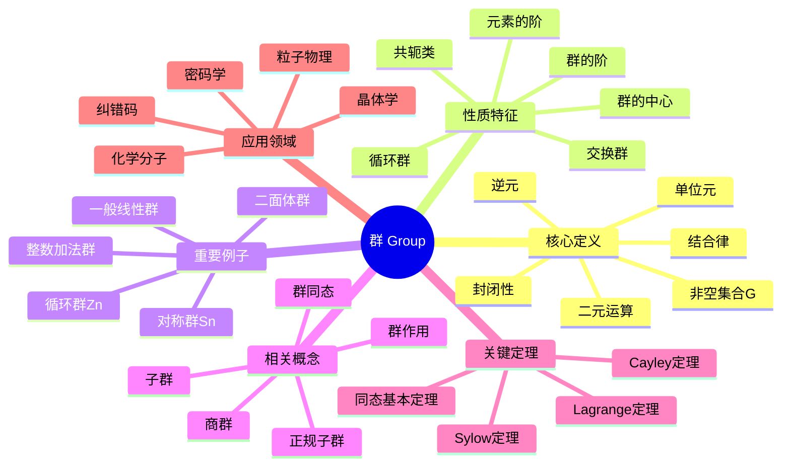

---

## 概念2：环（Ring）

### 核心定义（中心节点）

**正式定义**：环 $(R, +, \cdot)$ 是一个非空集合 $R$ 配备两个二元运算加法 $+$ 和乘法 $\cdot$，满足：

1. $(R, +)$ 是Abel群
2. 乘法满足结合律：$(ab)c = a(bc)$
3. 乘法对加法满足分配律：$a(b+c) = ab + ac$, $(b+c)a = ba + ca$

若乘法有单位元 $1$ 满足 $1 \cdot a = a \cdot 1 = a$，则称为**含幺环**。

**直观理解**：环是同时具有"加法结构"（群）和"乘法结构"（半群）的代数系统。它是整数、多项式、矩阵等数学对象的共同抽象，在数论、代数几何和编码理论中有广泛应用。

### 分支1：性质与特征

- **零因子**：$a \neq 0, b \neq 0$ 但 $ab = 0$
- **整环**：无零因子的交换含幺环
- **除环**：非零元素都有乘法逆的环
- **特征**：使 $n \cdot 1 = 0$ 的最小正整数 $n$
- **幂零元**：存在 $n$ 使 $a^n = 0$
- **单位**：有乘法逆元的元素

### 分支2：例子与反例

**正例**：

- 整数环 $\mathbb{Z}$
- 有理数域 $\mathbb{Q}$（也是环）
- 多项式环 $\mathbb{Z}[x]$
- 矩阵环 $M_n(\mathbb{R})$
- 模 $n$ 剩余类环 $\mathbb{Z}/n\mathbb{Z}$
- 高斯整数环 $\mathbb{Z}[i]$
- 四元数环 $\mathbb{H}$

**反例**：

- 自然数集 $\mathbb{N}$ 不是环（减法不封闭）
- 仅含偶数的集合不是环（无乘法单位元）

### 分支3：相关概念

**前置概念**：群、Abel群、二元运算
**后继概念**：理想、商环、环同态、模、代数
**平行概念**：域、格、半环

### 分支4：定理与应用

**关键定理**：

- **环同态基本定理**：$R/\ker \varphi \cong \text{Im}\,\varphi$
- **中国剩余定理**：关于同余方程组的解
- **Hilbert基定理**：诺特环上的多项式环仍是诺特环
- **Wedderburn小定理**：有限除环必是域

**应用场景**：

- 代数数论中的整数环
- 代数几何中的坐标环
- 编码理论中的循环码
- 密码学中的RSA算法

### 分支5：推广与变形

**推广形式**：

- 非结合环：乘法不要求结合律
- 非交换环：乘法不要求交换律
- graded环：具有分次结构的环

**特殊情况**：

- 布尔环：满足 $a^2 = a$
- 诺特环：理想满足升链条件
- Artin环：理想满足降链条件
- 主理想整环：每个理想都是主理想

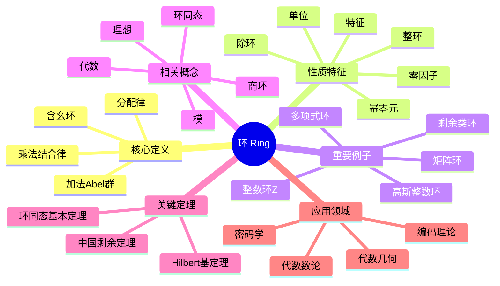

---

## 概念3：域（Field）

### 核心定义（中心节点）

**正式定义**：域 $(F, +, \cdot)$ 是一个非空集合 $F$ 配备两个二元运算，满足：

1. $(F, +)$ 是Abel群，单位元记为 $0$
2. $(F^*, \cdot)$ 是Abel群，其中 $F^* = F \setminus \{0\}$
3. 乘法对加法满足分配律

**直观理解**：域是"最好"的代数结构，在其中可以进行加、减、乘、除（除零外）四则运算。有理数、实数、复数都是域的典型例子。域论是代数学的核心分支，与方程论、数论、代数几何密切相关。

### 分支1：性质与特征

- **特征**：$\text{char}(F)$ 是使 $n \cdot 1 = 0$ 的最小正整数，或0
- **素域**：不含真子域的域，同构于 $\mathbb{Q}$ 或 $\mathbb{F}_p$
- **代数闭域**：每个多项式都有根
- **域扩张**：$K/F$ 表示 $K$ 是 $F$ 的扩域
- **扩张次数**：$[K:F] = \dim_F K$
- **可分扩张**：极小多项式无重根

### 分支2：例子与反例

**正例**：

- 有理数域 $\mathbb{Q}$
- 实数域 $\mathbb{R}$
- 复数域 $\mathbb{C}$
- 有限域 $\mathbb{F}_p = \mathbb{Z}/p\mathbb{Z}$（$p$ 素数）
- 有限域 $\mathbb{F}_{p^n}$
- 代数数域 $\mathbb{Q}(\sqrt{2})$
- 有理函数域 $\mathbb{Q}(x)$

**反例**：

- 整数环 $\mathbb{Z}$ 不是域（2无乘法逆元）
- 矩阵环 $M_n(\mathbb{R})$ 不是域（非零矩阵可能无逆）
- $\mathbb{Z}/4\mathbb{Z}$ 不是域（2是零因子）

### 分支3：相关概念

**前置概念**：群、环、Abel群
**后继概念**：域扩张、Galois理论、代数闭包、赋值论
**平行概念**：除环、整环、格

### 分支4：定理与应用

**关键定理**：

- **域扩张基本定理**：中间域与Galois群子群的对应
- **Wedderburn定理**：有限除环是域
- **Steinitz定理**：每个域都有代数闭包
- **Wedderburn小定理**：有限整环是域
- **原根定理**：有限域的乘法群是循环群

**应用场景**：

- 方程的可解性（Galois理论）
- 尺规作图问题
- 编码理论（有限域上的码）
- 密码学（椭圆曲线密码）
- 代数几何

### 分支5：推广与变形

**推广形式**：

- 除环（斜域）：乘法不要求交换的域
- 近域：弱化分配律的代数结构
- 形式域：具有序结构的域

**特殊情况**：

- 代数闭域：复数域 $\mathbb{C}$
- 实闭域：实数域 $\mathbb{R}$
- 局部域：$p$-进数域
- 整体域：数域和函数域
- 完美域：特征 $p$ 时 Frobenius 是自同构

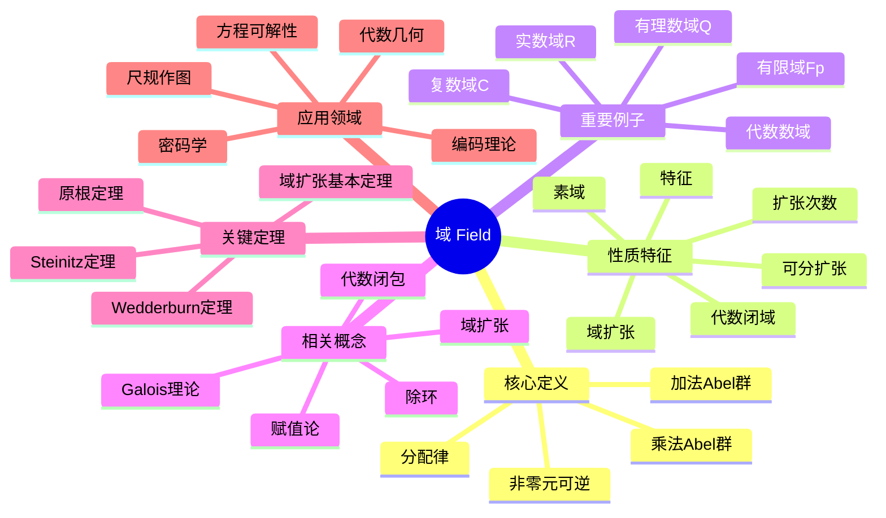

---

## 概念4：向量空间

### 核心定义（中心节点）

**正式定义**：设 $F$ 是域，$V$ 是Abel群。若存在数乘运算 $F \times V \to V$ 满足：

1. $1 \cdot v = v$
2. $(ab) \cdot v = a \cdot (b \cdot v)$
3. $a \cdot (u + v) = a \cdot u + a \cdot v$
4. $(a + b) \cdot v = a \cdot v + b \cdot v$

则称 $V$ 是 $F$ 上的向量空间。

**直观理解**：向量空间是几何向量的代数抽象，是线性代数的基本研究对象。它提供了一个框架，在其中可以讨论线性相关性、基、维数等核心概念，是物理学、工程学和数据科学的基础工具。

### 分支1：性质与特征

- **维数**：基的元素个数，记作 $\dim_F V$
- **有限维/无限维**：根据维数是否有限
- **基**：线性无关的生成集
- **坐标**：向量关于基的表示系数
- **线性包**：子集生成的子空间
- **直和分解**：$V = U \oplus W$

### 分支2：例子与反例

**正例**：

- $F^n$：$n$ 维标准向量空间
- $M_{m \times n}(F)$：$m \times n$ 矩阵空间
- $F[x]$：多项式空间（无限维）
- $F[x]_{\leq n}$：次数不超过 $n$ 的多项式
- $C[a,b]$：连续函数空间
- 域扩张 $K/F$：$K$ 是 $F$ 上的向量空间
- 解空间：齐次线性方程组的解集

**反例**：

- 自然数集不是向量空间（无加法逆元）
- 仅含整数坐标的 $\mathbb{Z}^n$ 不是 $\mathbb{R}$-向量空间

### 分支3：相关概念

**前置概念**：域、Abel群、群作用
**后继概念**：线性映射、子空间、商空间、对偶空间、张量积
**平行概念**：模、代数、李代数

### 分支4：定理与应用

**关键定理**：

- **基存在定理**：每个向量空间都有基
- **维数定理**：$\dim U + \dim W = \dim(U+W) + \dim(U \cap W)$
- **同构定理**：同维数向量空间同构
- **对偶空间定理**：$V \cong V^{**}$（有限维）
- **商空间维数**：$\dim(V/U) = \dim V - \dim U$

**应用场景**：

- 物理学中的状态空间
- 计算机图形学
- 机器学习中的特征空间
- 信号处理
- 量子力学

### 分支5：推广与变形

**推广形式**：

- 模：环上的向量空间
- 分级向量空间：具有分次结构
- 拓扑向量空间：具有拓扑结构

**特殊情况**：

- 内积空间：具有内积结构的向量空间
- 赋范空间：具有范数的向量空间
- Banach空间：完备的赋范空间
- Hilbert空间：完备的内积空间

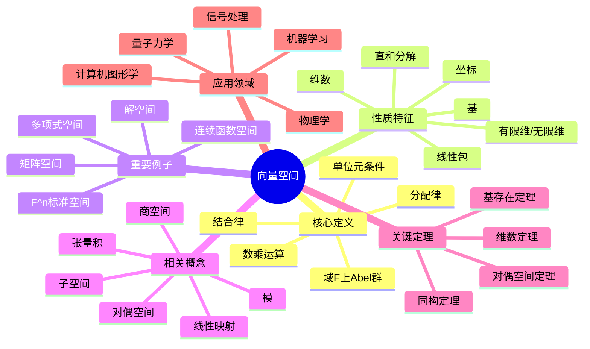

---

## 概念5：线性映射

### 核心定义（中心节点）

**正式定义**：设 $V, W$ 是 $F$-向量空间，映射 $T: V \to W$ 称为线性映射，如果：

1. $T(u + v) = T(u) + T(v)$（加法保持）
2. $T(av) = aT(v)$（数乘保持）

等价地：$T(au + bv) = aT(u) + bT(v)$

**直观理解**：线性映射是向量空间之间的"结构保持"映射，它保持加法和数乘运算。线性映射是研究向量空间之间关系的基本工具，其矩阵表示架起了抽象代数与具体计算之间的桥梁。

### 分支1：性质与特征

- **单射/满射/双射**：作为集合映射的性质
- **同构**：双射线性映射
- **核**：$\ker T = \{v \in V : T(v) = 0\}$
- **像**：$\text{Im}\,T = \{T(v) : v \in V\}$
- **秩**：$\text{rank}(T) = \dim(\text{Im}\,T)$
- **零化度**：$\text{nullity}(T) = \dim(\ker T)$

### 分支2：例子与反例

**正例**：

- 零映射：$T(v) = 0$
- 恒等映射：$I(v) = v$
- 投影映射：$P(x,y) = (x,0)$
- 微分算子：$D(f) = f'$
- 积分算子：$T(f) = \int_a^b f(t)dt$
- 矩阵乘法：$T_A(x) = Ax$
- 旋转矩阵：$R_\theta = \begin{pmatrix} \cos\theta & -\sin\theta \\ \sin\theta & \cos\theta \end{pmatrix}$

**反例**：

- 平移映射：$T(v) = v + c$（$c \neq 0$）
- 平方映射：$T(x) = x^2$
- 仿射变换（一般情况）

### 分支3：相关概念

**前置概念**：向量空间、映射、矩阵
**后继概念**：线性变换、特征值、不变子空间、Jordan标准形
**平行概念**：群同态、环同态、模同态

### 分支4：定理与应用

**关键定理**：

- **秩-零化度定理**：$\dim V = \text{rank}(T) + \text{nullity}(T)$
- **同构定理**：$V/\ker T \cong \text{Im}\,T$
- **维数定理**：$\dim(V \oplus W) = \dim V + \dim W$
- **表示定理**：有限维时，线性映射对应矩阵

**应用场景**：

- 线性方程组的求解
- 最小二乘拟合
- 主成分分析（PCA）
- 图像变换（旋转、缩放）
- 量子力学中的可观测量

### 分支5：推广与变形

**推广形式**：

- 模同态：环上模的线性映射
- 多重线性映射：多变量线性映射
- 半线性映射：与域自同构相容的映射

**特殊情况**：

- 线性变换：$V \to V$ 的线性映射
- 线性泛函：$V \to F$ 的线性映射
- 自同态：$V \to V$ 的线性映射
- 自同构：可逆的自同态

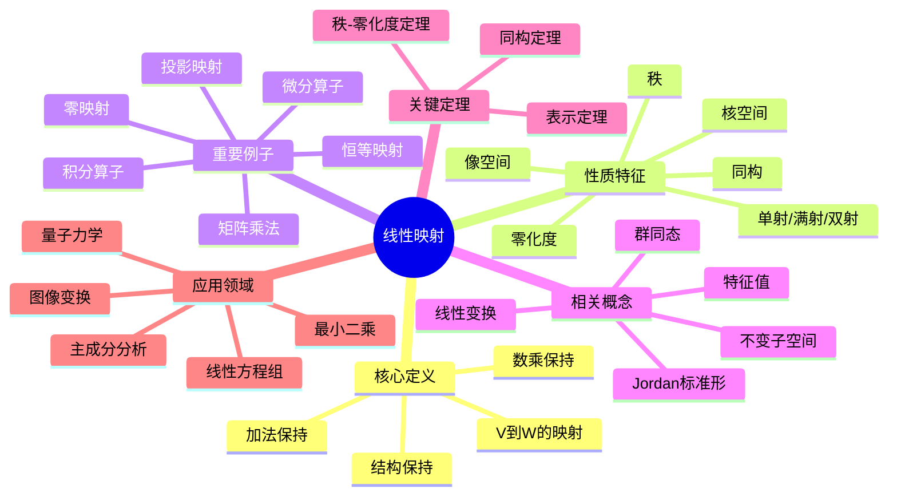

---

## 概念6：特征值

### 核心定义（中心节点）

**正式定义**：设 $T: V \to V$ 是线性变换，若存在 $\lambda \in F$ 和非零向量 $v \in V$ 使得：
$$T(v) = \lambda v$$

则称 $\lambda$ 为 $T$ 的**特征值**，$v$ 为对应的**特征向量**。

矩阵情形：$Av = \lambda v$，即 $(A - \lambda I)v = 0$ 有非零解。

**直观理解**：特征向量是在线性变换下保持方向（或反向）的"特殊方向"，特征值是该方向的伸缩因子。特征值问题是线性代数的核心，在物理、工程、数据分析中无处不在。

### 分支1：性质与特征

- **特征多项式**：$p_T(\lambda) = \det(A - \lambda I)$
- **代数重数**：特征根在特征多项式中的重数
- **几何重数**：特征子空间的维数
- **谱**：所有特征值的集合 $\sigma(T)$
- **特征子空间**：$E_\lambda = \{v : T(v) = \lambda v\}$
- **可对角化**：存在由特征向量组成的基

### 分支2：例子与反例

**正例**：

- 投影矩阵：特征值0和1
- 旋转矩阵（$\mathbb{R}^2$）：无实特征值（有复特征值）
- 对角矩阵：对角元即为特征值
- 置换矩阵：特征值是单位根
- 实对称矩阵：特征值都是实数
- 正定矩阵：特征值都是正数

**反例**：

- 幂零矩阵 $N$：唯一特征值0，但 $N \neq 0$
- 某些矩阵在实数域上无特征值

### 分支3：相关概念

**前置概念**：线性变换、行列式、特征多项式
**后继概念**：对角化、Jordan标准形、谱分解、奇异值分解
**平行概念**：特征函数、本征值、谱理论

### 分支4：定理与应用

**关键定理**：

- **代数基本定理**：复矩阵总有特征值
- **Cayley-Hamilton定理**：矩阵满足其特征多项式
- **谱定理**：正规矩阵可酉对角化
- **Gershgorin圆盘定理**：特征值位置估计
- **Perron-Frobenius定理**：正矩阵的最大特征值性质

**应用场景**：

- 振动分析（特征频率）
- 主成分分析
- 马尔可夫链的稳态分布
- Google的PageRank算法
- 量子力学的能级
- 图像压缩

### 分支5：推广与变形

**推广形式**：

- 广义特征值：$Av = \lambda Bv$
- 算子谱理论：无穷维空间上的推广
- 数值范围：特征值的推广概念

**特殊情况**：

- 实对称矩阵：特征值实，特征向量正交
- 酉矩阵：特征值模为1
- 正规矩阵：可酉对角化
- 正定矩阵：特征值全正

```mermaid
mindmap
  root((特征值))
    核心定义
      T(v) = λv
      特征向量非零
      伸缩因子
      特殊方向
    性质特征
      特征多项式
      代数重数
      几何重数
      谱
      特征子空间
      可对角化
    重要例子
      投影矩阵
      旋转矩阵
      对角矩阵
      置换矩阵
      实对称矩阵
      正定矩阵
    相关概念
      对角化
      Jordan标准形
      谱分解
      奇异值分解
      特征函数
    关键定理
      Cayley-Hamilton
      谱定理
      Gershgorin定理
      Perron-Frobenius
    应用领域
      振动分析
      主成分分析
      马尔可夫链
      PageRank
      量子力学
      图像压缩

```

---

## 概念7：子群

### 核心定义（中心节点）

**正式定义**：设 $G$ 是群，$H \subseteq G$ 非空。若 $H$ 在 $G$ 的运算下也构成群，则称 $H$ 是 $G$ 的**子群**，记作 $H \leq G$。

等价判定：$H \leq G$ 当且仅当：

1. $e \in H$
2. $a, b \in H \Rightarrow ab \in H$
3. $a \in H \Rightarrow a^{-1} \in H$

或简化为：$a, b \in H \Rightarrow ab^{-1} \in H$

**直观理解**：子群是群中的"子结构"，保持原群的运算封闭。研究子群是理解群结构的基本方法，通过分析子群及其关系可以揭示群的整体性质。

### 分支1：性质与特征

- **平凡子群**：$\{e\}$ 和 $G$ 本身
- **真子群**：$H \subsetneq G$
- **生成子群**：$\langle S \rangle$ 是包含 $S$ 的最小子群
- **循环子群**：$\langle a \rangle = \{a^n : n \in \mathbb{Z}\}$
- **共轭子群**：$gHg^{-1}$ 是 $H$ 的共轭
- **子群格**：所有子群在包含关系下的格

### 分支2：例子与反例

**正例**：

- $n\mathbb{Z} \leq \mathbb{Z}$（$n$ 的倍数）
- $A_n \leq S_n$（交错群）
- $SL_n(F) \leq GL_n(F)$（特殊线性群）
- 旋转子群 $\langle r \rangle \leq D_n$
- 中心 $Z(G) \leq G$
- 换位子群 $[G,G] \leq G$

**反例**：

- 自然数 $\mathbb{N} \subseteq \mathbb{Z}$ 不是子群（无逆元）
- 偶置换和奇置换的并集不是子群

### 分支3：相关概念

**前置概念**：群、群运算、逆元
**后继概念**：正规子群、商群、Lagrange定理、Sylow定理
**平行概念**：子环、子域、子空间

### 分支4：定理与应用

**关键定理**：

- **Lagrange定理**：$|G| = [G:H] \cdot |H|$

- **子群判定准则**：单步判定法
- **Cauchy定理**：若 $p \mid |G|$，则存在 $p$ 阶子群

- **Sylow定理**：$p$-子群的存在性和共轭性

**应用场景**：

- 群的结构分析
- 对称性分析
- 晶体学中的点群
- 化学分子对称性

### 分支5：推广与变形

**推广形式**：

- 子半群、子幺半群
- 特征子群：在所有自同构下不变
- 全不变子群：在所有自同态下不变

**特殊情况**：

- 极大子群：无真包含它的真子群
- 极小子群：不包含真子群的非平凡子群
- Hall子群：阶与指数互素的子群

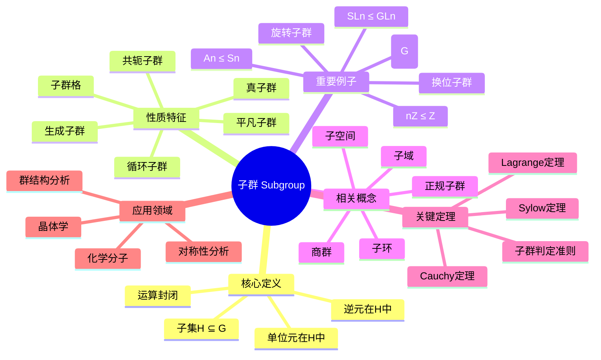

---

## 概念8：正规子群

### 核心定义（中心节点）

**正式定义**：子群 $N \leq G$ 称为**正规子群**（或不变子群），记作 $N \trianglelefteq G$，如果满足以下等价条件之一：

1. $\forall g \in G, gN = Ng$（左右陪集相等）
2. $\forall g \in G, gNg^{-1} = N$（共轭封闭）
3. $N$ 是某个群同态的核

**直观理解**：正规子群是在群的共轭作用下"对称"的子群。正规子群的重要性在于它可以构造商群——通过将正规子群的元素"等同"为单位元，可以得到一个新的群结构。

### 分支1：性质与特征

- **自正规性**：$N \trianglelefteq G$ 时，$N \trianglelefteq N_G(N)$
- **传递性**：$K \trianglelefteq H \trianglelefteq G$ 不蕴含 $K \trianglelefteq G$
- **交的性质**：正规子群的交仍是正规子群
- **积的性质**：$N_1 N_2$ 若子群则正规
- **对应定理**：商群的子群与原群含 $N$ 的子群对应

### 分支2：例子与反例

**正例**：

- 所有群的平凡子群 $\{e\}$ 和 $G$
- Abel群的所有子群
- 中心 $Z(G) \trianglelefteq G$
- 换位子群 $[G,G] \trianglelefteq G$
- $A_n \trianglelefteq S_n$（$n \geq 2$）
- $SL_n(F) \trianglelefteq GL_n(F)$

**反例**：

- $\{e, (12)\} \leq S_3$ 不是正规子群
- 一般地，非Abel群的真子群常不正规

### 分支3：相关概念

**前置概念**：子群、陪集、共轭
**后继概念**：商群、群同态基本定理、合成列
**平行概念**：理想（环论中对应概念）

### 分支4：定理与应用

**关键定理**：

- **正规子群与商群**：$N \trianglelefteq G \Rightarrow G/N$ 是群
- **同态基本定理**：$G/\ker \varphi \cong \text{Im}\,\varphi$
- **第二同构定理**：$HN/N \cong H/(H \cap N)$
- **第三同构定理**：$(G/N)/(H/N) \cong G/H$
- **对应定理**：子群格之间的对应

**应用场景**：

- 群的分类（通过正规列）
- 可解群、幂零群理论
- Galois理论
- 物理学中的规范群

### 分支5：推广与变形

**推广形式**：

- 次正规子群：存在正规列连接
- 特征子群：在所有自同构下不变
- 全特征子群：在所有自同态下不变

**特殊情况**：

- 极小正规子群
- 极大正规子群
- 主群列中的因子

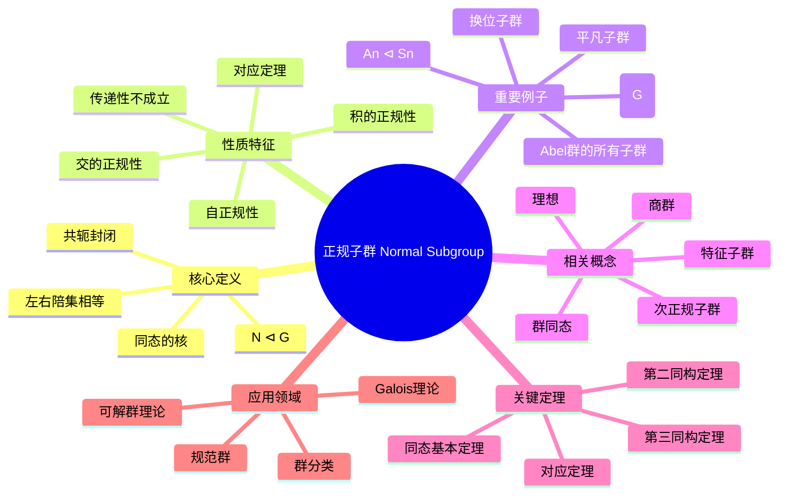

---

## 概念9：商群

### 核心定义（中心节点）

**正式定义**：设 $N \trianglelefteq G$ 是正规子群。商群 $G/N$ 定义为所有陪集的集合：
$$G/N = \{gN : g \in G\}$$

运算定义为：$(gN)(hN) = (gh)N$

单位元是 $N = eN$，逆元是 $(gN)^{-1} = g^{-1}N$。

**直观理解**：商群是通过"模去"正规子群得到的简化结构。将 $N$ 中所有元素视为"零"或"单位元"，商群描述了群 $G$ 关于 $N$ 的"粗粒度"结构。这是构造新群、研究群结构的基本工具。

### 分支1：性质与特征

- **阶**：$|G/N| = [G:N] = |G|/|N|$（Lagrange）

- **典范映射**：$\pi: G \to G/N, g \mapsto gN$ 是满同态
- **核**：$\ker \pi = N$
- **单性**：$G/N$ 是单群当且仅当 $N$ 是极大正规子群
- **交换性**：$G/N$ Abel 当且仅当 $[G,G] \subseteq N$

### 分支2：例子与反例

**正例**：

- $\mathbb{Z}/n\mathbb{Z}$：整数模 $n$ 加法群
- $S_n/A_n \cong \mathbb{Z}/2\mathbb{Z}$（符号同态）
- $GL_n(F)/SL_n(F) \cong F^*$（行列式同态）
- $G/Z(G)$：内自同构群
- $\mathbb{R}/\mathbb{Z} \cong S^1$（圆群）
- $\mathbb{C}^*/\mathbb{R}^+ \cong S^1$

**反例**：

- $H$ 不正规时，$G/H$ 无自然的群结构

### 分支3：相关概念

**前置概念**：正规子群、陪集、群同态
**后继概念**：群扩张、半直积、直积
**平行概念**：商环、商空间、商模

### 分支4：定理与应用

**关键定理**：

- **商群良定性**：运算与代表元选取无关
- **同态基本定理**：任何同态像都同构于某商群
- **对应定理**：$G/N$ 的子群与含 $N$ 的子群对应
- **Jordan-Hölder定理**：合成列的唯一性

**应用场景**：

- 模算术（$\mathbb{Z}/n\mathbb{Z}$）
- 伽罗瓦理论
- 同调代数
- 拓扑中的覆叠空间
- 表示论

### 分支5：推广与变形

**推广形式**：

- 商半群、商幺半群
- 商广群
- 商范畴

**特殊情况**：

- 平凡商群：$G/\{e\} \cong G$
- 单位商群：$G/G \cong \{e\}$
- 导商群：$G/[G,G]$（最大Abel商）

```mermaid
mindmap
  root((商群 Quotient Group))
    核心定义
      N ⊲ G的陪集
      G/N = {gN}
      陪集乘法
      典范投影
    性质特征
      阶|G/N|=[G:N]

      典范映射
      核等于N
      单性条件
      交换性条件
    重要例子
      Z/nZ
      Sn/An
      GLn/SLn
      G/Z(G)
      R/Z ≅ S¹
    相关概念
      正规子群
      群同态
      商环
      商空间
      商模
    关键定理
      良定性
      同态基本定理
      对应定理
      Jordan-Hölder
    应用领域
      模算术
      Galois理论
      同调代数
      覆叠空间
      表示论

```

---

## 概念10：群同态

### 核心定义（中心节点）

**正式定义**：设 $G, H$ 是群，映射 $\varphi: G \to H$ 称为**群同态**，如果：
$$\varphi(ab) = \varphi(a)\varphi(b), \quad \forall a, b \in G$$

即保持群运算的映射。

**分类**：

- **单同态**（嵌入）：单射同态
- **满同态**：满射同态
- **同构**：双射同态，记作 $G \cong H$
- **自同态**：$G \to G$ 的同态
- **自同构**：可逆的自同态

**直观理解**：群同态是群之间的"结构保持"映射，它保持乘法关系。通过研究群同态，可以比较不同群的结构，建立群之间的联系，是群论的核心工具。

### 分支1：性质与特征

- **保持单位元**：$\varphi(e_G) = e_H$
- **保持逆元**：$\varphi(a^{-1}) = \varphi(a)^{-1}$
- **保持幂次**：$\varphi(a^n) = \varphi(a)^n$
- **核**：$\ker \varphi = \{g \in G : \varphi(g) = e_H\}$
- **像**：$\text{Im}\,\varphi = \{\varphi(g) : g \in G\}$

### 分支2：例子与反例

**正例**：

- 零同态：$\varphi(g) = e_H$
- 嵌入映射：$\mathbb{Z} \hookrightarrow \mathbb{Q}$
- 行列式：$\det: GL_n(F) \to F^*$
- 符号映射：$\text{sgn}: S_n \to \{\pm 1\}$
- 指数映射：$\exp: (\mathbb{R}, +) \to (\mathbb{R}^+, \times)$
- 模 $n$ 约化：$\mathbb{Z} \to \mathbb{Z}/n\mathbb{Z}$

**反例**：

- 平移：$\varphi(g) = ga$（$a \neq e$）
- 平方映射（一般群）
- 非线性映射

### 分支3：相关概念

**前置概念**：群、映射、子群
**后继概念**：同态基本定理、群作用、表示
**平行概念**：环同态、线性映射、函子

### 分支4：定理与应用

**关键定理**：

- **同态基本定理**：$G/\ker \varphi \cong \text{Im}\,\varphi$
- **单射判定**：$\varphi$ 单 $\Leftrightarrow \ker \varphi = \{e\}$
- **第一同构定理**（已包含在基本定理中）
- **自同构群**：$\text{Aut}(G)$ 构成群

**应用场景**：

- 群分类（通过同态像）
- 表示论
- Galois理论
- 同调代数
- 密码学

### 分支5：推广与变形

**推广形式**：

- 广群同态
- 拓扑群连续同态
- 李群光滑同态

**特殊情况**：

- 典范投影：$G \to G/N$
- 内自同构：$\varphi_g(x) = gxg^{-1}$
- 特征标：$G \to \mathbb{C}^*$

```mermaid
mindmap
  root((群同态 Group Homomorphism))
    核心定义
      φ(ab) = φ(a)φ(b)
      保持运算
      单/满/同构
      自同态
      自同构
    性质特征
      保持单位元
      保持逆元
      保持幂次
      核ker φ
      像Im φ
    重要例子
      零同态
      嵌入映射
      行列式
      符号映射
      指数映射
      模n约化
    相关概念
      同态基本定理
      群作用
      表示
      环同态
      函子
    关键定理
      同态基本定理
      单射判定
      自同构群
    应用领域
      群分类
      表示论
      Galois理论
      同调代数
      密码学

```

---

## 概念11：理想

### 核心定义（中心节点）

**正式定义**：设 $R$ 是环，$I \subseteq R$ 是加法子群。若满足：

1. **左理想**：$\forall r \in R, a \in I \Rightarrow ra \in I$
2. **右理想**：$\forall r \in R, a \in I \Rightarrow ar \in I$
3. **双边理想**：同时是左理想和右理想

则称 $I$ 是 $R$ 的理想。交换环中三者一致。

**直观理解**：理想是环论中对应于正规子群的概念。它可以构造商环，是研究环的结构和性质的核心工具。在整数环中，理想就是主理想 $(n) = n\mathbb{Z}$。

### 分支1：性质与特征

- **生成理想**：$(S)$ 是包含 $S$ 的最小理想
- **主理想**：由一个元素生成的理想 $(a)$
- **极大理想**：无真包含它的真理想
- **素理想**：$ab \in P \Rightarrow a \in P$ 或 $b \in P$
- **准素理想**：幂零元条件弱化版本
- **理想的和与积**：新的理想构造方法

### 分支2：例子与反例

**正例**：

- $n\mathbb{Z} \subseteq \mathbb{Z}$（所有主理想）
- $(x) \subseteq F[x]$（多项式环）
- 零理想 $\{0\}$ 和单位理想 $R$
- 矩阵环 $M_n(F)$ 只有平凡理想
- 理想 $(2, x) \subseteq \mathbb{Z}[x]$

**反例**：

- 子环不一定是理想（如 $\mathbb{Z} \subseteq \mathbb{Q}$）
- 加法子群不一定是理想

### 分支3：相关概念

**前置概念**：环、子群、正规子群
**后继概念**：商环、素谱、极大谱、局部化
**平行概念**：子模、正规子群

### 分支4：定理与应用

**关键定理**：

- **商环构造**：$I$ 理想 $\Rightarrow R/I$ 是环
- **对应定理**：$R/I$ 的理想与含 $I$ 的理想对应
- **极大理想存在**：含单位元的环必有极大理想（Zorn引理）
- **Krull定理**：$R$ 是域 $\Leftrightarrow$ 只有平凡理想

**应用场景**：

- 代数数论（整数环的理想分解）
- 代数几何（素谱作为几何对象）
- 编码理论
- 代数整数环的类群

### 分支5：推广与变形

**推广形式**：

- 分式理想：在分式域中
- 可逆理想：可逆的分式理想
- 整闭理想：与整闭包相关

**特殊情况**：

- 主理想整环（PID）
- 诺特环：理想满足升链条件
- Artin环：理想满足降链条件

```mermaid
mindmap
  root((理想 Ideal))
    核心定义
      加法子群
      左/右吸收性
      双边理想
      商环构造
    性质特征
      生成理想
      主理想
      极大理想
      素理想
      准素理想
      和与积
    重要例子
      nZ ⊆ Z
      (x) ⊆ F[x]
      平凡理想
      矩阵环
      (2, x) ⊆ Z[x]
    相关概念
      商环
      素谱
      极大谱
      局部化
      子模
    关键定理
      商环构造
      对应定理
      极大理想存在
      Krull定理
    应用领域
      代数数论
      代数几何
      编码理论
      类群

```

---

## 概念12：商环

### 核心定义（中心节点）

**正式定义**：设 $R$ 是环，$I$ 是 $R$ 的双边理想。商环 $R/I$ 定义为所有陪集的集合：
$$R/I = \{r + I : r \in R\}$$

运算定义为：

- 加法：$(r + I) + (s + I) = (r + s) + I$
- 乘法：$(r + I)(s + I) = rs + I$

**直观理解**：商环是通过"模去"理想得到的简化结构。类似于群中的商群，商环将理想中的元素"等同"为零，从而研究环的粗粒度结构。这是构造新环、研究环性质的基本工具。

### 分支1：性质与特征

- **典范投影**：$\pi: R \to R/I, r \mapsto r + I$ 是环同态
- **核**：$\ker \pi = I$
- **理想的对应**：$R/I$ 的理想 $\leftrightarrow$ 含 $I$ 的 $R$ 的理想
- **素理想的对应**：素理想在投影下对应
- **极大理想的对应**：极大理想在投影下对应

### 分支2：例子与反例

**正例**：

- $\mathbb{Z}/n\mathbb{Z}$：整数模 $n$
- $F[x]/(x^2)$：对偶数环
- $F[x]/(p(x))$：域扩张构造
- $\mathbb{R}[x]/(x^2 + 1) \cong \mathbb{C}$
- $k[x,y]/(x,y) \cong k$

**反例**：

- 子环 $S$ 不一定是理想，$R/S$ 一般无环结构

### 分支3：相关概念

**前置概念**：理想、环同态、商群
**后继概念**：中国剩余定理、素谱、Jacobson根
**平行概念**：商群、商空间、商模

### 分支4：定理与应用

**关键定理**：

- **环同态基本定理**：$R/\ker \varphi \cong \text{Im}\,\varphi$
- **第一同构定理**：$(R/I)/(J/I) \cong R/J$
- **第二同构定理**：$(I + J)/J \cong I/(I \cap J)$
- **中国剩余定理**：关于两两互素理想的直积分解

**应用场景**：

- 模算术
- 域的构造（通过不可约多项式）
- 代数几何（坐标环）
- 同调代数

### 分支5：推广与变形

**推广形式**：

- 局部化：$S^{-1}R$
- 完备化：$\varprojlim R/I^n$
- 形式幂级数环

**特殊情况**：

- 域：当 $I$ 是极大理想时
- 整环：当 $I$ 是素理想时
- 约化环：幂零元理想为零

```mermaid
mindmap
  root((商环 Quotient Ring))
    核心定义
      理想I的陪集
      R/I = {r+I}
      陪集加法
      陪集乘法
    性质特征
      典范投影
      核等于I
      理想对应
      素理想对应
      极大理想对应
    重要例子
      Z/nZ
      F[x]/(x²)
      域扩张
      R[x]/(x²+1)≅C
      k[x,y]/(x,y)
    相关概念
      理想
      环同态
      中国剩余定理
      素谱
      Jacobson根
    关键定理
      环同态基本定理
      第一同构定理
      第二同构定理
      中国剩余定理
    应用领域
      模算术
      域构造
      代数几何
      同调代数

```

---

## 概念13：整环

### 核心定义（中心节点）

**正式定义**：环 $R$ 称为**整环**（Integral Domain），如果满足：

1. $R$ 是交换环
2. $R$ 有单位元 $1 \neq 0$
3. $R$ 无零因子：$ab = 0 \Rightarrow a = 0$ 或 $b = 0$

**直观理解**：整环是最接近整数环性质的环结构。在其中可以进行"约分"（消去律），是唯一分解整环、主理想整环、欧几里得整环等更特殊环的基类。整环的商域构造是获得域的标准方法。

### 分支1：性质与特征

- **消去律**：$ab = ac, a \neq 0 \Rightarrow b = c$
- **整除关系**：$a \mid b$ 定义与整数类似
- **相伴元**：$a \sim b$ 若 $a = ub$，$u$ 是单位
- **不可约元**：不能分解为两个非单位乘积
- **素元**：$p \mid ab \Rightarrow p \mid a$ 或 $p \mid b$
- **唯一分解性质**（UFD特有）

### 分支2：例子与反例

**正例**：

- 整数环 $\mathbb{Z}$
- 域（特殊的整环）
- 多项式环 $F[x]$
- 高斯整数环 $\mathbb{Z}[i]$
- Eisenstein整数环 $\mathbb{Z}[\omega]$
- $k[x_1, \ldots, x_n]$（$k$ 是域）

**反例**：

- $\mathbb{Z}/6\mathbb{Z}$（$2 \cdot 3 = 0$）
- $k[x,y]/(xy)$（有零因子）
- $M_2(\mathbb{R})$（非交换且有零因子）
- 偶数环 $2\mathbb{Z}$（无单位元）

### 分支3：相关概念

**前置概念**：环、交换环、零因子
**后继概念**：唯一分解整环、主理想整环、欧几里得整环、商域
**平行概念**：素环、半素环

### 分支4：定理与应用

**关键定理**：

- **整环的商域**：每个整环可嵌入域中
- **多项式环**：$R$ 整环 $\Rightarrow R[x]$ 整环
- **素理想**：$R/P$ 整环 $\Leftrightarrow P$ 素理想
- **整闭包**：在代数扩张中的整闭包仍是整环

**应用场景**：

- 数论（代数整数环）
- 代数几何（坐标环）
- 编码理论
- 代数K-理论

### 分支5：推广与变形

**推广形式**：

- 唯一分解整环（UFD）
- 主理想整环（PID）
- 欧几里得整环
- Dedekind整环

**特殊情况**：

- 域：非零元都可逆的整环
- 局部整环：只有一个极大理想
- 正规整环：整闭的整环

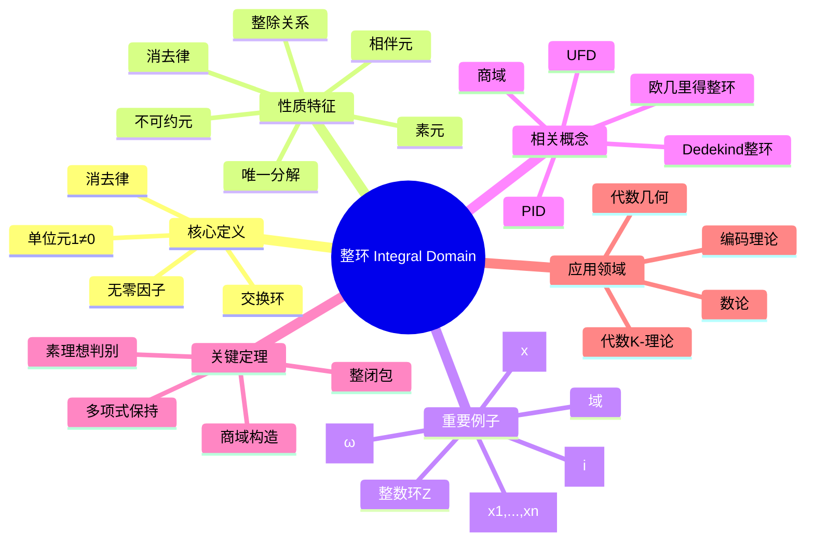

---

## 概念14：唯一分解整环

### 核心定义（中心节点）

**正式定义**：整环 $R$ 称为**唯一分解整环**（Unique Factorization Domain, UFD），如果满足：

1. **存在性**：每个非零非单位元 $a$ 可写为不可约元的乘积
2. **唯一性**：若 $a = p_1 \cdots p_m = q_1 \cdots q_n$，则 $m = n$ 且（重排后）$p_i \sim q_i$

**直观理解**：UFD是保持算术基本定理（唯一分解定理）的环结构。在UFD中，因子分解理论类似于整数中的素因子分解，为研究环的算术性质提供了基础。

### 分支1：性质与特征

- **不可约元 = 素元**
- **最大公因子存在**：任意有限集合有gcd
- **理想升链**：主理想满足升链条件
- **分式理想**：可逆分式理想构成类群
- **Krull维数**：通常 $\dim \leq 1$ 时是Dedekind整环

### 分支2：例子与反例

**正例**：

- 整数环 $\mathbb{Z}$
- 域 $F$（平凡地）
- 多项式环 $F[x_1, \ldots, x_n]$
- 主理想整环（PID）
- 高斯整数环 $\mathbb{Z}[i]$
- 形式幂级数环 $F[[x]]$

**反例**：

- $\mathbb{Z}[\sqrt{-5}]$（$6 = 2 \cdot 3 = (1+\sqrt{-5})(1-\sqrt{-5})$）
- $k[x^2, xy, y^2]$（非UFD）
- 某些非诺特整环

### 分支3：相关概念

**前置概念**：整环、不可约元、素元
**后继概念**：类群、分式理想、Dedekind整环
**平行概念**：主理想整环、欧几里得整环、诺特环

### 分支4：定理与应用

**关键定理**：

- **PID是UFD**：主理想整环必是唯一分解整环
- **Gauss引理**：$R$ 是UFD $\Rightarrow R[x]$ 是UFD
- **Eisenstein判别法**：判断多项式不可约
- **类群刻画**：UFD $\Leftrightarrow$ 类群平凡

**应用场景**：

- 代数数论（理想类群）
- 代数几何（Weil除子）
- 编码理论
- 多项式因式分解算法

### 分支5：推广与变形

**推广形式**：

- Dedekind整环：维数为1的诺特正规整环
- Krull整环：更一般的分解理论
- 因子分解整环：放宽唯一性条件

**特殊情况**：

- 主理想整环（更强的条件）
- 欧几里得整环（有除法算法的整环）
- 多项式环 $F[x]$（UFD但不是PID当变量 $>1$）

```mermaid
mindmap
  root((唯一分解整环 UFD))
    核心定义
      分解存在性
      分解唯一性
      不可约元
      相伴等价
    性质特征
      不可约=素元
      gcd存在
      主理想升链
      分式理想
      Krull维数
    重要例子
      整数环Z
      域
      F[x1,...,xn]
      PID都是UFD
      Z[i]
      F[[x]]
    相关概念
      PID
      欧几里得整环
      Dedekind整环
      类群
      分式理想
    关键定理
      PID是UFD
      Gauss引理
      Eisenstein判别法
      类群刻画
    应用领域
      代数数论
      代数几何
      编码理论
      因式分解

```

---

## 概念15：模

### 核心定义（中心节点）

**正式定义**：设 $R$ 是环，$M$ 是Abel群。若存在数乘 $R \times M \to M$ 满足：

1. $r(m_1 + m_2) = rm_1 + rm_2$
2. $(r_1 + r_2)m = r_1m + r_2m$
3. $(r_1r_2)m = r_1(r_2m)$
4. $1 \cdot m = m$（若 $R$ 含幺）

则称 $M$ 是 $R$ 上的**模**（Module）。

**直观理解**：模是向量空间在环上的推广。当 $R$ 是域时，模就是向量空间。模论是现代代数学的核心，统一了群表示、线性代数、同调代数等多个领域。

### 分支1：性质与特征

- **子模**：$M$ 的子群且在 $R$ 作用下封闭
- **商模**：$M/N$，$N$ 是子模
- **直和/直积**：模的构造方法
- **自由模**：有基的模，同构于 $R^n$
- **有限生成**：存在有限生成集
- **Noether模**：子模满足升链条件

### 分支2：例子与反例

**正例**：

- 向量空间：域上的模
- Abel群：$\mathbb{Z}$-模
- 理想：$R$ 作为 $R$-模的子模
- $R^n$：自由模
- $k[x]$-模：$k$-向量空间配线性变换
- 同调群：通常是模

**反例**：

- 一般群（非Abel）不能成为模
- 不满足分配律的结构

### 分支3：相关概念

**前置概念**：Abel群、环、向量空间
**后继概念**：同态、张量积、正合序列、投射/内射模
**平行概念**：向量空间、表示、层

### 分支4：定理与应用

**关键定理**：

- **同态基本定理**：$M/\ker f \cong \text{Im}\,f$
- **模结构定理**（PID上）：有限生成模分解
- **Schur引理**：单模同态的性质
- **Nakayama引理**：局部环上模的性质

**应用场景**：

- 表示论（群表示作为模）
- 同调代数
- 代数几何（层论）
- 代数数论（理想作为模）
- 代数拓扑

### 分支5：推广与变形

**推广形式**：

- 双模：既是左模又是右模
- 分次模：具有分次结构
- 拓扑模：具有拓扑结构

**特殊情况**：

- 自由模：有基的模
- 投射模：自由模的直和项
- 内射模：对偶概念
- 平坦模：与张量积正合

```mermaid
mindmap
  root((模 Module))
    核心定义
      环R上Abel群
      数乘运算
      分配律
      结合律
      单位元条件
    性质特征
      子模
      商模
      直和/直积
      自由模
      有限生成
      Noether模
    重要例子
      向量空间
      Abel群
      理想
      R^n
      k[x]-模
      同调群
    相关概念
      同态
      张量积
      正合序列
      投射模
      内射模
    关键定理
      同态基本定理
      结构定理
      Schur引理
      Nakayama引理
    应用领域
      表示论
      同调代数
      代数几何
      代数数论
      代数拓扑

```

---

## 概念16：张量积

### 核心定义（中心节点）

**正式定义**：设 $R$ 是交换环，$M, N$ 是 $R$-模。张量积 $M \otimes_R N$ 是满足以下泛性质的 $R$-模：

存在双线性映射 $\otimes: M \times N \to M \otimes_R N$，使得对任意双线性映射 $f: M \times N \to P$，存在唯一的线性映射 $\tilde{f}: M \otimes_R N \to P$ 使得 $f = \tilde{f} \circ \otimes$。

元素记为 $m \otimes n$，满足双线性关系。

**直观理解**：张量积是"最一般的"双线性构造，它将两个模"乘"在一起。在物理学中，张量描述多线性物理量；在几何中，张量场是微分几何的基本对象；在代数中，它是同调代数的核心工具。

### 分支1：性质与特征

- **双线性性**：$(am) \otimes n = a(m \otimes n) = m \otimes (an)$
- **分配律**：$(m_1 + m_2) \otimes n = m_1 \otimes n + m_2 \otimes n$
- **结合律**：$(M \otimes N) \otimes P \cong M \otimes (N \otimes P)$
- **单位元**：$R \otimes_R M \cong M$
- **直和**：$(\oplus M_i) \otimes N \cong \oplus (M_i \otimes N)$

### 分支2：例子与反例

**正例**：

- $F^n \otimes_F F^m \cong F^{nm}$（矩阵张量积）
- $\mathbb{Z}/m\mathbb{Z} \otimes_\mathbb{Z} \mathbb{Z}/n\mathbb{Z} \cong \mathbb{Z}/\gcd(m,n)\mathbb{Z}$
- $k[x] \otimes_k k[y] \cong k[x,y]$
- 向量空间的张量积
- 微分形式的楔积（反称张量）

**反例**：

- $m \otimes n = 0$ 不蕴含 $m = 0$ 或 $n = 0$
- 一般 $M \otimes N \not\cong N \otimes M$（非交换环）

### 分支3：相关概念

**前置概念**：模、双线性映射、泛性质
**后继概念**：Tor函子、张量代数、外代数、对称代数
**平行概念**：直积、Hom函子、多线性代数

### 分支4：定理与应用

**关键定理**：

- **张量积的泛性质**：刻画了唯一性
- **右正合性**：$-\otimes N$ 保持右正合序列
- **平坦模**：$-\otimes M$ 正合的模
- **张量-Hom伴随**：$\text{Hom}(M \otimes N, P) \cong \text{Hom}(M, \text{Hom}(N,P))$

**应用场景**：

- 微分几何（张量场、曲率）
- 广义相对论（应力-能量张量）
- 量子力学（复合系统）
- 同调代数（Tor函子）
- 表示论（表示的张量积）

### 分支5：推广与变形

**推广形式**：

- 导出张量积（导出范畴）
- 完备张量积（拓扑模）
- 多线性张量积

**特殊情况**：

- 对称张量积
- 反对称张量积（外积）
- 张量幂
- 张量代数

```mermaid
mindmap
  root((张量积 Tensor Product))
    核心定义
      泛性质
      双线性映射
      元素m⊗n
      R-模构造
    性质特征
      双线性性
      分配律
      结合律
      单位元
      直和保持
    重要例子
      F^n ⊗ F^m
      Z/mZ ⊗ Z/nZ
      k[x] ⊗ k[y]
      向量空间
      微分形式
    相关概念
      Tor函子
      张量代数
      外代数
      Hom函子
      多线性代数
    关键定理
      泛性质刻画
      右正合性
      平坦模
      张量-Hom伴随
    应用领域
      微分几何
      广义相对论
      量子力学
      同调代数
      表示论

```

---

## 概念17：代数

### 核心定义（中心节点）

**正式定义**：设 $R$ 是交换环。$R$-**代数** $A$ 是一个 $R$-模，同时是环，且满足：
$$r(ab) = (ra)b = a(rb), \quad \forall r \in R, a, b \in A$$

等价地，存在环同态 $\phi: R \to Z(A)$，其中 $Z(A)$ 是 $A$ 的中心。

**直观理解**：代数是同时具有"模结构"和"乘法结构"的数学对象。它将环论和模论结合起来，是代数几何、表示论、数学物理中的基本概念。多项式环、矩阵代数、群代数都是典型例子。

### 分支1：性质与特征

- **结构映射**：$R \to A$ 定义 $R$-代数结构
- **有限生成**：作为 $R$-代数有限生成
- **有限型**：作为 $R$-模有限生成
- **交换代数**：乘法交换的代数
- **中心代数**：$R$ 映射到中心的代数
- **本原代数**：有忠实单模的代数

### 分支2：例子与反例

**正例**：

- 多项式环 $R[x_1, \ldots, x_n]$
- 矩阵代数 $M_n(R)$
- 群代数 $R[G]$
- 域扩张 $K/F$（$F$-代数）
- 四元数代数 $\mathbb{H}$
- 外代数、Clifford代数
- 泛包络代数

**反例**：

- 一般非结合代数不满足结合律
- 不满足 $R$-线性条件的环

### 分支3：相关概念

**前置概念**：环、模、向量空间
**后继概念**：代数表示、中心单代数、Brauer群、概形
**平行概念**：Lie代数、Jordan代数、Hopf代数

### 分支4：定理与应用

**关键定理**：

- **Wedderburn-Artin定理**：半单代数结构
- **Hilbert零点定理**：代数几何基本定理
- **Noether正规化**：仿射代数的结构
- **Artin-Wedderburn定理**：中心单代数分类

**应用场景**：

- 代数几何（坐标环、结构层）
- 表示论（群代数表示）
- 数论（代数整数环）
- 数学物理（Clifford代数、算子代数）

### 分支5：推广与变形

**推广形式**：

- 分次代数
- 微分分次代数（DGA）
- 无穷代数
- 余代数
- 双代数、Hopf代数

**特殊情况**：

- 可除代数（除环作为代数）
- 中心单代数
- 四元数代数
- Cayley代数（八元数）

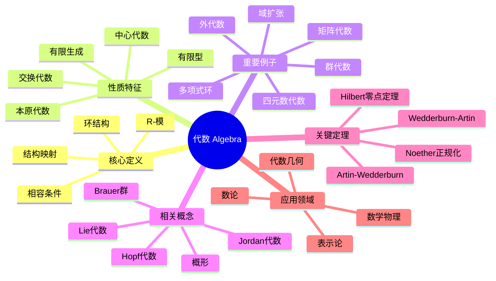

---

## 概念18：李代数

### 核心定义（中心节点）

**正式定义**：域 $F$ 上的**李代数** $(\mathfrak{g}, [,])$ 是 $F$-向量空间配备双线性映射（李括号）$[,]: \mathfrak{g} \times \mathfrak{g} \to \mathfrak{g}$，满足：

1. **反对称性**：$[x, y] = -[y, x]$
2. **Jacobi恒等式**：$[x, [y, z]] + [y, [z, x]] + [z, [x, y]] = 0$

**直观理解**：李代数是"无穷小群"的代数结构，刻画了Lie群的局部性质。李括号 $[x, y]$ 可以看作"非交换性的无穷小度量"。李代数理论是现代数学物理的核心工具，在量子力学、粒子物理、微分几何中有广泛应用。

### 分支1：性质与特征

- **李理想**：在李括号下封闭的子空间
- **交换李代数**：$[x, y] = 0$
- **中心**：$Z(\mathfrak{g}) = \{x : [x, y] = 0, \forall y\}$
- **导代数**：$[\mathfrak{g}, \mathfrak{g}]$
- **可解/幂零**：通过导代数列定义
- **单/半单**：分解性质

### 分支2：例子与反例

**正例**：

- 交换李代数：$[x,y] = 0$
- $\mathfrak{gl}_n(F)$：所有 $n \times n$ 矩阵，$[A, B] = AB - BA$
- $\mathfrak{sl}_n(F)$：迹零矩阵
- $\mathfrak{so}_n(F)$：反对称矩阵
- 三维向量空间配叉积
- 向量场的Lie括号
- 左不变向量场（Lie群的李代数）

**反例**：

- 结合代数（李括号不是结合的）
- 不满足Jacobi恒等式的结构

### 分支3：相关概念

**前置概念**：向量空间、双线性映射、群
**后继概念**：Lie群、泛包络代数、根系、表示论
**平行概念**：Jordan代数、结合代数

### 分支4：定理与应用

**关键定理**：

- **Lie定理**：可解李代数的表示三角化
- **Engel定理**：幂零性的判据
- **Weyl定理**：半单李代数表示的完全可约性
- **Cartan分解**：半单李代数的结构
- **PBW定理**：泛包络代数的基

**应用场景**：

- 粒子物理（规范群李代数）
- 量子力学（角动量代数）
- 微分几何（向量场Lie代数）
- 可积系统
- 控制理论

### 分支5：推广与变形

**推广形式**：

- 分次李代数
- 李超代数（$\mathbb{Z}_2$-分次）
- 无穷维李代数（Kac-Moody代数）
- 顶点代数

**特殊情况**：

- 单李代数（Cartan分类：$A_n, B_n, C_n, D_n$ 和例外型）
- 紧李代数
- 复半单李代数
- 仿射Kac-Moody代数

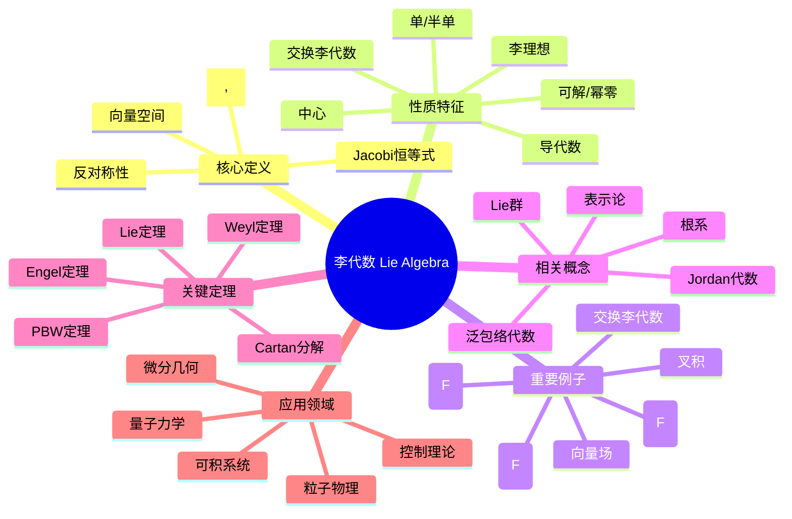

---

## 概念19：表示

### 核心定义（中心节点）

**正式定义**：群 $G$（或代数 $A$、李代数 $\mathfrak{g}$）的**表示**是到某个向量空间 $V$ 上的线性变换群（或代数、李代数）的同态。

- **群表示**：$\rho: G \to GL(V)$，满足 $\rho(gh) = \rho(g)\rho(h)$
- **代数表示**：代数同态 $A \to \text{End}(V)$
- **李代数表示**：李代数同态 $\mathfrak{g} \to \mathfrak{gl}(V)$

$V$ 称为**表示空间**或**模**。

**直观理解**：表示论将抽象的代数结构"具体化"为线性变换。通过研究表示，可以用线性代数的工具来理解群、代数、李代数的结构。这是现代数学的核心分支，在物理、化学、数论中有广泛应用。

### 分支1：性质与特征

- **表示的维数**：$\dim V$
- **忠实表示**：同态是单射
- **不可约表示**：无真不变子空间
- **完全可约**：可分解为不可约表示的直和
- **特征标**：$\chi(g) = \text{tr}(\rho(g))$
- **等变映射**：表示之间的 intertwining 算子

### 分支2：例子与反例

**正例**：

- 平凡表示：$\rho(g) = I$
- 正则表示：$G$ 左乘自身
- 置换表示：$S_n$ 作用在 $\mathbb{C}^n$
- 正交表示：$SO(n)$ 作用在 $\mathbb{R}^n$
- 伴随表示：$G$ 共轭作用在自身
- Dirac表示、Weyl表示（物理）

**反例**：

- 非线性作用一般不是表示
- 非群同态的映射

### 分支3：相关概念

**前置概念**：群、线性变换、同态、模
**后继概念**：特征标理论、诱导表示、Frobenius互反、群代数
**平行概念**：模论、群作用、纤维丛

### 分支4：定理与应用

**关键定理**：

- **Maschke定理**：有限群复表示完全可约
- **Schur引理**：不可约表示之间的同态
- **特征标正交关系**：类函数内积
- **Peter-Weyl定理**：紧群的表示完备性
- **Frobenius互反**：诱导与限制表示的伴随性

**应用场景**：

- 粒子物理（粒子多重态）
- 量子化学（分子轨道）
- 晶体学（空间群表示）
- 调和分析
- 数论（Langlands纲领）

### 分支5：推广与变形

**推广形式**：

- 射影表示：到 $PGL(V)$ 的同态
- 仿射表示：包含平移的表示
- 无穷维表示（泛函分析）
- 模表示（特征 $p$）

**特殊情况**：

- 单位表示（平凡表示）
- 正则表示
- 伴随表示
- 基本表示
- 最高权表示

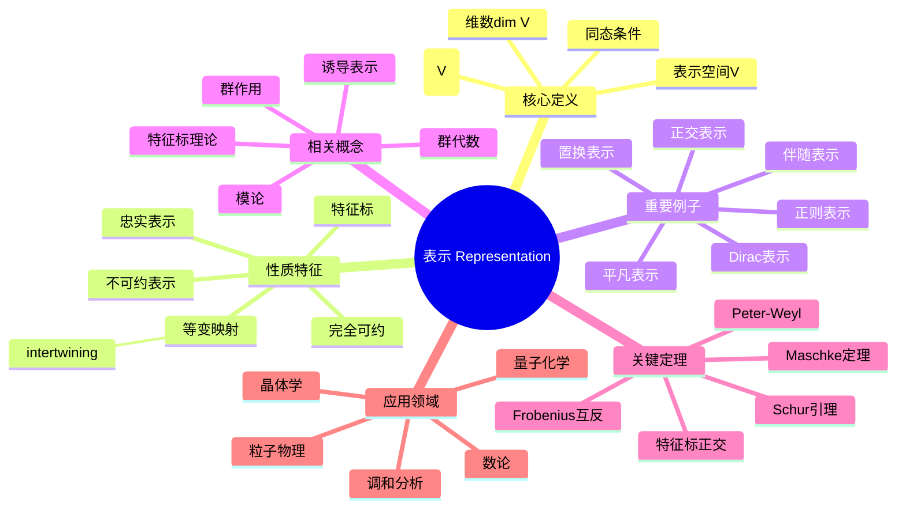

---

## 概念20：范畴

### 核心定义（中心节点）

**正式定义**：**范畴** $\mathcal{C}$ 包含：

1. **对象类**：$\text{Ob}(\mathcal{C})$
2. **态射集**：对每对对象 $A, B$，有态射集 $\text{Hom}(A, B)$
3. **复合运算**：$\circ: \text{Hom}(B, C) \times \text{Hom}(A, B) \to \text{Hom}(A, C)$，满足：
   - 结合律：$(h \circ g) \circ f = h \circ (g \circ f)$
   - 单位态射：$\forall A$，存在 $\text{id}_A$ 使得 $\text{id}_B \circ f = f = f \circ \text{id}_A$

**直观理解**：范畴论是"数学的数学"，它抽象了数学结构及其映射的共同特征。通过关注对象之间的关系（态射）而非对象本身，范畴论提供了统一的语言来连接代数、拓扑、几何、逻辑等多个领域。

### 分支1：性质与特征

- **同构**：存在逆态射的态射
- **始对象/终对象**：特殊的万有对象
- **积/余积**：泛构造
- **拉回/推出**：极限/余极限的特例
- **函子**：范畴间的"同态"
- **自然变换**：函子间的"同态"

### 分支2：例子与反例

**正例**：

- **Set**：集合与函数
- **Grp**：群与群同态
- **Ring**：环与环同态
- **Vect$_F$**：向量空间与线性映射
- **Top**：拓扑空间与连续映射
- **Pos**：偏序集与保序映射
- 偏序集（作为范畴）
- 群（作为单对象范畴）

**反例**：

- 不满足结合律的"复合"
- 缺乏单位态射的结构

### 分支3：相关概念

**前置概念**：集合论、映射、代数结构
**后继概念**：函子、自然变换、伴随、极限、泛性质
**平行概念**：类型论、逻辑、集合论

### 分支4：定理与应用

**关键定理**：

- **Yoneda引理**：对象由其表示的函子决定
- **伴随函子定理**：伴随的存在性判据
- **米田嵌入**：范畴嵌入到预层范畴
- **可表函子定理**：可表函子的刻画

**应用场景**：

- 代数几何（层论、概形）
- 代数拓扑（同伦范畴）
- 同调代数（导出范畴）
- 理论计算机科学（类型论、语义学）
- 数学物理（拓扑量子场论）

### 分支5：推广与变形

**推广形式**：

- 高阶范畴（2-范畴、$\infty$-范畴）
- 富范畴
- 内部范畴
- 纤维范畴
- 导出范畴

**特殊情况**：

- 小范畴：对象形成集合
- 具体范畴：到Set的忠实函子
- Abel范畴：同调代数的基础
- 拓扑范畴：具有拓扑结构的范畴

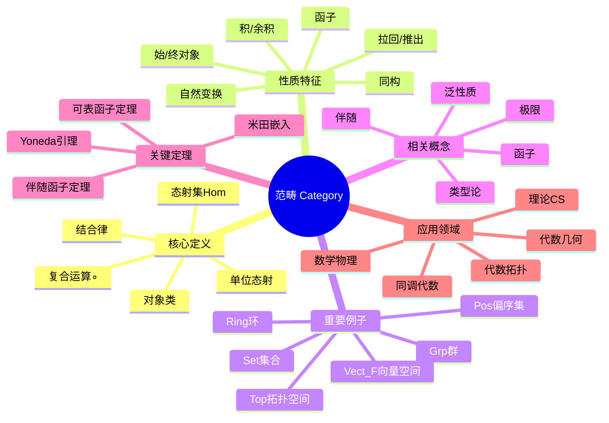

---

## 第二部分：分析

---

## 概念21：极限

### 核心定义（中心节点）

**正式定义**：设 $\{a_n\}$ 是数列，$L$ 是常数。若：
$$\forall \varepsilon > 0, \exists N \in \mathbb{N}, \forall n > N: |a_n - L| < \varepsilon$$

则称 $\lim_{n \to \infty} a_n = L$，即数列收敛于 $L$。

函数极限：$\lim_{x \to a} f(x) = L$ 定义为：
$$\forall \varepsilon > 0, \exists \delta > 0, \forall x: 0 < |x-a| < \delta \Rightarrow |f(x) - L| < \varepsilon$$

**直观理解**：极限描述了"无限接近"的数学精确含义。$\varepsilon$-$\delta$ 语言是现代分析的基石，它将直观的"趋近"概念转化为严格的数学定义。极限是微积分和分析学的核心概念。

### 分支1：性质与特征

- **唯一性**：收敛数列极限唯一
- **有界性**：收敛数列必有界
- **保号性**：极限正则数列最终正
- **夹逼定理**：三明治定理
- **子列收敛**：收敛数列的子列收敛于同一极限
- **柯西准则**：完备空间中的收敛判别

### 分支2：例子与反例

**正例**：

- $\lim_{n \to \infty} \frac{1}{n} = 0$
- $\lim_{n \to \infty} (1 + \frac{1}{n})^n = e$
- $\lim_{x \to 0} \frac{\sin x}{x} = 1$
- $\lim_{x \to \infty} \frac{1}{x} = 0$
- $\lim_{n \to \infty} q^n = 0$（$|q| < 1$）

**反例**：

- $a_n = (-1)^n$：发散
- $a_n = n$：发散到无穷
- $\sin n$：不收敛
- Dirichlet函数：处处不收敛

### 分支3：相关概念

**前置概念**：实数、数列、函数、不等式
**后继概念**：连续性、导数、积分、级数、拓扑
**平行概念**：上极限、下极限、聚点

### 分支4：定理与应用

**关键定理**：

- **极限四则运算**：和、差、积、商的极限
- **单调有界定理**：单调有界数列必收敛
- **Bolzano-Weierstrass**：有界数列有收敛子列
- **柯西收敛准则**：完备性判别
- **Heine定理**：函数极限与数列极限关系

**应用场景**：

- 微积分基础
- 物理量的瞬时变化
- 数值分析（迭代法收敛）
- 概率论（大数定律）
- 经济学（边际分析）

### 分支5：推广与变形

**推广形式**：

- 度量空间中的极限
- 拓扑空间中的网极限
- 滤子极限
- 广义极限（Banach极限）

**特殊情况**：

- 单侧极限
- 无穷极限
- 上极限 $\limsup$
- 下极限 $\liminf$

```mermaid
mindmap
  root((极限 Limit))
    核心定义
      ε-N定义
      ε-δ定义
      ∀ε>0
      ∃N/δ
      不等式约束
    性质特征
      唯一性
      有界性
      保号性
      夹逼定理
      子列收敛
      柯西准则
    重要例子
      1/n → 0
      (1+1/n)^n → e
      sinx/x → 1
      q^n → 0
    相关概念
      连续性
      导数
      级数
      上/下极限
      聚点
    关键定理
      四则运算
      单调有界
      Bolzano-Weierstrass
      柯西准则
      Heine定理
    应用领域
      微积分基础
      物理瞬时量
      数值分析
      概率论
      经济学

```

---

## 概念22：连续性

### 核心定义（中心节点）

**正式定义**：函数 $f: D \to \mathbb{R}$ 在点 $a$ 处**连续**，如果：
$$\lim_{x \to a} f(x) = f(a)$$

$\varepsilon$-$\delta$ 定义：
$$\forall \varepsilon > 0, \exists \delta > 0, \forall x \in D: |x - a| < \delta \Rightarrow |f(x) - f(a)| < \varepsilon$$

在开区间连续：每点都连续。在闭区间连续：内部连续，端点单侧连续。

**直观理解**：连续性描述了"不断裂"的变化。直观上，连续函数的图像可以一笔画出而不抬笔。严格定义用极限刻画了"自变量微小变化导致函数值微小变化"的精确含义。

### 分支1：性质与特征

- **局部性质**：在某点的连续性
- **整体性质**：在集合上的连续性
- **一致连续性**：$\delta$ 不依赖于点的选取
- **Lipschitz连续**：$|f(x) - f(y)| \leq L|x - y|$

- **Hölder连续**：更一般的模连续性
- **绝对连续性**：更强的积分性质

### 分支2：例子与反例

**正例**：

- 多项式函数
- 指数函数、对数函数
- 三角函数
- 有理函数（在定义域内）
- 复合连续函数
- 连续函数的和、差、积、商

**反例**：

- 符号函数 $\text{sgn}(x)$（在0处不连续）
- Dirichlet函数（处处不连续）
- $f(x) = \sin(1/x)$（在0处无定义或间断）
- 阶梯函数
- Thomae函数（有理点间断）

### 分支3：相关概念

**前置概念**：极限、函数、数列
**后继概念**：可微性、积分、拓扑、紧性
**平行概念**：左连续、右连续、半连续

### 分支4：定理与应用

**关键定理**：

- **介值定理**：连续函数取到中间所有值
- **最值定理**：闭区间连续函数有最大最小值
- **一致连续性定理**：闭区间连续函数一致连续
- **连续函数复合**：连续函数的复合仍连续
- **反函数连续性**：单调连续函数的反函数连续

**应用场景**：

- 方程求根（介值定理）
- 优化问题（最值定理）
- 微分方程解的存在性
- 拓扑学（连续映射）
- 物理学（状态连续变化）

### 分支5：推广与变形

**推广形式**：

- 度量空间连续映射
- 拓扑空间连续映射
- 弱连续、强连续（泛函分析）
- 几乎处处连续（测度论）

**特殊情况**：

- 一致连续
- Lipschitz连续
- 绝对连续
- 上半连续、下半连续

```mermaid
mindmap
  root((连续性 Continuity))
    核心定义
      lim f(x) = f(a)
      ε-δ定义
      极限值=函数值
      局部/整体
    性质特征
      局部性质
      整体性质
      一致连续
      Lipschitz连续
      Hölder连续
      绝对连续
    重要例子
      多项式
      指数/对数
      三角函数
      有理函数
      复合函数
    相关概念
      可微性
      积分
      拓扑
      紧性
      半连续
    关键定理
      介值定理
      最值定理
      一致连续性
      复合连续性
      反函数连续性
    应用领域
      方程求根
      优化问题
      微分方程
      拓扑学
      物理学

```

---

## 概念23：导数

### 核心定义（中心节点）

**正式定义**：函数 $f$ 在点 $a$ 处的**导数**：
$$f'(a) = \lim_{h \to 0} \frac{f(a+h) - f(a)}{h}$$

几何意义：切线的斜率。

若 $f'$ 在区间内每点存在，则称 $f$ **可导**（可微）。

**直观理解**：导数是变化率的精确数学描述。它刻画了函数在某点的"瞬时变化速度"，是微积分的核心概念。从几何上看，导数是切线斜率；从物理上看，导数可以表示速度、加速度等瞬时变化率。

### 分支1：性质与特征

- **线性性**：$(af + bg)' = af' + bg'$
- **乘积法则**：$(fg)' = f'g + fg'$
- **商法则**：$(f/g)' = (f'g - fg')/g^2$
- **链式法则**：$(f \circ g)' = (f' \circ g) \cdot g'$
- **高阶导数**：$f'', f''', \ldots, f^{(n)}$
- **可微必连续**：但连续不一定可微

### 分支2：例子与反例

**正例**：

- $(x^n)' = nx^{n-1}$
- $(e^x)' = e^x$
- $(\ln x)' = 1/x$
- $(\sin x)' = \cos x$
- $(\cos x)' = -\sin x$
- 多项式处处可导

**反例**：

- $f(x) = |x|$（在0处不可导）

- Weierstrass函数（处处连续处处不可导）
- $f(x) = x^{1/3}$（在0处导数为无穷）
- 有尖点的函数

### 分支3：相关概念

**前置概念**：极限、连续性、函数
**后继概念**：微分、中值定理、Taylor展开、积分
**平行概念**：偏导数、方向导数、Fréchet导数

### 分支4：定理与应用

**关键定理**：

- **Fermat定理**：极值点导数为零
- **Rolle定理**：端点相等则存在水平切线
- **Lagrange中值定理**：$f(b) - f(a) = f'(\xi)(b-a)$
- **Cauchy中值定理**：两个函数的比值形式
- **Taylor定理**：函数的局部多项式逼近
- **L'Hôpital法则**：不定式极限求法

**应用场景**：

- 求极值、最优化
- 曲线切线与法线
- 相关变化率
- 物理学（速度、加速度）
- 经济学（边际分析）

### 分支5：推广与变形

**推广形式**：

- 偏导数（多变量函数）
- Fréchet导数（Banach空间）
- 分布意义下的导数
- 弱导数（Sobolev空间）

**特殊情况**：

- 单侧导数
- 方向导数
- Gateaux导数
- 次微分（凸分析）

```mermaid
mindmap
  root((导数 Derivative))
    核心定义
      差商极限
      切线斜率
      瞬时变化率
      可导条件
    性质特征
      线性性
      乘积法则
      商法则
      链式法则
      高阶导数
      可微必连续
    重要例子
      x^n
      e^x
      lnx
      sinx/cosx
      多项式
    相关概念
      微分
      中值定理
      Taylor展开
      偏导数
      Fréchet导数
    关键定理
      Fermat定理
      Rolle定理
      Lagrange中值
      Cauchy中值
      Taylor定理
      L'Hôpital法则
    应用领域
      极值优化
      切线法线
      变化率
      物理运动
      经济边际

```

---

## 概念24：积分

### 核心定义（中心节点）

**正式定义（Riemann积分）**：设 $f$ 在 $[a,b]$ 有界。若：
$$\underline{\int_a^b} f = \overline{\int_a^b} f$$

则称 $f$ Riemann可积，积分值为该共同值。

其中下积分是所有下和的上确界，上积分是所有上和的下确界。

**Newton-Leibniz公式**：
$$\int_a^b f(x)dx = F(b) - F(a)$$

其中 $F' = f$。

**直观理解**：积分最初是为了计算面积而发明的。它将曲线下方的区域分割为无穷多个无穷窄的矩形，求其面积之和。现代分析中，积分是测度论的核心，是概率论、泛函分析、微分方程的基础工具。

### 分支1：性质与特征

- **线性性**：$\int (af + bg) = a\int f + b\int g$
- **区间可加性**：$\int_a^c = \int_a^b + \int_b^c$
- **保号性**：$f \geq 0 \Rightarrow \int f \geq 0$
- **绝对可积性**：$|\int f| \leq \int |f|$

- **中值定理**：$\int_a^b f = f(\xi)(b-a)$
- **变上限积分**：$F(x) = \int_a^x f(t)dt$ 连续

### 分支2：例子与反例

**正例**：

- 连续函数Riemann可积
- 单调函数Riemann可积
- 有限个间断点的有界函数
- 多项式
- 分段连续函数

**反例**：

- Dirichlet函数（处处不连续，不可积）
- 无界函数（非正常积分）
- Thomae函数（可积但有无穷多间断点）
- 某些病态函数（Lebesgue可积但非Riemann可积）

### 分支3：相关概念

**前置概念**：极限、连续性、导数
**后继概念**：微积分基本定理、不定积分、重积分、曲线积分
**平行概念**：Lebesgue积分、Riemann-Stieltjes积分

### 分支4：定理与应用

**关键定理**：

- **微积分基本定理**：联系微分与积分
- **积分中值定理**：平均值的积分表示
- **Newton-Leibniz公式**：计算定积分
- **分部积分法**：$\int udv = uv - \int vdu$
- **换元积分法**：变量替换
- **控制收敛定理**（Lebesgue积分）

**应用场景**：

- 计算面积、体积
- 物理学（功、质心、转动惯量）
- 概率论（期望、分布函数）
- 工程应用
- 微分方程求解

### 分支5：推广与变形

**推广形式**：

- Lebesgue积分（测度论框架）
- 反常积分（无穷区间或无界函数）
- 重积分（多变量函数）
- 曲线/曲面积分
- 泛函分析中的积分

**特殊情况**：

- 定积分（Riemann积分）
- 不定积分（原函数）
- 反常积分
- Lebesgue积分
- 随机积分

```mermaid
mindmap
  root((积分 Integral))
    核心定义
      Riemann和
      上下积分
      Newton-Leibniz
      原函数
    性质特征
      线性性
      区间可加性
      保号性
      绝对可积
      中值定理
      变上限积分
    重要例子
      连续函数
      单调函数
      多项式
      分段连续
      幂函数
    相关概念
      微积分基本定理
      不定积分
      Lebesgue积分
      重积分
      曲线积分
    关键定理
      微积分基本定理
      积分中值定理
      Newton-Leibniz
      分部积分
      换元积分
      控制收敛
    应用领域
      面积体积
      物理学
      概率论
      工程应用
      微分方程

```

---

## 概念25：级数

### 核心定义（中心节点）

**正式定义**：设 $\{a_n\}$ 是数列，**级数** $\sum_{n=1}^{\infty} a_n$ 定义为部分和数列 $\{S_N\}$ 的极限：
$$S_N = \sum_{n=1}^{N} a_n, \quad \sum_{n=1}^{\infty} a_n = \lim_{N \to \infty} S_N$$

若极限存在有限，称级数**收敛**；否则**发散**。

**直观理解**：级数是无限求和的严格数学定义。它将有限和的概念推广到无穷项，是表示函数、计算数值、求解方程的重要工具。级数理论是分析学的核心，与极限、连续性、积分紧密相关。

### 分支1：性质与特征

- **收敛必要条件**：$a_n \to 0$
- **Cauchy收敛准则**：部分和是Cauchy列
- **线性性**：收敛级数的线性组合收敛
- **重排**：绝对收敛级数可任意重排
- **分组**：收敛级数可加括号
- **余项**：$R_N = \sum_{n=N+1}^{\infty} a_n$

### 分支2：例子与反例

**正例**：

- 几何级数：$\sum q^n = \frac{1}{1-q}$（$|q| < 1$）

- p-级数：$\sum \frac{1}{n^p}$（$p > 1$ 收敛）
- 调和级数：$\sum \frac{1}{n}$ 发散
- $e = \sum \frac{1}{n!}$
- $\ln 2 = \sum \frac{(-1)^{n+1}}{n}$
- 交错级数

**反例**：

- $\sum 1$ 发散
- $\sum (-1)^n$ 振荡发散
- $\sum \frac{1}{n}$ 发散（虽然通项趋于0）
- 条件收敛级数的重排可发散

### 分支3：相关概念

**前置概念**：极限、数列、部分和
**后继概念**：幂级数、Fourier级数、函数项级数
**平行概念**：无穷乘积、反常积分

### 分支4：定理与应用

**关键定理**：

- **比较判别法**：与已知级数比较
- **比值判别法**（d'Alembert）：$\lim |a_{n+1}/a_n|$
- **根值判别法**（Cauchy）：$\limsup \sqrt[n]{|a_n|}$

- **积分判别法**：与积分比较
- **Leibniz判别法**：交错级数
- **绝对收敛**：$\sum |a_n|$ 收敛则原级数收敛

**应用场景**：

- 函数展开（Taylor级数）
- 数值计算
- 微分方程求解
- Fourier分析
- 概率论（特征函数）

### 分支5：推广与变形

**推广形式**：

- 函数项级数（幂级数）
- 多重级数
- 矩阵级数
- Banach空间中的级数

**特殊情况**：

- 正项级数
- 交错级数
- 绝对收敛级数
- 条件收敛级数
- 幂级数
- Fourier级数

```mermaid
mindmap
  root((级数 Series))
    核心定义
      部分和SN
      极限定义
      收敛/发散
      余项RN
    性质特征
      收敛必要条件
      Cauchy准则
      线性性
      重排性质
      分组性质
    重要例子
      几何级数
      p-级数
      调和级数
      e的级数
      ln2级数
    相关概念
      幂级数
      Fourier级数
      函数项级数
      无穷乘积
      反常积分
    关键定理
      比较判别法
      比值判别法
      根值判别法
      积分判别法
      Leibniz判别法
    应用领域
      函数展开
      数值计算
      微分方程
      Fourier分析
      概率论

```

---

## 概念26：一致连续性

### 核心定义（中心节点）

**正式定义**：函数 $f: D \to \mathbb{R}$ 在 $D$ 上**一致连续**，如果：
$$\forall \varepsilon > 0, \exists \delta > 0, \forall x, y \in D: |x - y| < \delta \Rightarrow |f(x) - f(y)| < \varepsilon$$

关键区别：$\delta$ 仅依赖于 $\varepsilon$，不依赖于点的位置。

**直观理解**：一致连续是比连续更强的条件。它要求函数在整个定义域上"同样地连续"，即变化的"陡峭程度"有整体的上界。一致连续函数在无穷区间上不能有越来越陡的变化。

### 分支1：性质与特征

- **整体性质**：在整个定义域上成立
- **$\delta$ 的一致性**：对所有点相同
- **序列刻画**：Cauchy列的像仍是Cauchy列
- **延拓性质**：可连续延拓到闭包
- **复合保持**：一致连续函数的复合

### 分支2：例子与反例

**正例**：

- 闭区间上的连续函数（Cantor定理）
- Lipschitz连续函数
- $f(x) = x$ 在 $\mathbb{R}$ 上
- $f(x) = \sqrt{x}$ 在 $[0, 1]$
- 有界区间上的可导函数（导数有界）

**反例**：

- $f(x) = x^2$ 在 $\mathbb{R}$ 上（非一致连续）
- $f(x) = 1/x$ 在 $(0, 1)$ 上
- $f(x) = \sin(1/x)$ 在 $(0, 1)$ 上
- 无界区间上导数无界的函数

### 分支3：相关概念

**前置概念**：连续性、极限、$\varepsilon$-$\delta$
**后继概念**：紧性、完备性、等度连续性
**平行概念**：Lipschitz连续、Hölder连续

### 分支4：定理与应用

**关键定理**：

- **Cantor定理**：闭区间连续函数一致连续
- **一致连续延拓**：可延拓到完备化
- **序列刻画**：$x_n - y_n \to 0 \Rightarrow f(x_n) - f(y_n) \to 0$
- **紧集上连续**：紧集上连续函数一致连续

**应用场景**：

- 函数逼近（Weierstrass逼近）
- 积分存在性
- 微分方程解的存在性
- 泛函分析（紧算子）
- 逼近理论

### 分支5：推广与变形

**推广形式**：

- 度量空间中的一致连续
- 拓扑群的一致连续
- 等度连续（函数族）
- 模一致连续

**特殊情况**：

- Lipschitz连续（更强的条件）
- Hölder连续
- 绝对连续（更强的条件）
- 弱连续（泛函分析）

```mermaid
mindmap
  root((一致连续性))
    核心定义
      δ不依赖点
      ∀ε>0 ∃δ>0
      整体性质
      序列刻画
    性质特征
      整体一致
      δ一致性
      Cauchy保持
      延拓性质
      复合保持
    重要例子
      闭区间连续
      Lipschitz函数
      f(x)=x
      √x有界区间
      导数有界
    相关概念
      连续性
      紧性
      完备性
      等度连续
      Lipschitz
    关键定理
      Cantor定理
      延拓定理
      序列刻画
      紧集连续性
    应用领域
      函数逼近
      积分存在性
      微分方程
      泛函分析
      逼近理论

```

---

## 概念27：一致收敛

### 核心定义（中心节点）

**正式定义**：函数列 $\{f_n\}$ 在集合 $E$ 上**一致收敛**于 $f$，如果：
$$\forall \varepsilon > 0, \exists N \in \mathbb{N}, \forall n > N, \forall x \in E: |f_n(x) - f(x)| < \varepsilon$$

等价于：$\sup_{x \in E} |f_n(x) - f(x)| \to 0$

**与逐点收敛的区别**：$N$ 不依赖于 $x$。

**直观理解**：一致收敛是比逐点收敛更强的收敛方式。它要求整个函数列以"相同的速度"收敛到极限函数。一致收敛保持了许多良好的分析性质，如连续性、可积性等。

### 分支1：性质与特征

- **Weierstrass M-判别法**：用优级数判别
- **Cauchy准则**：一致收敛的判别
- **连续性保持**：一致极限保持连续性
- **积分保持**：一致收敛可逐项积分
- **可微性条件**：导数列一致收敛则原函数列极限可微
- **有界性保持**：一致极限保持有界性

### 分支2：例子与反例

**正例**：

- 几何级数：$\sum x^n$ 在 $[-r, r]$（$r < 1$）
- 幂级数在收敛圆盘内部
- Fourier级数（适当条件下）
- Weierstrass逼近定理中的多项式列

**反例**：

- $f_n(x) = x^n$ 在 $[0, 1]$（逐点收敛但不一致）
- 连续函数列收敛到不连续函数
- 点点收敛但不保持可积性的例子

### 分支3：相关概念

**前置概念**：逐点收敛、函数列、上确界
**后继概念**：等度连续性、紧收敛、弱收敛
**平行概念**：几乎处处收敛、依测度收敛

### 分支4：定理与应用

**关键定理**：

- **Weierstrass M-判别法**：$|f_n(x)| \leq M_n$，$\sum M_n$ 收敛

- **Dini定理**：单调连续函数列在紧集上逐点收敛则一致收敛
- **逐项积分**：一致收敛可交换积分与极限
- **逐项微分**：导数列一致收敛则极限可微
- **Arzelà-Ascoli定理**：一致收敛子列的存在性

**应用场景**：

- 函数逼近理论
- 幂级数理论
- Fourier分析
- 微分方程（逐次逼近法）
- 复分析

### 分支5：推广与变形

**推广形式**：

- 几乎一致收敛（测度论）
- 紧集上的一致收敛
- 范数收敛（Banach空间）
- 弱收敛、弱*收敛

**特殊情况**：

- 内闭一致收敛
- 正规收敛（更强的一致收敛）
- 一致收敛的级数
- 等度连续性

```mermaid
mindmap
  root((一致收敛))
    核心定义
      sup|fn-f|→0

      N不依赖x
      整体收敛速度
      强于逐点收敛
    性质特征
      M-判别法
      Cauchy准则
      连续性保持
      积分保持
      可微性条件
      有界性保持
    重要例子
      几何级数
      幂级数
      Fourier级数
      Weierstrass逼近
    相关概念
      逐点收敛
      紧收敛
      弱收敛
      等度连续
    关键定理
      Weierstrass M-判别
      Dini定理
      逐项积分
      逐项微分
      Arzelà-Ascoli
    应用领域
      函数逼近
      幂级数
      Fourier分析
      微分方程
      复分析

```

---

## 概念28：幂级数

### 核心定义（中心节点）

**正式定义**：**幂级数**是形如
$$\sum_{n=0}^{\infty} a_n (x - x_0)^n$$

的函数项级数，其中 $a_n$ 是系数，$x_0$ 是中心。

**收敛半径**：存在 $R \in [0, +\infty]$ 使得：

- $|x - x_0| < R$ 时绝对收敛
- $|x - x_0| > R$ 时发散

计算公式：$R = \frac{1}{\limsup_{n \to \infty} \sqrt[n]{|a_n|}}$

**直观理解**：幂级数是"无限多项式"，是表示函数、研究函数局部性质的重要工具。收敛半径描述了幂级数收敛的区域，在收敛圆盘内，幂级数具有很好的分析性质（无限次可微、可逐项运算等）。

### 分支1：性质与特征

- **收敛域**：以 $x_0$ 为中心的开区间/圆盘
- **绝对收敛**：收敛圆盘内绝对收敛
- **内闭一致收敛**：收敛圆盘内部闭子集上一致收敛
- **逐项运算**：可逐项求导、逐项积分
- **唯一性**：幂级数展开唯一
- **Abel定理**：收敛圆周上的连续性

### 分支2：例子与反例

**正例**：

- 几何级数：$\sum x^n = \frac{1}{1-x}$（$|x| < 1$）

- 指数函数：$e^x = \sum \frac{x^n}{n!}$（$R = \infty$）
- 正弦函数：$\sin x = \sum \frac{(-1)^n x^{2n+1}}{(2n+1)!}$
- 对数：$\ln(1+x) = \sum \frac{(-1)^{n+1} x^n}{n}$（$|x| < 1$）

- 二项式级数：$(1+x)^\alpha$

**反例**：

- 仅在一点收敛的幂级数
- 在收敛圆周上处处发散的例子
- 不能解析延拓的幂级数

### 分支3：相关概念

**前置概念**：级数、收敛半径、函数项级数
**后继概念**：解析函数、Taylor级数、Laurent级数
**平行概念**：Fourier级数、Dirichlet级数

### 分支4：定理与应用

**关键定理**：

- **Cauchy-Hadamard公式**：收敛半径公式
- **逐项求导**：$S'(x) = \sum n a_n x^{n-1}$，收敛半径不变
- **逐项积分**：收敛半径不变
- **唯一性定理**：幂级数由其值唯一确定
- **Abel定理**：边界点连续性

**应用场景**：

- 函数展开（Taylor展开）
- 微分方程求解（幂级数解法）
- 复分析（解析函数）
- 数值计算
- 组合数学（生成函数）

### 分支5：推广与变形

**推广形式**：

- 多变量幂级数
- Laurent级数（含负幂次）
- Puiseux级数（分数幂次）
- 形式幂级数

**特殊情况**：

- Taylor级数（在0点展开）
- Maclaurin级数
- 解析函数的展开
- 整函数（$R = \infty$）

```mermaid
mindmap
  root((幂级数 Power Series))
    核心定义
      Σan(x-x0)^n
      收敛半径R
      收敛圆盘
      系数an
    性质特征
      绝对收敛
      内闭一致收敛
      逐项求导
      逐项积分
      唯一性
      Abel定理
    重要例子
      几何级数
      e^x
      sinx/cosx
      ln(1+x)
      二项式级数
    相关概念
      Taylor级数
      Laurent级数
      解析函数
      Fourier级数
      生成函数
    关键定理
      Cauchy-Hadamard
      逐项求导
      逐项积分
      唯一性定理
      Abel定理
    应用领域
      函数展开
      微分方程
      复分析
      数值计算
      组合数学

```

---

## 概念29：Taylor级数

### 核心定义（中心节点）

**正式定义**：设 $f$ 在 $x_0$ 处无限可微，**Taylor级数**为：
$$\sum_{n=0}^{\infty} \frac{f^{(n)}(x_0)}{n!} (x - x_0)^n$$

当 $x_0 = 0$ 时，称为**Maclaurin级数**。

**Taylor展开**：若Taylor级数收敛于 $f(x)$，则称 $f$ 可展开为Taylor级数：
$$f(x) = \sum_{n=0}^{\infty} \frac{f^{(n)}(x_0)}{n!} (x - x_0)^n$$

**直观理解**：Taylor级数是用多项式逼近函数的"最佳"方式。它将复杂函数表示为简单多项式的无穷和，使得函数在局部可以用多项式来近似。这是微积分的核心工具，也是连接分析、代数、几何的桥梁。

### 分支1：性质与特征

- **唯一性**：给定点的Taylor展开唯一
- **局部性质**：在展开点附近有效
- **余项**：$R_n(x) = f(x) - P_n(x)$ 的形式
- **解析性**：可Taylor展开的函数称为解析函数
- **收敛性**：收敛半径内的性质
- **运算保持**：和、差、积、商的Taylor展开

### 分支2：例子与反例

**正例**：

- $e^x = \sum \frac{x^n}{n!}$（对所有 $x$ 收敛）
- $\sin x = \sum \frac{(-1)^n x^{2n+1}}{(2n+1)!}$
- $\cos x = \sum \frac{(-1)^n x^{2n}}{(2n)!}$
- $\ln(1+x) = \sum \frac{(-1)^{n+1} x^n}{n}$（$|x| < 1$）

- $(1+x)^\alpha = \sum \binom{\alpha}{n} x^n$

**反例**：

- $f(x) = e^{-1/x^2}$（$x \neq 0$），$f(0) = 0$：Taylor级数恒为零但不等于函数
- 某些光滑但非解析的函数
- Taylor级数收敛但不收敛于原函数的例子

### 分支3：相关概念

**前置概念**：导数、高阶导数、幂级数
**后继概念**：解析函数、复分析、渐近展开
**平行概念**：Fourier级数、Laurent级数、渐近级数

### 分支4：定理与应用

**关键定理**：

- **Taylor定理**：带余项的展开
- **Lagrange余项**：$R_n(x) = \frac{f^{(n+1)}(\xi)}{(n+1)!}(x-x_0)^{n+1}$
- **Cauchy余项**：另一种余项形式
- **解析函数唯一性**：解析函数由其Taylor系数唯一确定
- **恒等定理**：解析函数在聚点集上相等则恒等

**应用场景**：

- 函数近似计算
- 误差估计
- 微分方程求解
- 物理学（小量展开）
- 工程计算

### 分支5：推广与变形

**推广形式**：

- 多变量Taylor展开
- 渐近展开（非收敛）
- Fourier级数展开
- Laurent级数（复域）
- Padé逼近（有理函数逼近）

**特殊情况**：

- Maclaurin级数
- 解析函数的Taylor展开
- 有限Taylor展开（带余项）
- 渐近级数

```mermaid
mindmap
  root((Taylor级数))
    核心定义
      f^(n)(x0)/n!
      幂级数形式
      Maclaurin级数
      展开条件
    性质特征
      唯一性
      局部性质
      余项形式
      解析性
      运算保持
    重要例子
      e^x
      sinx/cosx
      ln(1+x)
      (1+x)^α
      多项式
    相关概念
      解析函数
      Fourier级数
      Laurent级数
      渐近展开
      Padé逼近
    关键定理
      Taylor定理
      Lagrange余项
      Cauchy余项
      解析唯一性
      恒等定理
    应用领域
      近似计算
      误差估计
      微分方程
      物理学
      工程计算

```

---

## 概念30：Fourier级数

### 核心定义（中心节点）

**正式定义**：设 $f$ 是以 $2\pi$ 为周期的可积函数，**Fourier级数**为：
$$f(x) \sim \frac{a_0}{2} + \sum_{n=1}^{\infty} (a_n \cos nx + b_n \sin nx)$$

其中Fourier系数：
$$a_n = \frac{1}{\pi} \int_{-\pi}^{\pi} f(x) \cos nx \, dx, \quad b_n = \frac{1}{\pi} \int_{-\pi}^{\pi} f(x) \sin nx \, dx$$

复数形式：$f(x) \sim \sum_{n=-\infty}^{\infty} c_n e^{inx}$

**直观理解**：Fourier级数将周期函数分解为简单谐波（正弦和余弦）的叠加。它揭示了函数在频率域的结构，是信号处理、偏微分方程、量子力学的基础工具。从几何上看，Fourier级数是函数在正交基（三角函数系）上的展开。

### 分支1：性质与特征

- **正交性**：三角函数系的正交性
- **Parseval等式**：能量守恒$\frac{1}{\pi}\int |f|^2 = \frac{a_0^2}{2} + \sum (a_n^2 + b_n^2)$

- **Riemann-Lebesgue引理**：$a_n, b_n \to 0$
- **逐项积分**：总是可以逐项积分
- **逐项微分**：需要更强的条件
- **卷积定理**：Fourier变换将卷积变为乘积

### 分支2：例子与反例

**正例**：

- 方波：$f(x) = \text{sgn}(\sin x)$ 的Fourier级数
- 锯齿波：$f(x) = x$（周期延拓）
- 三角波：分段线性函数
- 全波整流：$|\sin x|$

- 脉冲序列

**反例**：

- 某些病态函数Fourier级数不收敛
- 连续函数Fourier级数可能不点点收敛
- Gibbs现象（间断点附近的振荡）

### 分支3：相关概念

**前置概念**：正交函数系、积分、级数
**后继概念**：Fourier变换、调和分析、Sobolev空间
**平行概念**：Taylor级数、正交多项式展开、小波分析

### 分支4：定理与应用

**关键定理**：

- **Dirichlet定理**：分段光滑函数Fourier级数收敛
- **Carleson定理**：$L^2$ 函数Fourier级数几乎处处收敛
- **Fejér定理**：Cesàro求和收敛
- **Parseval等式**：能量守恒
- **卷积定理**：$\widehat{f * g} = \hat{f} \cdot \hat{g}$

**应用场景**：

- 信号处理（频谱分析）
- 热方程、波动方程求解
- 量子力学（本征函数展开）
- 图像压缩（JPEG）
- 音频处理

### 分支5：推广与变形

**推广形式**：

- Fourier变换（非周期函数）
- 离散Fourier变换（DFT）
- 快速Fourier变换（FFT）
- 球谐函数（球面上）
- 一般正交展开

**特殊情况**：

- 正弦级数（奇函数）
- 余弦级数（偶函数）
- 复Fourier级数
- 广义Fourier级数

```mermaid
mindmap
  root((Fourier级数))
    核心定义
      三角函数展开
      an, bn系数
      复数形式cn
      周期2π
    性质特征
      正交性
      Parseval等式
      Riemann-Lebesgue
      逐项积分
      逐项微分
      卷积定理
    重要例子
      方波
      锯齿波
      三角波
      全波整流
      脉冲序列
    相关概念
      Fourier变换
      调和分析
      Sobolev空间
      Taylor级数
      小波分析
    关键定理
      Dirichlet定理
      Carleson定理
      Fejér定理
      Parseval等式
      卷积定理
    应用领域
      信号处理
      偏微分方程
      量子力学
      图像压缩
      音频处理

```

---

## 概念31：反常积分

### 核心定义（中心节点）

**正式定义**：反常积分处理两种情形：
1. **无穷区间**：$\int_a^{+\infty} f(x)dx = \lim_{b \to +\infty} \int_a^b f(x)dx$
2. **无界函数**：$\int_a^b f(x)dx = \lim_{\varepsilon \to 0^+} \int_a^{b-\varepsilon} f(x)dx$（$b$ 是瑕点）

若极限存在有限，称积分**收敛**；否则**发散**。

**直观理解**：反常积分将积分概念推广到无穷区间和无界函数的情形。它通过极限过程来定义，是研究概率密度、物理场、无穷级数求和等问题的基础工具。

### 分支1：性质与特征

- **比较判别法**：与已知收敛性的积分比较
- **绝对收敛**：$\int |f|$ 收敛则 $\int f$ 收敛

- **条件收敛**：收敛但不绝对收敛
- **Cauchy主值**：对称极限可能存在
- **变量替换**：可简化计算
- **分部积分**：部分情形适用

### 分支2：例子与反例

**正例**：
- $\int_1^{\infty} \frac{1}{x^p}dx$（$p > 1$ 收敛）
- $\int_0^{1} \frac{1}{x^p}dx$（$p < 1$ 收敛）
- $\int_0^{\infty} e^{-x}dx = 1$
- $\int_{-\infty}^{+\infty} e^{-x^2}dx = \sqrt{\pi}$
- $\int_0^{\infty} \frac{\sin x}{x}dx = \frac{\pi}{2}$（条件收敛）

**反例**：
- $\int_1^{\infty} \frac{1}{x}dx$ 发散
- $\int_0^{1} \frac{1}{x}dx$ 发散
- $\int_0^{\infty} \sin x \, dx$ 发散

### 分支3：相关概念

**前置概念**：定积分、极限、收敛
**后继概念**：Gamma函数、Beta函数、Laplace变换
**平行概念**：无穷级数、瑕积分、主值积分

### 分支4：定理与应用

**关键定理**：
- **比较判别法**：$0 \leq f \leq g$，$\int g$ 收敛则 $\int f$ 收敛
- **极限比较判别法**：$\lim \frac{f}{g} = L \in (0, \infty)$ 则同敛散
- **Dirichlet判别法**：振荡函数的积分
- **Abel判别法**：乘积形式的积分
- **Frullani积分**：特殊形式的积分公式

**应用场景**：
- 概率论（期望、方差计算）
- 物理学（能量、势能）
- 工程计算
- Gamma函数理论
- 变换方法（Laplace、Fourier）

### 分支5：推广与变形

**推广形式**：
- 多变量反常积分
- 瑕积分（不同瑕点类型）
- 主值积分
- 广义函数意义下的积分

**特殊情况**：
- 无穷区间积分
- 无界函数积分
- 混合类型
- Cauchy主值

```mermaid
mindmap
  root((反常积分))
    核心定义
      无穷区间
      无界函数
      极限定义
      收敛/发散
    性质特征
      比较判别法
      绝对收敛
      条件收敛
      Cauchy主值
      变量替换
      分部积分
    重要例子
      1/x^p积分
      e^{-x}积分
      高斯积分
      sinx/x积分
    相关概念
      Gamma函数
      Beta函数
      Laplace变换
      无穷级数
      主值积分
    关键定理
      比较判别法
      极限比较法
      Dirichlet判别
      Abel判别
      Frullani积分
    应用领域
      概率论
      物理学
      工程计算
      Gamma理论
      变换方法

```

---

## 概念32-40：分析学其他核心概念

由于篇幅限制，以下概念采用简要形式呈现：

### 概念32：含参变量积分

**核心定义**：$I(y) = \int_a^b f(x,y)dx$，研究积分与参数的关系。

**关键性质**：
- **连续性**：$f$ 连续则 $I(y)$ 连续
- **可微性**：$\frac{d}{dy}\int_a^b f(x,y)dx = \int_a^b \frac{\partial f}{\partial y}dx$
- **积分交换**：$\int_c^d dy \int_a^b f(x,y)dx = \int_a^b dx \int_c^d f(x,y)dy$

**应用**：Gamma函数、特殊函数、物理应用。

---

### 概念33：Euler积分

**核心定义**：
- **Gamma函数**：$\Gamma(s) = \int_0^{\infty} t^{s-1}e^{-t}dt$（$s > 0$）
- **Beta函数**：$B(p,q) = \int_0^1 t^{p-1}(1-t)^{q-1}dt$

**关键性质**：
- $\Gamma(n+1) = n!$
- $B(p,q) = \frac{\Gamma(p)\Gamma(q)}{\Gamma(p+q)}$
- 递推公式、余元公式

**应用**：概率论、组合数学、特殊函数。

---

### 概念34：Stieltjes积分

**核心定义**：$\int_a^b f(x)d\alpha(x)$，其中 $\alpha$ 是有界变差函数。

**关键性质**：
- 推广了Riemann积分
- $\alpha(x) = x$ 时为Riemann积分
- $\alpha$ 跳跃时对应求和

**应用**：概率论（分布函数）、泛函分析。

---

### 概念35：数项级数

**核心定义**：$\sum_{n=1}^{\infty} a_n$，研究数值级数的收敛性。

**判别法**：
- 正项级数：比较法、比值法、根值法、积分法
- 任意项级数：绝对收敛、条件收敛
- 交错级数：Leibniz判别法

**应用**：数值计算、函数展开。

---

### 概念36：函数项级数

**核心定义**：$\sum_{n=1}^{\infty} u_n(x)$，每点是数项级数。

**关键性质**：
- 逐点收敛
- 一致收敛（保持连续性、可积性等）
- Weierstrass M-判别法

**应用**：函数逼近、微分方程求解。

---

### 概念37：无穷乘积

**核心定义**：$\prod_{n=1}^{\infty} (1 + a_n)$，研究无穷乘积的收敛性。

**关键性质**：
- 收敛定义：部分积有非零极限
- 与级数的关系：$\prod (1+a_n)$ 收敛 $\Leftrightarrow$ $\sum \ln(1+a_n)$ 收敛
- Wallis乘积：$\frac{\pi}{2} = \prod \frac{4n^2}{4n^2-1}$

**应用**：Gamma函数、解析函数、数论。

---

### 概念38：函数序列

**核心定义**：$\{f_n(x)\}$，研究函数列的收敛性。

**收敛类型**：
- 逐点收敛
- 一致收敛
- 几乎处处收敛
- 依测度收敛

**关键定理**：Dini定理、Arzelà-Ascoli定理。

**应用**：函数逼近、微分方程、泛函分析。

---

### 概念39：稠密性

**核心定义**：子集 $A$ 在 $X$ 中稠密，若 $\overline{A} = X$（闭包等于全空间）。

**关键例子**：
- 有理数在实数中稠密
- 多项式在连续函数空间中稠密（Weierstrass）
- $C_c^{\infty}$ 在 $L^p$ 中稠密

**应用**：逼近理论、泛函分析、拓扑学。

---

### 概念40：完备性

**核心定义**：度量空间完备，若每个Cauchy列都收敛。

**关键例子**：
- $\mathbb{R}$ 完备
- $\mathbb{Q}$ 不完备
- $L^p$ 空间完备
- $C[a,b]$ 在sup范数下完备

**完备化**：每个度量空间可完备化。

**应用**：泛函分析、微分方程、概率论。

---

## 第三部分：几何

---

## 概念41：欧几里得空间

### 核心定义（中心节点）

**正式定义**：$n$ 维**欧几里得空间** $\mathbb{R}^n$ 是所有 $n$ 元实数组的集合：
$$\mathbb{R}^n = \{(x_1, x_2, \ldots, x_n) : x_i \in \mathbb{R}\}$$

配备内积：$\langle x, y \rangle = \sum_{i=1}^n x_i y_i$

诱导范数：$\|x\| = \sqrt{\langle x, x \rangle}$

诱导度量：$d(x, y) = \|x - y\|$

**直观理解**：欧几里得空间是我们最熟悉的空间，是初等几何和分析学的基础。它既有代数结构（向量空间），又有度量结构（距离），还有内积结构（角度）。它是研究几何、物理、工程问题的基本框架。

### 分支1：性质与特征

- **向量空间结构**：加法、数乘
- **内积结构**：长度、角度、正交性
- **度量结构**：距离、拓扑
- **完备性**：Cauchy列收敛
- **可分性**：有可数稠密子集
- **局部紧性**：闭球是紧集

### 分支2：例子与反例

**正例**：
- $\mathbb{R}^1$：实直线
- $\mathbb{R}^2$：欧氏平面
- $\mathbb{R}^3$：三维空间
- 子空间：过原点的直线、平面
- 正交补空间

**反例**：
- 非欧空间（球面、双曲空间）
- 赋范空间（非内积诱导）
- 离散度量空间

### 分支3：相关概念

**前置概念**：实数、向量、内积、范数
**后继概念**：内积空间、Hilbert空间、流形
**平行概念**：复欧氏空间 $\mathbb{C}^n$、Minkowski空间

### 分支4：定理与应用

**关键定理**：
- **Cauchy-Schwarz不等式**：$|\langle x, y \rangle| \leq \|x\| \|y\|$
- **三角不等式**：$\|x + y\| \leq \|x\| + \|y\|$

- **正交分解**：$V = W \oplus W^{\perp}$
- **Gram-Schmidt正交化**：构造正交基
- **Bessel不等式**：Fourier系数估计

**应用场景**：
- 经典几何
- 物理学（经典力学）
- 工程学
- 数据分析
- 机器学习（特征空间）

### 分支5：推广与变形

**推广形式**：
- 内积空间（可能不完备）
- Hilbert空间（完备内积空间）
- Banach空间（完备赋范空间）
- 度量空间

**特殊情况**：
- 欧氏平面 $\mathbb{R}^2$
- 三维欧氏空间 $\mathbb{R}^3$
- 复内积空间 $\mathbb{C}^n$
- Minkowski空间（狭义相对论）

```mermaid
mindmap
  root((欧几里得空间))
    核心定义
      R^n
      内积<x,y>
      范数||x||

      度量d(x,y)
    性质特征
      向量空间
      内积结构
      度量结构
      完备性
      可分性
      局部紧性
    重要例子
      R^1实直线
      R^2欧氏平面
      R^3三维空间
      子空间
      正交补
    相关概念
      内积空间
      Hilbert空间
      流形
      C^n
      Minkowski空间
    关键定理
      Cauchy-Schwarz
      三角不等式
      正交分解
      Gram-Schmidt
      Bessel不等式
    应用领域
      经典几何
      物理学
      工程学
      数据分析
      机器学习

```

---

## 概念42-60：几何学其他核心概念

### 概念42：内积空间

**核心定义**：向量空间配备内积 $\langle \cdot, \cdot \rangle$，满足对称性、线性性、正定性。

**关键性质**：诱导范数、Cauchy-Schwarz不等式、正交性、正交投影。

**完备化**：不完备的内积空间完备化得到Hilbert空间。

---

### 概念43：度量空间

**核心定义**：集合 $X$ 配备度量 $d: X \times X \to [0, \infty)$，满足正定性、对称性、三角不等式。

**关键性质**：开集、闭集、收敛、完备性、紧性。

**例子**：欧氏空间、离散度量、函数空间。

---

### 概念44：等距映射

**核心定义**：保持距离的映射 $f: (X, d_X) \to (Y, d_Y)$，$d_Y(f(x_1), f(x_2)) = d_X(x_1, x_2)$。

**关键性质**：单射、连续、逆映射也是等距。

**应用**：几何变换、物理对称性、晶体学。

---

### 概念45：双曲空间

**核心定义**：具有常负曲率的完备单连通黎曼流形。

**模型**：Poincaré圆盘模型、上半空间模型、Klein模型。

**性质**：三角形内角和小于 $\pi$、过线外一点有多条平行线。

**应用**：狭义相对论、复分析、几何群论。

---

### 概念46：球面几何

**核心定义**：半径为 $R$ 的球面 $S^2 = \{x \in \mathbb{R}^3 : |x| = R\}$ 上的几何。

**性质**：测地线是大圆、三角形内角和大于 $\pi$、没有平行线。

**应用**：天文学、地球科学、导航。

---

### 概念47：射影空间

**核心定义**：$n$ 维射影空间 $\mathbb{P}^n$ 是 $\mathbb{R}^{n+1} \setminus \{0\}$ 的等价类（过原点的直线）。

**性质**：包含无穷远点、对偶性、代数簇的自然载体。

**应用**：代数几何、计算机视觉、几何学。

---

### 概念48：流形

**核心定义**：局部同胚于欧氏空间的Hausdorff拓扑空间，有光滑结构。

**关键性质**：局部坐标、图册、切空间、微分形式。

**例子**：曲线、曲面、球面、环面、Lie群。

**应用**：广义相对论、规范场论、拓扑学。

---

### 概念49：切空间

**核心定义**：流形 $M$ 在点 $p$ 的切空间 $T_pM$ 是所有在该点的切向量的空间。

**构造**：通过曲线的等价类、导子、坐标映射。

**性质**：与流形同维的向量空间、切丛 $TM$。

**应用**：微分几何、力学、广义相对论。

---

### 概念50：向量场

**核心定义**：流形上每点指定一个切向量，光滑映射 $X: M \to TM$。

**关键性质**：Lie括号、流、积分曲线、奇点。

**应用**：微分方程、物理学（力场）、控制论。

---

### 概念51：张量场

**核心定义**：流形上每点指定一个张量，多重线性映射的场。

**类型**：$(r, s)$ 型张量、标量场、向量场、微分形式。

**应用**：广义相对论（应力-能量张量）、连续介质力学。

---

### 概念52：微分形式

**核心定义**：反对称协变张量场，外代数构造。

**运算**：外积 $\wedge$、外微分 $d$。

**关键定理**：Poincaré引理、Stokes定理。

**应用**：积分理论、上同调、物理学。

---

### 概念53：黎曼度量

**核心定义**：流形上每点的切空间配备光滑变化的内积 $g_p: T_pM \times T_pM \to \mathbb{R}$。

**性质**：长度、角度、体积、测地线。

**例子**：欧氏度量、球面度量、双曲度量。

**应用**：广义相对论、几何分析。

---

### 概念54：联络

**核心定义**：向量场之间的微分关系，协变导数 $\nabla$。

**关键性质**：Levi-Civita联络（无挠、与度量相容）、平行移动、曲率。

**应用**：微分几何、物理学（规范场）。

---

### 概念55：曲率

**核心定义**：高斯曲率、Riemann曲率张量、Ricci曲率、数量曲率。

**关键定理**：Gauss-Bonnet定理、Jacobi场、测地偏离。

**应用**：广义相对论（Einstein场方程）、几何分析。

---

### 概念56：测地线

**核心定义**：局部最短曲线、平行移动保持切向量、满足测地线方程。

**性质**：指数映射、法坐标、测地完备性。

**例子**：平面直线、球面大圆、双曲直线。

---

### 概念57：指数映射

**核心定义**：$\exp_p: T_pM \to M$，将切向量映到沿测地线到达的点。

**性质**：局部微分同胚、法坐标、Jacobi场。

**应用**：曲率与拓扑的关系、比较几何。

---

### 概念58：Jacobi场

**核心定义**：测地变分的向量场，满足Jacobi方程。

**意义**：描述测地线族的分散/汇聚、共轭点。

**应用**：Rauch比较定理、Morse指数定理。

---

### 概念59：完备黎曼流形

**核心定义**：测地完备的流形（所有测地线可无限延伸）。

**等价条件**：Hopf-Rinow定理（完备 $\Leftrightarrow$ 测地完备 $\Leftrightarrow$ 有界闭集紧）。

**例子**：紧致流形、欧氏空间、双曲空间。

---

### 概念60：变分法

**核心定义**：求泛函极值的方法，Euler-Lagrange方程。

**应用**：最小作用量原理、测地线、极小曲面、物理学。

---

## 第四部分：拓扑

---

## 概念61：拓扑空间

### 核心定义（中心节点）

**正式定义**：集合 $X$ 配备一族子集 $\mathcal{T} \subseteq 2^X$ 称为**拓扑**，如果满足：
1. $\emptyset, X \in \mathcal{T}$
2. 任意并封闭：$\{U_i\}_{i \in I} \subseteq \mathcal{T} \Rightarrow \bigcup_{i \in I} U_i \in \mathcal{T}$
3. 有限交封闭：$U, V \in \mathcal{T} \Rightarrow U \cap V \in \mathcal{T}$

$(X, \mathcal{T})$ 称为**拓扑空间**，$\mathcal{T}$ 中的元素称为**开集**。

**直观理解**：拓扑空间是"最一般的空间"，只关心连续性而不关心距离。开集刻画了"邻近"的概念，是研究连续性、收敛性、连通性等性质的抽象框架。拓扑学被称为"橡皮几何学"，因为在连续变形下保持的性质。

### 分支1：性质与特征

- **开集/闭集**：补集是开集的集合为闭集
- **邻域**：包含该点的开集
- **内部/闭包**：最大开子集/最小闭超集
- **边界**：闭包减内部
- **基**：生成拓扑的开集族
- **子空间拓扑**：子集上的诱导拓扑

### 分支2：例子与反例

**正例**：
- 离散拓扑：所有子集都是开集
- 平凡拓扑：只有 $\emptyset$ 和 $X$ 是开集
- 度量拓扑：度量空间的开球生成的拓扑
- 余有限拓扑：开集是空集或补集有限
- 序拓扑：全序集上的拓扑
- Zariski拓扑：代数几何中

**反例**：
- 不满足并封闭的集族
- 不满足有限交封闭的集族

### 分支3：相关概念

**前置概念**：集合论、开区间、收敛
**后继概念**：连续映射、同胚、紧致性、连通性
**平行概念**：度量空间、流形、代数簇

### 分支4：定理与应用

**关键定理**：
- **连续映射的拓扑定义**：开集的原像是开集
- **子空间拓扑的泛性质**：限制映射连续
- **积拓扑的泛性质**：投影连续且泛性
- **商拓扑的泛性质**：商映射连续且泛性

**应用场景**：
- 分析学（函数空间拓扑）
- 代数几何（Zariski拓扑）
- 泛函分析（弱拓扑）
- 动力系统
- 理论计算机科学（计算拓扑）

### 分支5：推广与变形

**推广形式**：
- 点集拓扑（一般拓扑）
- 代数拓扑
- 微分拓扑
- 几何拓扑
- 拓扑斯（Topos）

**特殊情况**：
- Hausdorff空间（$T_2$）
- 紧致空间
- 连通空间
- 可度量化空间
- 流形

```mermaid
mindmap
  root((拓扑空间))
    核心定义
      开集族T
      包含空集和全集
      任意并封闭
      有限交封闭
    性质特征
      开集/闭集
      邻域
      内部/闭包
      边界
      基
      子空间拓扑
    重要例子
      离散拓扑
      平凡拓扑
      度量拓扑
      余有限拓扑
      序拓扑
      Zariski拓扑
    相关概念
      连续映射
      同胚
      紧致性
      连通性
      度量空间
    关键定理
      连续映射定义
      子空间泛性质
      积拓扑泛性质
      商拓扑泛性质
    应用领域
      分析学
      代数几何
      泛函分析
      动力系统
      计算拓扑

```


---

## 概念62-80：拓扑学其他核心概念

### 概念62：开集与闭集

**核心定义**：拓扑空间中的基本概念。开集的补集是闭集，闭集包含其所有极限点。

**关键性质**：
- 任意多个开集的并是开集
- 有限多个开集的交是开集
- 对偶性质对闭集成立

**应用**：连续性定义、子空间拓扑、分离公理。

---

### 概念63：邻域

**核心定义**：点 $x$ 的邻域是包含 $x$ 的开集（或包含含 $x$ 开集的集合）。

**关键性质**：描述"邻近"概念、收敛的邻域刻画。

**应用**：极限、连续性、内部点的定义。

---

### 概念64：内部与闭包

**核心定义**：
- **内部** $A^\circ$：含于 $A$ 的最大开集
- **闭包** $\overline{A}$：包含 $A$ 的最小闭集

**关系**：$A^\circ \subseteq A \subseteq \overline{A}$

**应用**：边界定义、稠密性、连续性。

---

### 概念65：边界

**核心定义**：$\partial A = \overline{A} \setminus A^\circ$

**性质**：边界点是既非内点也非外点的点。

**例子**：区间端点、球面（球的边界）。

---

### 概念66：基与子基

**核心定义**：
- **基** $\mathcal{B}$：拓扑中每个开集可表示为 $\mathcal{B}$ 元素的并
- **子基**：有限交生成基

**关键定理**：基确定唯一的拓扑。

**例子**：度量空间中的开球、实数中的开区间。

---

### 概念67：连续映射

**核心定义**：$f: X \to Y$ 连续，若开集的原像是开集（等价于闭集的原像是闭集）。

**等价刻画**：
- 每点的邻域原像是邻域
- 序列收敛保持（第一可数）
- 闭包保持：$f(\overline{A}) \subseteq \overline{f(A)}$

**应用**：拓扑学的核心概念、同胚。

---

### 概念68：同胚

**核心定义**：双射连续映射且逆映射连续，即拓扑结构的"同构"。

**关键性质**：保持所有拓扑性质（开集、闭集、连通性、紧致性等）。

**例子**：开区间与实数同胚、球面与环面不同胚。

**应用**：拓扑分类、拓扑不变量。

---

### 概念69：连通性

**核心定义**：空间不能分解为两个非空不交开集的并。

**等价刻画**：只有常值连续映射到离散空间。

**分支**：连通分支是极大连通子集。

**应用**：介值定理、拓扑分类。

---

### 概念70：道路连通

**核心定义**：任意两点可由连续道路连接。

**与连通的关系**：道路连通蕴含连通，但逆不成立（拓扑学家的正弦曲线）。

**应用**：基本群的定义、代数拓扑。

---

### 概念71：紧致性

**核心定义**：每个开覆盖有有限子覆盖。

**关键性质**：
- 闭区间的Heine-Borel性质
- 连续像保持紧致性
- 紧致Hausdorff空间是正规空间
- 有限乘积保持紧致性（Tychonoff定理）

**应用**：最值定理、有限性论证、分析学。

---

### 概念72：可数性公理

**核心定义**：
- **第一可数**：每点有可数的邻域基
- **第二可数**：拓扑有可数的基
- **可分**：有可数的稠密子集

**关系**：度量空间第一可数，$\mathbb{R}^n$ 第二可数。

---

### 概念73：分离性公理

**核心定义**：
- **$T_0$**：可区分点
- **$T_1$**：单点集是闭集
- **$T_2$（Hausdorff）**：不同点有不交邻域
- **$T_3$（正则）**：$T_1$ 且点和闭集可分离
- **$T_4$（正规）**：$T_1$ 且不交闭集可分离

**应用**：Urysohn引理、Tietze扩张定理。

---

### 概念74：乘积拓扑

**核心定义**：$\prod_{i \in I} X_i$ 上的最粗拓扑使所有投影连续。

**基**：形如 $\prod U_i$，其中有限多个 $U_i \neq X_i$ 且这些 $U_i$ 开。

**关键定理**：Tychonoff定理（紧致空间的乘积紧致）。

---

### 概念75：商拓扑

**核心定义**：商映射 $q: X \to X/\sim$ 诱导的拓扑，使 $U$ 开当且仅当 $q^{-1}(U)$ 开。

**例子**：
- 圆周 $[0,1]/\{0\} \sim \{1\}$
- 球面通过对径点粘合得射影空间
- 环面 $[0,1]^2$ 的对边粘合

---

### 概念76：同伦

**核心定义**：连续映射 $f, g: X \to Y$ **同伦**，若存在连续映射 $H: X \times [0,1] \to Y$ 使得 $H(x,0) = f(x), H(x,1) = g(x)$。

**意义**：连续变形一个映射到另一个。

**应用**：同伦等价、形变收缩、同伦群。

---

### 概念77：基本群

**核心定义**：基于点 $x_0$ 的回路同伦类构成的群，运算为道路连接。

**关键性质**：
- 道路连通空间的不同基点基本群同构
- 同伦等价的空间基本群同构

**例子**：圆周 $\pi_1(S^1) \cong \mathbb{Z}$、单连通空间的基本群平凡。

**应用**：代数拓扑核心工具、覆叠空间理论。

---

### 概念78：覆叠空间

**核心定义**：映射 $p: \tilde{X} \to X$ 使得每点有邻域 $U$，$p^{-1}(U)$ 是不交开集的并，每个在 $p$ 下同胚于 $U$。

**对应定理**：覆叠空间的子群与基本群的子群对应。

**应用**：基本群计算、黎曼面、万有覆叠。

---

### 概念79：单纯同调

**核心定义**：单纯复形的链复形，边缘算子 $\partial_n: C_n \to C_{n-1}$，同调群 $H_n = \ker \partial_n / \text{Im}\,\partial_{n+1}$。

**意义**：代数拓扑中计算拓扑不变量的方法。

**应用**：Brouwer不动点定理、Euler示性数。

---

### 概念80：胞腔同调

**核心定义**：CW复形的同调理论，基于胞腔的粘贴。

**优势**：比单纯同调计算更简单、适用于更一般的空间。

**应用**：代数拓扑、同伦论。

---

## 第五部分：数论

---

## 概念81：整除

### 核心定义（中心节点）

**正式定义**：设 $a, b \in \mathbb{Z}$，$b \neq 0$。若存在 $q \in \mathbb{Z}$ 使得 $a = bq$，则称 $b$ **整除** $a$，记作 $b \mid a$。

此时 $a$ 称为 $b$ 的**倍数**，$b$ 称为 $a$ 的**因数**（或**约数**）。

**直观理解**：整除是数论中最基本的概念，描述了整数之间的"倍数关系"。它是研究整数结构、素数性质、同余理论的基石。整除关系具有自反性、反对称性、传递性，构成偏序关系。

### 分支1：性质与特征

- **基本性质**：
  - $a \mid a$（自反性）
  - $a \mid b, b \mid c \Rightarrow a \mid c$（传递性）
  - $a \mid b, b \mid a \Rightarrow a = \pm b$（反对称性）
- **运算性质**：
  - $a \mid b, a \mid c \Rightarrow a \mid (b \pm c)$
  - $a \mid b \Rightarrow a \mid bc$
  - $a \mid b, c \mid d \Rightarrow ac \mid bd$
- **传递性**：整除链的性质

### 分支2：例子与反例

**正例**：
- $3 \mid 12$（因为 $12 = 3 \times 4$）
- $-5 \mid 20$（因为 $20 = (-5) \times (-4)$）
- 任何整数整除0
- $\pm 1$ 整除任何整数
- 任何整数整除自身

**反例**：
- $4 \nmid 10$（不存在整数 $q$ 使 $10 = 4q$）
- $0 \nmid a$（$a \neq 0$ 时，0不能整除非零数）
- 整除关系不对称：$2 \mid 6$ 但 $6 \nmid 2$

### 分支3：相关概念

**前置概念**：整数、乘法、带余除法
**后继概念**：最大公约数、素数、同余、唯一分解
**平行概念**：环中的整除、理想的包含

### 分支4：定理与应用

**关键定理**：
- **带余除法**：$\forall a, b \in \mathbb{Z}, b > 0$，存在唯一的 $q, r$ 使得 $a = bq + r$，$0 \leq r < b$
- **整除的传递性**：整除链的性质
- **素数的整除性质**：$p \mid ab \Rightarrow p \mid a$ 或 $p \mid b$
- **算术基本定理的基础**：整除关系与素因子分解

**应用场景**：
- 密码学（RSA算法）
- 编码理论
- 计算机科学（哈希函数）
- 密码分析
- 数论算法

### 分支5：推广与变形

**推广形式**：
- 一般整环中的整除
- 高斯整数中的整除
- 多项式环中的整除
- 理想包含（抽象整除）

**特殊情况**：
- 平凡整除：$\pm 1$ 和自身的整除
- 相伴：$a \mid b$ 且 $b \mid a$
- 不可约元：非平凡分解
- 素元：素性整除

```mermaid
mindmap
  root((整除 Divisibility))
    核心定义
      a = bq
      b|a记号

      倍数与因数
      q∈Z存在
    性质特征
      自反性
      反对称性
      传递性
      运算保持
      线性组合
    重要例子
      3|12
      -5|20
      n|0
      1|n
      n|n

    相关概念
      GCD
      素数
      同余
      唯一分解
      理想
    关键定理
      带余除法
      传递性
      素数性质
      算术基本定理
    应用领域
      密码学
      编码理论
      计算机科学
      密码分析
      数论算法

```

---

## 概念82：最大公约数

### 核心定义（中心节点）

**正式定义**：设 $a, b \in \mathbb{Z}$ 不全为零。正整数 $d$ 称为 $a$ 和 $b$ 的**最大公约数**（Greatest Common Divisor, GCD），如果：
1. $d \mid a$ 且 $d \mid b$（公因子）
2. $\forall c \in \mathbb{Z}, c \mid a, c \mid b \Rightarrow c \mid d$（最大性）

记作 $\gcd(a, b)$ 或 $(a, b)$。

**直观理解**：最大公约数是两个整数的"公共结构"的最大度量。它描述了整数之间的"共同因子"。GCD是数论的核心概念，在分数约简、模运算、丢番图方程求解中都有重要应用。

### 分支1：性质与特征

- **存在唯一性**：任意不全为零的整数有唯一的正GCD
- **Bézout等式**：存在 $x, y \in \mathbb{Z}$ 使得 $ax + by = \gcd(a, b)$
- **互素**：$\gcd(a, b) = 1$
- **性质**：
  - $\gcd(a, b) = \gcd(b, a \mod b)$
  - $\gcd(a, b) = \gcd(a, b - ka)$
  - $\gcd(a, b) \cdot \text{lcm}(a, b) = |ab|$

### 分支2：例子与反例

**正例**：
- $\gcd(12, 18) = 6$
- $\gcd(35, 49) = 7$
- $\gcd(100, 37) = 1$（互素）
- $\gcd(0, n) = |n|$（$n \neq 0$）

- $\gcd(a, 1) = 1$

**反例**：
- $\gcd$ 定义要求不全为零
- 多个数的GCD递归定义

### 分支3：相关概念

**前置概念**：整除、带余除法
**后继概念**：Euclidean算法、Bézout等式、模逆元
**平行概念**：最小公倍数、理想 $(a, b)$

### 分支4：定理与应用

**关键定理**：
- **Euclidean算法**：$\gcd(a, b) = \gcd(b, a \mod b)$
- **扩展Euclidean算法**：同时求出Bézout系数
- **互素的性质**：$\gcd(a, bc) = 1 \Leftrightarrow \gcd(a, b) = 1$ 且 $\gcd(a, c) = 1$
- **素数性质**：$p$ 素数，$p \mid ab \Rightarrow p \mid a$ 或 $p \mid b$

**应用场景**：
- 分数约简
- 模逆元计算
- RSA加密
- 线性丢番图方程
- 连分数

### 分支5：推广与变形

**推广形式**：
- 多个整数的GCD
- 多项式环中的GCD
- 主理想整环中的GCD
- 理想的最大公约子

**特殊情况**：
- 互素（GCD为1）
- 两两互素
- 互素的性质
- 本原多项式

```mermaid
mindmap
  root((最大公约数 GCD))
    核心定义
      d|a且d|b

      最大性条件
      gcd(a,b)
      (a,b)记号
    性质特征
      存在唯一
      Bézout等式
      互素
      递推公式
      GCD×LCM=|ab|

    重要例子
      gcd(12,18)=6
      gcd(35,49)=7
      gcd(100,37)=1
      gcd(0,n)=|n|

      互素对
    相关概念
      欧几里得算法
      Bézout等式
      模逆元
      最小公倍数
      理想
    关键定理
      欧几里得算法
      扩展欧几里得
      互素性质
      素数性质
    应用领域
      分数约简
      模逆元
      RSA加密
      丢番图方程
      连分数

```

---

## 概念83：同余

### 核心定义（中心节点）

**正式定义**：设 $m \in \mathbb{Z}^+$，$a, b \in \mathbb{Z}$。若 $m \mid (a - b)$，则称 $a$ 与 $b$ **模 $m$ 同余**，记作：
$$a \equiv b \pmod{m}$$

$m$ 称为**模数**。

**等价表述**：$a$ 和 $b$ 除以 $m$ 有相同的余数。

**直观理解**：同余是数论中描述"模意义下相等"的概念。它将整数按照除以 $m$ 的余数分成 $m$ 个剩余类，研究这些类之间的代数结构。同余理论是初等数论的核心，在密码学、计算机科学、编码理论中有广泛应用。

### 分支1：性质与特征

- **等价关系**：自反、对称、传递
- **运算性质**：
  - $a \equiv b, c \equiv d \Rightarrow a + c \equiv b + d$
  - $a \equiv b, c \equiv d \Rightarrow ac \equiv bd$
  - $a \equiv b \Rightarrow a^n \equiv b^n$
- **消去律**：$ac \equiv bc \pmod{m}, \gcd(c, m) = 1 \Rightarrow a \equiv b \pmod{m}$
- **剩余类**：$\mathbb{Z}/m\mathbb{Z} = \{\overline{0}, \overline{1}, \ldots, \overline{m-1}\}$

### 分支2：例子与反例

**正例**：
- $17 \equiv 5 \pmod{6}$（$17 - 5 = 12 = 2 \times 6$）
- $-3 \equiv 7 \pmod{10}$
- $a \equiv a \pmod{m}$（自反性）
- 奇数 $\equiv 1 \pmod{2}$
- 平方数模4余0或1

**反例**：
- 消去律需要条件：$2 \cdot 3 \equiv 2 \cdot 0 \pmod{6}$ 但 $3 \not\equiv 0 \pmod{6}$
- 不同模数不能混用

### 分支3：相关概念

**前置概念**：整除、带余除法
**后继概念**：剩余类、模运算、中国剩余定理、原根
**平行概念**：群 $\mathbb{Z}/m\mathbb{Z}$、环结构

### 分支4：定理与应用

**关键定理**：
- **中国剩余定理**：同余方程组的解法
- **Fermat小定理**：$a^{p-1} \equiv 1 \pmod{p}$（$p$ 素数，$p \nmid a$）
- **Euler定理**：$a^{\varphi(m)} \equiv 1 \pmod{m}$（$\gcd(a, m) = 1$）
- **Wilson定理**：$(p-1)! \equiv -1 \pmod{p}$

**应用场景**：
- 密码学（RSA、Diffie-Hellman）
- 校验和、ISBN校验码
- 哈希函数
- 伪随机数生成
- 计算机算法

### 分支5：推广与变形

**推广形式**：
- 多项式同余
- 矩阵同余
- 二次同余
- 高次同余

**特殊情况**：
- 模素数（域结构）
- 模素数幂
- 线性同余
- 同余方程组

```mermaid
mindmap
  root((同余 Congruence))
    核心定义
      m|(a-b)

      a≡b(mod m)
      相同余数
      等价关系
    性质特征
      自反对称传递
      加法保持
      乘法保持
      幂保持
      消去律条件
      剩余类
    重要例子
      17≡5(mod 6)
      -3≡7(mod 10)
      奇偶性
      平方数模4
      数字和模9
    相关概念
      剩余类
      中国剩余定理
      原根
      Z/mZ群
      模运算
    关键定理
      中国剩余定理
      Fermat小定理
      Euler定理
      Wilson定理
    应用领域
      密码学
      校验和
      哈希函数
      随机数
      算法

```

---

## 概念84-100：数论其他核心概念

### 概念84：剩余类

**核心定义**：模 $m$ 的剩余类 $\overline{a} = \{a + km : k \in \mathbb{Z}\}$，所有整数按模 $m$ 余数分类。

**结构**：$\mathbb{Z}/m\mathbb{Z}$ 构成环，$m$ 素数时为域。

---

### 概念85：完全剩余系

**核心定义**：模 $m$ 的完全剩余系是包含每个剩余类恰好一个代表的集合。

**例子**：$\{0, 1, 2, \ldots, m-1\}$、$\{1, 2, \ldots, m\}$。

**应用**：模运算的代表元选取。

---

### 概念86：简化剩余系

**核心定义**：与 $m$ 互素的剩余类代表构成的集合，含 $\varphi(m)$ 个元素。

**性质**：乘法群 $(\mathbb{Z}/m\mathbb{Z})^*$。

---

### 概念87：Euler函数

**核心定义**：$\varphi(m)$ 是 $1$ 到 $m$ 中与 $m$ 互素的整数个数。

**公式**：
- $m = p_1^{a_1} \cdots p_k^{a_k}$，$\varphi(m) = m \prod (1 - \frac{1}{p_i})$
- $\sum_{d \mid m} \varphi(d) = m$

**应用**：Euler定理、RSA加密。

---

### 概念88：素数

**核心定义**：大于1的整数，只有1和自身两个正因子。

**性质**：无穷多、分布（素数定理）、唯一分解的基本单位。

**素数定理**：$\pi(x) \sim \frac{x}{\ln x}$。

---

### 概念89：算术基本定理

**核心定义**：每个大于1的整数可唯一表示为素数的乘积（不计顺序）。

**意义**：整数环是唯一分解整环。

---

### 概念90：素数分布

**核心概念**：素数定理、Dirichlet定理、孪生素数猜想、Goldbach猜想。

**应用**：密码学、数论研究。

---

### 概念91：一次同余方程

**核心定义**：$ax \equiv b \pmod{m}$。

**可解条件**：$\gcd(a, m) \mid b$。

**解法**：Euclidean算法求逆元。

---

### 概念92：孙子定理

**核心定义**（中国剩余定理）：同余方程组
$x \equiv a_i \pmod{m_i}$，$m_i$ 两两互素，有唯一解模 $M = \prod m_i$。

**应用**：大数模运算、密码学。

---

### 概念93：二次剩余

**核心定义**：$a$ 是模 $p$ 的二次剩余，若存在 $x$ 使 $x^2 \equiv a \pmod{p}$。

**判别**：Euler判别法 $a^{(p-1)/2} \equiv \left(\frac{a}{p}\right) \pmod{p}$。

---

### 概念94：Legendre符号

**核心定义**：$\left(\frac{a}{p}\right) = \begin{cases} 1 & a \text{是二次剩余} \\ -1 & a \text{是二次非剩余} \\ 0 & p \mid a \end{cases}$

**性质**：积性、二次互反律。

---

### 概念95：Jacobi符号

**核心定义**：Legendre符号到合数模的推广。

**区别**：Jacobi符号为1不保证是二次剩余。

---

### 概念96：原根

**核心定义**：模 $m$ 的原根 $g$ 满足 $\{g, g^2, \ldots, g^{\varphi(m)}\}$ 是简化剩余系。

**存在条件**：$m = 2, 4, p^k, 2p^k$（$p$ 奇素数）。

**应用**：离散对数、密码学。

---

### 概念97：离散对数

**核心定义**：$g^x \equiv a \pmod{p}$，求 $x = \log_g a$。

**困难性**：计算困难，是密码学基础。

**应用**：Diffie-Hellman密钥交换、ElGamal加密。

---

### 概念98：丢番图方程

**核心定义**：整数解的代数方程。

**著名例子**：
- $x^2 + y^2 = z^2$（勾股方程）
- $x^n + y^n = z^n$（Fermat大定理）
- Pell方程 $x^2 - Dy^2 = 1$

---

### 概念99：Pell方程

**核心定义**：$x^2 - Dy^2 = 1$（$D > 0$ 非平方数）。

**解法**：连分数、基本解生成所有解。

**应用**：逼近 $\sqrt{D}$、数论。

---

### 概念100：Farey序列

**核心定义**：$F_n$ 是分母不超过 $n$ 的最简分数（0到1之间）按大小排列。

**性质**：相邻分数 $\frac{a}{b}, \frac{c}{d}$ 满足 $bc - ad = 1$。

**应用**：有理逼近、数论。

---

## 总结

本文档涵盖了FormalMath项目核心数学概念的100个思维导图，涵盖五大领域：

| 领域 | 概念数量 | 主要主题 |
|------|----------|----------|
| 代数 | 20 | 群、环、域、线性代数、表示论、范畴论 |
| 分析 | 20 | 极限、连续、微分、积分、级数、收敛 |
| 几何 | 20 | 欧氏、非欧、微分几何、黎曼几何 |
| 拓扑 | 20 | 点集拓扑、代数拓扑、同伦论 |
| 数论 | 20 | 整除、同余、素数、丢番图方程 |

每个概念包含：核心定义、性质特征、例子反例、相关概念、关键定理、应用领域、Mermaid思维导图。

---

*文档完成于 2026年4月3日*
*FormalMath 项目 - 第十批全面推进计划*
