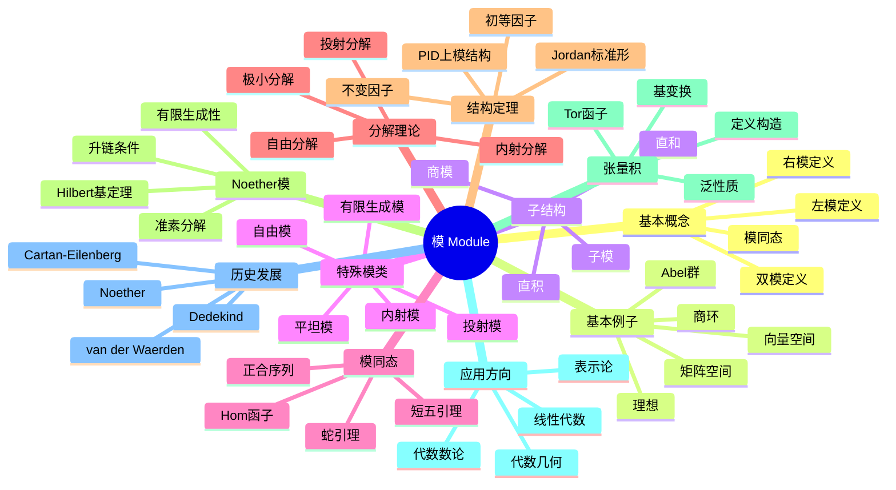

# 模 思维导图

## 中心概念
模是环上的"向量空间"，是环在Abel群上的线性作用。它是同时推广了向量空间（域上模）和Abel群（Z上模）的代数结构，是同调代数的核心对象。

## 核心分支

### 定义与公理
- **左R-模**: Abel群 $(M,+)$ 配备环 $R$ 的作用 $R \times M \to M$ 满足分配律和结合律
- **右R-模**: 作用 $M \times R \to M$
- **R-模同态**: 保持加法和数乘的群同态
- **双模**: 同时为左R-模和右S-模且作用交换

### 基本性质
- **子模**: 对加法和数乘封闭的子集
- **商模**: $M/N$ 配备诱导的模结构
- **直和与直积**: 模的构造方法
- **正合序列**: 模同态序列中像等于核

### 重要例子
- **向量空间**: 域 $F$ 上的模就是 $F$-向量空间
- **Abel群**: $\mathbb{Z}$-模与Abel群等价
- **理想**: 环的左/右理想是子模
- **矩阵空间**: $M_{m \times n}(R)$ 是 $M_m(R)$-$M_n(R)$-双模
- **群代数**: $\mathbb{Z}[G]$-模是带G作用的Abel群

### 核心定理
- **PID上有限生成模结构定理**: $M \cong R^r \oplus \bigoplus R/(p_i^{n_i})$（证明思路：初等因子法）
- **Hilbert基定理**: $R$ Noether $\Rightarrow$ $R[x]$ Noether
- **正合函子性质**: Hom和张量积的左/右正合性
- **投射模刻画**: 正合函子 $\text{Hom}_R(P, -)$ 保持正合性
- **内射模刻画**: $\text{Hom}_R(-, I)$ 正合

### 相关概念
- **父概念**: Abel群、向量空间、环作用
- **子概念**: 投射模、内射模、平坦模、Noether模
- **相邻概念**: 表示论、同调代数、代数K-理论

### 应用领域
- **线性代数**: 矩阵标准形、Jordan形
- **代数数论**: 理想类群、单位群
- **代数几何**: 层论、凝聚层
- **表示论**: 群表示作为群代数上的模

### 历史发展
- **早期发展**: Dedekind研究代数整数的理想
- **关键发展**:
  - 1920年代：Noether抽象化模论
  - 1930年：van der Waerden《Modern Algebra》系统阐述
  - 1956年：Cartan-Eilenberg《Homological Algebra》
- **现代研究**: 导出范畴、稳定模范畴、高阶模论

### 参考资源
- **推荐教材**: Dummit-Foote《Abstract Algebra》、Atiyah-Macdonald《Commutative Algebra》
- **相关论文**: Noether《Idealtheorie in Ringbereichen》、Eilenberg-Mac Lane《Group extensions》
- **在线资源**: Stacks Project

---

**概念链接**: [[环]] [[向量空间]] [[同调代数]] [[表示论]] [[范畴论]]
