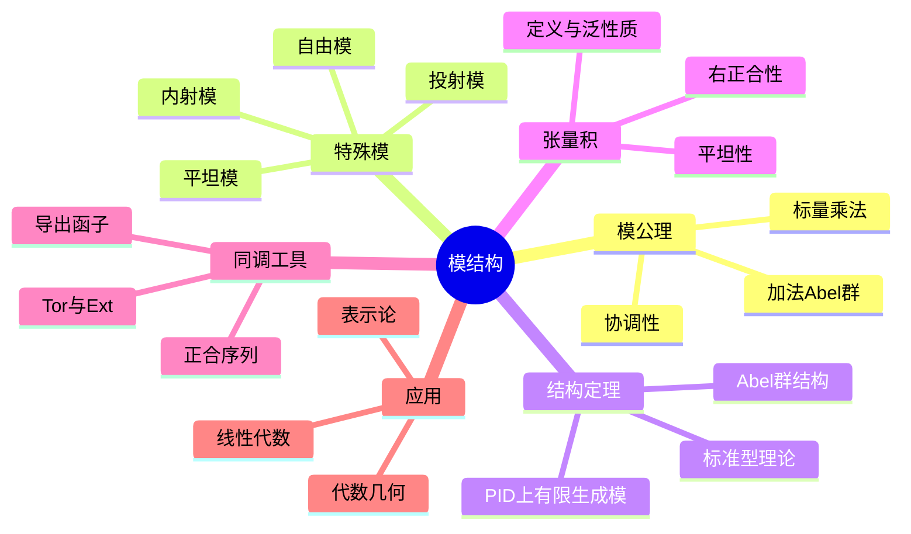

msc_primary: "00A99"
msc_secondary: ['00-XX']
---

# 模结构 思维导图

## 中心概念

### 精确定义

**模**是环 $R$ 上的"向量空间"——Abel群 $M$ 配以 $R$ 的标量乘法作用，满足：$r(m+n) = rm + rn$，$(r+s)m = rm + sm$，$(rs)m = r(sm)$，$1m = m$。模是线性代数在环上的自然推广。

### 直观理解

模是环上最自然的"线性"结构。当基环是域时，模就是向量空间；当基环是整数环时，模就是Abel群。模论统一了群论、线性代数和表示论中的许多概念。

---

## 第一层分支：核心要素

### 模公理

- **加法Abel群**：$(M, +)$ 是Abel群
- **标量乘法**：$R \times M \to M$，$(r, m) \mapsto rm$
- **双线性**：$r(m+n) = rm + rn$，$(r+s)m = rm + sm$
- **协调性**：$(rs)m = r(sm)$
- **单位元**：$1m = m$

### 模的类型

- **左模 vs 右模**：标量乘在左或右
- **双模**：同时为左 $R$-模和右 $S$-模，且作用协调
- **自由模**：有基的模（同构于 $R^n$ 或 $R^{(I)}$）
- **有限生成模**：有有限生成元的模

### 子模与商模

- **子模**：对加法和标量乘封闭的子集
- **商模**：$M/N = \{m + N : m \in M\}$
- **格结构**：子模关于包含关系构成格
- **合成列**：$M = M_0 \supset M_1 \supset \cdots \supset M_n = 0$，因子为单模

### 模同态

- **定义**：$f: M \to N$ 保持加法和标量乘法
- **核与像**：$\ker f$，$\operatorname{im} f$
- **同态基本定理**：$M/\ker f \cong \operatorname{im} f$
- **模同构**：双射模同态

---

## 第二层分支：性质与定理

### 重要性质

#### 1. 基本性质

- **零模**：$\{0\}$ 是最小的模
- **零因子问题**：$R$ 有零因子时，$rm = 0$ 不蕴含 $r=0$ 或 $m=0$
- **挠元与挠模**：$\operatorname{Tor}(M) = \{m : \exists r \neq 0, rm = 0\}$
- **无挠模**：$\operatorname{Tor}(M) = 0$

#### 2. 直和与直积

- **直和**：$\bigoplus_{i \in I} M_i$，几乎全为零的元组
- **直积**：$\prod_{i \in I} M_i$，所有元组
- **有限情形**：$\bigoplus_{i=1}^n M_i = \prod_{i=1}^n M_i$
- **泛性质**：直和是余积，直积是积

### 核心定理

#### 1. 模的分类（PID情形）

##### 有限生成Abel群结构定理

- **内容**：$G \cong \mathbb{Z}^r \oplus \bigoplus_{i=1}^k \mathbb{Z}_{p_i^{e_i}}$
- **自由部分**：$\mathbb{Z}^r$，秩 $r$
- **挠部分**：有限群，分解为素数幂阶循环群
- **不变因子**：循环分解 $\mathbb{Z}_{d_1} \oplus \cdots \oplus \mathbb{Z}_{d_k}$，$d_1 | \cdots | d_k$

##### 主理想整环上的模

- **结构定理**：有限生成模 $M \cong R^r \oplus \bigoplus R/(p_i^{e_i})$
- **初等因子**：循环分支的生成元
- **有理标准型**：利用不变因子
- **Jordan标准型**：代数闭域上的利用初等因子

#### 2. 正合序列

- **短正合序列**：$0 \to A \to B \to C \to 0$
- **分裂**：$B \cong A \oplus C$
- **五引理、蛇引理**：正合序列间的同态诱导的关系

#### 3. 投射模与内射模

##### 投射模

- **定义**：$P$ 使得 $\operatorname{Hom}(P, -)$ 正合
- **等价刻画**：$P$ 是某自由模的直和项；提升性质
- **例子**：自由模、PID上自由模的子模

##### 内射模

- **定义**：$I$ 使得 $\operatorname{Hom}(-, I)$ 正合
- **等价刻画**：Baer判别法；扩张性质
- **例子**：可除Abel群、$

#### 4. 张量积

- **定义**：$M \otimes_R N$，泛双线性映射
- **性质**：$R \otimes_R M \cong M$，$(M \otimes N) \otimes P \cong M \otimes (N \otimes P)$
- **右正合性**：$M \otimes -$ 右正合但非左正合
- **平坦模**：$M \otimes -$ 正合的模

---

## 第三层分支：例子与应用

### 典型例子

#### 1. Abel群（$\mathbb{Z}$-模）

- **结构**：有限生成Abel群的结构定理
- **挠自由**：$\mathbb{Z}^r$
- **挠群**：有限Abel群

#### 2. 向量空间（域上模）

- **特殊性**：所有模自由，有基
- **维数**：良定义的维数理论

#### 3. 多项式环上的模

- **$k[x]$-模**：$k$-线性空间配上一个线性变换
- **结构定理**：对应有理标准型、Jordan标准型

#### 4. 群表示（群环上的模）

- **定义**：$k[G]$-模 = 群 $G$ 的 $k$-表示
- **Maschke定理**：特征不整除 $|G|$ 时，表示完全可约

- **特征标**：表示的迹函数

### 反例

#### 1. 非自由模

- **挠模**：$\mathbb{Z}_n$ 作为 $\mathbb{Z}$-模
- **非自由投射模**：某些环上的非自由投射模（如Swan定理相关的例子）

#### 2. 非投射模

- **$\mathbb{Q}$ 作为 $\mathbb{Z}$-模**：平坦但非投射

### 应用场景

#### 1. 线性代数

- **标准型理论**：有理标准型、Jordan标准型的模论解释
- **矩阵相似**：$k[x]$-模的同构分类
- **结构不变量**：不变因子、初等因子

#### 2. 同调代数

- **导出函子**：$\operatorname{Tor}$，$\operatorname{Ext}$
- **$\operatorname{Tor}_1^R(M,N)$**：张量积的左导出函子
- **$\operatorname{Ext}_R^n(M,N)$**：Hom的右导出函子

#### 3. 代数几何

- **层论**：层的模结构
- **局部自由层**：向量丛的对应
- **凝聚层**：有限展示模的对应

#### 4. 代数拓扑

- **链复形**：模的序列与边界算子
- **同调群**：Ker/Im 的商
- **万有系数定理**：联系整系数与同调系数

#### 5. 代数数论

- **理想类群**：分式理想模主理想
- **单位群**：Dirichlet单位定理
- **Galois模**：Galois群作用的模

---

## 第四层分支：关联概念

### 相似概念

#### 代数

- **定义**：环 $R$ 上的模，带有双线性乘法
- **结合代数**：乘法结合
- **李代数**：乘法反对称，满足Jacobi恒等式

#### 分级模

- **定义**：$M = \bigoplus_{n \in \mathbb{Z}} M_n$
- **分次同态**：保持分次
- **应用**：同调代数、交换代数

### 对偶概念

#### 余模与余代数

- **余模**：模的对偶概念，余作用
- **余代数**：代数的对偶，有余乘和余单位
- **Hopf代数**：代数+余代数+antipode

### 推广概念

#### 范畴论视角

- **模范畴**：$R$-$\mathbf{Mod}$
- **Abel范畴**：模范畴的公理化
- **Freyd-Mitchell嵌入定理**：小Abel范畴嵌入到模范畴

#### 非交换代数几何

- **投射空间**：$\operatorname{Proj}$ 构造
- **非交换坐标环**：用代数代替几何对象
- **Artin-Schelter正则代数**：非交换多项式环

#### 导出范畴

- **复形范畴**：链复形与链映射
- **拟同构**：诱导同调同构
- **导出范畴**：局部化拟同构
- **t-结构**：提取"自然"的Abel子范畴

#### 高阶代数结构

- **$A_\infty$-代数**：结合律仅在同伦意义下成立
- **$L_\infty$-代数**：Lie代数的同伦推广
- **DG-代数**：微分分次代数

---

## Mermaid思维导图

---

**参考章节**：抽象代数 - 第3章 模论
**关联文件**：线性空间-思维导图.md、同调代数-思维导图.md
