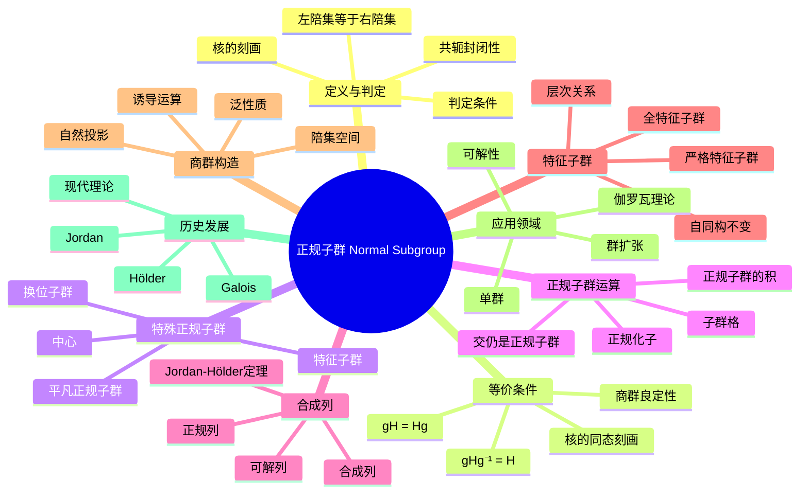

msc_primary: "00A99"
msc_secondary: ['00-00']
---

# 正规子群 思维导图

## 中心概念
正规子群（不变子群）是在群的所有内自同构下保持不变的子群，是构造商群的基础。正规子群对应于群同态的核。

## 核心分支

### 定义与判定
- **定义**: $N \leq G$ 称为正规子群，若 $\forall g \in G: gNg^{-1} = N$，记作 $N \trianglelefteq G$
- **等价定义**: $N$ 的每个左陪集也是右陪集
- **核的刻画**: 任何群同态的核都是正规子群
- **指数2子群**: 指数2的子群必为正规子群

### 基本性质
- **交的性质**: 任意正规子群的交仍是正规子群
- **共轭封闭**: 正规子群是若干共轭类的并
- **商群良定性**: 正规子群使得陪集运算良定义
- **对应关系**: 正规子群与满同态的核一一对应

### 重要例子
- **中心**: $Z(G) \trianglelefteq G$ 总是正规子群
- **换位子群**: $[G,G] \trianglelefteq G$，且 $G/[G,G]$ 是交换群
- **交错群**: $A_n \trianglelefteq S_n$（$n \geq 2$）
- **特殊线性群**: $SL_n(F) \trianglelefteq GL_n(F)$

### 核心定理
- **对应定理**: 若 $N \trianglelefteq G$，则 $G$ 的含 $N$ 的子群与 $G/N$ 的子群一一对应
- **第二同构定理**: $H \leq G, N \trianglelefteq G$，则 $HN/N \cong H/(H \cap N)$
- **第三同构定理**: $N \trianglelefteq M \trianglelefteq G$，则 $(G/N)/(M/N) \cong G/M$
- **Jordan-Hölder定理**: 合成列的唯一性（在同构和重排意义下）

### 相关概念
- **父概念**: [[子群]]
- **子概念**: [[商群]]、[[特征子群]]、[[合成列]]
- **相邻概念**: [[群同态]]、[[群同构]]、[[群作用]]

### 应用领域
- **群扩张**: 群扩张理论的构建块
- **可解性**: 可解群的递推定义基础
- **单群**: 单群是无非平凡正规子群的群
- **伽罗瓦理论**: 正规子群对应正规扩张

### 历史发展
- **Galois (1830s)**: 在研究方程可解性时引入正规子群思想
- **Jordan (1860s)**: 系统研究正规子群和合成列
- **Hölder (1889)**: Jordan-Hölder定理
- **现代**: 无限群、拓扑群、代数群的正规子群理论

---

**概念链接**: [[群]] [[子群]] [[商群]] [[群同态]] [[群同构]]
