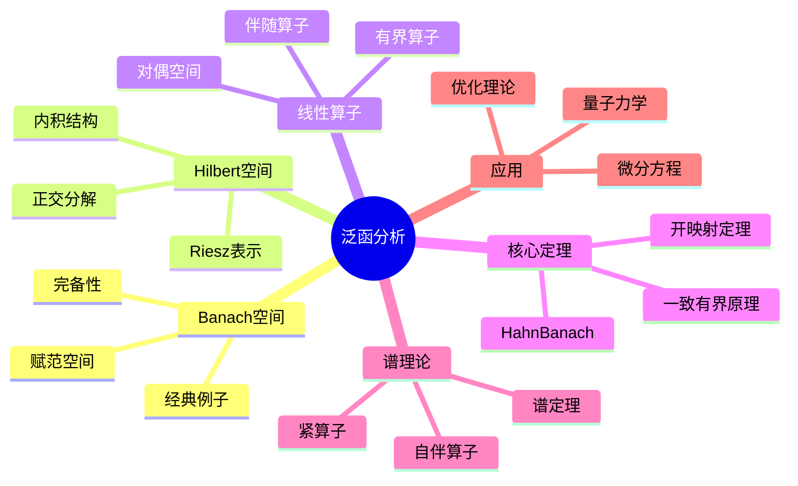

# 泛函分析 思维导图

## 中心概念

### 精确定义
**泛函分析**研究无穷维向量空间（通常是函数空间）上的分析学。核心对象包括Banach空间（完备的赋范空间）、Hilbert空间（完备的内积空间）及其上的线性算子。它将有限维线性代数和数学分析的方法推广到无穷维情形。

### 直观理解
泛函分析是"无穷维线性代数"。有限维空间中"显然"的性质在无穷维中需要重新检验——如闭单位球的紧性、有界集的极值存在性。它提供了研究微分方程、积分方程、量子力学的统一框架。

---

## 第一层分支：核心要素

### Banach空间
- **赋范空间**：向量空间 $X$ 配备范数 $\|\cdot\|$

- **完备性**：所有Cauchy列收敛
- **Banach空间**：完备的赋范空间
- **例子**：$C(K)$（连续函数），$L^p$（$p$-可积函数），$\ell^p$（$p$-可和序列）
- **有限维**：所有有限维赋范空间彼此同构且完备

### Hilbert空间
- **内积空间**：向量空间 $H$ 配备内积 $\langle \cdot, \cdot \rangle$
- **诱导范数**：$\|x\| = \sqrt{\langle x, x \rangle}$

- **Hilbert空间**：完备的内积空间
- **例子**：$L^2$（平方可积函数），$\ell^2$（平方可和序列）
- **正交性**：$\langle x, y \rangle = 0$，正交基的存在性

### 线性算子
- **有界算子**：$\|Tx\| \leq M\|x\|$，等价于连续性
- **算子范数**：$\|T\| = \sup_{\|x\|=1} \|Tx\|$

- **对偶空间**：$X^* = \mathcal{B}(X, \mathbb{F})$，所有有界线性泛函
- **伴随算子**：$\langle Tx, y \rangle = \langle x, T^*y \rangle$
- **谱理论**：算子的特征值与谱

### 弱拓扑与弱*拓扑
- **弱收敛**：$x_n \rightharpoonup x$ 若 $f(x_n) \to f(x)$ 对所有 $f \in X^*$
- **弱*收敛**：$f_n \stackrel{*}{\rightharpoonup} f$ 若 $f_n(x) \to f(x)$ 对所有 $x \in X$
- **弱紧性**：Banach-Alaoglu定理（单位球弱*紧）

---

## 第二层分支：性质与定理

### 重要性质

#### 1. 有界算子的基本性质
- **Banach代数**：有界算子构成Banach代数
- **可逆性**：开映射定理、逆映射定理
- **谱**：$\sigma(T) = \{\lambda : T - \lambda I \text{ 不可逆}\}$
- **谱半径**：$r(T) = \lim_{n \to \infty} \|T^n\|^{1/n}$

#### 2. Hilbert空间的特殊性质
- **投影定理**：闭凸集上的最佳逼近
- **Riesz表示定理**：$H^* \cong H$（自对偶）
- **正交分解**：$H = M \oplus M^\perp$（$M$ 闭子空间）
- **规范正交基**：可数或不可数基的存在

### 核心定理

#### 1. 一致有界原理（共鸣定理）
- **内容**：Banach空间上有界线性算子点态有界则一致有界
- **形式**：$\sup_n \|T_n x\| < \infty$（所有 $x$）$\Rightarrow$ $\sup_n \|T_n\| < \infty$

- **应用**：Fourier级数的发散性、机械求积公式的收敛

#### 2. 开映射定理与闭图像定理
- **开映射定理**：Banach空间间的满射有界线性算子是开映射
- **逆映射定理**：双射有界线性算子的逆有界
- **闭图像定理**：图像闭的线性算子有界
- **应用**：微分算子的正则性

#### 3. Hahn-Banach定理
- **实形式**：子空间上的有界线性泛函可保范延拓到全空间
- **复形式**：复空间上的延拓
- **几何形式**：凸集的分离定理
- **推论**：对偶空间足够"丰富"，$X^*$ 分离 $X$ 的点

#### 4. 紧算子理论（Fredholm理论）
- **紧算子**：有界集映为相对紧集
- **Fredholm择一性**：$I - K$ 要么是双射，要么有有限维核和余核
- **谱**：紧算子谱至多可数，非零谱点为特征值
- **应用**：积分方程

#### 5. 自伴算子谱定理
- **Hilbert空间情形**：自伴算子酉等价于乘法算子
- **谱分解**：$T = \int \lambda dE(\lambda)$（谱测度积分）
- **应用**：量子力学、偏微分方程

---

## 第三层分支：例子与应用

### 典型例子

#### 1. 经典Banach空间
- **$\ell^p$空间**：$\|x\|_p = (\sum |x_n|^p)^{1/p}$
- **$L^p$空间**：$\|f\|_p = (\int |f|^p)^{1/p}$

- **$C(K)$空间**：紧集上的连续函数，上确界范数
- **Sobolev空间**：$W^{k,p}$，含弱导数的函数空间

#### 2. 经典Hilbert空间
- **$\ell^2$**：平方可和序列
- **$L^2(\Omega)$**：平方可积函数
- **$H^2$**：Hardy空间
- **$L^2(\mathbb{R}^n)$**：量子力学的态空间

#### 3. 重要算子
- **移位算子**：$S(x_1, x_2, \ldots) = (0, x_1, x_2, \ldots)$
- **积分算子**：$(Tf)(x) = \int K(x,y)f(y)dy$
- **微分算子**：$\frac{d}{dx}$，无界算子
- **Fourier变换**：$\mathcal{F}f(\xi) = \int f(x)e^{-ix\xi}dx$

### 反例

#### 1. 不完备空间
- **$C([0,1])$ 配 $L^1$ 范数**：不完备
- **多项式空间**：配各种范数均不完备

#### 2. 无界算子
- **微分算子**：在 $L^2$ 上无界
- **乘法算子**：乘以无界函数

### 应用场景

#### 1. 微分方程
- **弱解理论**：Sobolev空间中的解
- **椭圆方程**：Fredholm择一性、正则性
- **演化方程**：半群理论 $u(t) = e^{tA}u_0$
- **谱方法**：特征函数展开

#### 2. 量子力学
- **Hilbert空间**：态的数学描述
- **可观测量**：自伴算子
- **Heisenberg不确定性**：位置与动量算子的不对易性
- **谱定理**：测量结果与算子谱

#### 3. 偏微分方程
- **变分方法**：能量泛函的极小化
- **紧嵌入**：Rellich-Kondrachov定理
- **先验估计**：解的正则性
- **分布解**：广义函数方法

#### 4. 逼近论
- **投影算子**：最佳逼近
- **插值理论**：算子插值
- **逼近格式**：有限元方法的收敛性

#### 5. 遍历理论
- **Koopman算子**：$Uf = f \circ T$
- **谱方法**：动力系统的谱分析
- **Mixing性质**：关联函数的衰减

---

## 第四层分支：关联概念

### 相似概念

#### 分布理论
- **测试函数空间**：$\mathcal{D}(\Omega)$，紧支撑光滑函数
- **分布**：$\mathcal{D}'(\Omega)$，连续线性泛函
- **运算**：微分、乘法（光滑函数）、卷积
- **Fourier变换**：缓增分布 $\mathcal{S}'$

#### 算子代数
- **C*代数**：Banach代数加对合运算 $\|a^*a\| = \|a\|^2$

- **von Neumann代数**：强算子拓扑闭的自伴代数
- **谱三元组**：非交换几何的基础

### 对偶概念

#### 凸分析
- **凸函数**：$f(\lambda x + (1-\lambda)y) \leq \lambda f(x) + (1-\lambda)f(y)$
- **次梯度**：凸函数的"导数"推广
- **Legendre-Fenchel变换**：凸共轭
- **应用**：优化理论、变分法

### 推广概念

#### 非线性泛函分析
- **变分法**：泛函的极值
- **临界点理论**：Morse理论、指标理论
- **单调算子**：非线性算子理论
- **分歧理论**：解的分支与稳定性

#### 随机分析
- **随机过程**：$L^2$ 空间值的过程
- **Malliavin分析**：Wiener空间上的微积分
- **白噪声分析**：广义随机过程

#### 算子空间与量子概率
- **完全有界映射**：矩阵范数的相容性
- **量子群**：非交换的对称性
- **自由概率论**：随机矩阵的极限理论

---

## Mermaid思维导图

---

**参考章节**：泛函分析 - 全章  
**关联文件**：线性空间-思维导图.md、测度-思维导图.md
