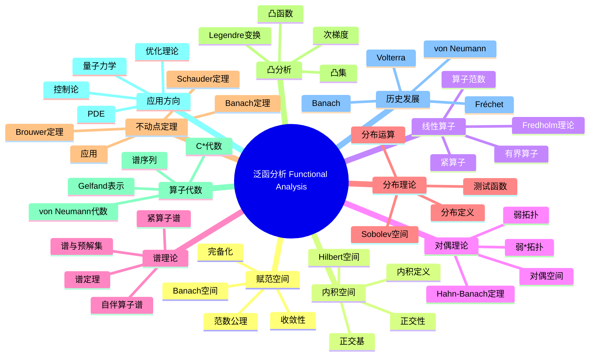

msc_primary: "00A99"
msc_secondary: ['00-XX']
---

# 泛函分析 思维导图

## 中心概念
泛函分析研究无穷维向量空间（主要是函数空间）上的分析学，统一了线性代数、分析和拓扑的方法。它是量子力学、偏微分方程和优化理论的数学基础。

## 核心分支

### 定义与公理
- **赋范空间**: 向量空间 $X$ 配备范数 $\|\cdot\|$ 满足正定性、齐次性、三角不等式

- **Banach空间**: 完备的赋范空间
- **Hilbert空间**: 完备的内积空间
- **有界线性算子**: $\|Tx\| \leq M\|x\|$，算子范数 $\|T\| = \sup_{\|x\|=1}\|Tx\|$

### 基本性质
- **完备化**: 每个赋范空间可完备化为Banach空间
- **Hahn-Banach**: 范数空间的子空间上的线性泛函可保范延拓
- **一致有界原理**: 点态有界的算子族一致有界
- **开映射定理**: Banach空间间的满射有界线性算子是开映射

### 重要例子
- **$L^p$空间**: 可测函数的 $p$-次可积函数空间
- **$\ell^p$空间**: 序列的 $p$-次可和空间
- **$C(X)$**: 紧空间 $X$ 上的连续函数空间
- **Sobolev空间**: 弱导数可积的函数空间
- **Hardy空间**: 单位圆盘上的全纯函数空间

### 核心定理
- **Hahn-Banach定理**: 线性泛函的保范延拓（证明思路：Zorn引理）
- **Riesz表示定理**: Hilbert空间上线性泛函的内积表示
- **谱定理**: 紧自伴算子的对角化
- **Banach-Alaoglu**: 对偶空间的单位球弱*紧
- **Lax-Milgram定理**: 椭圆型偏微分方程弱解存在性

### 相关概念
- **父概念**: 实分析、线性代数、拓扑学
- **子概念**: 算子代数、非交换几何、自由概率
- **相邻概念**: 调和分析、偏微分方程、量子力学

### 应用领域
- **量子力学**: Hilbert空间态、可观测量算子
- **偏微分方程**: 弱解、Sobolev方法
- **优化理论**: 凸分析、变分问题
- **控制论**: 系统稳定性、最优控制

### 历史发展
- **创立者**: Vito Volterra (1887) 研究积分方程
- **关键发展**:
  - 1906：Fréchet引入度量空间
  - 1932：Banach《Théorie des Opérations Linéaires》
  - 1930年代：von Neumann建立量子力学数学基础
  - 1943：Gelfand建立交换Banach代数理论
- **现代研究**: 非交换几何、自由概率、量子群

### 参考资源
- **推荐教材**: Rudin《Functional Analysis》、Conway《A Course in Functional Analysis》
- **相关论文**: Banach《Théorie des Opérations Linéaires》(1932)、von Neumann《Mathematische Grundlagen der Quantenmechanik》(1932)
- **在线资源**: Functional Analysis Notes (Paul Garrett)

---

**概念链接**: [[实分析]] [[Hilbert空间]] [[谱理论]] [[量子力学]] [[偏微分方程]]
