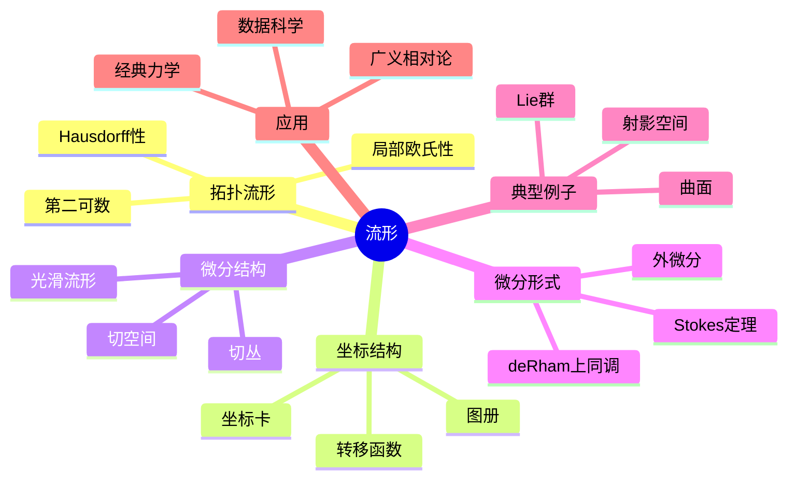

# 流形 思维导图

## 中心概念

### 精确定义
**流形**是局部同胚于欧氏空间的Hausdorff、第二可数拓扑空间。形式地，$n$ 维拓扑流形 $M$ 满足：(1) 每点有开邻域同胚于 $\mathbb{R}^n$（或开球）；(2) Hausdorff分离性；(3) 第二可数公理。

### 直观理解
流形是"弯曲的欧氏空间"——局部平直但整体可能弯曲。地球表面是2维流形（局部像平面，整体是球面）。流形为物理时空、相空间、数据空间等提供了自然的数学模型。

---

## 第一层分支：核心要素

### 拓扑流形
- **局部欧氏性**：$\forall p \in M$，存在邻域 $U$ 和同胚 $\phi: U \to \mathbb{R}^n$
- **维数**：局部维数一致的常数 $n$
- **Hausdorff性**：分离公理，保证唯一极限
- **第二可数性**：拓扑有可数基，保证仿紧性

### 坐标卡与图册
- **坐标卡（Chart）**：$(U, \phi)$，其中 $\phi: U \to \mathbb{R}^n$ 是同胚
- **图册（Atlas）**：覆盖全流形的坐标卡集合
- **转移函数**：$\phi_\beta \circ \phi_\alpha^{-1}$，定义在开集 $\phi_\alpha(U_\alpha \cap U_\beta)$ 上
- **相容性**：转移函数是光滑（或连续）的

### 微分流形
- **光滑结构**：图册中所有转移函数是光滑 ($C^\infty$) 的
- **微分同胚**：光滑双向映射，保持微分结构
- **切空间**：$T_pM$，流形在某点的"切平面"
- **切丛**：$TM = \bigsqcup_{p \in M} T_pM$，所有切空间的并

### 张量与微分形式
- **张量场**：光滑地赋予每点一个张量
- **微分形式**：反对称协变张量场
- **外微分**：$d: \Omega^k(M) \to \Omega^{k+1}(M)$
- **de Rham上同调**：$H^k_{dR}(M) = \ker d / \operatorname{im} d$

---

## 第二层分支：性质与定理

### 重要性质

#### 1. 基本性质
- **仿紧性**：流形是仿紧的（有单位分解）
- **可定向性**：存在处处非零的 $n$-形式
- **嵌入定理**：Whitney嵌入定理（光滑流形可嵌入欧氏空间）
- **分类问题**：低维流形的分类，高维困难

#### 2. 切映射与微分
- **切映射（Pushforward）**：$f_*: T_pM \to T_{f(p)}N$
- **余切映射（Pullback）**：$f^*: T^*_{f(p)}N \to T^*_pM$
- **链式法则**：$(g \circ f)_* = g_* \circ f_*$

### 核心定理

#### 1. 隐函数定理与逆映射定理
- **逆映射定理**：局部微分同胚的判定
- **隐函数定理**：子流形的局部描述
- **正则值原像**：$y$ 是 $f: M \to N$ 的正则值，则 $f^{-1}(y)$ 是子流形

#### 2. Whitney定理
- **Whitney嵌入定理**：任何 $n$ 维光滑流形可光滑嵌入 $\mathbb{R}^{2n}$
- **Whitney浸入定理**：可浸入 $\mathbb{R}^{2n-1}$
- **紧流形**：可嵌入有限维欧氏空间

#### 3. Sard定理
- **内容**：光滑映射的临界值集是零测集
- **意义**："一般"值都是正则值
- **应用**：横截性、Brouwer不动点定理

#### 4. Stokes定理
- **内容**：$\int_M d\omega = \int_{\partial M} \omega$
- **意义**：微积分基本定理的高维推广
- **应用**：de Rham上同调、物理场论

#### 5. de Rham定理
- **内容**：$H^k_{dR}(M) \cong H^k(M; \mathbb{R})$（与奇异上同调同构）
- **意义**：分析拓扑与代数拓扑的桥梁
- **方法**：层论、微分分次代数

---

## 第三层分支：例子与应用

### 典型例子

#### 1. 低维流形
- **曲线（1维）**：$S^1$，$\mathbb{R}$，$(0,1)$
- **曲面（2维）**：
  - 球面 $S^2$：单连通，Euler示性数2
  - 环面 $T^2$：$\pi_1 = \mathbb{Z}^2$
  - Klein瓶：不可定向
  - 射影平面 $\mathbb{RP}^2$：不可定向
  - 高亏格曲面：$\Sigma_g$，$g$ 个环面的连通和

#### 2. 经典高维流形
- **球面**：$S^n = \{x \in \mathbb{R}^{n+1} : |x| = 1\}$

- **环面**：$T^n = S^1 \times \cdots \times S^1$
- **实射影空间**：$\mathbb{RP}^n = S^n/\{\pm 1\}$
- **复射影空间**：$\mathbb{CP}^n = (\mathbb{C}^{n+1} \setminus \{0\})/\mathbb{C}^*$
- **Grassmann流形**：$k$ 维子空间的集合
- **Stiefel流形**：标准正交 $k$ 标架的集合

#### 3. Lie群
- **一般线性群**：$GL_n(\mathbb{R})$，$GL_n(\mathbb{C})$
- **特殊线性群**：$SL_n(\mathbb{R})$，$SL_n(\mathbb{C})$
- **正交群**：$O(n)$，$SO(n)$
- **酉群**：$U(n)$，$SU(n)$
- **辛群**：$Sp(2n, \mathbb{R})$

### 反例

#### 1. 非Hausdorff流形
- **具有双重原点的直线**：两条实直线在除原点外粘合
- **用途**：代数几何（概形）

#### 2. 不可分空间
- **长直线**：不可度量化的一维流形
- **性质**：局部像 $\mathbb{R}$，但非第二可数

### 应用场景

#### 1. 广义相对论
- **时空流形**：4维Lorentz流形
- **度规**：$ds^2 = g_{\mu\nu}dx^\mu dx^\nu$
- **测地线**：自由粒子的世界线
- **Einstein方程**：$G_{\mu\nu} = \frac{8\pi G}{c^4} T_{\mu\nu}$

#### 2. 经典力学
- **相空间**：广义坐标和动量的空间
- **辛结构**：$\omega = \sum dp_i \wedge dq_i$
- **Hamilton方程**：$\dot{q} = \frac{\partial H}{\partial p}$，$\dot{p} = -\frac{\partial H}{\partial q}$
- **Liouville定理**：相空间体积守恒

#### 3. 规范场论
- **主丛**：$P \to M$ 以Lie群 $G$ 为结构群
- **联络**：协变导数的推广
- **曲率**：场强张量
- **Chern类**：示性类，拓扑不变量

#### 4. 数据科学
- **流形学习**：假设高维数据在低维流形上
- **ISOMAP**：测地距离保持的降维
- **LLE**：局部线性嵌入
- **t-SNE**：概率分布保持的可视化

#### 5. 机器人学
- **位形空间**：机器人所有可能位形的空间
- **关节空间**：关节角度的空间（环面的子集）
- **工作空间**：末端执行器可达的空间

---

## 第四层分支：关联概念

### 相似概念

#### 带边流形
- **定义**：局部同胚于半空间 $\mathbb{H}^n = \{x_n \geq 0\}$
- **边界**：不能同胚于开球的点集
- **例子**：闭单位球 $B^n$，$\partial B^n = S^{n-1}$

#### 轨形（Orbifold）
- **定义**：局部像 $\mathbb{R}^n$ 模掉有限群作用
- **应用**：弦理论、代数几何
- **例子**：足球（二十面体对称）

### 对偶概念

#### 分层空间
- **定义**：用流形片段（层）粘合的空间
- **例子**：代数簇、解析空间
- **应用**：奇点理论

### 推广概念

#### 复流形
- **定义**：局部同胚于 $\mathbb{C}^n$，转移函数全纯
- **全纯函数**：复可微函数
- **例子**：Riemann面、复射影空间、环面
- **Kähler流形**：有相容的Riemann度规、辛结构和复结构

#### 辛流形
- **定义**：有非退化闭2形式 $\omega$ 的流形
- **Darboux定理**：辛形式局部标准
- **应用**：经典力学、几何量子化

#### 代数簇
- **定义**：多项式方程组的零点集
- **概形**：代数簇的局部环化推广
- **动机**：统一算术与几何

#### 无限维流形
- **Banach流形**：以Banach空间为模型
- **Hilbert流形**：以Hilbert空间为模型
- **Fréchet流形**：以Fréchet空间为模型
- **应用**：规范理论、膜理论

---

## Mermaid思维导图

---

**参考章节**：微分几何 - 第1章 微分流形  
**关联文件**：拓扑空间-思维导图.md、曲率-思维导图.md
