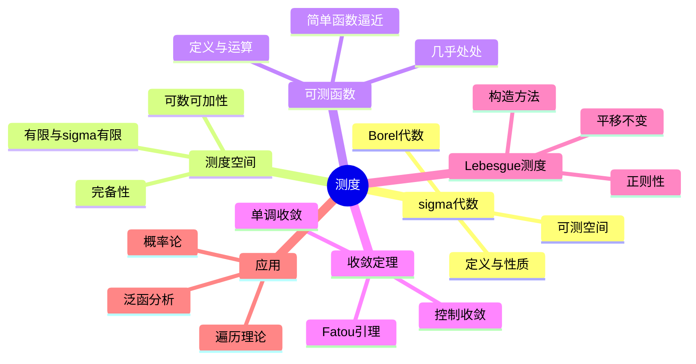

# 测度 思维导图

## 中心概念

### 精确定义
**测度**是定义在 $\sigma$-代数上的可数可加集函数 $\mu: \mathcal{A} \to [0, +\infty]$，满足：(1) $\mu(\emptyset) = 0$；(2) 可数可加性——对互不相交的集合列 $\{E_n\}$，$\mu(\bigcup E_n) = \sum \mu(E_n)$。

### 直观理解
测度是"长度"、"面积"、"体积"概念的抽象和推广。它使得我们可以对更广泛的集合（包括不可求长的集合）赋予"大小"，并为Lebesgue积分理论奠定基础。测度论是现代分析学和概率论的基石。

---

## 第一层分支：核心要素

### $\sigma$-代数
- **定义**：$\mathcal{A} \subseteq \mathcal{P}(X)$ 满足：包含 $X$；对补封闭；对可数并封闭
- **生成**：给定集族生成的最小 $\sigma$-代数
- **Borel $\sigma$-代数**：拓扑空间由开集生成的 $\sigma$-代数 $\mathcal{B}(X)$
- **可测空间**：$(X, \mathcal{A})$，尚未定义测度

### 测度空间
- **测度**：$\mu: \mathcal{A} \to [0, +\infty]$，满足 $\mu(\emptyset) = 0$ 和可数可加性
- **有限测度**：$\mu(X) < \infty$
- **$\sigma$-有限测度**：$X = \bigcup E_n$，$\mu(E_n) < \infty$
- **完备测度**：零测集的子集都可测
- **测度空间**：$(X, \mathcal{A}, \mu)$

### 可测函数
- **定义**：$f: X \to Y$，$Y$ 的开集原像可测（或Borel可测）
- **等价**：$\{f > a\}$ 可测（实值函数）
- **运算封闭**：可测函数的和、积、极限可测
- **简单函数**：可测集指示函数的有限线性组合

### Lebesgue测度
- **定义**：$\mathbb{R}^n$ 上平移不变的完备测度
- **区间体积**：$\mu([a_1,b_1] \times \cdots) = \prod (b_i - a_i)$
- **外测度构造**：Carathéodory扩张定理
- **正则性**：内外正则（Borel集可用开集从外、闭集从内外逼近）
- **唯一性**：平移不变、正规化的Borel测度唯一

---

## 第二层分支：性质与定理

### 重要性质

#### 1. 测度的基本性质
- **单调性**：$A \subseteq B$ $\Rightarrow$ $\mu(A) \leq \mu(B)$
- **次可数可加性**：$\mu(\bigcup E_n) \leq \sum \mu(E_n)$
- **连续性从下**：$E_n \nearrow E$ $\Rightarrow$ $\mu(E_n) \nearrow \mu(E)$
- **连续性从上**：$E_n \searrow E$，$\mu(E_1) < \infty$ $\Rightarrow$ $\mu(E_n) \searrow \mu(E)$

#### 2. 零测集与几乎处处
- **零测集**：$\mu(E) = 0$ 的集合
- **几乎处处（a.e.）**：除零测集外处处成立
- **完备化**：扩大 $\sigma$-代数使所有零测集子集可测

### 核心定理

#### 1. Carathéodory扩张定理
- **内容**：半环上的预测度可唯一扩张到生成的 $\sigma$-代数
- **方法**：外测度构造 + 可测集定义
- **Lebesgue测度**：从区间长度出发的扩张

#### 2. 收敛定理

##### 单调收敛定理（MON）
- **内容**：$0 \leq f_n \nearrow f$ a.e. $\Rightarrow$ $\int f_n \nearrow \int f$
- **意义**：积分与递增极限可交换

##### Fatou引理
- **内容**：$\int \liminf f_n \leq \liminf \int f_n$
- **方向**：不等式方向很重要
- **推论**：非负函数项级数的逐项积分

##### 控制收敛定理（DOM）
- **内容**：$|f_n| \leq g$，$g$ 可积，$f_n \to f$ a.e. $\Rightarrow$ $\int f_n \to \int f$
- **核心**：可积控制函数保证积分极限交换
- **应用**：参数积分、概率极限定理

#### 3. Riesz表示定理
- **内容**：局部紧Hausdorff空间上正线性泛函对应唯一正则Borel测度
- **意义**：测度与积分的对偶性
- **应用**：构造测度、泛函分析

#### 4. Lusin定理与Egorov定理
- **Lusin定理**：可测函数在紧集上"几乎连续"
- **Egorov定理**：几乎处处收敛蕴含几乎一致收敛（有限测度）
- **意义**：可测函数与连续函数的关系

#### 5. Radon-Nikodym定理
- **绝对连续**：$\nu \ll \mu$（$\mu(E) = 0$ $\Rightarrow$ $\nu(E) = 0$）
- **内容**：$\nu \ll \mu$ 且 $\sigma$-有限 $\Rightarrow$ $\exists f$，$d\nu = f d\mu$
- **密度函数**：$f = \frac{d\nu}{d\mu}$
- **Lebesgue分解**：任意 $\nu$ 可分解为绝对连续部分和奇异部分

---

## 第三层分支：例子与应用

### 典型例子

#### 1. 经典测度
- **计数测度**：$\mu(E) = |E|$（元素个数）
- **Dirac测度**：$\delta_x(E) = 1$ 若 $x \in E$，否则 0
- **Lebesgue测度**：$\mathbb{R}^n$ 上的标准测度
- **Gauss测度**：$d\gamma = \frac{1}{(2\pi)^{n/2}}e^{-|x|^2/2}dx$

#### 2. 奇异测度
- **Cantor函数**：连续、递增、几乎处处导数为0
- **Cantor测度**：分布在Cantor集上的测度
- **支撑在曲线上的测度**：如曲线积分诱导的测度

#### 3. 乘积测度
- **定义**：$(X \times Y, \mathcal{A} \otimes \mathcal{B}, \mu \times \nu)$
- **Fubini定理**：可积函数的重积分与累次积分相等
- **Tonelli定理**：非负可测函数的重积分与累次积分相等

### 反例

#### 1. Vitali集
- **构造**：利用选择公理从 $[0,1]$ 的等价类中各选一个代表元
- **性质**：不可测（违反可数可加性）
- **意义**：说明完备测度需要牺牲一些集合的可测性

#### 2. 非Lebesgue可测函数
- **Vitali函数**：基于Vitali集的不可测函数
- **不可测集的指示函数**

### 应用场景

#### 1. 概率论
- **概率空间**：$(\Omega, \mathcal{F}, P)$，$P(\Omega) = 1$
- **随机变量**：可测函数 $X: \Omega \to \mathbb{R}$
- **分布**：$\mu_X = P \circ X^{-1}$
- **期望**：$E[X] = \int X dP$
- **大数定律、中心极限定理**：测度收敛

#### 2. 泛函分析
- **$L^p$空间**：$\|f\|_p = (\int |f|^p)^{1/p}$
- **对偶空间**：$(L^p)^* = L^q$（$1/p + 1/q = 1$）
- **弱收敛**：基于积分定义的收敛

#### 3. 遍历理论
- **保测变换**：$\mu(T^{-1}E) = \mu(E)$
- **遍历性**：不变集只能是零测或全测
- **Birkhoff遍历定理**：时间平均 = 空间平均

#### 4. 几何测度论
- **Hausdorff测度**：分形维数的测度
- **面积/余面积公式**：子流形的测度计算
- **极小曲面**：测度论方法研究

#### 5. 偏微分方程
- **Sobolev空间**：基于测度的弱导数理论
- **Young测度**：振荡序列的极限描述
- **测度值解**：守恒律的广义解

---

## 第四层分支：关联概念

### 相似概念

#### 外测度
- **定义**：$\mu^*: \mathcal{P}(X) \to [0,+\infty]$，单调、次可数可加、$\mu^*(\emptyset) = 0$
- **Carathéodory条件**：$E$ 可测 $\Leftrightarrow$ $\forall A$，$\mu^*(A) = \mu^*(A \cap E) + \mu^*(A \setminus E)$
- **应用**：从外测度构造测度

#### 容量
- **定义**：Newton容量、对数容量
- **应用**：位势理论、复分析
- **Choquet容量**：可定义的泛函

### 对偶概念

#### 积分
- **定义**：简单函数积分 $\to$ 非负函数积分 $\to$ 一般函数积分
- **与测度的关系**：积分决定测度，测度决定积分
- **Lebesgue-Stieltjes积分**：关于函数的积分

### 推广概念

#### 向量值测度
- **定义**：取值于Banach空间的测度
- **变差**：全变差的概念
- **Radon-Nikodym性质**：有界变差向量测度的密度表示

#### 谱测度
- **定义**：可测集到投影算子的映射
- **谱定理**：自伴算子的谱分解
- **应用**：量子力学、泛函分析

#### 非交换测度论
- **von Neumann代数**：非交换的可测结构
- **迹**：非交换积分
- **自由概率论**：非交换的随机矩阵理论

---

## Mermaid思维导图

---

**参考章节**：实变函数/测度论 - 第2章 测度与积分  
**关联文件**：可积性-思维导图.md、泛函分析-思维导图.md
