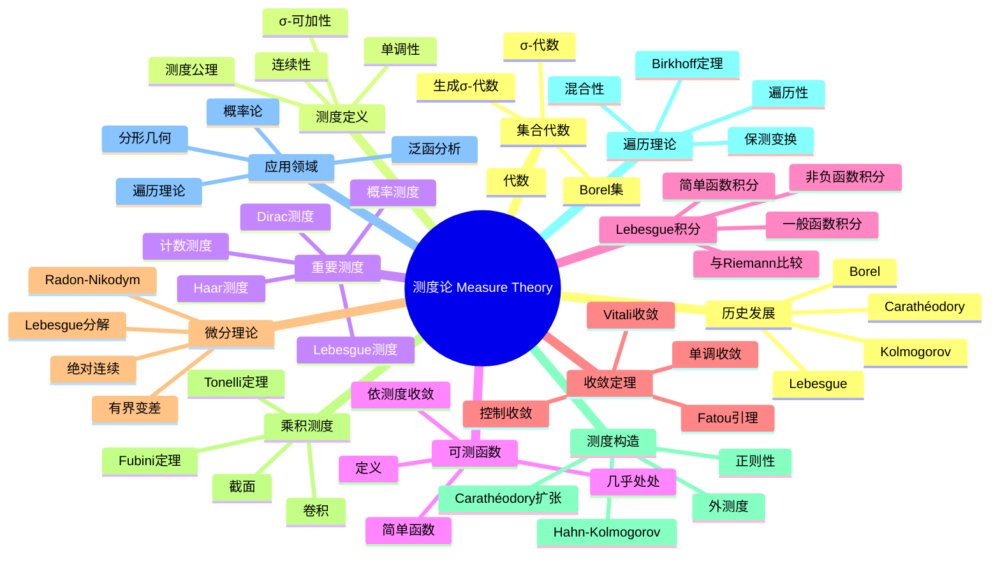

msc_primary: "00A99"
msc_secondary: ['00-00']
---

# 测度论 思维导图

## 中心概念
测度论研究集合的"大小"或"体积"的数学理论，是Lebesgue积分、概率论和现代分析的基础。它推广了长度、面积、体积的概念，处理更一般的集合和函数。

## 核心分支

### 定义与公理
- **σ-代数**: 集合 $X$ 的子集族对补、可数并封闭
- **测度**: 函数 $\mu: \mathcal{A} \to [0, \infty]$ 满足 $\mu(\emptyset) = 0$ 和 $\sigma$-可加性
- **可测函数**: $f^{-1}(B)$ 可测，对所有Borel集 $B$
- **几乎处处**: 除去零测集成立

### 基本性质
- **单调性**: $A \subset B$ 蕴含 $\mu(A) \leq \mu(B)$
- **连续性**: 递增序列的测度极限等于极限的测度
- **次可加性**: $\mu(\bigcup A_n) \leq \sum \mu(A_n)$
- **完备性**: 零测集的子集可测

### 重要例子
- **Lebesgue测度**: $\mathbb{R}^n$ 上的标准测度
- **计数测度**: $\mu(A) = |A|$（元素个数）

- **Dirac测度**: $\delta_x(A) = 1$ 若 $x \in A$，否则为0
- **概率测度**: $\mu(X) = 1$ 的测度
- **Haar测度**: 局部紧群上的平移不变测度

### 核心定理
- **单调收敛定理**: $f_n \uparrow f$ 则 $\int f_n \to \int f$
- **控制收敛定理**: $|f_n| \leq g$ 可积，$f_n \to f$ a.e. 则 $\int f_n \to \int f$

- **Fubini定理**: 重积分化为累次积分（证明思路：单调类定理）
- **Radon-Nikodym定理**: $\nu \ll \mu$ 则 $d\nu = f d\mu$
- **Carathéodory扩张定理**: 半环上的预测度可扩张为测度

### 相关概念
- **父概念**: 实分析、集合论
- **子概念**: 概率论、遍历理论、几何测度论
- **相邻概念**: 积分、泛函分析、拓扑学

### 应用领域
- **概率论**: 随机变量、期望、大数定律
- **泛函分析**: $L^p$空间、分布理论
- **遍历理论**: 动力系统、统计力学
- **分形几何**: Hausdorff测度、分形维数

### 历史发展
- **早期发展**: Jordan内容量、Borel测度
- **创立者**: Henri Lebesgue (1902)《Intégrale, longueur, aire》
- **关键发展**:
  - 1914：Carathéodory外测度方法
  - 1933：Kolmogorov《概率论基础》公理化
  - 1930年代：Haar测度
  - 1950年代：遍历理论发展
- **现代研究**: 几何测度论、最优输运

### 参考资源
- **推荐教材**: Folland《Real Analysis》、Rudin《Real and Complex Analysis》
- **相关论文**: Lebesgue《Intégrale, longueur, aire》(1902)、Kolmogorov《Grundbegriffe der Wahrscheinlichkeitsrechnung》(1933)
- **在线资源**: Terry Tao测度论讲义

---

**概念链接**: [[积分]] [[概率论]] [[泛函分析]] [[遍历理论]] [[实分析]]
