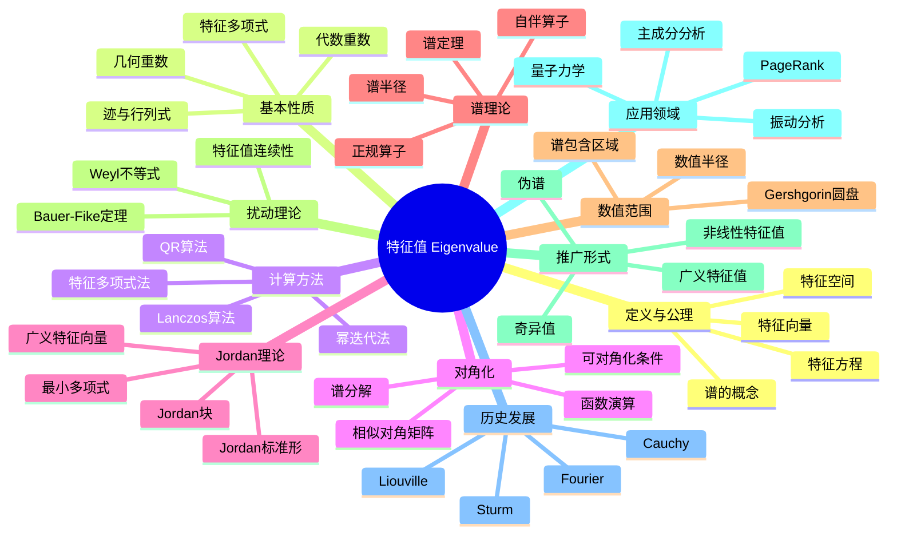

msc_primary: "00A99"
msc_secondary: ['00-00']
---

# 特征值 思维导图

## 中心概念
特征值是线性变换在特定方向上的伸缩因子，满足 $Tv = \lambda v$ 的标量 $\lambda$，是理解线性变换本质特征的关键。

## 核心分支

### 定义与公理
- **形式化定义**: 标量 $\lambda$ 是 $T$ 的特征值若存在非零 $v$ 使 $Tv = \lambda v$
- **特征方程**: $\det(T - \lambda I) = 0$
- **特征多项式**: $p_T(\lambda) = \det(\lambda I - T)$
- **谱**: 所有特征值的集合 $\sigma(T)$

### 基本性质
- **代数重数**: 特征值作为特征多项式根的重数
- **几何重数**: 特征空间的维数 $\dim \ker(T - \lambda I)$
- **迹与行列式**: $\text{tr}(T) = \sum \lambda_i$，$\det(T) = \prod \lambda_i$
- **Cayley-Hamilton**: $p_T(T) = 0$

### 计算方法
- **特征多项式法**: 计算 $\det(\lambda I - A) = 0$ 的根
- **幂迭代法**: $v_{k+1} = Av_k/\|Av_k\|$ 收敛到主特征向量

- **QR算法**: 迭代 QR 分解计算所有特征值
- **Lanczos算法**: 适合大型稀疏对称矩阵

### 核心定理
- **谱定理**: 正规矩阵酉对角化；自伴矩阵正交对角化
- **Jordan标准形定理**: 每个复矩阵相似于唯一的Jordan形
- **Gershgorin圆盘定理**: 特征值位于行/列Gershgorin圆盘的并集中
- **Courant-Fischer极小极大定理**: 对称矩阵特征值的变分刻画
- **Weyl不等式**: 扰动后特征值的变化界限

### 相关概念
- **父概念**: 线性映射、矩阵
- **子概念**: 奇异值、广义特征值、伪谱、谱半径
- **相邻概念**: 对角化、Jordan形、谱理论

### 应用领域
- **振动分析**: 结构模态分析、固有频率
- **主成分分析**: 协方差矩阵特征分解
- **PageRank**: Google的网页排名算法（特征向量）
- **量子力学**: 可观测量本征值对应测量结果

### 历史发展
- **早期发展**: Cauchy (1829) 研究二次型的主轴
- **关键发展**:
  - 1836-1837：Sturm-Liouville理论
  - 1900年代：Hilbert、Schmidt发展积分算子谱理论
  - 1920年代：von Neumann建立量子力学的数学基础
  - 1960年代：QR算法的发展
- **现代研究**: 大规模特征值计算、随机矩阵理论

### 参考资源
- **推荐教材**: Horn-Johnson《Matrix Analysis》、Trefethen《Numerical Linear Algebra》
- **相关论文**: von Neumann《Mathematical Foundations of Quantum Mechanics》
- **在线资源**: LAPACK文档、ARPACK用户指南

---

**概念链接**: [[线性映射]] [[向量空间]] [[泛函分析]] [[数值分析]] [[量子计算]]
