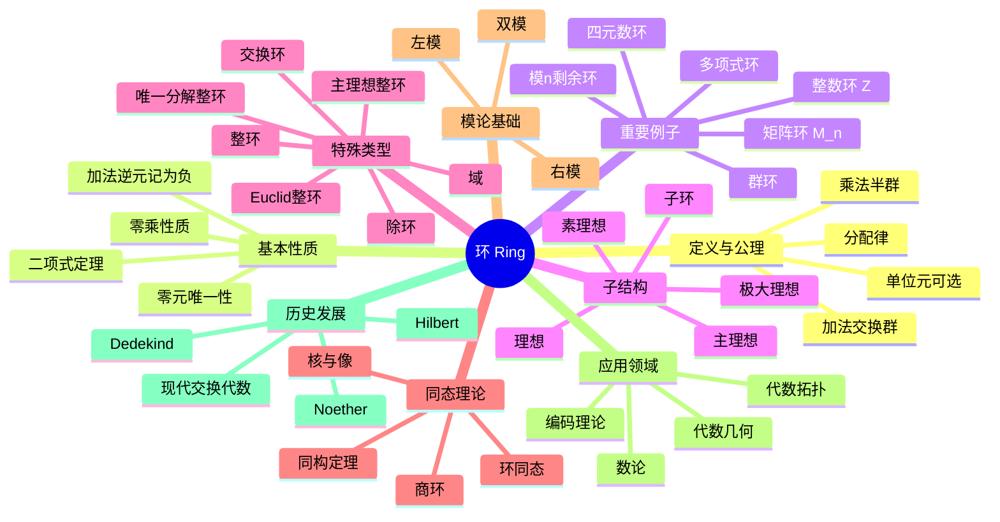

# 环 思维导图

## 中心概念
环是配备了两种二元运算（加法和乘法）的代数结构，关于加法构成交换群，关于乘法构成半群，且满足分配律。

## 核心分支

### 定义与公理
- **形式化定义**: 三元组 $(R, +, \cdot)$，$(R,+)$ 是交换群，$(R,\cdot)$ 是半群，满足左右分配律
- **公理系统**: 加法交换群公理 + 乘法封闭结合 + $a(b+c)=ab+ac$, $(b+c)a=ba+ca$
- **等价定义**: Abel群配备双线性乘法映射

### 基本性质
- **零元唯一性**: 加法单位元0唯一，$0 \cdot a = a \cdot 0 = 0$
- **加法逆元**: 记 $-a$ 为 $a$ 的加法逆元，$(-a)b = a(-b) = -(ab)$
- **零乘性质**: $0 \cdot a = 0$；若 $a \neq 0, b \neq 0$ 但 $ab = 0$，称 $a,b$ 为零因子
- **二项式定理**: $(a+b)^n = \sum_{k=0}^n \binom{n}{k} a^k b^{n-k}$（交换环中成立）

### 重要例子
- **整数环** $\mathbb{Z}$: 最基本的交换环，欧几里得整环
- **多项式环** $R[x]$: 系数在环 $R$ 中的多项式
- **矩阵环** $M_n(R)$: 元素取自环 $R$ 的 $n \times n$ 矩阵（非交换）
- **模n剩余环** $\mathbb{Z}/n\mathbb{Z}$: 当 $n$ 为合数时含有零因子
- **四元数环** $\mathbb{H}$: Hamilton发现的非交换除环
- **群环** $R[G]$: 群 $G$ 在环 $R$ 上的形式线性组合

### 核心定理
- **中国剩余定理**: 若 $I_1, \ldots, I_n$ 两两互素，则 $R/(I_1 \cap \cdots \cap I_n) \cong R/I_1 \times \cdots \times R/I_n$
- **同构基本定理**: $R/\ker \varphi \cong \text{Im}\,\varphi$
- **素理想与整环**: $R/P$ 是整环当且仅当 $P$ 是素理想
- **极大理想与域**: $R/M$ 是域当且仅当 $M$ 是极大理想

### 相关概念
- **父概念**: 群、半环、近环
- **子概念**: 整环、主理想整环、唯一分解整环、欧几里得整环、域、除环
- **相邻概念**: 模、代数、格

### 应用领域
- **代数几何**: 仿射簇的坐标环、概形的结构层
- **数论**: 代数整数环、理想类群
- **编码理论**: 循环码的代数结构
- **代数拓扑**: 上同调环

### 历史发展
- **创立者**: Richard Dedekind (1871)，引入理想概念
- **关键发展**:
  - 1890年代：Hilbert证明基定理
  - 1920年代：Noether建立现代交换代数基础
  - 1950年代：Grothendieck引入概形理论
- **现代研究**: 非交换代数几何、导出代数几何

### 参考资源
- **推荐教材**: Atiyah-Macdonald《Commutative Algebra》、Dummit & Foote《Abstract Algebra》
- **相关论文**: Hilbert基定理(1890)、Noether正规化引理
- **在线资源**: Stacks Project

---

**概念链接**: [[群]] [[域]] [[模]] [[同态与同构]] [[代数几何]]
