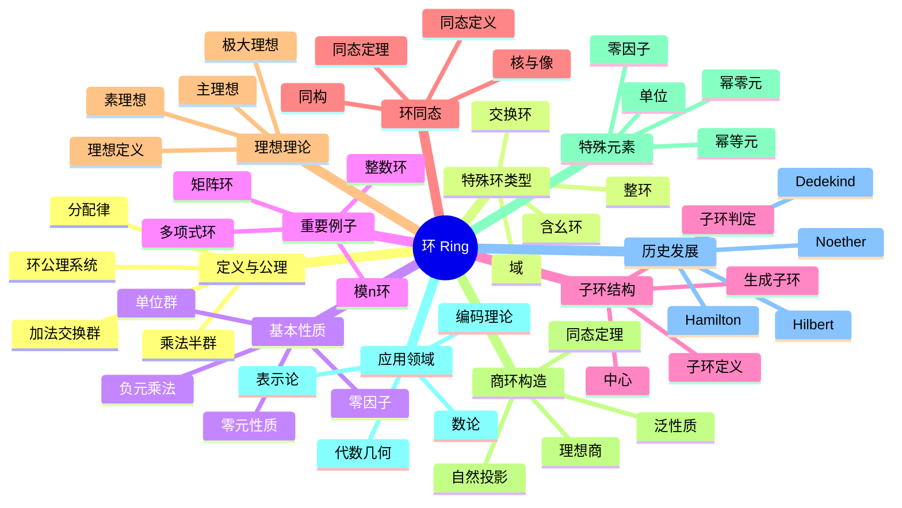

msc_primary: "00A99"
msc_secondary: ['00-XX']
---

# 环 思维导图

## 中心概念

环是配备了两个二元运算（加法和乘法）的代数结构，其中加法构成交换群，乘法满足结合律，且满足分配律。环是代数学的核心结构之一。

## 核心分支

### 定义与公理

- **定义**: $(R, +, \cdot)$ 是环，若：
  - $(R, +)$ 是交换群
  - $(R, \cdot)$ 是半群
  - 分配律: $a(b+c) = ab + ac$，$(b+c)a = ba + ca$
- **含幺环**: 乘法有单位元 $1$
- **交换环**: 乘法交换
- **零环**: $R = \{0\}$

### 特殊环类型

- **整环**: 无零因子的交换含幺环
- **域**: 非零元都可逆的交换环
- **除环**: 非零元都可逆的环（乘法不必须交换）
- **主理想整环**: 每个理想都是主理想的整环

### 基本性质

- **零元**: $0 \cdot a = a \cdot 0 = 0$
- **负元**: $(-a)b = a(-b) = -(ab)$
- **零因子**: 若 $ab = 0$ 但 $a, b \neq 0$，称 $a, b$ 为零因子
- **单位**: 乘法可逆元构成单位群 $R^\times$

### 重要例子

- **整数环**: $(\mathbb{Z}, +, \cdot)$，最基本的环
- **多项式环**: $R[x]$，系数在环 $R$ 中的多项式
- **矩阵环**: $M_n(R)$，$n \times n$ 矩阵
- **模n环**: $\mathbb{Z}/n\mathbb{Z}$，剩余类环
- **四元数环**: $\mathbb{H}$，Hamilton发现的非交换除环

### 理想理论

- **定义**: $I \subseteq R$ 是理想，若对加法封闭，且吸收乘法
- **主理想**: $(a) = Ra = \{ra : r \in R\}$
- **素理想**: $P$ 是素理想，若 $ab \in P \Rightarrow a \in P$ 或 $b \in P$
- **极大理想**: 不被其他真理想包含的理想

### 核心定理

- **同态基本定理**: $R/\ker \varphi \cong \text{Im}\,\varphi$
- **中国剩余定理**: 理想互素时，$R/(I_1 \cap \cdots \cap I_n) \cong R/I_1 \times \cdots \times R/I_n$
- **整环的分式域**: 每个整环可嵌入到域中
- **Hilbert基定理**: 若 $R$ Noether，则 $R[x]$ Noether

### 环同态

- **定义**: 保持加法和乘法的映射 $\varphi: R \to S$
- **核**: $\ker \varphi$ 是 $R$ 的理想
- **像**: $\text{Im}\,\varphi$ 是 $S$ 的子环
- **同构**: 双射同态，$R \cong S$

### 相关概念

- **父概念**: [[代数结构]]
- **子概念**: [[整环]]、[[域]]、[[理想]]、[[子环]]
- **相邻概念**: [[群]]、[[模]]、[[代数]]

### 应用领域

- **代数几何**: 环的谱、代数簇
- **数论**: 代数整数环、类域论
- **编码理论**: 循环码、代数几何码
- **表示论**: 群代数、模表示

### 历史发展

- **Hamilton (1843)**: 发现四元数，第一个非交换除环
- **Dedekind (1870s)**: 理想理论的基础
- **Hilbert (1890s)**: Hilbert基定理，不变量理论
- **Noether (1920s)**: 抽象代数的系统化，理想理论的公理化

---

**概念链接**: [[群]] [[整环]] [[域]] [[理想]] [[子环]] [[环同态]]
