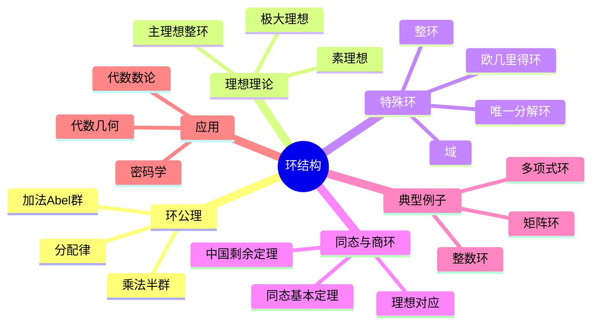

# 环结构 思维导图

## 中心概念

### 精确定义

**环** $(R, +, \cdot)$ 是一个集合 $R$ 配以两个二元运算：加法构成Abel群，乘法构成半群，且满足分配律。环是同时具有"加法"和"乘法"两种运算的代数结构，是整数运算性质的抽象。

### 直观理解

环是"类整数"的代数结构——可以相加、相减、相乘，但不一定能相除。环论研究多项式、矩阵、代数整数等对象的共同性质，是交换代数与代数几何的基础。

---

## 第一层分支：核心要素

### 环公理

- **加法群**：$(R, +)$ 是Abel群
- **乘法半群**：$(R, \cdot)$ 是半群（结合律）
- **分配律**：$a(b+c) = ab + ac$，$(b+c)a = ba + ca$

### 特殊环类型

- **交换环**：乘法交换 $ab = ba$
- **含幺环**：乘法有单位元 $1$
- **整环**：无零因子的交换含幺环
- **除环**：非零元都有乘法逆（非交换的域）
- **域**：交换除环

### 理想

- **定义**：子加群 $I \subseteq R$，满足 $RI \subseteq I$，$IR \subseteq I$
- **主理想**：由一个元素生成的理想 $(a) = Ra$
- **素理想**：$P \neq R$，$ab \in P$ $\Rightarrow$ $a \in P$ 或 $b \in P$
- **极大理想**：不存在严格包含它的真理想
- **理想运算**：交、和、积、根理想 $\sqrt{I}$

### 商环与同态

- **同态**：$\phi: R \to S$ 保持加法和乘法
- **核**：$\ker \phi$，是 $R$ 的理想
- **商环**：$R/I$，陪集 $a + I$ 的集合
- **同态基本定理**：$R/\ker \phi \cong \operatorname{im} \phi$

---

## 第二层分支：性质与定理

### 重要性质

#### 1. 基本性质

- **零乘法**：$0 \cdot a = a \cdot 0 = 0$
- **负号性质**：$(-a)b = a(-b) = -(ab)$
- **分配律推广**：$a(b_1 + \cdots + b_n) = ab_1 + \cdots + ab_n$

#### 2. 可逆元与零因子

- **单位群**：$R^\times = \{u \in R : \exists v, uv = vu = 1\}$
- **零因子**：$a \neq 0$ 但 $\exists b \neq 0$ 使 $ab = 0$
- **整环性质**：无零因子 $\Leftrightarrow$ 消去律成立

### 核心定理

#### 1. 理想与商环的基本对应

- **理想对应定理**：$R$ 的包含 $I$ 的理想与 $R/I$ 的理想一一对应
- **第三同构定理**：$(R/I)/(J/I) \cong R/J$（$I \subseteq J$）

#### 2. 中国剩余定理（环论形式）

- **条件**：理想 $I_1, \ldots, I_n$ 两两互素（$I_i + I_j = R$）
- **内容**：$R/(I_1 \cap \cdots \cap I_n) \cong R/I_1 \times \cdots \times R/I_n$
- **应用**：整数模运算、多项式插值

#### 3. 整环的特殊性质

##### 素元与不可约元

- **不可约元**：$p$ 非零非单位，$p = ab$ $\Rightarrow$ $a$ 或 $b$ 是单位
- **素元**：$p | ab$ $\Rightarrow$ $p | a$ 或 $p | b$
- **关系**：素元必不可约，反之需额外条件

##### 唯一分解整环（UFD）

- **定义**：每个非零非单位元素唯一分解为素元乘积（不计次序和单位）
- **例子**：$\mathbb{Z}$，$F[x]$，主理想整环
- **非UFD例子**：$\mathbb{Z}[\sqrt{-5}]$（$6 = 2 \cdot 3 = (1+\sqrt{-5})(1-\sqrt{-5})$）

#### 4. 主理想整环（PID）与欧几里得整环

- **PID**：每个理想都是主理想的整环
- **欧几里得整环**：有带余除法的整环
- **关系**：欧几里得整环 $\subseteq$ PID $\subseteq$ UFD $\subseteq$ 整环
- **例子**：$\mathbb{Z}$，$F[x]$，$\mathbb{Z}[i]$，$\mathbb{Z}[\omega]$（Eisenstein整数）

---

## 第三层分支：例子与应用

### 典型例子

#### 1. 数环

- **整数环**：$\mathbb{Z}$，最基本的环
- **代数整数环**：如 $\mathbb{Z}[\sqrt{d}]$，$\mathbb{Z}[\omega]$
- **局部化**：$\mathbb{Z}_{(p)} = \{a/b : p \nmid b\}$

#### 2. 多项式环

- **一元多项式**：$R[x]$，系数在 $R$ 中
- **多元多项式**：$R[x_1, \ldots, x_n]$
- **形式幂级数**：$R[[x]]$

#### 3. 矩阵环

- **$M_n(R)$**：$n \times n$ 矩阵环
- **性质**：非交换（$n \geq 2$），有零因子

#### 4. 群环

- **定义**：$R[G]$，形式和 $\sum_{g \in G} r_g g$
- **乘法**：群乘法与分配律结合
- **应用**：表示论

### 反例

#### 1. 非整环的例子

- **$\mathbb{Z}_6$**：$2 \cdot 3 = 0$，有零因子
- **$M_2(\mathbb{R})$**：非零矩阵乘积可为零

#### 2. 整环但非UFD

- **$\mathbb{Z}[\sqrt{-5}]$**：非唯一分解
- **不变因子**：类数衡量"非唯一性"程度

### 应用场景

#### 1. 代数几何

- **坐标环**：仿射簇 $V$ 的多项式函数环 $k[V]$
- **Hilbert零点定理**：代数集与根理想的一一对应
- **Spec函子**：从环构造概形

#### 2. 代数数论

- **代数整数环**：数域的整数环 $\mathcal{O}_K$
- **素理想分解**：$(p) = P_1^{e_1} \cdots P_g^{e_g}$
- **类数**：衡量唯一分解失效程度

#### 3. 编码理论

- **循环码**：$\mathbb{F}_q[x]/(x^n-1)$ 的理想
- **BCH码**：基于有限域扩张的纠错码
- **格密码**：基于环上困难问题

#### 4. 密码学

- **RSA**：基于 $\mathbb{Z}_n^*$ 的结构
- **椭圆曲线**：基于椭圆曲线群和环结构
- **多项式环**：NTRU密码系统

---

## 第四层分支：关联概念

### 相似概念

#### 模（环上的线性空间）

- **定义**：Abel群 $M$ 配以环 $R$ 的作用
- **自由模**：有基的模（类比向量空间）
- **关系**：模是环上的"向量空间"

#### 格

- **定义**：偏序集中任意两元素有上确界和下确界
- **分配格**：满足分配律的格
- **Boole代数**：特殊的分配格

### 对偶概念

#### 分式域

- **构造**：整环 $R$ 的分式域 $\operatorname{Frac}(R)$
- **泛性质**：$R$ 到域的嵌入的泛性质
- **例子**：$\operatorname{Frac}(\mathbb{Z}) = \mathbb{Q}$，$\operatorname{Frac}(F[x]) = F(x)$

### 推广概念

#### 非交换代数

- **中心单代数**：中心是域的有限维单代数
- **四元数代数**：$\left(\frac{a,b}{F}\right)$
- **Brauer群**：中心单代数的相似类

#### 同调代数

- **投射模**：$\operatorname{Hom}(P, -)$ 正合
- **内射模**：$\operatorname{Hom}(-, I)$ 正合
- **平坦模**：张量积保持正合

#### 交换代数进阶

- **Noether环**：理想升链满足ACC
- **Hilbert基定理**：$R$ Noether $\Rightarrow$ $R[x]$ Noether
- **维数理论**：Krull维数、高度、深度
- **完备化**：$\mathfrak{m}$-adic完备化

---

## Mermaid思维导图

---

**参考章节**：抽象代数 - 第2章 环论
**关联文件**：群结构-思维导图.md、域扩张-思维导图.md
