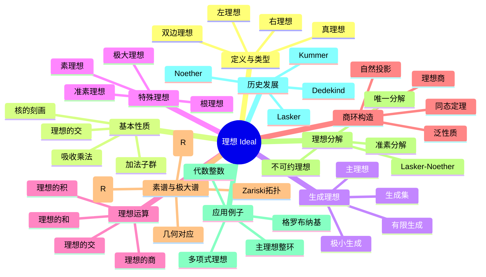

msc_primary: "00A99"
msc_secondary: ['00-XX']
---

# 理想 思维导图

## 中心概念
理想是环的特殊子集，对加法封闭且吸收乘法。理想是构造商环的基础，对应于群论中的正规子群概念。

## 核心分支

### 定义与类型
- **双边理想**: $I \subseteq R$，满足 $I$ 是加法子群，且 $RI \subseteq I$，$IR \subseteq I$
- **左理想**: $RI \subseteq I$
- **右理想**: $IR \subseteq I$
- **真理想**: $I \neq R$（等价于 $1 \notin I$）

### 生成理想
- **主理想**: $(a) = RaR = \{rab : r \in R\}$（双边情形）
- **有限生成**: $I = (a_1, \ldots, a_n) = Ra_1R + \cdots + Ra_nR$
- **生成集**: 包含给定集合的最小理想
- **理想的和**: $I + J = \{a + b : a \in I, b \in J\}$

### 特殊理想
- **素理想**: $P$ 是素理想，若 $ab \in P \Rightarrow a \in P$ 或 $b \in P$
- **极大理想**: 不被其他真理想包含的真理想
- **准素理想**: $ab \in Q$，$a \notin Q$ $\Rightarrow$ $b^n \in Q$（对某个 $n$）
- **根理想**: $\sqrt{I} = \{r : r^n \in I$（对某个 $n$）$\}$

### 理想分解
- **准素分解**: 每个理想可表示为准素理想的交
- **Lasker-Noether定理**: Noether环中的理想有准素分解
- **唯一性**: 相伴素理想的唯一性
- **不可约理想**: 不能表示为两个真包含理想的交

### 核心定理
- **同态基本定理**: $R/\ker \varphi \cong \text{Im}\,\varphi$
- **素理想与整环**: $P$ 是素理想 $\Leftrightarrow$ $R/P$ 是整环
- **极大理想与域**: $M$ 是极大理想 $\Leftrightarrow$ $R/M$ 是域
- **中国剩余定理**: 互素理想的商同构于直积

### 素谱与几何
- **素谱**: $\text{Spec}(R) = \{R$ 的所有素理想$\}$
- **Zariski拓扑**: 闭集为 $V(I) = \{P \in \text{Spec}(R) : I \subseteq P\}$
- **几何对应**: 代数簇与根理想的对应
- **层论**: 结构层 $\mathcal{O}_{\text{Spec}(R)}$

### 重要例子
- **整数环**: $(n) = n\mathbb{Z}$，素理想 $(p)$，$p$ 为素数
- **多项式环**: $(x, y)$ 在 $k[x,y]$ 中是极大理想
- **主理想整环**: 每个理想都是主理想
- **零理想**: $(0)$ 是素理想当且仅当 $R$ 是整环

### 相关概念
- **父概念**: [[环]]、[[子环]]
- **子概念**: [[素理想]]、[[极大理想]]、[[主理想]]
- **相邻概念**: [[商环]]、[[环同态]]、[[整环]]

### 应用领域
- **代数几何**: 代数簇与理想的对应
- **数论**: 代数整数环的理想分解
- **计算代数**: Gröbner基、理想计算
- **代数拓扑**: 上同调环、理想层

### 历史发展
- **Kummer (1840s)**: 理想数的概念，解决唯一分解问题
- **Dedekind (1870s)**: 理想理论的公理化
- **Lasker (1905)**: 多项式环的准素分解
- **Noether (1921)**: Lasker-Noether定理，抽象理想理论

---

**概念链接**: [[环]] [[子环]] [[商环]] [[素理想]] [[极大理想]] [[主理想整环]]
