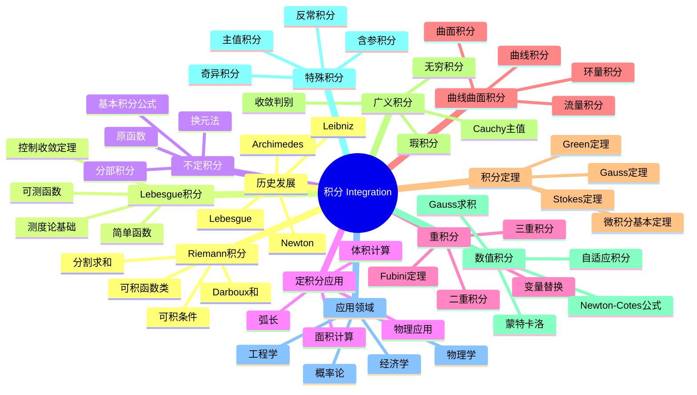

# 积分 思维导图

## 中心概念
积分是微积分的另一核心概念，与导数构成逆运算关系（微积分基本定理）。它既是求面积、体积的几何工具，也是物理学、概率论和工程中的基本运算。

## 核心分支

### 定义与公理
- **Riemann积分**: $\int_a^b f(x)dx = \lim_{\|P\| \to 0} \sum_{i=1}^n f(\xi_i)\Delta x_i$
- **Lebesgue积分**: 对可测函数 $f$，$\int f d\mu = \sup\{\int s d\mu: 0 \leq s \leq f, s \text{ 简单}\}$
- **不定积分**: $F(x) = \int_a^x f(t)dt$，即原函数族
- **微积分基本定理**: $\frac{d}{dx}\int_a^x f(t)dt = f(x)$；$\int_a^b F'(x)dx = F(b) - F(a)$

### 基本性质
- **线性性**: $\int (af + bg) = a\int f + b\int g$
- **区间可加性**: $\int_a^b + \int_b^c = \int_a^c$
- **保序性**: $f \leq g$ 蕴含 $\int f \leq \int g$
- **绝对可积**: $|\int f| \leq \int |f|$

### 重要例子
- **基本积分**: $\int x^n dx = \frac{x^{n+1}}{n+1}$，$\int e^x dx = e^x$，$\int \frac{1}{x}dx = \ln|x|$
- **三角积分**: $\int \sin x dx = -\cos x$，$\int \sec^2 x dx = \tan x$
- **特殊函数**: Gamma函数 $\Gamma(z) = \int_0^\infty t^{z-1}e^{-t}dt$
- **Dirichlet积分**: $\int_0^\infty \frac{\sin x}{x}dx = \frac{\pi}{2}$
- **Gauss积分**: $\int_{-\infty}^\infty e^{-x^2}dx = \sqrt{\pi}$

### 核心定理
- **微积分基本定理**: 连接微分与积分（证明思路：中值定理）
- **控制收敛定理**: $f_n \to f$ a.e.，$|f_n| \leq g$ 可积，则 $\int f_n \to \int f$
- **Fubini定理**: 重积分化为累次积分（证明思路：单调类定理）
- **变量替换公式**: $\int_{\phi(a)}^{\phi(b)} f = \int_a^b (f \circ \phi)\phi'$
- **Newton-Leibniz公式**: $F' = f$ 则 $\int_a^b f = F(b) - F(a)$

### 相关概念
- **父概念**: 极限、连续性、测度论
- **子概念**: 曲线积分、曲面积分、Stokes定理、微分形式
- **相邻概念**: 导数、级数、概率分布

### 应用领域
- **概率论**: 期望、方差、概率密度
- **物理学**: 功、能量、质心、转动惯量
- **工程学**: 信号处理、系统响应
- **经济学**: 消费者剩余、生产者剩余

### 历史发展
- **古代**: Archimedes穷竭法求抛物线面积
- **创立者**: Newton和Leibniz独立发明（17世纪末）
- **严格化**:
  - 1854：Riemann积分定义
  - 1902：Lebesgue创立测度论积分
  - 1913：Radon推广到一般测度空间
- **现代发展**: 非交换积分、量子随机积分

### 参考资源
- **推荐教材**: Rudin《Real and Complex Analysis》、Folland《Real Analysis》
- **相关论文**: Lebesgue《Intégrale, longueur, aire》(1902)
- **在线资源**: 3Blue1Brown积分可视化

---

**概念链接**: [[导数]] [[测度论]] [[微分方程]] [[概率论]] [[泛函分析]]
