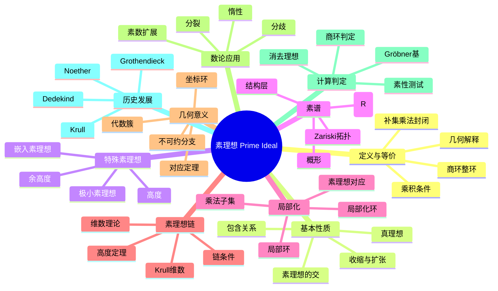

# 素理想 思维导图

## 中心概念
素理想是环论中的核心概念，对应于整数中的素数。素理想 $P$ 满足：若乘积 $ab \in P$，则 $a \in P$ 或 $b \in P$。素理想在代数几何中对应于不可约子簇。

## 核心分支

### 定义与等价条件
- **定义**: $P$ 是真理想，若 $ab \in P$ 则 $a \in P$ 或 $b \in P$
- **商环条件**: $P$ 是素理想 $\Leftrightarrow$ $R/P$ 是整环
- **补集条件**: $R \setminus P$ 是乘法子集
- **几何解释**: 对应不可约子簇

### 基本性质
- **真理想**: 素理想必是真理想（$P \neq R$）
- **包含关系**: 若 $P \subseteq Q$ 且 $Q$ 素，则 $P$ 未必素
- **素理想的交**: 素理想的交不一定是素理想
- **扩张与收缩**: 素理想的扩张和收缩性质

### 素谱
- **素谱**: $\text{Spec}(R) = \{R$ 的所有素理想$\}$
- **Zariski拓扑**: 闭集为 $V(I) = \{P \in \text{Spec}(R) : I \subseteq P\}$
- **结构层**: $\mathcal{O}_{\text{Spec}(R)}$，局部环的层
- **概形**: 局部环化空间 $(\text{Spec}(R), \mathcal{O}_{\text{Spec}(R)})$

### 维数理论
- **Krull维数**: 素理想链的最大长度
- **高度**: $\text{ht}(P)$ = 终止于 $P$ 的素理想链的最大长度
- **余高度**: $\text{coht}(P) = \dim(R/P)$
- **维数公式**: $\text{ht}(P) + \dim(R/P) \leq \dim(R)$

### 局部化
- **乘法子集**: $S \subseteq R$ 对乘法封闭，$1 \in S$
- **局部化**: $S^{-1}R = \{r/s : r \in R, s \in S\}$
- **素理想对应**: $\text{Spec}(S^{-1}R) \leftrightarrow \{P \in \text{Spec}(R) : P \cap S = \emptyset\}$
- **局部环**: 只有一个极大理想的环

### 核心定理
- **素理想存在**: 每个非零环都有极大理想，从而是素理想
- **Krull高度定理**: 真理想的高度不超过生成元个数
- **Noether正规化**: 有限生成代数的维数理论
- **对应定理**: 素理想与代数几何对象的对应

### 重要例子
- **整数环**: $\text{Spec}(\mathbb{Z}) = \{(0)\} \cup \{(p) : p$ 素数$\}$
- **多项式环**: $k[x]$ 的素理想为 $(0)$ 和 $(f)$，$f$ 不可约
- **多元多项式**: $k[x,y]$ 的素理想更复杂，有 $(0), (f), (x-a, y-b)$
- **坐标环**: 代数簇坐标环的素理想对应子簇

### 几何意义
- **代数簇**: $V(P)$ 是不可约代数簇
- **不可约分支**: 代数簇的不可约分支对应极小素理想
- **点对应**: $k^n$ 中的点对应极大理想 $(x_1-a_1, \ldots, x_n-a_n)$
- **结构层**: 在素理想处的茎是局部环

### 数论应用
- **素数扩展**: 素数在代数整数环中的分解
- **分歧**: 素理想分解中的重数
- **惰性**: 素数保持为素理想
- **分裂**: 素数分解为不同素理想的乘积

### 相关概念
- **父概念**: [[理想]]
- **子概念**: [[极大理想]]、[[极小素理想]]、[[嵌入素理想]]
- **相邻概念**: [[整环]]、[[局部化]]、[[Zariski拓扑]]

### 应用领域
- **代数几何**: 概形理论的基础
- **数论**: 代数数论中的素理想分解
- **交换代数**: 维数理论、深度理论
- **表示论**: 素理想与表示的联系

### 历史发展
- **Dedekind (1870s)**: 代数整数环的素理想
- **Noether (1920s)**: 抽象素理想理论
- **Krull (1930s)**: 局部环、维数理论
- **Grothendieck (1960s)**: 概形理论，素谱的几何化

---

**概念链接**: [[理想]] [[极大理想]] [[整环]] [[局部化]] [[Zariski拓扑]] [[概形]]
