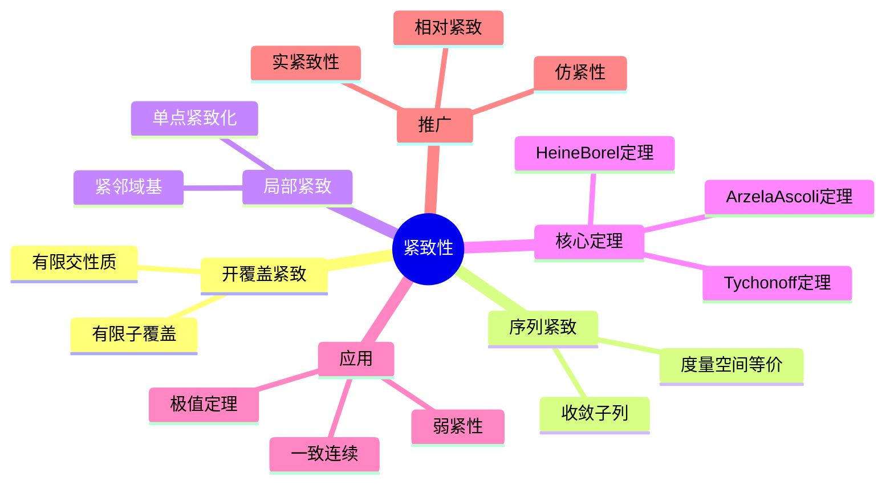

msc_primary: "00A99"
msc_secondary: ['00-XX']
---

# 紧致性 思维导图

## 中心概念

### 精确定义

**紧致性**是拓扑学中最重要的性质之一。拓扑空间 $X$ 称为紧致的，如果每个开覆盖都有有限子覆盖。形式上，若 $X = \bigcup_{i \in I} U_i$（$U_i$ 开），则存在有限子集 $J \subseteq I$ 使 $X = \bigcup_{j \in J} U_j$。

### 直观理解

紧致性是"有限性"在拓扑中的推广。紧致集上的连续函数有界且能达到最值（类似闭区间的性质）；紧致空间上的序列有收敛子列（类似有界序列）；紧致性保证了从局部到整体的过渡。

---

## 第一层分支：核心要素

### 开覆盖紧致性

- **开覆盖**：开集族覆盖全空间
- **有限子覆盖**：有限个开集仍能覆盖
- **紧致定义**：每个开覆盖都有有限子覆盖
- **子集紧致性**：子集在子空间拓扑下紧致

### 序列紧致性

- **定义**：每个序列都有收敛子列
- **与紧致性关系**：
  - 度量空间中：紧致 $\Leftrightarrow$ 序列紧致 $\Leftrightarrow$ 自列紧（闭且序列紧致）
  - 一般拓扑空间：紧致 $\nRightarrow$ 序列紧致（需额外条件）
- **可数紧致性**：每个可数开覆盖有有限子覆盖

### 局部紧致性

- **定义**：每点有紧邻域基
- **性质**：局部紧Hausdorff空间类似于有限维流形
- **单点紧致化**：局部紧非紧空间可一点紧化
  - 例如：$\mathbb{R}$ 的单点紧化为 $S^1$
  - $\mathbb{R}^n$ 的单点紧化为 $S^n$

### 紧致化

- **紧致化**：将空间嵌入紧致空间作为稠密子集
- **一点紧致化（Alexandroff）**：局部紧空间的紧致化
- **Stone-Čech紧致化**：$\beta X$，最大的Hausdorff紧致化
- **端点紧致化**：Freudenthal紧致化

---

## 第二层分支：性质与定理

### 重要性质

#### 1. 紧致性的基本性质

- **闭子集性质**：Hausdorff空间中紧致子集是闭集
- **有限交性质**：$X$ 紧致 $\Leftrightarrow$ 具有有限交性质的闭集族有非空交
- **连续像**：紧致空间的连续像是紧致的
- **积空间性质**：有限积紧致空间的积是紧致的（Tychonoff定理推广）

#### 2. 度量空间中的紧致性

- **全有界性**：$\forall \epsilon > 0$，存在有限 $\epsilon$-网
- **完全有界+完备**：度量空间紧致 $\Leftrightarrow$ 全有界且完备
- **Lebesgue数**：紧致度量空间的开覆盖有Lebesgue数
- **等度连续**：Arzelà-Ascoli定理刻画紧子集

### 核心定理

#### 1. Tychonoff定理

- **内容**：任意多（甚至不可数多）紧致空间的积空间紧致
- **等价于**：选择公理
- **应用**：证明无限维空间的紧性（如 $\{0,1\}^I$，$[0,1]^I$）
- **证明方法**：Alexander子基定理

#### 2. Heine-Borel定理

- **内容**：$\mathbb{R}^n$ 的子集紧致 $\Leftrightarrow$ 闭且有界
- **适用范围**：有限维赋范空间
- **反例**：无限维中闭单位球不紧（Riesz引理）
- **意义**：有限维与无限维的本质区别

#### 3. 极值定理

- **内容**：紧致空间上的实值连续函数有界且能取到最大最小值
- **应用**：优化问题解的存在性
- **推广**：上半连续函数取到最大值

#### 4. Arzelà-Ascoli定理

- **内容**：函数空间子集紧致的刻画
- **条件**：等度连续 + 逐点有界 + 闭包完备
- **应用**：微分方程解的存在性（Peano定理）
- **度量形式**：$C(K)$ 中子集紧 $\Leftrightarrow$ 等度连续+一致有界

#### 5. 一致连续性定理

- **内容**：紧致度量空间上的连续函数必一致连续
- **意义**：紧致性保证了连续性"一致"化
- **应用**：积分估计、逼近理论

---

## 第三层分支：例子与应用

### 典型例子

#### 1. 紧致空间

- **闭区间**：$[a, b] \subset \mathbb{R}$（Heine-Borel）
- **球面**：$S^n \subset \mathbb{R}^{n+1}$
- **环面**：$T^n = S^1 \times \cdots \times S^1$
- **Cantor集**：$[0,1]$ 中的三分集，完全不连通紧致集

#### 2. 非紧致空间

- **欧氏空间**：$\mathbb{R}^n$（无界）
- **开区间**：$(0,1)$（非闭）
- **离散无限集**：离散拓扑的无限集
- **无限维球面**：单位球在非自反Banach空间中不紧

#### 3. 局部紧非紧空间

- **欧氏空间**：$\mathbb{R}^n$
- **局部紧群**：如 $GL_n(\mathbb{R})$，非紧但局部紧
- **树（图论）**：无限树

### 反例

#### 1. 序列紧致但不紧致

- **第一不可数序数空间**：$[0, \omega_1)$ 序列紧致但非紧致
- **说明**：紧致性比序列紧致性更强

#### 2. 紧致但不序列紧致

- **$\{0,1\}^{\mathbb{R}}$**：紧致（Tychonoff）但无收敛序列（离散积）
- **说明**：需要网的收敛性

### 应用场景

#### 1. 分析学

- **函数逼近**：Weierstrass逼近定理
- **积分理论**：Riesz表示定理（正线性泛函）
- **谱理论**：紧致算子的谱理论
- **变分法**：直接法（泛函在紧集上取极值）

#### 2. 代数几何

- **射影簇**：射影空间的闭子集紧致（Zariski拓扑+经典拓扑）
- **紧Riemann面**：代数曲线
- **族的研究**：模空间的紧化

#### 3. 动力系统

- **不变测度**：紧致空间上的连续映射有不变测度（Krylov-Bogolyubov）
- **极小集**：紧致不变集的极小子集
- **结构稳定性**：双曲系统的稳定性

#### 4. 泛函分析

- **弱*紧性**：Banach-Alaoglu定理（单位球弱*紧）
- **自反空间**：单位球弱紧 $\Leftrightarrow$ 自反
- **算子理论**：紧致算子的Fredholm理论

---

## 第四层分支：关联概念

### 相似概念

#### 可数紧致性

- **定义**：每个可数开覆盖有有限子覆盖
- **关系**：紧致 $\Rightarrow$ 可数紧致 $\Rightarrow$ 序列紧致
- **度量空间**：三者等价

#### 伪紧性

- **定义**：每个连续实函数有界
- **关系**：紧致 $\Rightarrow$ 可数紧致 $\Rightarrow$ 伪紧
- **正规空间**：可数紧致 $\Leftrightarrow$ 伪紧

#### 林德勒夫性质

- **定义**：每个开覆盖有可数子覆盖
- **关系**：紧致 $\Rightarrow$ 林德勒夫
- **度量空间**：可分 $\Leftrightarrow$ 林德勒夫 $\Leftrightarrow$ 第二可数

### 对偶概念

#### 仿紧性

- **定义**：每个开覆盖有局部有限的开加细
- **意义**：单位分解的存在性
- **度量空间**：度量空间仿紧
- **应用**：微分几何（流形的单位分解）

### 推广概念

#### 相对紧致性

- **定义**：闭包紧致
- **应用**：分布理论、广义函数
- **Montel空间**：有界集相对紧致的局部凸空间

#### 实紧致性

- **定义**：嵌入到某 $\mathbb{R}^I$ 作为闭子集
- **关系**：紧致 $\Rightarrow$ 实紧致
- **Hewitt实紧致化**：实紧空间的最大紧致化

#### 序紧致性

- **Dedekind完备性**：序拓扑中的紧致性
- **应用**：序理论、逻辑学

---

## Mermaid思维导图

---

**参考章节**：拓扑学 - 第3章 紧致性
**关联文件**：拓扑空间-思维导图.md、连通性-思维导图.md
