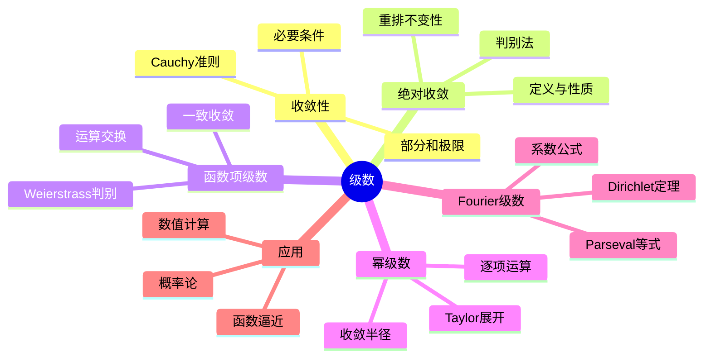

msc_primary: "00A99"
msc_secondary: ['00-00']
---

# 级数 思维导图

## 中心概念

### 精确定义

**级数**是无穷多个数的"求和"，形式为 $\sum_{n=1}^{\infty} a_n = a_1 + a_2 + a_3 + \cdots$。其和定义为部分和序列 $S_N = \sum_{n=1}^N a_n$ 的极限：$\sum_{n=1}^{\infty} a_n = \lim_{N \to \infty} S_N$（若极限存在）。

### 直观理解

级数将离散的无穷求和转化为极限过程。收敛级数的"尾部"贡献趋于零，使得无穷求和有确定的意义。级数是研究函数、解方程、进行数值计算的重要工具。

---

## 第一层分支：核心要素

### 收敛性

- **定义**：$\sum a_n$ 收敛 $\Leftrightarrow$ 部分和序列 $\{S_N\}$ 收敛
- **Cauchy准则**：$\forall \epsilon > 0, \exists N$，当 $m > n > N$ 时，$|\sum_{k=n+1}^m a_k| < \epsilon$

- **必要条件**：$\sum a_n$ 收敛 $\Rightarrow$ $a_n \to 0$（逆否命题用于判断发散）
- **余项**：$R_N = \sum_{n=N+1}^{\infty} a_n$，收敛时 $R_N \to 0$

### 绝对收敛

- **定义**：$\sum |a_n|$ 收敛

- **性质**：绝对收敛 $\Rightarrow$ 收敛（逆否：发散 $\Rightarrow$ 不绝对收敛）
- **重排不变性**：绝对收敛级数任意重排后收敛于同一和
- **比较**：条件收敛级数重排可能改变和（Riemann重排定理）

### 一致收敛

- **函数项级数**：$\sum_{n=1}^{\infty} f_n(x)$
- **一致收敛定义**：$\forall \epsilon > 0, \exists N$，当 $n > N$ 时对所有 $x$ 有 $|S(x) - S_n(x)| < \epsilon$
- **Weierstrass M-判别法**：$|f_n(x)| \leq M_n$，$\sum M_n$ 收敛 $\Rightarrow$ 一致收敛

- **性质**：一致收敛的连续函数列极限连续

### 幂级数

- **形式**：$\sum_{n=0}^{\infty} a_n (x - x_0)^n$
- **收敛半径**：$R = \frac{1}{\limsup_{n \to \infty} \sqrt[n]{|a_n|}}$（或 $\lim |\frac{a_n}{a_{n+1}}|$）

- **收敛区间**：$(x_0 - R, x_0 + R)$，端点需单独判断
- **Abel定理**：幂级数在收敛区间端点收敛，则在闭区间上一致收敛

---

## 第二层分支：性质与定理

### 重要性质

#### 1. 正项级数判别法

- **比较判别法**：$0 \leq a_n \leq b_n$，$\sum b_n$ 收敛 $\Rightarrow$ $\sum a_n$ 收敛
- **比值判别法（d'Alembert）**：$\lim |\frac{a_{n+1}}{a_n}| = L$，$L < 1$ 收敛，$L > 1$ 发散
- **根值判别法（Cauchy）**：$\lim \sqrt[n]{|a_n|} = L$，$L < 1$ 收敛，$L > 1$ 发散

- **积分判别法**：$\sum f(n)$ 与 $\int_1^{\infty} f(x)dx$ 同敛散（$f$ 正递减）
- **p-级数**：$\sum \frac{1}{n^p}$，$p > 1$ 收敛，$p \leq 1$ 发散

#### 2. 一般项级数判别法

- **Leibniz判别法**：交错级数 $\sum (-1)^n a_n$（$a_n \searrow 0$）必收敛
- **Dirichlet判别法**：$\sum a_n b_n$，$S_N = \sum_{n=1}^N a_n$ 有界，$b_n \searrow 0$ $\Rightarrow$ 收敛
- **Abel判别法**：$\sum a_n$ 收敛，$b_n$ 单调有界 $\Rightarrow$ $\sum a_n b_n$ 收敛

#### 3. 级数运算

- **线性运算**：$\sum (\alpha a_n + \beta b_n) = \alpha \sum a_n + \beta \sum b_n$
- **Cauchy乘积**：$(\sum a_n)(\sum b_n) = \sum_{n=0}^{\infty} \sum_{k=0}^n a_k b_{n-k}$
- **Mertens定理**：若至少一个绝对收敛，则Cauchy乘积收敛于正确值

### 核心定理

#### 1. Riemann重排定理

- **内容**：条件收敛级数可通过重排收敛到任意实数或发散
- **意义**：条件收敛和依赖于求和顺序
- **对比**：绝对收敛级数重排后和不变

#### 2. 一致收敛与运算交换

- **连续性**：一致收敛的连续函数项级数和连续
- **逐项积分**：一致收敛 $\Rightarrow$ $\int \sum f_n = \sum \int f_n$
- **逐项求导**：更强的条件（如导函数级数一致收敛）保证 $(\sum f_n)' = \sum f_n'$

#### 3. Taylor级数与展开

- **Taylor级数**：$f(x) = \sum_{n=0}^{\infty} \frac{f^{(n)}(a)}{n!}(x-a)^n$
- **展开条件**：余项趋于零
- **常见展开**：
  - $e^x = \sum_{n=0}^{\infty} \frac{x^n}{n!}$
  - $\sin x = \sum_{n=0}^{\infty} \frac{(-1)^n x^{2n+1}}{(2n+1)!}$
  - $\ln(1+x) = \sum_{n=1}^{\infty} \frac{(-1)^{n-1} x^n}{n}$（$|x| < 1$）

#### 4. Fourier级数

- **形式**：$f(x) \sim \frac{a_0}{2} + \sum_{n=1}^{\infty} (a_n \cos nx + b_n \sin nx)$
- **系数公式**：$a_n = \frac{1}{\pi}\int_{-\pi}^{\pi} f(x)\cos nx dx$，$b_n$ 类似
- **收敛性**：Dirichlet定理（分段光滑函数点态收敛）
- **Parseval等式**：$\frac{1}{\pi}\int_{-\pi}^{\pi} |f|^2 = \frac{a_0^2}{2} + \sum(a_n^2 + b_n^2)$

---

## 第三层分支：例子与应用

### 典型例子

#### 1. 几何级数

- **形式**：$\sum_{n=0}^{\infty} q^n = \frac{1}{1-q}$（$|q| < 1$）

- **应用**：循环小数化分数、现值计算
- **导数形式**：$\sum_{n=1}^{\infty} nq^{n-1} = \frac{1}{(1-q)^2}$

#### 2. 交错级数

- **Leibniz级数**：$\sum_{n=1}^{\infty} \frac{(-1)^{n-1}}{n} = \ln 2$（条件收敛）
- **交错p-级数**：$\sum \frac{(-1)^n}{n^p}$（$p > 0$ 收敛）

#### 3. 重要常数的级数

- **$\pi$的级数**：Leibniz公式 $\frac{\pi}{4} = 1 - \frac{1}{3} + \frac{1}{5} - \cdots$
- **$e$的级数**：$e = \sum_{n=0}^{\infty} \frac{1}{n!}$
- **Basel问题**：$\sum_{n=1}^{\infty} \frac{1}{n^2} = \frac{\pi^2}{6}$

### 反例

#### 1. 发散但通项趋于零

- **调和级数**：$\sum \frac{1}{n}$ 发散（$\ln n$ 增长）
- **解释**：通项趋于零只是必要条件而非充分条件

#### 2. 条件收敛但不绝对收敛

- $\sum \frac{(-1)^n}{\sqrt{n}}$：收敛（Leibniz），但不绝对收敛

### 应用场景

#### 1. 函数逼近

- **Taylor多项式**：局部逼近
- **幂级数展开**：解析函数的表示
- **Fourier级数**：周期函数的频域分析
- **Padé逼近**：有理函数逼近

#### 2. 数值计算

- **数值积分**：Romberg积分（基于级数外推）
- **微分方程**：幂级数解法
- **特殊函数**：Bessel函数、Legendre函数的级数定义

#### 3. 概率论与统计

- **特征函数展开**：$\varphi(t) = E[e^{itX}]$ 的级数展开
- **母函数**：概率生成函数
- **大偏差理论**：Chernoff界基于矩母函数

---

## 第四层分支：关联概念

### 相似概念

#### 无穷乘积

- **形式**：$\prod_{n=1}^{\infty} (1 + a_n)$
- **收敛定义**：部分乘积收敛到非零值
- **与级数关系**：$\prod (1 + a_n)$ 收敛 $\Leftrightarrow$ $\sum \ln(1 + a_n)$ 收敛
- **应用**：Gamma函数的无穷乘积表示

#### 连分数

- **形式**：$a_0 + \frac{b_1}{a_1 + \frac{b_2}{a_2 + \cdots}}$
- **渐近分数**：有理逼近
- **应用**：二次无理数的表示、最佳有理逼近

### 对偶概念

#### 序列与级数

- **级数是序列的求和**：$S_N = \sum_{n=1}^N a_n$
- **序列是级数的差分**：$a_n = S_n - S_{n-1}$
- **Cauchy凝聚判别法**：$\sum a_n$ 与 $\sum 2^n a_{2^n}$ 同敛散（$a_n \searrow$）

### 推广概念

#### 广义级数

- **二重级数**：$\sum_{m,n} a_{mn}$
- **可求和法**：Cesàro求和、Abel求和（对发散级数赋予和）
- **渐近级数**：$f(x) \sim \sum \frac{a_n}{x^n}$（不一定收敛，但截断近似）

#### 函数空间的级数

- **正交级数**：Hilbert空间中的正交展开
- **小波级数**：时频局部化的展开
- **再生核Hilbert空间**：核函数的级数表示

---

## Mermaid思维导图

---

**参考章节**：数学分析I/II - 第5章 级数理论
**关联文件**：极限概念-思维导图.md、可微性-思维导图.md
