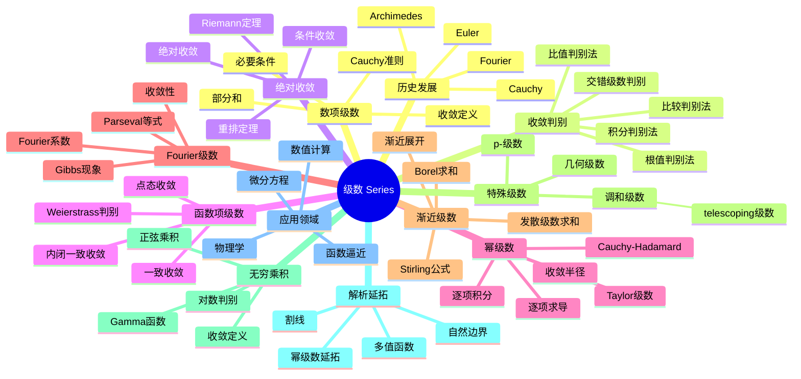

# 级数 思维导图

## 中心概念
级数是无限多项求和的形式，是分析学中表示函数、研究收敛性和进行近似计算的核心工具。幂级数、Fourier级数和渐近级数是三大主要类型。

## 核心分支

### 定义与公理
- **级数**: $\sum_{n=1}^\infty a_n = \lim_{N \to \infty} S_N$，其中 $S_N = \sum_{n=1}^N a_n$
- **收敛**: 部分和序列收敛
- **绝对收敛**: $\sum |a_n|$ 收敛
- **一致收敛**: 函数级数收敛关于参数一致

### 基本性质
- **线性性**: $\sum (\alpha a_n + \beta b_n) = \alpha \sum a_n + \beta \sum b_n$
- **必要条件**: 收敛 $\Rightarrow$ $a_n \to 0$
- **重排定理**: 绝对收敛级数任意重排收敛于同一值
- **Cauchy乘积**: 两个级数的乘积级数

### 重要例子
- **几何级数**: $\sum_{n=0}^\infty r^n = \frac{1}{1-r}$（$|r| < 1$）
- **p-级数**: $\sum_{n=1}^\infty \frac{1}{n^p}$（$p > 1$ 收敛）
- **调和级数**: $\sum_{n=1}^\infty \frac{1}{n}$ 发散
- **交错调和级数**: $\sum_{n=1}^\infty \frac{(-1)^{n+1}}{n} = \ln 2$（条件收敛）
- **指数级数**: $\sum_{n=0}^\infty \frac{x^n}{n!} = e^x$

### 核心定理
- **比较判别法**: $0 \leq a_n \leq b_n$，$\sum b_n$ 收敛 $\Rightarrow$ $\sum a_n$ 收敛
- **比值判别法**: $\lim |\frac{a_{n+1}}{a_n}| = L < 1$ 则绝对收敛
- **根值判别法**: $\limsup |a_n|^{1/n} = L < 1$ 则绝对收敛
- **Riemann重排定理**: 条件收敛级数可重排收敛到任意值
- **Abel定理**: 幂级数在收敛圆边界上的连续性

### 相关概念
- **父概念**: 序列、极限
- **子概念**: 幂级数、Fourier级数、渐近级数、无穷乘积
- **相邻概念**: 积分、解析函数、微分方程

### 应用领域
- **函数逼近**: Taylor展开、Fourier分析
- **微分方程**: 幂级数解法
- **数值计算**: 迭代方法、近似算法
- **物理学**: 扰动展开、量子场论

### 历史发展
- **古代**: Archimedes求抛物线弓形面积
- **发展**:
  - 1735：Euler解决Basel问题 $\sum \frac{1}{n^2} = \frac{\pi^2}{6}$
  - 1821：Cauchy《分析教程》严格理论
  - 1807：Fourier提出三角级数
  - 1900年代：渐近分析发展
- **现代发展**: 超收敛级数、多值解析函数

### 参考资源
- **推荐教材**: Rudin《Principles of Mathematical Analysis》、Knopp《Infinite Sequences and Series》
- **相关论文**: Euler《De summis serierum reciprocarum》(1735)、Fourier《Théorie analytique de la chaleur》(1822)
- **在线资源**: 3Blue1Brown级数可视化

---

**概念链接**: [[极限]] [[Fourier分析]] [[复分析]] [[渐近分析]] [[数值分析]]
