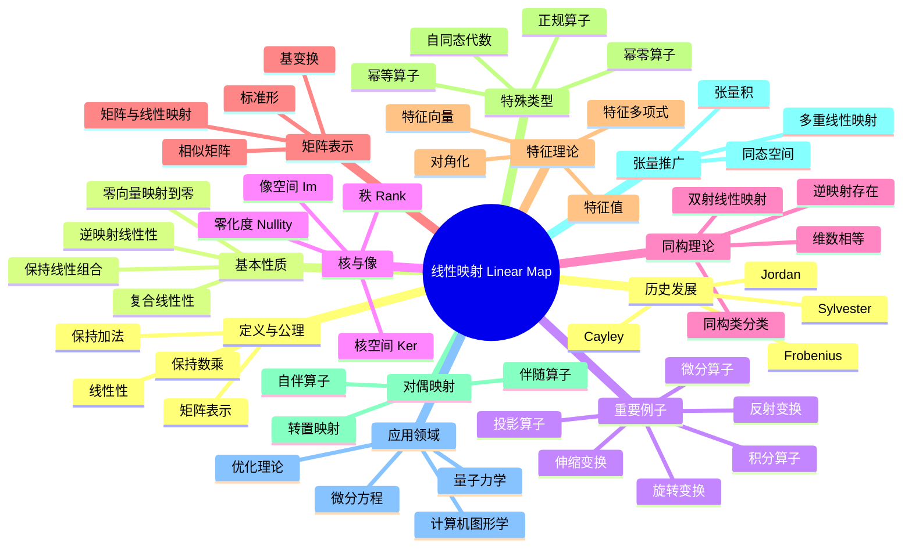

msc_primary: "00A99"
msc_secondary: ['00-00']
---

# 线性映射 思维导图

## 中心概念
线性映射（线性变换）是保持向量空间结构的映射，即保持加法和数乘运算的映射，是线性代数的核心研究对象。

## 核心分支

### 定义与公理
- **形式化定义**: 映射 $T: V \to W$ 满足 $T(v_1 + v_2) = T(v_1) + T(v_2)$ 和 $T(av) = aT(v)$
- **公理系统**: 线性性 = 可加性 + 齐次性
- **等价定义**: 保持所有线性组合的映射；$\text{Hom}_F(V,W)$ 中的元素

### 基本性质
- **零向量保持**: $T(\mathbf{0}_V) = \mathbf{0}_W$
- **保持线性组合**: $T(\sum a_i v_i) = \sum a_i T(v_i)$
- **复合线性性**: 线性映射的复合仍是线性的
- **逆映射线性性**: 可逆线性映射的逆也是线性的

### 重要例子
- **投影算子**: $P^2 = P$，如到子空间的正交投影
- **旋转变换**: 平面或空间中的旋转变换
- **反射变换**: 关于超平面的镜像反射
- **伸缩变换**: 各向同性或各向异性缩放
- **微分算子**: $D: C^\infty \to C^\infty$, $D(f) = f'$
- **积分算子**: $(Tf)(x) = \int K(x,y)f(y)dy$

### 核心定理
- **秩-零化度定理**: $\dim V = \dim \ker T + \dim \text{Im}\, T$
- **同构定理**: $V/\ker T \cong \text{Im}\, T$
- **矩阵表示定理**: 选定基后，$\text{Hom}(V,W) \cong M_{m \times n}(F)$
- **基变换公式**: $[T]_{\mathcal{B}'} = P^{-1}[T]_{\mathcal{B}}P$
- **Jordan标准形**: 复矩阵相似于Jordan形（证明思路：广义特征空间分解）

### 相关概念
- **父概念**: 同态、模同态
- **子概念**: 自同态、同构、投影、幂零变换、正规算子
- **相邻概念**: 矩阵、特征值、对偶空间、张量

### 应用领域
- **计算机图形学**: 变换矩阵、投影、光照计算
- **量子力学**: 可观测量作为自伴算子
- **微分方程**: 线性微分算子、格林函数
- **优化理论**: 梯度、Hessian矩阵、凸优化

### 历史发展
- **创立者**: Arthur Cayley (1858) 创立矩阵理论
- **关键发展**:
  - 1870年代：Jordan、Weierstrass建立标准形理论
  - 1900年代：Fredholm、Hilbert发展积分方程理论
  - 1930年代：von Neumann建立算子代数
- **现代研究**: 算子理论、随机矩阵

### 参考资源
- **推荐教材**: Axler《Linear Algebra Done Right》、Roman《Advanced Linear Algebra》
- **相关论文**: Cayley《A Memoir on the Theory of Matrices》、Jordan《Traité des substitutions》
- **在线资源**: MIT OpenCourseWare 18.06

---

**概念链接**: [[向量空间]] [[特征值]] [[同态与同构]] [[矩阵]] [[泛函分析]]
