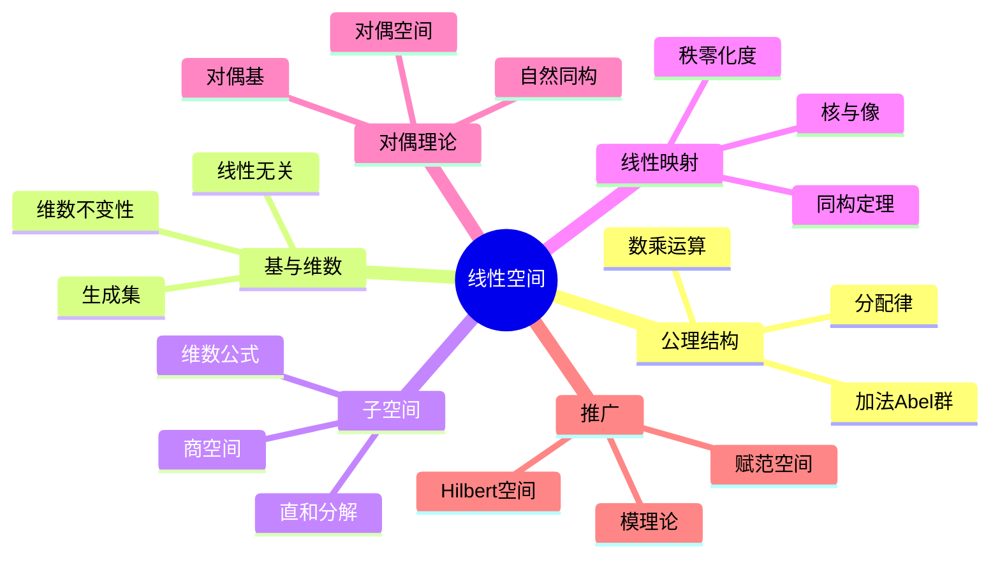

msc_primary: "00A99"
msc_secondary: ['00-XX']
---

# 线性空间 思维导图

## 中心概念

### 精确定义

**线性空间**（向量空间）是域 $F$ 上的集合 $V$，配备加法运算和数乘运算，满足八条公理：加法交换律、结合律、零元、负元；数乘与域乘法协调、单位元；以及数乘对加法的分配律。

### 直观理解

线性空间是"可定向量"的抽象集合，其中的元素（向量）可以"相加"和被数"缩放"。线性空间为线性代数提供了公理化基础，是几何、物理、工程等领域的核心数学工具。

---

## 第一层分支：核心要素

### 线性空间公理

- **加法群**：$(V, +)$ 是Abel群
- **数乘**：$F \times V \to V$，$(\lambda, v) \mapsto \lambda v$
- **协调性**：$\lambda(\mu v) = (\lambda\mu)v$
- **单位元**：$1v = v$
- **分配律**：$\lambda(u+v) = \lambda u + \lambda v$，$(\lambda+\mu)v = \lambda v + \mu v$

### 基与维数

- **线性组合**：$\sum_{i=1}^n \lambda_i v_i$
- **线性无关**：$\sum \lambda_i v_i = 0$ $\Rightarrow$ 所有 $\lambda_i = 0$
- **生成集**：所有线性组合的集合
- **基**：极大线性无关集 = 极小生成集
- **维数**：基中元素的个数，记作 $\dim V$
- **维数不变性**：所有基元素个数相同

### 子空间

- **定义**：对加法和数乘封闭的子集
- **交与和**：子空间的交仍是子空间，和也是
- **直和**：$U + W$ 为直和 $U \oplus W$ 若 $U \cap W = \{0\}$
- **维数公式**：$\dim(U + W) = \dim U + \dim W - \dim(U \cap W)$

### 线性映射

- **定义**：$T: V \to W$ 保持加法和数乘：$T(\lambda u + v) = \lambda T(u) + T(v)$
- **核与像**：$\ker T = \{v : T(v) = 0\}$，$\operatorname{im} T = \{T(v)\}$
- **秩-零化度定理**：$\dim V = \dim \ker T + \dim \operatorname{im} T$
- **同构**：双射线性映射

---

## 第二层分支：性质与定理

### 重要性质

#### 1. 基本性质

- **零向量性质**：$0v = 0$，$\lambda 0 = 0$，$(-\lambda)v = -(\lambda v)$
- **消去律**：$\lambda v = 0$ $\Rightarrow$ $\lambda = 0$ 或 $v = 0$
- **唯一表示**：每个向量对给定基有唯一坐标表示

#### 2. 基的扩充与收缩

- **扩充定理**：线性无关集可扩充为基
- **收缩定理**：生成集可收缩为基
- **维数判定**：$n$ 维空间中，$n$ 个线性无关向量构成基

### 核心定理

#### 1. 同构基本定理

- **第一同构定理**：$V/\ker T \cong \operatorname{im} T$
- **维数关系**：$\dim V = \dim \ker T + \operatorname{rank} T$
- **推论**：有限维空间同构 $\Leftrightarrow$ 维数相同

#### 2. 线性映射的矩阵表示

- **矩阵表示**：$[T]_{\mathcal{B}}^{\mathcal{C}}$ 关于基 $\mathcal{B}, \mathcal{C}$
- **基变换**：$[T]_{\mathcal{B}'} = P^{-1}[T]_{\mathcal{B}}P$
- **相似矩阵**：表示同一映射的不同矩阵

#### 3. 商空间

- **定义**：$V/W = \{v + W : v \in V\}$
- **维数**：$\dim(V/W) = \dim V - \dim W$
- **泛性质**：线性映射 $T: V \to U$ 满足 $W \subseteq \ker T$ 诱导 $\bar{T}: V/W \to U$

#### 4. 对偶空间

- **定义**：$V^* = \operatorname{Hom}(V, F)$，所有线性泛函
- **对偶基**：若 $\{e_i\}$ 为基，则 $\{e^i\}$ 满足 $e^i(e_j) = \delta_{ij}$
- **自然同构**：$(V^*)^* \cong V$（有限维）
- **零化子**：$W^0 = \{f \in V^* : f|_W = 0\}$

---

## 第三层分支：例子与应用

### 典型例子

#### 1. 具体向量空间

- **$F^n$**：$n$ 元有序组，标准基 $e_1, \ldots, e_n$
- **矩阵空间**：$M_{m \times n}(F)$，维数 $mn$
- **多项式空间**：$F[x]$（无限维），$F[x]_n$（次数 $< n$，维数 $n$）

#### 2. 函数空间

- **$C([a,b])$**：连续函数空间（无限维）
- **$\ell^p$**：$p$-可和序列空间
- **$L^p$**：$p$-次可积函数空间

#### 3. 几何空间

- **平面/空间向量**：$\mathbb{R}^2$，$\mathbb{R}^3$
- **切空间**：流形上某点的切向量空间
- **张量空间**：多线性映射构成的空间

### 反例

#### 1. 非线性空间

- **正实数**：$(\mathbb{R}^+, \cdot)$ 不是 $\mathbb{R}$ 上线性空间（数乘不封闭）
- **单位球面**：不满足封闭性

#### 2. 无限维的特殊性

- **非自反空间**：$(\ell^1)^* = \ell^\infty$，$(\ell^\infty)^* \neq \ell^1$
- **基的复杂性**：Hamel基（代数基）vs Schauder基

### 应用场景

#### 1. 线性方程组

- **解空间**：$Ax = 0$ 的解构成子空间（零空间）
- **秩**：$\operatorname{rank} A = \dim(\operatorname{im} A)$
- **解的结构**：特解 + 齐次解

#### 2. 微分方程

- **解空间**：线性ODE的解构成向量空间
- **Wronskian**：判断解的线性无关性
- **Green函数**：解算子的核表示

#### 3. 傅里叶分析

- **正交基**：$\{e^{inx}\}$ 构成 $L^2([-\pi, \pi])$ 的正交基
- **展开**：$f = \sum \langle f, e_n \rangle e_n$
- **Parseval等式**：范数等于Fourier系数平方和

#### 4. 量子力学

- **Hilbert空间**：复内积空间（完备）
- **态向量**：系统的量子态
- **可观测量**：自伴算子
- **叠加原理**：态的线性组合仍是态

#### 5. 数据科学

- **主成分分析**：在数据空间找最优低维子空间
- **特征脸**：人脸图像的特征分解
- **降维**：PCA、SVD、流形学习

---

## 第四层分支：关联概念

### 相似概念

#### 模（环上的推广）

- **定义**：环 $R$ 上的"线性空间"
- **自由模**：有基的模
- **关系**：域上的模 = 向量空间

#### 仿射空间

- **定义**：没有原点的"向量空间"
- **结构**：点集 $A$，配以平移群的作用
- **仿射组合**：$\sum \lambda_i P_i$，其中 $\sum \lambda_i = 1$

### 对偶概念

#### 正交补

- **定义**：$W^\perp = \{v : \langle v, w \rangle = 0, \forall w \in W\}$
- **性质**：$(W^\perp)^\perp = W$（有限维）
- **直和分解**：$V = W \oplus W^\perp$

### 推广概念

#### 赋范空间与Banach空间

- **范数**：$\|\cdot\|: V \to \mathbb{R}_{\geq 0}$

- **Banach空间**：完备的赋范空间
- **例子**：$C([a,b])$（上确界范数），$\ell^p$，$L^p$

#### 内积空间与Hilbert空间

- **内积**：$\langle \cdot, \cdot \rangle: V \times V \to F$
- **Hilbert空间**：完备的内积空间
- **投影定理**：闭子空间上的最佳逼近
- **Riesz表示**：$H^* \cong H$

#### 拓扑向量空间

- **定义**：拓扑结构与线性结构协调
- **局部凸空间**：有由凸集构成的局部基
- **分布理论**：广义函数作为测试函数空间的对偶

#### 分次空间与张量代数

- **分次**：$V = \bigoplus_{n} V_n$
- **张量积**：$V \otimes W$
- **外代数**：反对称张量构成的代数
- **对称代数**：对称张量构成的代数

---

## Mermaid思维导图

---

**参考章节**：线性代数 - 第1章 向量空间
**关联文件**：群结构-思维导图.md、模结构-思维导图.md
