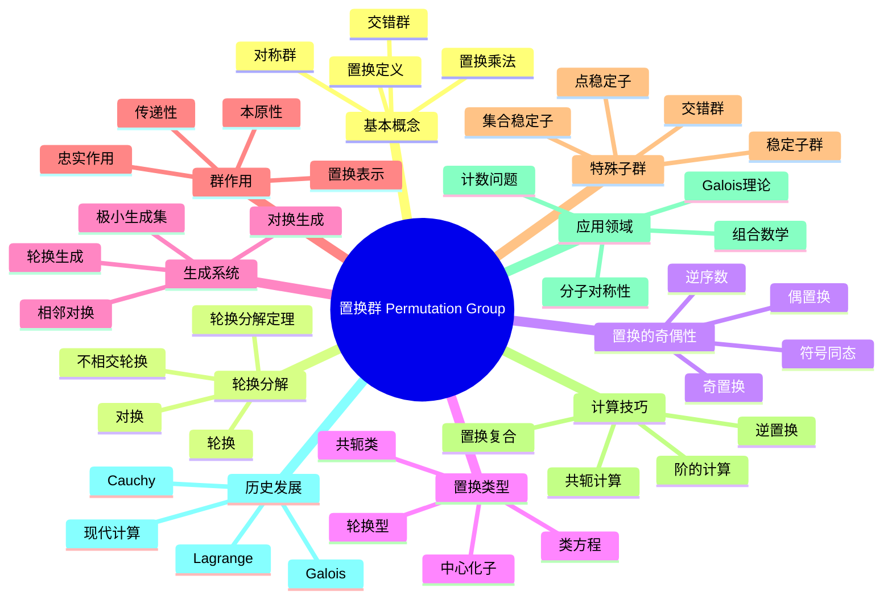

msc_primary: "00A99"
msc_secondary: ['00-XX']
---

# 置换群 思维导图

## 中心概念
置换群是由集合上的双射（置换）构成的群，是群论历史上最早研究的群类型。Cayley定理表明每个群都同构于某个置换群的子群。

## 核心分支

### 基本概念
- **置换**: 有限集合 $\{1, 2, \ldots, n\}$ 到自身的双射
- **对称群**: $S_n$ 表示 $n$ 个元素的所有置换构成的群，$|S_n| = n!$

- **置换表示**: 两行表示法、轮换表示法
- **置换乘法**: 从右到左的复合运算

### 轮换分解
- **轮换**: $(a_1\, a_2\, \ldots\, a_k)$ 表示循环置换
- **轮换分解定理**: 每个置换可唯一分解为不相交轮换的乘积
- **对换**: 长度为2的轮换 $(i\, j)$
- **轮换型**: 轮换长度的多重集合决定共轭类

### 置换的奇偶性
- **逆序数**: 置换中逆序对的数量
- **符号**: $\text{sgn}(\sigma) = (-1)^{\text{逆序数}}$
- **偶置换**: 符号为 $+1$ 的置换
- **奇置换**: 符号为 $-1$ 的置换
- **符号同态**: $\text{sgn}: S_n \to \{\pm 1\}$

### 交错群
- **定义**: $A_n = \ker(\text{sgn})$，即所有偶置换构成的群
- **阶**: $|A_n| = n!/2$（$n \geq 2$）

- **正规性**: $A_n \trianglelefteq S_n$，指数2
- **单性**: $A_n$ 是单群（$n \geq 5$）

### 核心定理
- **Cayley定理**: 每个 $n$ 阶群都同构于 $S_n$ 的某个子群
- **共轭判定**: $S_n$ 中两个置换共轭当且仅当它们有相同的轮换型
- **生成定理**: $S_n$ 由 $(1\, 2)$ 和 $(1\, 2\, \ldots\, n)$ 生成
- **Jordan定理**: 本原置换群的分类

### 重要例子
- **$S_3$**: 6阶非交换群，同构于 $D_3$（三角形对称群）
- **$A_4$**: 12阶群，有正规子群 $V_4$（Klein四元群）
- **$S_4$**: 24阶群，与立方体旋转群有密切关系
- **$A_5$**: 60阶单群，同构于正二十面体旋转群

### 群作用
- **置换表示**: 群到 $S_n$ 的同态
- **忠实作用**: 表示是单射
- **传递性**: 只有一个轨道
- **本原性**: 没有非平凡的块系统

### 相关概念
- **父概念**: [[群]]
- **子概念**: [[交错群]]、[[群作用]]、[[Cayley定理]]
- **相邻概念**: [[循环群]]、[[群同态]]、[[群同构]]

### 应用领域
- **Galois理论**: 多项式根的置换与方程可解性
- **组合数学**: 计数问题、Pólya计数定理
- **分子对称性**: 点群、分子振动分析
- **密码学**: 置换密码、S盒设计

### 历史发展
- **Lagrange (1770)**: 研究方程根的置换
- **Cauchy (1815)**: 置换论的数学基础
- **Galois (1830)**: Galois理论，群论的创立
- **现代**: 计算群论、置换群算法

---

**概念链接**: [[群]] [[群作用]] [[群同态]] [[交错群]] [[Cayley定理]]
