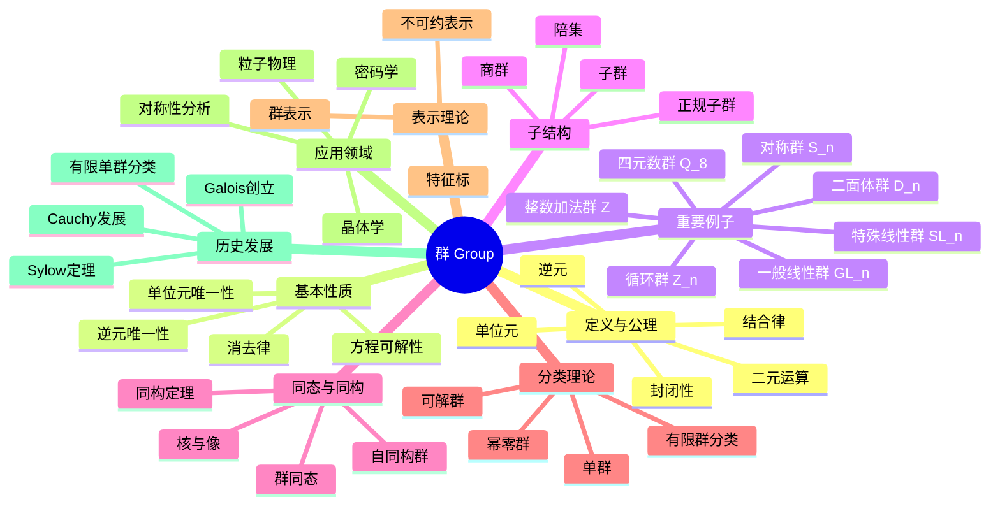

msc_primary: "00A99"
msc_secondary: ['00-XX']
---

# 群 思维导图

## 中心概念
群是代数学中最基本的代数结构之一，是一个配备了二元运算的集合，满足封闭性、结合律、单位元和逆元四个公理。

## 核心分支

### 定义与公理
- **形式化定义**: 群是一个二元组 $(G, \cdot)$，其中 $G$ 是集合，$\cdot: G \times G \to G$ 是二元运算
- **公理系统**: 封闭性、结合律、$\exists e \in G, \forall a \in G: a \cdot e = e \cdot a = a$、$\forall a \in G, \exists a^{-1}: a \cdot a^{-1} = e$
- **等价定义**: 半群+单位元+逆元；拟群+结合律

### 基本性质
- **单位元唯一性**: 群中单位元是唯一的
- **逆元唯一性**: 每个元素的逆元是唯一的
- **消去律**: $ab = ac \Rightarrow b = c$；$ba = ca \Rightarrow b = c$
- **判定条件**: 非空集合配备运算满足结合律、左单位元、左逆元则成群

### 重要例子
- **整数加法群** $(\mathbb{Z}, +)$: 无限循环群的原型
- **循环群** $\mathbb{Z}_n$: 有限循环群，同构于 $n$ 次单位根群
- **对称群** $S_n$: $n$ 个元素的所有置换构成的群，阶为 $n!$
- **二面体群** $D_n$: 正 $n$ 边形的对称群，阶为 $2n$
- **一般线性群** $GL_n(F)$: 域 $F$ 上 $n \times n$ 可逆矩阵群
- **特殊线性群** $SL_n(F)$: 行列式为1的矩阵群
- **四元数群** $Q_8$: 8阶非交换群 $\{\pm 1, \pm i, \pm j, \pm k\}$

### 核心定理
- **Lagrange定理**: 子群的阶整除群的阶（证明思路：陪集划分）
- **Cauchy定理**: 若素数 $p$ 整除 $|G|$，则 $G$ 有 $p$ 阶元（证明思路：群作用）

- **Sylow定理**: 存在Sylow $p$-子群，且所有Sylow $p$-子群共轭（证明思路：Sylow第一、二、三定理）
- **同构基本定理**: $G/\ker \varphi \cong \text{Im}\,\varphi$（证明思路：构造同态映射）

### 相关概念
- **父概念**: 半群、幺半群、拟群
- **子概念**: 阿贝尔群、循环群、有限群、无限群、拓扑群、李群
- **相邻概念**: 环、域、模、范畴

### 应用领域
- **对称性分析**: 化学分子对称性、晶体结构分类
- **密码学**: RSA算法、椭圆曲线密码的群论基础
- **晶体学**: 230个空间群的分类
- **粒子物理**: 规范群、标准模型中的李群

### 历史发展
- **创立者**: Évariste Galois (1811-1832)，引入群概念解决五次方程不可解问题
- **关键发展**: 
  - 1870年代：Cauchy、Sylow建立有限群基础理论
  - 1890年代：Frobenius、Burnside发展表示论
  - 1960-1980年代：有限单群分类定理完成
- **现代研究**: 几何群论、计算群论、量子群

### 参考资源
- **推荐教材**: Dummit & Foote《Abstract Algebra》、Artin《Algebra》
- **相关论文**: Feit-Thompson定理(1963)、分类定理(1981)
- **在线资源**: GroupNames、GAP系统文档

---

**概念链接**: [[环]] [[域]] [[同态与同构]] [[表示论]] [[李代数]]
