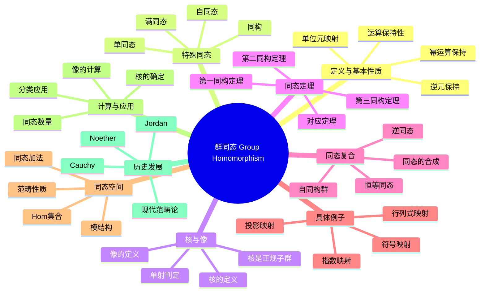

msc_primary: "00A99"
msc_secondary: ['00-XX']
---

# 群同态 思维导图

## 中心概念
群同态是两个群之间保持群运算结构的映射，是研究群之间关系和分类的基本工具。群同态连接了不同的群结构。

## 核心分支

### 定义与基本性质
- **定义**: 映射 $\varphi: G \to H$ 满足 $\varphi(ab) = \varphi(a)\varphi(b)$，$\forall a, b \in G$
- **单位元**: $\varphi(e_G) = e_H$
- **逆元**: $\varphi(a^{-1}) = \varphi(a)^{-1}$
- **幂运算**: $\varphi(a^n) = \varphi(a)^n$ 对所有整数 $n$ 成立

### 特殊同态
- **单同态**: 单射的同态，$G$ 可嵌入到 $H$ 中
- **满同态**: 满射的同态，$G$ 可映射到整个 $H$
- **同构**: 双射的同态，$G \cong H$ 表示群结构相同
- **自同态**: $G$ 到自身的同态，记 $\text{End}(G)$
- **自同构**: $G$ 到自身的同构，记 $\text{Aut}(G)$

### 核与像
- **核**: $\ker \varphi = \{g \in G : \varphi(g) = e_H\} \trianglelefteq G$
- **像**: $\text{Im}\,\varphi = \{\varphi(g) : g \in G\} \leq H$
- **单射判定**: $\varphi$ 是单射当且仅当 $\ker \varphi = \{e\}$
- **同态基本定理**: $G/\ker \varphi \cong \text{Im}\,\varphi$

### 核心定理
- **第一同构定理**: 任何同态都诱导出商群到像的同构
- **对应定理**: $G$ 的含 $\ker \varphi$ 的子群与 $\text{Im}\,\varphi$ 的子群一一对应
- **Cayley定理**: 任何群都同构于某个置换群的子群
- **同态计数**: 有限循环群之间的同态完全由生成元的像决定

### 重要例子
- **指数映射**: $\exp: (\mathbb{R}, +) \to (\mathbb{R}^+, \times)$，$\exp(x) = e^x$
- **行列式**: $\det: GL_n(F) \to F^\times$
- **符号映射**: $\text{sgn}: S_n \to \{\pm 1\}$
- **投影映射**: $\pi_i: G_1 \times G_2 \to G_i$

### 相关概念
- **父概念**: [[群]]
- **子概念**: [[群同构]]、[[同态定理]]、[[自同构群]]
- **相邻概念**: [[子群]]、[[正规子群]]、[[商群]]

### 应用领域
- **群分类**: 通过同构对群进行分类
- **表示论**: 群到矩阵群的同态
- **伽罗瓦理论**: 域自同构群的研究
- **代数拓扑**: 基本群的同态

### 历史发展
- **Cauchy (1815-1850)**: 置换群的研究，同态思想萌芽
- **Jordan (1870)**: 系统研究群同态和同构
- **Noether (1920s)**: 同态定理的抽象化表述
- **现代**: 范畴论中的群同态作为态射

---

**概念链接**: [[群]] [[群同构]] [[子群]] [[正规子群]] [[商群]]
