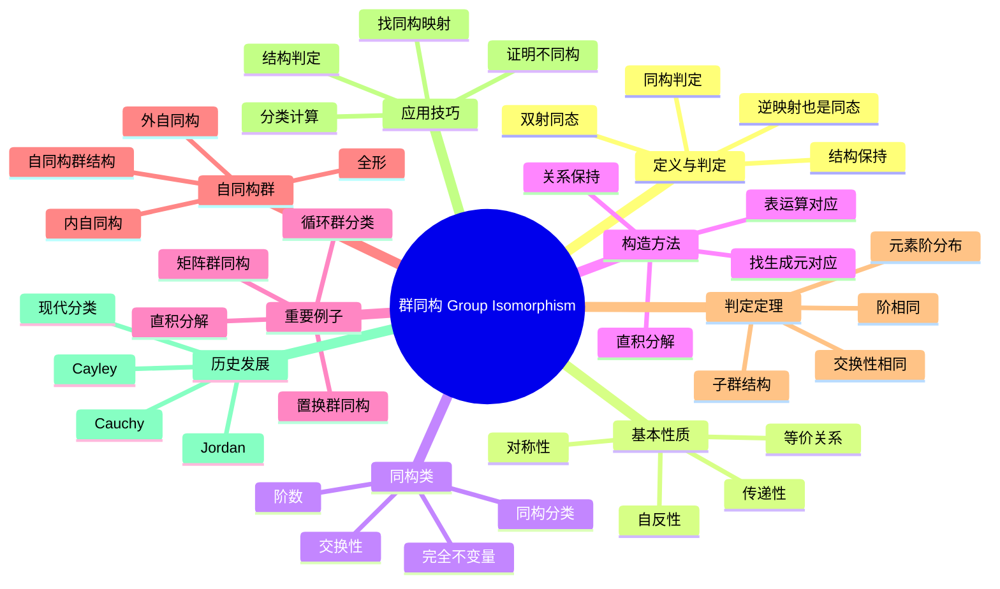

# 群同构 思维导图

## 中心概念
群同构是两个群之间的双射同态，表示两个群具有完全相同的代数结构。同构的群在代数性质上不可区分。

## 核心分支

### 定义与判定
- **定义**: 双射的群同态 $\varphi: G \to H$，满足 $\varphi(ab) = \varphi(a)\varphi(b)$
- **逆映射**: 同构的逆映射也是同构
- **记号**: $G \cong H$ 表示群 $G$ 与 $H$ 同构
- **结构保持**: 同构保持所有群论性质（阶、交换性、子群结构等）

### 基本性质
- **自反性**: $G \cong G$（恒等映射）
- **对称性**: $G \cong H \Rightarrow H \cong G$
- **传递性**: $G \cong H$，$H \cong K \Rightarrow G \cong K$
- **等价关系**: 同构是群集合上的等价关系

### 同构不变量
- **阶**: $|G| = |H|$
- **交换性**: $G$ 交换 $\Leftrightarrow H$ 交换
- **元素阶**: 元素阶的分布相同
- **子群结构**: 子群格结构相同
- **正规子群**: 正规子群数量和结构相同

### 重要例子
- **循环群分类**: 无限循环群 $\cong \mathbb{Z}$；有限 $n$ 阶循环群 $\cong \mathbb{Z}/n\mathbb{Z}$
- **Klein四元群**: $\mathbb{Z}/2\mathbb{Z} \times \mathbb{Z}/2\mathbb{Z} \cong$ 正方形对称群的旋转子群
- **单位根群**: $n$ 次单位根群 $\cong \mathbb{Z}/n\mathbb{Z}$
- **实数加法与正实数乘法**: $(\mathbb{R}, +) \cong (\mathbb{R}^+, \times)$ 通过指数映射

### 核心定理
- **Cayley定理**: 每个群都同构于某个置换群的子群
- **循环群分类定理**: 同阶循环群互相同构
- **有限生成交换群基本定理**: 每个有限生成交换群同构于循环群的直和
- **Sylow定理推论**: 同阶群的Sylow子群结构关系

### 自同构群
- **内自同构**: $\varphi_g(x) = gxg^{-1}$，形成 $\text{Inn}(G) \trianglelefteq \text{Aut}(G)$
- **外自同构**: $\text{Out}(G) = \text{Aut}(G)/\text{Inn}(G)$
- **全形**: $\text{Hol}(G) = G \rtimes \text{Aut}(G)$
- **自同构群计算**: 循环群 $\text{Aut}(\mathbb{Z}/n\mathbb{Z}) \cong (\mathbb{Z}/n\mathbb{Z})^\times$

### 相关概念
- **父概念**: [[群同态]]
- **子概念**: [[自同构群]]、[[同构定理]]
- **相邻概念**: [[群]]、[[子群]]、[[商群]]

### 应用领域
- **群分类**: 同构类是群的基本分类单位
- **结构识别**: 识别已知结构的群
- **计数问题**: 不同构群的数量计算
- **密码学**: 群同构在密码协议中的应用

### 历史发展
- **Cauchy (1815-1850)**: 置换群研究中的同构思想
- **Cayley (1854)**: 群的抽象定义，Cayley定理
- **Jordan (1870)**: 系统研究群同构
- **现代**: 计算群论中的同构判定算法

---

**概念链接**: [[群]] [[群同态]] [[子群]] [[商群]] [[自同构群]]
