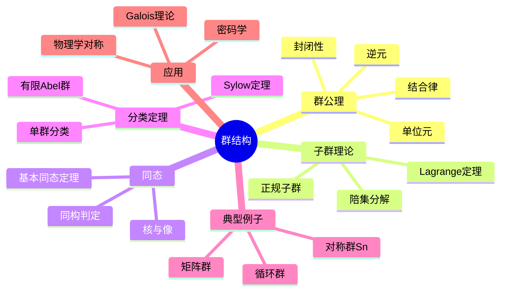

msc_primary: "00A99"
msc_secondary: ['00-00']
---

# 群结构 思维导图

## 中心概念

### 精确定义

**群** $(G, \cdot)$ 是一个集合 $G$ 配以一个二元运算 $\cdot$，满足四条公理：封闭性、结合律、存在单位元、每个元素存在逆元。群是代数学中最基本的代数结构，用于刻画对称性的数学抽象。

### 直观理解

群描述"可逆操作"的集合。如平面图形的旋转反射对称构成群，数的加减法构成群，置换操作构成群。群论是研究对称性的统一语言，贯穿数学和物理的各个分支。

---

## 第一层分支：核心要素

### 群公理

- **封闭性**：$\forall a, b \in G$，$a \cdot b \in G$
- **结合律**：$(a \cdot b) \cdot c = a \cdot (b \cdot c)$
- **单位元**：$\exists e \in G$，使得 $\forall a \in G$，$e \cdot a = a \cdot e = a$
- **逆元**：$\forall a \in G$，$\exists a^{-1} \in G$，使得 $a \cdot a^{-1} = a^{-1} \cdot a = e$

### 群的类型

- **有限群与无限群**：按元素个数分类
- **交换群（Abel群）**：$a \cdot b = b \cdot a$
- **循环群**：由一个元素生成的群 $G = \langle g \rangle$
- **置换群**：$S_n$，$n$ 个元素的全体置换
- **矩阵群**：$GL_n(F)$，$SL_n(F)$，$O_n$，$U_n$ 等

### 子群

- **定义**：$H \subseteq G$，在 $G$ 的运算下也构成群
- **判定**：$H \neq \emptyset$，$a, b \in H$ $\Rightarrow$ $ab^{-1} \in H$
- **生成子群**：$\langle S \rangle$ 为包含 $S$ 的最小子群
- **陪集**：$aH = \{ah : h \in H\}$（左陪集），$Ha$（右陪集）

### 同态与同构

- **同态**：映射 $\phi: G \to H$ 满足 $\phi(ab) = \phi(a)\phi(b)$
- **同构**：双射同态，记作 $G \cong H$
- **核**：$\ker \phi = \{g \in G : \phi(g) = e_H\}$
- **像**：$\operatorname{im} \phi = \{\phi(g) : g \in G\}$

---

## 第二层分支：性质与定理

### 重要性质

#### 1. 基本性质

- **单位元唯一性**：群中单位元唯一
- **逆元唯一性**：每个元素的逆元唯一
- **消去律**：$ab = ac$ $\Rightarrow$ $b = c$（左消去），同理右消去
- **幂运算**：$a^n = a \cdot a \cdots a$（$n$ 个），$a^{-n} = (a^{-1})^n$

#### 2. Lagrange定理

- **内容**：若 $H \leq G$ 且 $|G| < \infty$，则 $|H|$ 整除 $|G|$
- **指数**：$[G:H] = |G|/|H|$，即陪集个数

- **推论**：元素阶整除群的阶
- **应用**：判断子群存在性

### 核心定理

#### 1. 同态基本定理

- **内容**：$G / \ker \phi \cong \operatorname{im} \phi$
- **意义**：任何同态像都同构于某个商群
- **应用**：简化群结构研究

#### 2. 群的分类定理

##### 有限Abel群基本定理

- **内容**：有限Abel群同构于素数幂阶循环群的直积
- **不变因子分解**：$G \cong \mathbb{Z}_{d_1} \times \cdots \times \mathbb{Z}_{d_k}$，$d_1 | d_2 | \cdots | d_k$

- **初等因子分解**：$G \cong \prod \mathbb{Z}_{p_i^{e_i}}$

##### 有限单群分类

- **单群**：没有非平凡正规子群的群
- **分类定理**：有限单群分为18族+26个散在单群
- **里程碑**：数学史上最庞大的证明之一

#### 3. Sylow定理

- **Sylow p-子群**：阶为 $p^k$ 的子群，其中 $p^k \mid |G|$ 但 $p^{k+1} \nmid |G|$

- **存在性**：Sylow p-子群存在
- **共轭性**：所有Sylow p-子群互相共轭
- **计数**：$n_p \equiv 1 \pmod p$，$n_p \mid |G|/p^k$

- **应用**：判断有限群结构、证明非单性

#### 4. Jordan-Hölder定理

- **合成列**：$G = G_0 \rhd G_1 \rhd \cdots \rhd G_n = \{e\}$
- **内容**：合成因子（商群）在同构和重排意义下唯一
- **意义**：群的"素因子分解"

---

## 第三层分支：例子与应用

### 典型例子

#### 1. 基本例子

- **整数加法群**：$(\mathbb{Z}, +)$，无限循环群
- **模n剩余类**：$(\mathbb{Z}_n, +)$，有限循环群
- **Klein四元群**：$V_4 \cong \mathbb{Z}_2 \times \mathbb{Z}_2$
- **四元数群**：$Q_8 = \{\pm 1, \pm i, \pm j, \pm k\}$

#### 2. 对称群

- **$S_n$**：$n$ 个元素的对称群，$|S_n| = n!$
- **$A_n$**：交错群（偶置换），$|A_n| = n!/2$

- **置换的轮换分解**：任何置换可表为不交轮换之积
- **共轭类**：同型置换共轭

#### 3. 典型矩阵群

- **一般线性群**：$GL_n(F)$，可逆 $n \times n$ 矩阵
- **特殊线性群**：$SL_n(F)$，行列式为1的矩阵
- **正交群**：$O_n$，保持内积的变换（$A^TA = I$）
- **酉群**：$U_n$，复情形的正交群

### 反例

#### 1. 非群结构

- **自然数加法**：无逆元
- **矩阵乘法（全体矩阵）**：非零元可能无逆
- **叉积**：不满足结合律

#### 2. 非交换群

- **$S_3$**：最小的非交换群（6阶）
- **$GL_n(F)$（$n \geq 2$）**：矩阵乘法不交换

### 应用场景

#### 1. 几何对称性

- **刚体运动群**：平移、旋转、反射
- **晶格群**：晶体结构的分类（230个空间群）
- **Galois理论**：多项式根的对称性

#### 2. 物理学

- **粒子物理**：$SU(3)$ 描述夸克色对称
- **规范场论**：规范群（$U(1)$，$SU(2)$，$SU(3)$）
- **晶体学**：点群和空间群分类

#### 3. 密码学

- **椭圆曲线群**：椭圆曲线点加法
- **离散对数问题**：基于群结构的密码协议
- **RSA算法**：基于 $(\mathbb{Z}_n^*, \cdot)$ 的结构

#### 4. 化学

- **分子对称性**：点群描述分子形状
- **光谱分析**：对称性决定选律

---

## 第四层分支：关联概念

### 相似概念

#### 半群与幺半群

- **半群**：仅满足封闭性和结合律
- **幺半群**：半群加单位元
- **例子**：$(\mathbb{N}, +)$ 是幺半群但非群

#### 环与域（更强的结构）

- **环**：加法成群，乘法半群，分配律
- **域**：交换除环，非零元都可逆
- **关系**：域的单位元群是Abel群

### 对偶概念

#### 商群与扩张

- **商群**：$G/N$（$N \trianglelefteq G$）
- **群扩张**：$1 \to N \to G \to Q \to 1$
- **可解群**：通过交换商群层层化简

### 推广概念

#### 拓扑群与李群

- **拓扑群**：群结构+拓扑结构，运算连续
- **李群**：光滑流形上的群，运算是光滑映射
- **例子**：$GL_n(\mathbb{R})$，$SO(n)$，$SU(n)$
- **李代数**：李群在单位元处的切空间

#### 表示论

- **群表示**：$\rho: G \to GL(V)$，群到线性变换的映射
- **特征标**：$\chi(g) = \operatorname{tr}(\rho(g))$
- **正则表示**：群代数上的表示
- **Maschke定理**：有限群在特征零域上表示完全可约

#### 范畴论视角

- **群范畴 Grp**：对象为群，态射为同态
- **遗忘函子**：$U: \mathbf{Grp} \to \mathbf{Set}$
- **自由群**：遗忘函子的左伴随

---

## Mermaid思维导图

---

**参考章节**：抽象代数 - 第1章 群论
**关联文件**：环结构-思维导图.md、域扩张-思维导图.md
