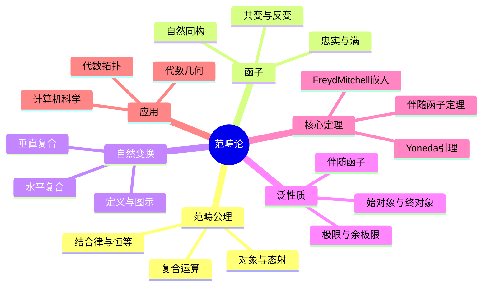

# 范畴论 思维导图

## 中心概念

### 精确定义
**范畴** $\mathcal{C}$ 由以下要素构成：对象的类 $\operatorname{Ob}(\mathcal{C})$；对任意 $A, B \in \operatorname{Ob}(\mathcal{C})$，态射集 $\operatorname{Hom}(A, B)$；以及满足结合律和恒等律的态射复合运算。范畴论是数学的"元理论"，为不同数学分支提供统一语言和结构洞察。

### 直观理解
范畴论研究数学结构的"结构"——不关注集合内部的元素，而关注对象之间的关系（态射）。如同拓扑学研究"邻近"而不依赖具体度量，范畴论研究"映射"而不依赖具体实现。它揭示了不同数学领域间深刻的相似性。

---

## 第一层分支：核心要素

### 范畴公理
- **对象**：$A, B, C, \ldots$（可以是集合、群、空间等）
- **态射**：$f: A \to B$，$\operatorname{Hom}(A, B)$ 的集合（或类）
- **复合**：$g \circ f: A \to C$（若 $f: A \to B$，$g: B \to C$）
- **结合律**：$(h \circ g) \circ f = h \circ (g \circ f)$
- **恒等态射**：$\operatorname{id}_A: A \to A$，$f \circ \operatorname{id}_A = f = \operatorname{id}_B \circ f$

### 函子
- **定义**：$F: \mathcal{C} \to \mathcal{D}$，保持对象、态射、复合和恒等
- **共变函子**：$F(f: A \to B): F(A) \to F(B)$
- **反变函子**：$F(f: A \to B): F(B) \to F(A)$
- **双函子**：从积范畴出发的函子

### 自然变换
- **定义**：$\alpha: F \Rightarrow G$，对每个 $A$ 有 $\alpha_A: F(A) \to G(A)$，使得图表交换
- **垂直复合**：自然变换的复合
- **水平复合**：Godement积
- **自然同构**：每个 $\alpha_A$ 是同构的自然变换

### 泛性质与极限
- **始对象与终对象**：唯一的态射从/到它
- **积与余积**：$A \times B$ 和 $A \sqcup B$
- **等化子与余等化子**：$\ker$ 和 $\operatorname{coker}$
- **极限与余极限**：一般锥的泛对象
- **伴随**：$\operatorname{Hom}(F(A), B) \cong \operatorname{Hom}(A, G(B))$

---

## 第二层分支：性质与定理

### 重要性质

#### 1. 基本范畴例子
- **集合范畴 Set**：对象为集合，态射为函数
- **群范畴 Grp**：对象为群，态射为群同态
- **拓扑范畴 Top**：对象为拓扑空间，态射为连续映射
- **线性空间范畴 Vect**：对象为向量空间，态射为线性映射
- **偏序集**：态射为序关系

#### 2. 特殊态射
- **单态射（monomorphism）**：左可消去
- **满态射（epimorphism）**：右可消去
- **同构**：存在逆态射
- **自同态与自同构**：$\operatorname{End}(A)$，$\operatorname{Aut}(A)$

### 核心定理

#### 1. Yoneda引理
- **内容**：$\operatorname{Nat}(\operatorname{Hom}(-, A), F) \cong F(A)$（$F$ 为集合值函子）
- **意义**：对象由其表示的函子完全确定
- **推论**：$\operatorname{Hom}(-, A) \cong \operatorname{Hom}(-, B)$ $\Rightarrow$ $A \cong B$
- **应用**：表示论、层论

#### 2. 伴随函子定理
- **Freyd伴随函子定理**：保持极限的函子有左伴随（在满足条件的范畴）
- **单位与余单位**：$\eta: \operatorname{id} \to GF$，$\varepsilon: FG \to \operatorname{id}$
- **三角恒等式**：伴随的刻画
- **例子**：自由-遗忘伴随，张量积-Hom伴随

#### 3. 可表示函子
- **定义**：$F \cong \operatorname{Hom}(A, -)$ 对某 $A$
- **表示对象**：在同构意义下唯一
- **例子**：
  - 基本群函子由 $S^1$ 表示
  - 上同调函子由 Eilenberg-MacLane 空间表示

#### 4. Abel范畴
- **定义**：有核、余核、有限极限和余极限、单+满=同构的加法范畴
- **例子**：模范畴、凝聚层范畴
- **Freyd-Mitchell嵌入定理**：小Abel范畴可嵌入模范畴
- **同调代数**：Abel范畴中的正合序列、导出函子

---

## 第三层分支：例子与应用

### 典型例子

#### 1. 具体范畴
- **Set**：集合与函数
- **Grp**：群与同态
- **Ring**：环与同态
- **$R$-Mod**：$R$-模与同态
- **Top**：拓扑空间与连续映射
- **Man**：光滑流形与光滑映射

#### 2. 导出范畴
- **复形范畴**：链复形与链映射
- **同伦范畴**：模掉链同伦
- **导出范畴**：局部化拟同构
- **$D^b(\mathcal{A})$**：有界导出范畴

#### 3. 高阶范畴
- **2-范畴**：态射之间有2-态射
- **$(\infty,1)$-范畴**：同伦范畴的推广
- **$(\infty,1)$-Cat**：无穷范畴的范畴

### 反例

#### 1. 非具体范畴
- **商范畴**：态射不是集合的范畴（可能大）
- **高阶范畴**：态射本身构成范畴

#### 2. 非Abel范畴
- **群范畴**：非加法范畴
- **拓扑空间**：非Abel范畴

### 应用场景

#### 1. 代数学
- **模范畴**：$R$-$\mathbf{Mod}$
- **张量积的泛性质**：平衡双线性映射的泛对象
- **Hom与伴随**：$-\otimes B \dashv \operatorname{Hom}(B, -)$

#### 2. 代数拓扑
- **同伦范畴**：空间与连续映射的同伦类
- **谱序列**：谱的收敛
- **模型范畴**：同伦论的公理化
- **$(\infty,1)$-范畴**：同伦论的范畴论框架

#### 3. 代数几何
- **概形的范畴**：Sch
- **模空间**：表示函子
- **导出代数几何**：交换代数的导出版本
- **叠（Stack）**：商问题的函子描述

#### 4. 数理逻辑与计算机科学
- **类型论**：Curry-Howard对应
- **线性逻辑**：资源敏感的逻辑
- **单子（Monad）**：计算效果的范畴论模型
- **函数式编程**：Haskell等语言的范畴论基础

#### 5. 数学物理
- **拓扑量子场论**：对称幺半范畴中的函子
- **量子群**：quasitriangular Hopf代数
- **弦理论**：镜像对称的范畴论解释

---

## 第四层分支：关联概念

### 相似概念

#### 预层与层
- **预层**：$\mathcal{F}: \mathcal{C}^{op} \to \mathbf{Set}$
- **层**：满足粘合条件的预层
- **Giraud定理**：拓扑斯的刻画
- **应用**：代数几何、拓扑学

#### 内范畴论
- **内范畴**：在范畴内的范畴
- **内群**：群对象
- **叠**：纤维范畴的2-余层条件

### 对偶概念

#### 对偶范畴
- **定义**：$\mathcal{C}^{op}$，反转所有箭头
- **反变函子**：$\mathcal{C} \to \mathcal{D}$ 即 $\mathcal{C}^{op} \to \mathcal{D}^{op}$
- **对偶原理**：任何定理在 $\mathcal{C}$ 成立，则在 $\mathcal{C}^{op}$ 成立其对偶

### 推广概念

#### 高阶范畴论
- **n-范畴**：n层态射
- **无穷范畴**：$(\infty,1)$-范畴，$(\infty,n)$-范畴
- **同伦类型论**：类型即空间，等同即道路

#### 拓扑斯理论
- **拓扑斯**：广义集合论的范畴
- **几何态射**：拓扑斯间的映射
- **分类拓扑斯**：由几何理论分类
- **应用**：集合论的力迫法、代数几何

#### 量子群与编织范畴
- **编织幺半范畴**：$B_{X,Y}: X \otimes Y \to Y \otimes X$
- **量子群**：拟三角Hopf代数表示的范畴
- **纽结不变量**：Reshetikhin-Turaev构造

---

## Mermaid思维导图

---

**参考章节**：范畴论 - 全章  
**关联文件**：同调代数-思维导图.md、模结构-思维导图.md
