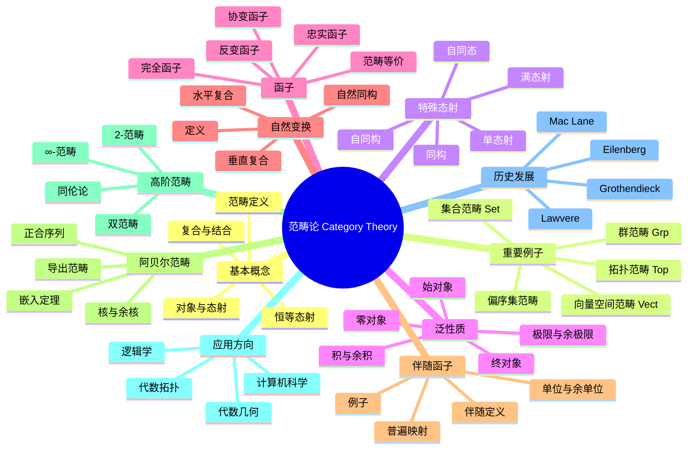

msc_primary: "00A99"
msc_secondary: ['00-00']
---

# 范畴论 思维导图

## 中心概念
范畴论是数学的"元理论"，研究数学结构的共同模式。它通过对象和态射抽象代数结构，统一了不同数学分支的概念和方法，是现代数学的基础语言。

## 核心分支

### 定义与公理
- **范畴**: 对象类 $\text{Ob}(\mathcal{C})$ 和态射集 $\text{Hom}(A,B)$，配备复合 $\circ$ 和恒等 $\text{id}_A$
- **复合结合律**: $(h \circ g) \circ f = h \circ (g \circ f)$
- **恒等律**: $f \circ \text{id}_A = f = \text{id}_B \circ f$
- **小范畴**: 对象为集合的范畴

### 基本性质
- **同构**: 存在逆态射的态射
- **单/满态射**: 左/右可消去的态射
- **始/终对象**: 到/从任意对象有唯一态射
- **零对象**: 既是始对象又是终对象

### 重要例子
- **Set**: 集合与函数
- **Grp**: 群与群同态
- **Top**: 拓扑空间与连续映射
- **Vect$_F$**: 域 $F$ 上的向量空间与线性映射
- **Poset**: 偏序集作为范畴（对象=元素，态射=≤）
- **Set$^{\mathcal{C}^{\text{op}}}$**: 预层范畴

### 核心定理
- **Yoneda引理**: $\text{Nat}(\text{Hom}(-,A), F) \cong F(A)$（证明思路：构造显式同构）
- **伴随函子定理**: 满足条件的函子有左/右伴随（Freyd定理）
- **米田嵌入**: 每个范畴可嵌入到预层范畴
- **Abel范畴嵌入定理**: 每个小Abel范畴可嵌入到模范畴

### 相关概念
- **父概念**: 数学基础、抽象代数
- **子概念**: 高阶范畴、导出范畴、模型范畴、$(\infty,1)$-范畴
- **相邻概念**: 同调代数、代数几何、类型论

### 应用领域
- **代数几何**: 概形、层、导出范畴
- **代数拓扑**: 同伦论、谱序列、模型范畴
- **逻辑学**: 类型论、笛卡尔闭范畴、拓扑斯
- **计算机科学**: 函数式编程、单子、范畴语义

### 历史发展
- **创立者**: Samuel Eilenberg 和 Saunders Mac Lane (1945)
- **关键发展**:
  - 1945：《General Theory of Natural Equivalences》
  - 1957：Grothendieck引入Abel范畴
  - 1964：Lawvere《An Elementary Theory of the Category of Sets》
  - 1990年代：高阶范畴理论的兴起
- **现代研究**: $(\infty,1)$-范畴、导出代数几何

### 参考资源
- **推荐教材**: Mac Lane《Categories for the Working Mathematician》、Leinster《Basic Category Theory》
- **相关论文**: Eilenberg-Mac Lane《General Theory of Natural Equivalences》
- **在线资源**: nLab、The Catsters（YouTube频道）

---

**概念链接**: [[同调代数]] [[导出范畴]] [[代数几何]] [[类型论]] [[同伦论]]
