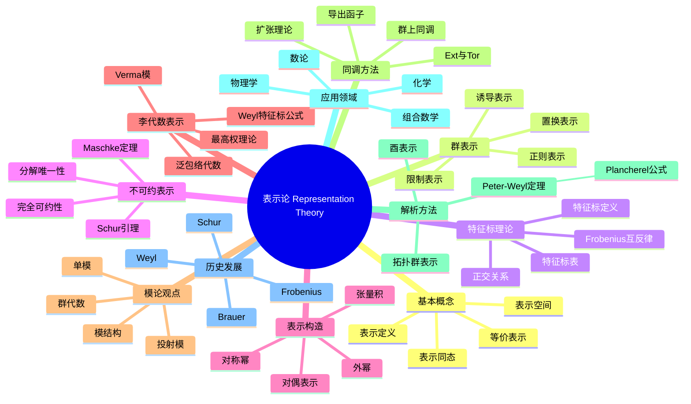

# 表示论 思维导图

## 中心概念
表示论研究抽象代数结构（群、李代数、结合代数等）在向量空间上的线性作用，将抽象结构转化为具体的线性变换，是连接代数学与其他数学分支的桥梁。

## 核心分支

### 定义与公理
- **群表示**: 同态 $\rho: G \to GL(V)$，将群元映射为可逆线性变换
- **表示同态**: 线性映射 $T: V \to W$ 与群作用交换
- **等价表示**: 存在可逆表示同态
- **忠实表示**: 表示同态是单射

### 基本性质
- **Maschke定理**: 有限群在特征零域上的表示完全可约
- **Schur引理**: 不可约表示间的同态是零或同构
- **完全可约性**: 表示可分解为不可约表示的直和
- **正交关系**: 不可约特征标满足正交归一关系

### 重要例子
- **平凡表示**: 所有群元作用为恒等变换
- **正则表示**: 群代数 $F[G]$ 上的左乘作用
- **置换表示**: 群在集合上的作用诱导线性表示
- **正交群的旋量表示**: 覆盖映射 $\text{Spin}(n) \to SO(n)$
- **对称群的Specht模**: 不可约表示的分类

### 核心定理
- **Maschke定理**: 有限群在 $\text{char} \nmid |G|$ 时完全可约（证明思路：平均化投影）
- **Schur引理**: 不可约表示自同态是标量（代数闭域上）
- **特征标正交性**: $\langle \chi_i, \chi_j \rangle = \delta_{ij}$
- **Frobenius互反律**: 诱导与限制表示的伴随关系
- **Peter-Weyl定理**: 紧群的不可约表示分离点

### 相关概念
- **父概念**: 群论、线性代数、模论
- **子概念**: 诱导表示、射影表示、模表示、李代数表示
- **相邻概念**: 特征标、群代数、上同调、同调代数

### 应用领域
- **物理学**: 粒子物理中的规范群表示、角动量理论
- **化学**: 分子振动光谱的对称性分析
- **组合数学**: 对称函数、杨表理论
- **数论**: Galois表示、自守形式

### 历史发展
- **创立者**: Ferdinand Georg Frobenius (1896) 创立特征标理论
- **关键发展**:
  - 1901-1905：Schur发展表示论的矩阵方法
  - 1920-1930：Weyl建立紧李群表示论
  - 1935-1945：Brauer发展模表示论
  - 1970年代：Langlands纲领提出
- **现代研究**: 几何表示论、范畴化表示论

### 参考资源
- **推荐教材**: Fulton-Harris《Representation Theory》、Serre《Linear Representations of Finite Groups》
- **相关论文**: Weyl《The Classical Groups》、Brauer-Nesbitt《On the modular characters of groups》
- **在线资源**: ATLAS of Finite Group Representations

---

**概念链接**: [[群]] [[李代数]] [[模]] [[同调代数]] [[范畴论]]
