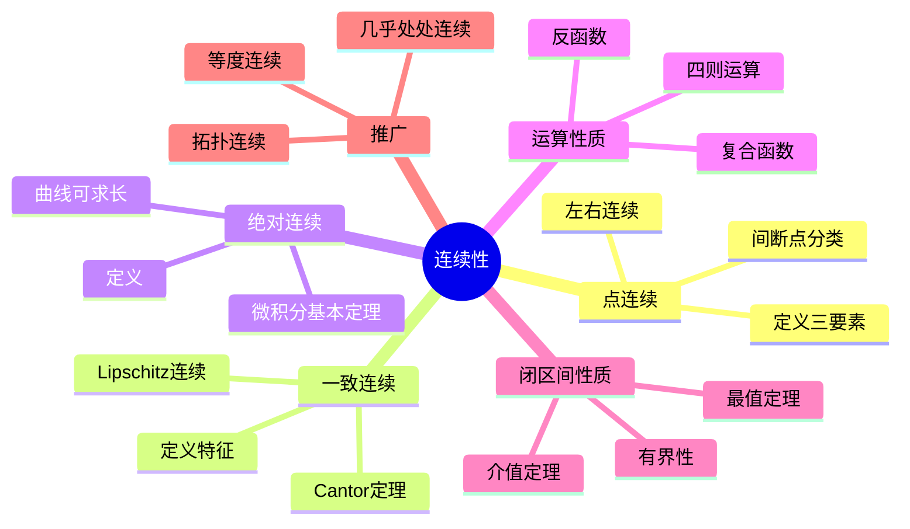

msc_primary: "00A99"
msc_secondary: ['00-XX']
---

# 连续性 思维导图

## 中心概念

### 精确定义

**连续性**描述函数在某点或某集合上"没有突变"的性态。函数 $f$ 在点 $a$ 连续定义为：$\lim_{x \to a} f(x) = f(a)$，即$\forall \epsilon > 0, \exists \delta > 0$，当 $|x-a| < \delta$ 时，$|f(x) - f(a)| < \epsilon$。

### 直观理解

连续性意味着"小变化引起小变化"——输入的微小扰动只导致输出的微小扰动。几何上，连续函数的图像可以"一笔画"完成，没有跳跃、洞或无穷间断。

---

## 第一层分支：核心要素

### 点连续

- **定义**：$\lim_{x \to a} f(x) = f(a)$
- **等价表述**：$\lim_{\Delta x \to 0} \Delta y = 0$，其中 $\Delta y = f(a+\Delta x) - f(a)$
- **三要素**：(1) $f(a)$ 有定义 (2) 极限存在 (3) 两者相等
- **左右连续**：左连续 $\lim_{x \to a^-} f(x) = f(a)$，右连续同理

### 区间连续

- **开区间连续**：在 $(a,b)$ 内每一点都连续
- **闭区间连续**：在 $(a,b)$ 内连续，在 $a$ 右连续，在 $b$ 左连续
- **分段连续**：除去有限个点外处处连续，间断点为第一类间断点

### 一致连续

- **定义**：$\forall \epsilon > 0, \exists \delta > 0$，使得对定义域内任意 $x,y$，当 $|x-y| < \delta$ 时，$|f(x)-f(y)| < \epsilon$

- **关键特征**：$\delta$ 仅依赖于 $\epsilon$，与点的位置无关
- **几何意义**：函数图像"整体"没有陡峭的局部

### 绝对连续

- **定义**：$\forall \epsilon > 0, \exists \delta > 0$，使得对任意有限个互不相交的区间 $(a_i, b_i)$，当 $\sum(b_i - a_i) < \delta$ 时，$\sum|f(b_i) - f(a_i)| < \epsilon$

- **强于一致连续**：绝对连续 $\Rightarrow$ 一致连续
- **微积分基本定理**：绝对连续函数几乎处处可导且可表示为积分

---

## 第二层分支：性质与定理

### 重要性质

#### 1. 连续函数的运算

- **四则运算**：连续函数的和、差、积、商（分母非零）仍连续
- **复合函数**：连续函数的复合仍连续
- **反函数**：严格单调连续函数的反函数连续
- **证明**：利用极限的四则运算和复合函数极限定理

#### 2. 间断点分类

- **第一类间断点（可去/跳跃）**：左右极限都存在
  - 可去间断点：左右极限相等但不等于函数值（或无定义）
  - 跳跃间断点：左右极限存在但不相等
- **第二类间断点**：至少一侧极限不存在
  - 无穷间断点：至少一侧趋于无穷
  - 振荡间断点：无限振荡无极限

#### 3. 闭区间连续函数的性质

- **有界性**：闭区间上的连续函数必有界
- **最值定理**：必能取到最大值和最小值
- **介值定理**：取到最值之间的一切值
- **零点定理**：若端点值异号，则必有零点

### 核心定理

#### 1. Cantor定理

- **内容**：闭区间上的连续函数必一致连续
- **证明思路**：利用有限覆盖定理或Bolzano-Weierstrass定理
- **条件不可去**：开区间上的连续函数不一定一致连续（如 $1/x$ 在 $(0,1)$）

#### 2. Lipschitz连续性

- **定义**：$|f(x) - f(y)| \leq L|x - y|$ 对所有 $x,y$ 成立

- **关系**：Lipschitz连续 $\Rightarrow$ 绝对连续 $\Rightarrow$ 一致连续 $\Rightarrow$ 连续
- **几何意义**：函数图像的斜率有统一上界

#### 3. 单调函数的性质

- **单调函数的间断点**：至多可数，且都是第一类间断点
- **单调连续函数**：严格单调连续函数存在连续的反函数

---

## 第三层分支：例子与应用

### 典型例子

#### 1. 基本初等函数

- **多项式函数**：在 $\mathbb{R}$ 上处处连续
- **指数函数** $e^x$：在 $\mathbb{R}$ 上连续
- **三角函数**：$\sin x$, $\cos x$ 在 $\mathbb{R}$ 上连续
- **对数函数**：在其定义域 $(0, +\infty)$ 上连续

#### 2. 连续但不可微的例子

- **Weierstrass函数**：处处连续但处处不可微
  $$W(x) = \sum_{n=0}^{\infty} a^n \cos(b^n \pi x)$$
- **几何特征**："锯齿状"无限精细的结构
- **历史意义**：打破"连续必可微"的直觉

#### 3. 一致连续的例子

- $f(x) = \sin x$ 在 $\mathbb{R}$ 上一致连续（Lipschitz连续）
- $f(x) = \sqrt{x}$ 在 $[0, +\infty)$ 上一致连续
- $f(x) = x^2$ 在 $\mathbb{R}$ 上不一致连续

### 反例

#### 1. 连续但不一致连续

- $f(x) = \frac{1}{x}$ 在 $(0,1)$ 上：当 $x \to 0^+$ 时"越来越陡"
- $f(x) = x^2$ 在 $\mathbb{R}$ 上：远处斜率无限增大

#### 2. 一致连续但不绝对连续

- **Cantor函数**（魔鬼楼梯）：一致连续但不是绝对连续
- 特征：几乎处处导数为0，但函数非常数

### 应用场景

#### 1. 方程求根

- **介值定理应用**：证明方程 $x^3 - 2x - 5 = 0$ 在 $(2,3)$ 内有根
- **二分法**：基于介值定理的数值求根方法
- **不动点定理**：Banach压缩映射原理

#### 2. 优化理论

- **最值定理保证**：闭集上连续函数必能取到最值
- **极值点存在性**：Weierstrass极值定理
- **约束优化**：Lagrange乘数法的理论基础

#### 3. 微分方程

- **解的存在性**：Peano存在定理（连续性条件）
- **解的唯一性**：需要Lipschitz条件
- **延拓定理**：解的存在区间与连续性关系

---

## 第四层分支：关联概念

### 相似概念

#### 上半连续与下半连续

- **上半连续**：$\limsup_{x \to a} f(x) \leq f(a)$
- **下半连续**：$\liminf_{x \to a} f(x) \geq f(a)$
- **关系**：连续 $\Leftrightarrow$ 既上半又下半连续
- **应用**：极值理论、凸分析

#### 等度连续

- **定义**：函数族的连续性"一致"成立
- **Arzelà-Ascoli定理**：有界等度连续函数族存在一致收敛子列
- **应用**：证明微分方程解的存在性

### 对偶概念

#### 间断与奇异

- **可去间断**：补充定义可使函数连续
- **本质间断**：无法通过重新定义使函数连续
- **可积性**：连续函数Riemann可积，有限个间断点也可积

### 推广概念

#### 拓扑连续性

- **定义**：开集的原像是开集
- **意义**：不依赖于度量的一般化连续性
- **同胚**：双向连续的映射，保持拓扑结构

#### 映射的连续性

- **多元函数连续**：各变量分别连续 vs 联合连续
- **向量值函数**：各分量连续 $\Leftrightarrow$ 函数连续
- **算子连续**：泛函分析中算子的连续性

#### 几乎处处连续

- **定义**：不连续点构成零测集
- **Lebesgue定理**：有界函数Riemann可积 $\Leftrightarrow$ 几乎处处连续
- **本质确界**：略去零测集后的上确界

---

## Mermaid思维导图

---

**参考章节**：数学分析I - 第2章 极限与连续
**关联文件**：极限概念-思维导图.md、可微性-思维导图.md
