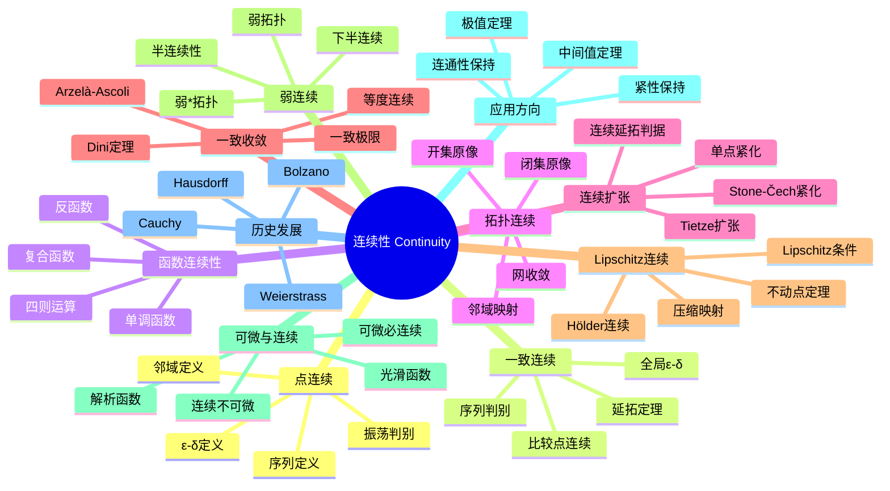

# 连续性 思维导图

## 中心概念
连续性是数学中最基本的概念之一，描述了函数或映射的"无跳跃"性质。它不仅是微积分的基础，也是拓扑学的核心，连接了分析与几何。

## 核心分支

### 定义与公理
- **点连续**: $\lim_{x \to a} f(x) = f(a)$，或 $\forall \epsilon > 0, \exists \delta > 0, |x-a| < \delta \Rightarrow |f(x)-f(a)| < \epsilon$
- **一致连续**: $\forall \epsilon > 0, \exists \delta > 0, |x-y| < \delta \Rightarrow |f(x)-f(y)| < \epsilon$（$\delta$ 不依赖点）
- **拓扑连续**: $f^{-1}(U)$ 开，对所有开集 $U$
- **序列连续**: $x_n \to x$ 蕴含 $f(x_n) \to f(x)$

### 基本性质
- **四则运算**: 连续函数的和、差、积、商（分母非零）连续
- **复合**: 连续函数的复合连续
- **紧集上**: 紧集上的连续函数一致连续（Heine-Cantor）
- **保拓扑性质**: 连续映射保持连通性、紧性、道路连通性

### 重要例子
- **连续函数**: 多项式、指数、三角函数、对数（定义域内）
- **不连续函数**: Dirichlet函数、符号函数、取整函数
- **一致连续**: $f(x) = x$ 在 $\mathbb{R}$ 上；$f(x) = \sqrt{x}$ 在 $[0,\infty)$
- **非一致连续**: $f(x) = x^2$ 在 $\mathbb{R}$ 上；$f(x) = \sin(1/x)$ 在 $(0,1)$
- **Weierstrass函数**: 处处连续处处不可微

### 核心定理
- **中间值定理**: 连续函数取到区间端点值之间的所有值（证明思路：连通性保持）
- **极值定理**: 紧集上的连续函数必取到最大最小值
- **Heine-Cantor定理**: 紧度量空间上的连续函数一致连续
- **Tietze扩张定理**: 正规空间中闭子集上的连续函数可连续延拓到全空间
- **Arzelà-Ascoli定理**: 函数列紧性的判据

### 相关概念
- **父概念**: 极限、拓扑、度量空间
- **子概念**: 一致连续、Lipschitz连续、绝对连续、下半连续
- **相邻概念**: 可微性、拓扑空间、紧性

### 应用领域
- **中间值定理**: 方程根的存在性
- **极值定理**: 优化问题的解存在性
- **不动点定理**: 压缩映射原理、Brouwer不动点定理
- **微分方程**: 解的存在唯一性定理

### 历史发展
- **早期发展**: Euler、Lagrange的直观连续性概念
- **严格化**:
  - 1817：Bolzano给出中间值定理的严格证明
  - 1821：Cauchy《分析教程》
  - 1872：Weierstrass构造处处连续处处不可微函数
  - 1914：Hausdorff拓扑连续性定义
- **现代发展**: 广义函数、分布理论

### 参考资源
- **推荐教材**: Rudin《Principles of Mathematical Analysis》、Munkres《Topology》
- **相关论文**: Weierstrass《Über continuirliche Functionen eines reellen Arguments》(1872)
- **在线资源**: 3Blue1Brown连续性可视化

---

**概念链接**: [[极限]] [[导数]] [[拓扑空间]] [[一致收敛]] [[泛函分析]]
