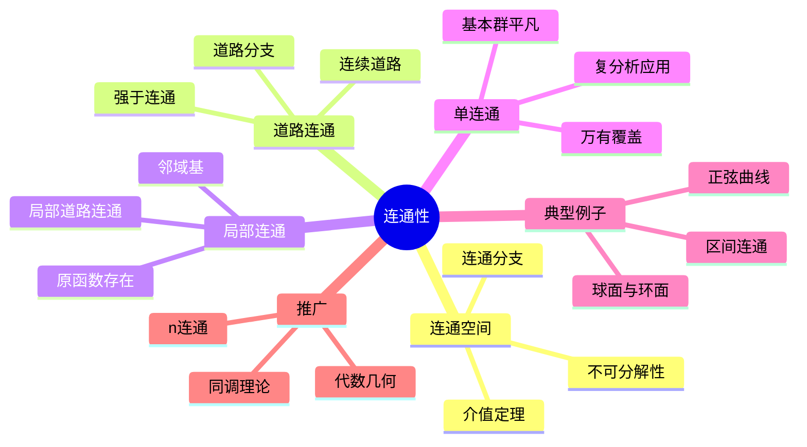

# 连通性 思维导图

## 中心概念

### 精确定义

**连通性**描述拓扑空间"不可分"的性质。空间 $X$ 称为连通的，如果它不能分解为两个非空不交开集的并。等价地，$X$ 的既开又闭子集只有 $\emptyset$ 和 $X$。

### 直观理解

连通性捕捉空间的"整体性"——能否"一笔画"遍。连通空间没有"裂缝"，任何连续映射到离散空间的像都是单点。连通性是拓扑学研究的基本不变量之一。

---

## 第一层分支：核心要素

### 连通性

- **定义**：不存在分解 $X = U \cup V$，$U, V$ 非空不交开集
- **等价刻画**：
  - 不存在非平凡的既开又闭集
  - 连续映射 $f: X \to \{0,1\}$ 必为常数
  - $X$ 不能表示为两个非空分离集的并
- **连通分支**：极大连通子集，构成 $X$ 的划分

### 道路连通性

- **定义**：任意两点可用连续道路连接
  - 道路：$\gamma: [0,1] \to X$，$\gamma(0) = a$，$\gamma(1) = b$
- **与连通性关系**：道路连通 $\Rightarrow$ 连通，反之不成立
- **道路分支**：极大道路连通子集

### 局部连通性

- **局部连通**：每点有连通邻域基
- **局部道路连通**：每点有道路连通邻域基
- **关系**：局部道路连通 $\Rightarrow$ 局部连通
- **应用**：复分析（区域上全纯函数的原函数）

### 单连通性

- **定义**：道路连通且基本群平凡（每条闭道路可连续收缩为一点）
- **等价条件**：
  - 闭道路的连续形变（同伦）到常值道路
  - 任意两点间道路的（同伦）唯一性
- **应用**：复变函数论、覆盖空间理论

---

## 第二层分支：性质与定理

### 重要性质

#### 1. 连通性的基本性质

- **连续像**：连通空间的连续像是连通的
- **积空间**：连通空间的积空间连通
- **闭包性质**：$A$ 连通，$A \subseteq B \subseteq \bar{A}$ $\Rightarrow$ $B$ 连通
- **并的性质**：连通子集族有非空交，则并连通

#### 2. 道路连通性的性质

- **连续像**：道路连通空间的连续像道路连通
- **积空间**：道路连通空间的积空间道路连通
- **运算性质**：道路连通集的并在有公共点时道路连通

### 核心定理

#### 1. 连通性的判定

- **介值定理**：连通空间的连续实函数取到中间值
- **区间连通性**：$\mathbb{R}$ 的连通子集恰为区间
- **凸集连通性**：赋范空间的凸集道路连通

#### 2. 道路连通与连通的区别

- **拓扑学家的正弦曲线**：
  $$X = \{(x, \sin(1/x)) : x \in (0,1]\} \cup \{(0,y) : y \in [-1,1]\}$$
  - 连通但非道路连通
  - "垂直段"与"振荡曲线"在 $(0,0)$ 处"粘连"但无道路连接

#### 3. 基本群与单连通性

- **定义**：$\pi_1(X, x_0)$，以 $x_0$ 为基点的闭道路同伦类
- **单连通**：$\pi_1(X) = 0$（平凡群）
- **覆盖空间**：单连通空间是万有覆盖空间
- **Seifert-van Kampen定理**：计算基本群的方法

#### 4. Jordan曲线定理

- **内容**：平面上的简单闭曲线分平面为两个区域（内部和外部）
- **推论**：Jordan曲线是平面的连通分支边界
- **推广**：高维情形的Jordan-Brouwer分离定理

---

## 第三层分支：例子与应用

### 典型例子

#### 1. 连通空间

- **区间**：$[a,b]$，$(a,b)$，$[a,b)$ 等
- **欧氏空间**：$\mathbb{R}^n$（道路连通）
- **球面**：$S^n$（$n \geq 1$ 时道路连通，$n \geq 2$ 时单连通）
- **环面**：$T^2 = S^1 \times S^1$（连通但非单连通）

#### 2. 非连通空间

- **离散多于一点的空间**
- **$\mathbb{R} \setminus \{0\} = (-\infty, 0) \cup (0, +\infty)$**
- **Cantor集**：完全不连通（无连通子集多于一点）
- **$GL_n(\mathbb{R})$**：两个连通分支（行列式正负）

#### 3. 连通但非道路连通

- **拓扑学家的正弦曲线**
- **梳子空间**：类似的构造

#### 4. 单连通空间

- **$\mathbb{R}^n$**：可缩空间，单连通
- **$S^n$**（$n \geq 2$）：单连通
- **复平面上的单连通区域**：Jordan区域

#### 5. 非单连通空间

- **$S^1$**：$\pi_1(S^1) = \mathbb{Z}$
- **$T^n$**（$n \geq 1$）：$\pi_1(T^n) = \mathbb{Z}^n$
- **$\mathbb{R}^2 \setminus \{0\}$**：同伦等价于 $S^1$

### 反例

#### 1. 连通但不局部连通

- **无限扫帚**：$X = \bigcup_{n=1}^\infty L_n$，其中 $L_n$ 是从 $(0,0)$ 到 $(1, 1/n)$ 的线段
- **性质**：连通，但在 $(0,0)$ 不局部连通

#### 2. 局部连通但不连通

- **两个不交开区间**：各自局部连通，整体不连通

### 应用场景

#### 1. 复变函数论

- **单连通区域**：Cauchy积分定理成立
- **原函数存在性**：单连通区域上全纯函数有原函数
- **Riemann映射定理**：单连通真子域共形等价于单位圆盘

#### 2. 代数拓扑

- **基本群**：分类空间的"洞"
- **覆盖空间**：用单连通覆盖研究非单连通空间
- **同调论**：连通分支的计数

#### 3. 图论

- **图的连通性**：路径、割点、桥
- **网络可靠性**：连通度与容错性
- **Menger定理**：连通性与不交路径

#### 4. 动力系统

- **不变集**：连通不变集的结构
- **吸引子**：连通吸引子的拓扑性质
- **混沌区域**：分形边界与连通性

#### 5. 微分几何

- **流形的连通性**：连通流形的分类
- **复流形**：Stein流形、单连通与全纯函数
- **纤维丛**：丛的全空间连通性

---

## 第四层分支：关联概念

### 相似概念

#### 完全连通性（完全不连通）

- **定义**：连通分支都是单点
- **例子**：Cantor集、$p$-adic整数、离散空间
- **Profinite群**：完全不连通紧致群

#### 线性连通性

- **定义**：任意两点可用嵌入的线段连接
- **关系**：强于道路连通
- **例子**：星形集、凸集

### 对偶概念

#### 可缩性

- **定义**：可连续形变收缩到一点
- **关系**：可缩 $\Rightarrow$ 单连通，反之不成立
- **例子**：$\mathbb{R}^n$ 可缩，$S^n$（$n \geq 2$）单连通但不可缩

### 推广概念

#### 高阶连通性

- **$n$-连通**：低维同伦群平凡
- **弱等价**：诱导所有同伦群同构
- **CW复形**：用胞腔构造空间的框架

#### 同调与上同调

- **连通性**：$H_0(X)$ 反映连通分支数
- **单连通性**：$H_1(X)$ 与 $\pi_1(X)^{ab}$ 的关系
- **障碍理论**：上同调与扩张问题

#### 代数几何中的连通性

- **Zariski连通性**：Zariski拓扑下的连通性
- **切触连通性**：代数簇的切触性质
- **算术连通性**：概形在基域扩张下的连通性

---

## Mermaid思维导图

---

**参考章节**：拓扑学 - 第4章 连通性
**关联文件**：拓扑空间-思维导图.md、紧致性-思维导图.md
