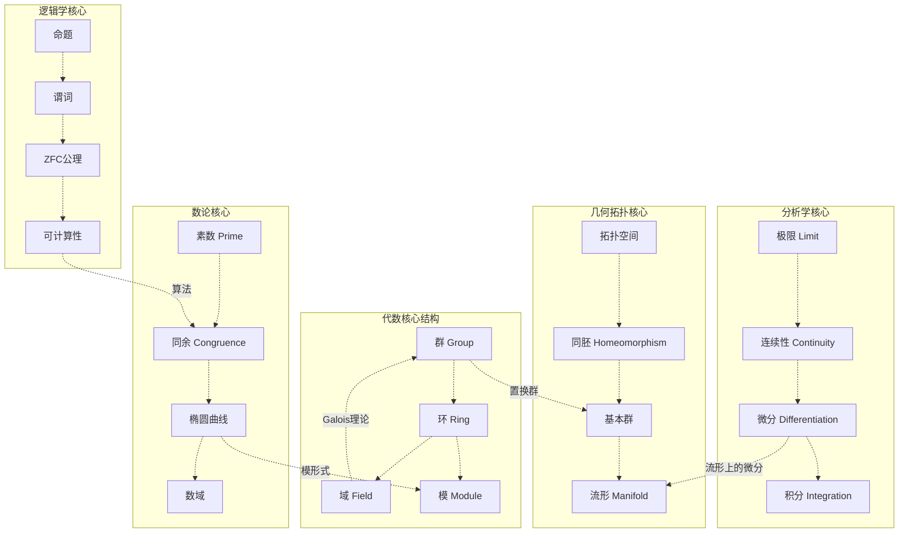
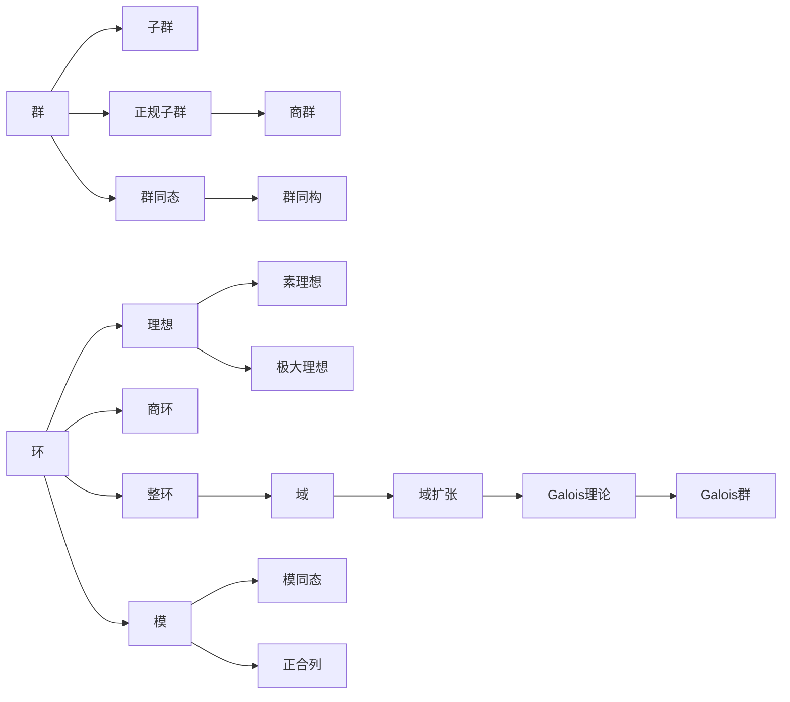
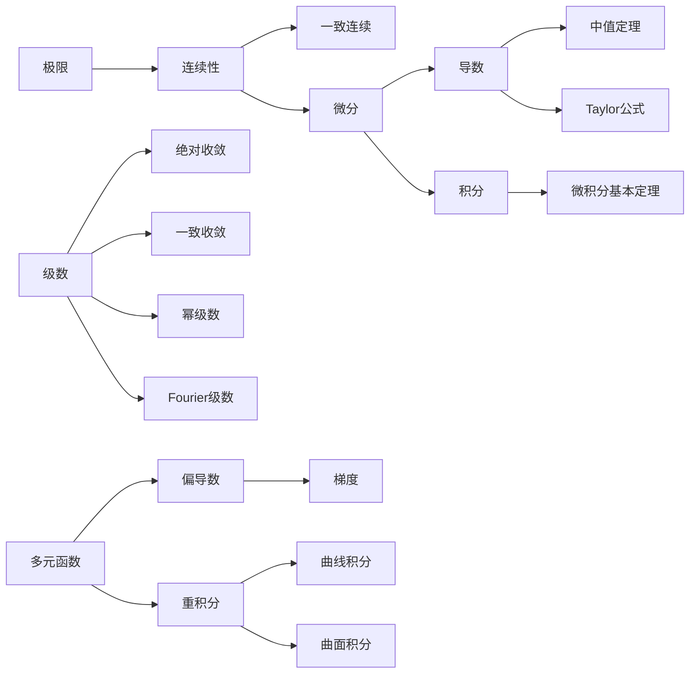
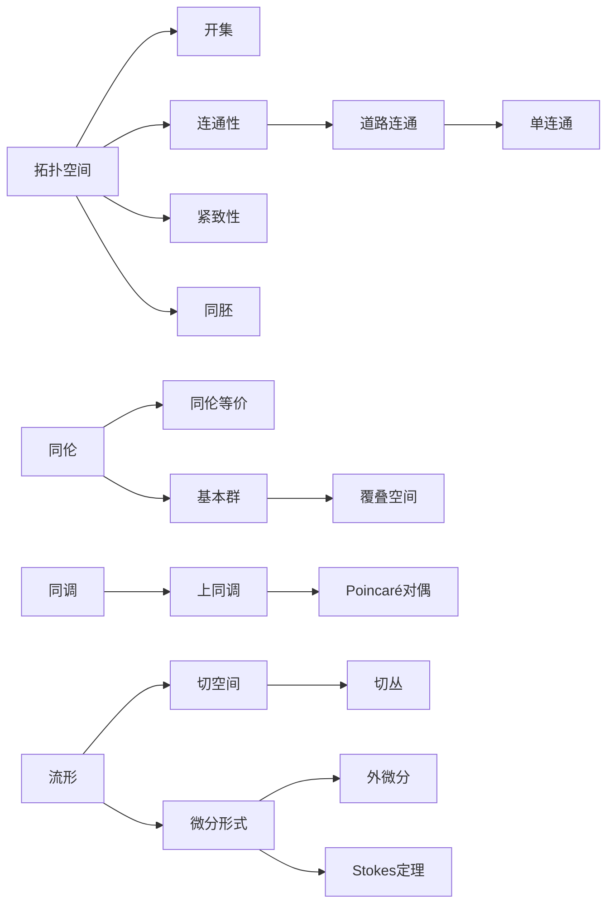
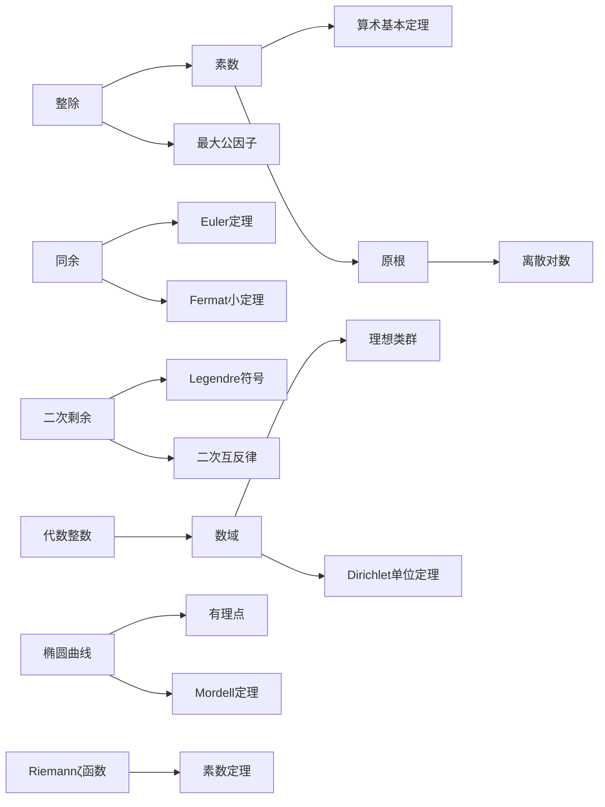
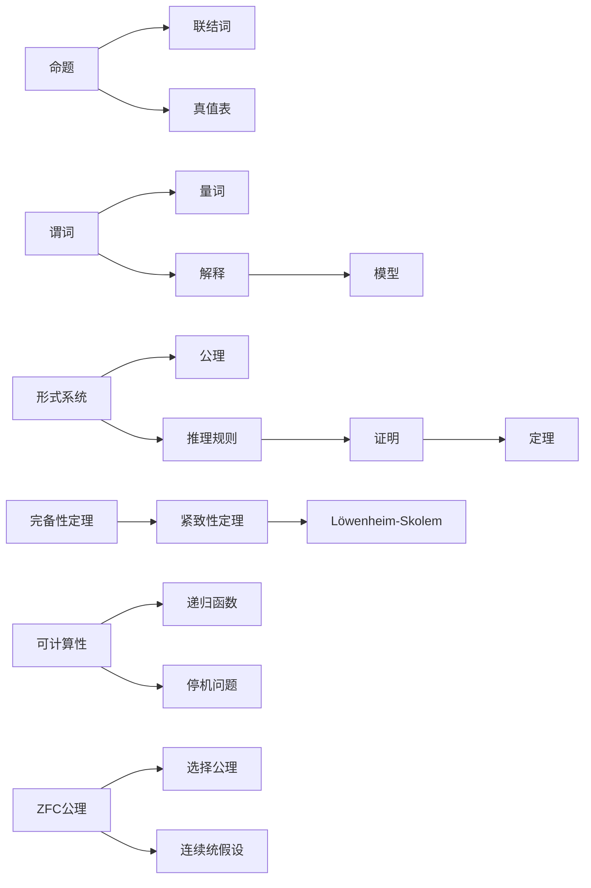

# FormalMath 概念双向链接网络

## 概述
本文档构建了FormalMath项目中核心概念之间的双向链接网络，展示了数学知识的结构化关联。

## 数学分支全景网络

## 代数结构内部网络

## 分析学内部网络

## 几何拓扑内部网络

## 数论内部网络

## 逻辑学内部网络

## 跨分支链接

### 代数 ↔ 数论
- **群论**: 类群、单位群、Galois群
- **环论**: 代数整数环、理想分解
- **域论**: 数域、局部域

### 代数 ↔ 拓扑
- **代数拓扑**: 同调群、同伦群、基本群
- **李群**: 群结构与流形结构的结合
- **层论**: 拓扑空间上的代数结构

### 分析 ↔ 几何
- **微分几何**: 流形上的分析
- **微分形式**: 积分理论的几何化
- **复几何**: 复流形、Kähler几何

### 逻辑 ↔ 计算机科学
- **可计算性**: 算法理论的基础
- **形式化验证**: 程序正确性证明
- **类型论**: 逻辑与编程语言的桥梁

## 双向链接索引

### 代数结构
| 概念 | 出链 | 入链 |
|------|------|------|
| 群 | 子群、正规子群、群同态 | 环的单位群、Galois群 |
| 环 | 理想、子环、整环 | 模、代数整数环 |
| 域 | 子域、域扩张 | 整环的分式域、数域 |
| 模 | 子模、商模、自由模 | 向量空间、表示论 |

### 分析学
| 概念 | 出链 | 入链 |
|------|------|------|
| 极限 | 连续性、级数 | 微积分基础 |
| 连续性 | 一致连续、微分 | 极限、拓扑 |
| 微分 | 导数、中值定理 | 连续性、积分 |
| 积分 | 微积分基本定理 | 微分、测度论 |

### 几何拓扑
| 概念 | 出链 | 入链 |
|------|------|------|
| 拓扑空间 | 开集、闭集、连续性 | 流形、度量空间 |
| 同胚 | 拓扑不变量 | 拓扑空间映射 |
| 基本群 | 覆叠空间 | 同伦、代数拓扑 |
| 流形 | 切空间、微分形式 | 拓扑空间、微分几何 |

### 数论
| 概念 | 出链 | 入链 |
|------|------|------|
| 素数 | 整除、同余 | 算术基本定理 |
| 同余 | Euler定理、原根 | 整除、模运算 |
| 椭圆曲线 | 有理点、Mordell定理 | 代数几何、密码学 |
| 数域 | 理想类群、单位定理 | 代数整数、代数数论 |

### 逻辑学
| 概念 | 出链 | 入链 |
|------|------|------|
| 命题 | 联结词、真值表 | 谓词逻辑基础 |
| 谓词 | 量词、解释 | 命题逻辑扩展 |
| ZFC | 选择公理、大基数 | 集合论基础 |
| 可计算性 | 递归函数、停机问题 | 算法理论基础 |

## 使用说明

1. **概念导航**: 通过双向链接在相关概念间跳转
2. **知识路径**: 跟随链接构建学习路径
3. **交叉引用**: 查看概念在不同分支中的应用
4. **网络分析**: 理解概念间的依赖关系
