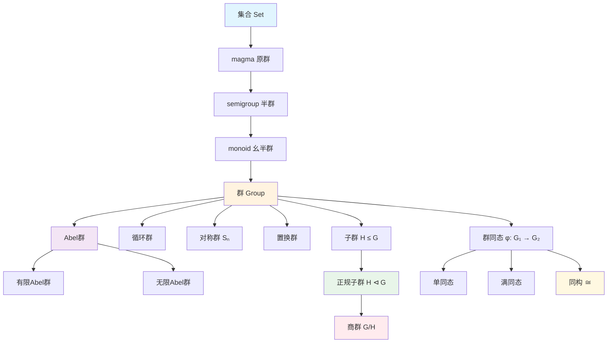
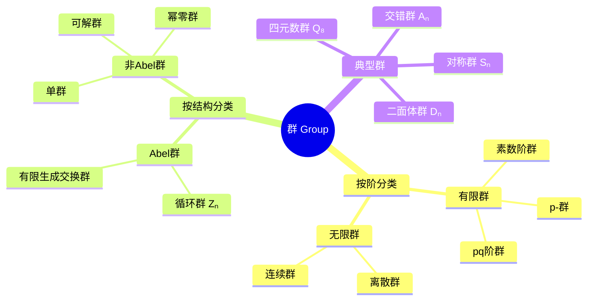

msc_primary: "20A05"
msc_secondary: ['20B30']
concept_type: "概念可视化"
visualization_type: "层次结构图"
---

# 群论基础概念层次图

## 描述

本可视化展示群论中各类代数结构的层次关系，从最基本的集合结构逐步构建到复杂的群结构，以及群的分类体系。

## 数学概念

群论是抽象代数的核心分支，研究具有二元运算的代数结构。本图展示从集合到群、从群到各类特殊群的完整层次。

## 可视化代码

### 群结构层次图



### 群分类体系



### 群作用关系图

```mermaid
graph LR
    subgraph 群G
    G1[g ∈ G]
    end

    subgraph 集合X
    X1[x ∈ X]
    X2[g·x ∈ X]
    end

    G1 -->|作用| X1
    G1 -.->|诱导| X2

    X1 --> X2

    subgraph 轨道与稳定子
    O[轨道 Orb(x)]
    S[稳定子 Stab(x)]
    end

    X1 --> O
    G1 --> S

    style G1 fill:#bbdefb
    style X1 fill:#c8e6c9
    style O fill:#fff9c4
    style S fill:#ffccbc

```

### ASCII结构图

```

群论概念层次结构
═══════════════════════════════════════════════════════════

第零层：基础结构
┌─────────────────────────────────────────────────────────┐
│  集合 (Set)                                              │
│  └── 配备二元运算 · : S × S → S                          │
│      └── 原群 (Magma)                                    │
└─────────────────────────────────────────────────────────┘
                            ↓
第一层：结合性
┌─────────────────────────────────────────────────────────┐
│  半群 (Semigroup)                                        │
│  └── 增加单位元 e                                        │
│      └── 幺半群 (Monoid)                                 │
└─────────────────────────────────────────────────────────┘
                            ↓
第二层：逆元
┌─────────────────────────────────────────────────────────┐
│  群 (Group) (G, ·, e)                                    │
│  ├── 封闭性: ∀a,b ∈ G, a·b ∈ G                          │
│  ├── 结合律: (a·b)·c = a·(b·c)                          │
│  ├── 单位元: a·e = e·a = a                               │
│  └── 逆元: ∀a, ∃a⁻¹, a·a⁻¹ = e                          │
└─────────────────────────────────────────────────────────┘
                            ↓
第三层：交换性
┌─────────────────────────────────────────────────────────┐
│  Abel群 (Abelian Group)                                  │
│  └── 交换律: a·b = b·a                                   │
└─────────────────────────────────────────────────────────┘

典型例子层级:
━━━━━━━━━━━━━━━━━━━━━━━━━━━━━━━━━━━━━━━━━━━━━━━━━━━━━━━━━━
ℤ  ⊃  nℤ  ⊃  {0}           (整数加法子群链)
S₃  ⊃  A₃  ⊃  {e}          (对称群到交错群)
GL(n,ℝ)  ⊃  SL(n,ℝ)        (一般线性群到特殊线性群)
═══════════════════════════════════════════════════════════

```

## 交互说明

- **点击查看详情**: 点击图中节点可查看该概念的详细定义
- **颜色编码**:
  - 蓝色: 基础结构
  - 橙色: 核心群概念
  - 紫色: Abel群相关
  - 绿色: 子群与正规子群
  - 红色: 商群
  - 黄色: 同构

## 参考

1. Dummit, D. S., & Foote, R. M. (2004). Abstract Algebra. Wiley.
2. Lang, S. (2002). Algebra. Springer.
3. Artin, M. (2011). Algebra. Pearson.
