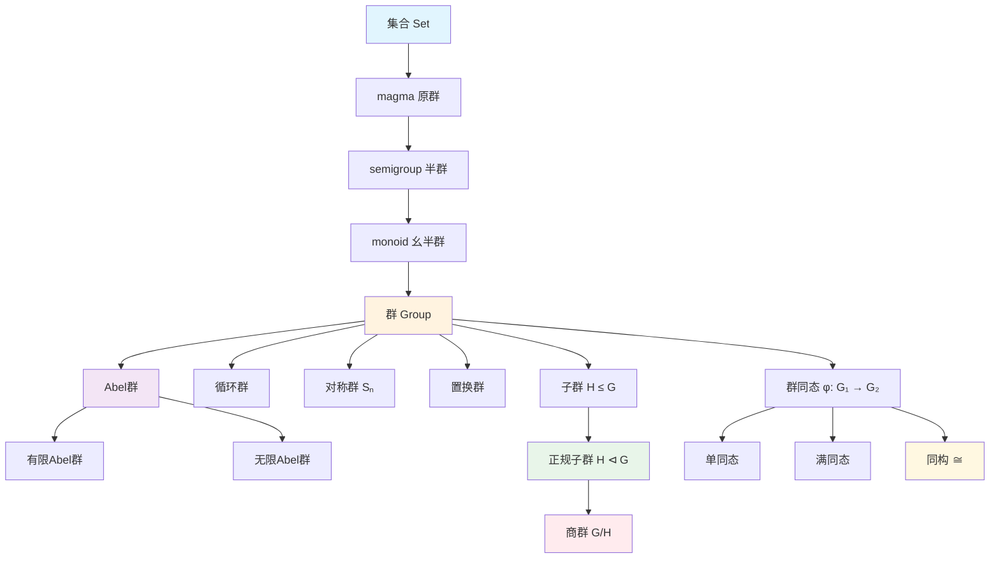

# 群论基础概念层次图

## 1. 从集合到群

**定义 1.1（原群与半群）**.
- **原群（magma）**：集合配备封闭二元运算 $(S, \cdot)$；
- **半群（semigroup）**：满足结合律的原群；
- **幺半群（monoid）**：有单位元的半群。

**定义 1.2（群）**. 群 $(G, \cdot)$ 是幺半群，且每个元素有逆元：$\forall a \in G, \exists a^{-1} \in G: aa^{-1} = a^{-1}a = e$。

**例子 1.3**.
- $(\mathbb{Z}, +)$：无限 Abel 群；
- $(\mathbb{Q}^\times, \cdot)$：Abel 群；
- $GL_n(\mathbb{R})$：一般线性群，非 Abel（$n \geq 2$）；
- $S_n$：$n$ 元对称群，阶为 $n!$；
- 四元数群 $Q_8 = \{\pm 1, \pm i, \pm j, \pm k\}$，非 Abel 有限群。

## 2. 子群与正规子群

**定义 2.1（子群）**. $H \subseteq G$ 为子群（$H \leq G$），若 $H$ 在 $G$ 的运算下成群。等价判定：$H \neq \emptyset$ 且 $a, b \in H \Rightarrow ab^{-1} \in H$。

**定义 2.2（正规子群）**. $N \leq G$ 为正规子群（$N \trianglelefteq G$），若 $gNg^{-1} = N$ 对所有 $g \in G$。等价地，$N$ 是某同态的核。

**定理 2.3（商群）**. 若 $N \trianglelefteq G$，则 $G/N = \{gN : g \in G\}$ 在运算 $(g_1N)(g_2N) = g_1g_2N$ 下成群。

*证明*. 良定义性：若 $g_1N = g_1'N$，$g_2N = g_2'N$，则 $g_1' = g_1n_1$，$g_2' = g_2n_2$。$g_1'g_2' = g_1g_2(g_2^{-1}n_1g_2)n_2 \in g_1g_2N$（由正规性）。其余群公理直接验证。$\square$

## 3. 同态与同构

**定义 3.1（群同态）**. 映射 $\varphi: G \to H$ 称为同态，若 $\varphi(ab) = \varphi(a)\varphi(b)$。

**定义 3.2（核与像）**.
- **核**：$\ker\varphi = \{g \in G : \varphi(g) = e_H\} \trianglelefteq G$；
- **像**：$\operatorname{im}\varphi = \{\varphi(g) : g \in G\} \leq H$。

**定理 3.3（同态基本定理）**. $G/\ker\varphi \cong \operatorname{im}\varphi$。

*证明*. 定义 $\bar{\varphi}(g\ker\varphi) = \varphi(g)$。良定义：若 $g_1\ker\varphi = g_2\ker\varphi$，则 $g_1^{-1}g_2 \in \ker\varphi$，故 $\varphi(g_1) = \varphi(g_2)$。$\bar{\varphi}$ 为同态、满射。单射：$\bar{\varphi}(g\ker\varphi) = e \Rightarrow g \in \ker\varphi \Rightarrow g\ker\varphi = \ker\varphi$。$\square$

## 4. 群作用

**定义 4.1（群作用）**. 群 $G$ 在集合 $X$ 上的作用是同态 $G \to \operatorname{Sym}(X)$，或等价地，映射 $G \times X \to X$（$(g, x) \mapsto g \cdot x$）满足 $e \cdot x = x$ 和 $(gh) \cdot x = g \cdot (h \cdot x)$。

**定义 4.2（轨道与稳定子）**.
- **轨道**：$\operatorname{Orb}(x) = \{g \cdot x : g \in G\} \subseteq X$；
- **稳定子**：$\operatorname{Stab}(x) = \{g \in G : g \cdot x = x\} \leq G$。

**定理 4.3（轨道-稳定子）**. $|\operatorname{Orb}(x)| = [G : \operatorname{Stab}(x)]$。

*证明*. 映射 $g\operatorname{Stab}(x) \mapsto g \cdot x$ 给出 $G/\operatorname{Stab}(x)$ 与 $\operatorname{Orb}(x)$ 之间的双射。$\square$

**推论 4.4（Burnside 引理）**. 有限群作用下轨道数
$$|X/G| = \frac{1}{|G|}\sum_{g \in G} |X^g|,$$
其中 $X^g = \{x \in X : g \cdot x = x\}$。

## 5. 群的分类

**定理 5.1（Lagrange）**. 有限群 $G$ 的子群 $H$ 满足 $|H| \mid |G|$。

**定理 5.2（Cauchy）**. 若素数 $p \mid |G|$，则 $G$ 有 $p$ 阶元。

**定理 5.3（Sylow）**.
- 存在 Sylow $p$-子群（阶为 $p^k$，$p^k \mid |G|$ 但 $p^{k+1} \nmid |G|$）；
- 所有 Sylow $p$-子群共轭；
- Sylow $p$-子群个数 $n_p \equiv 1 \pmod{p}$ 且 $n_p \mid |G|/p^k$。

## 6. 可视化：群结构层次

## 7. 参考

1. Dummit, D. S., & Foote, R. M. (2004). *Abstract Algebra* (3rd ed.). Wiley.
2. Lang, S. (2002). *Algebra* (3rd ed.). Springer.
3. Artin, M. (2011). *Algebra* (2nd ed.). Pearson.
