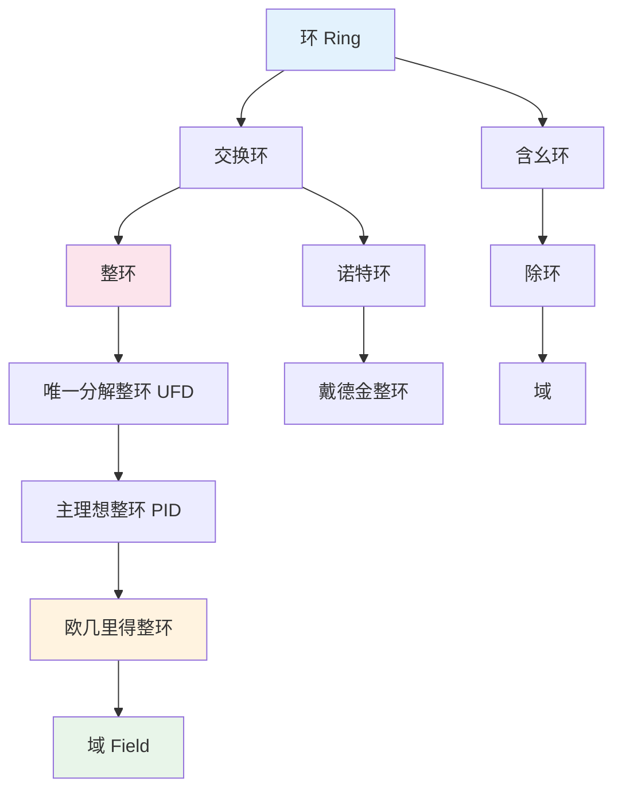

# 环论结构层次图

## 1. 环的基本定义

**定义 1.1（环）**. 环 $(R, +, \cdot)$ 是配备两个二元运算的集合，满足：
- $(R, +)$ 为 Abel 群，零元记为 $0$；
- 乘法结合律：$(a \cdot b) \cdot c = a \cdot (b \cdot c)$；
- 分配律：$a \cdot (b+c) = a \cdot b + a \cdot c$，$(b+c) \cdot a = b \cdot a + c \cdot a$。

若存在元素 $1 \in R$ 使得 $1 \cdot a = a \cdot 1 = a$ 对所有 $a \in R$ 成立，则称 $R$ 为**含幺环**。若乘法交换，则称**交换环**。

**例子 1.2**.
- $(\mathbb{Z}, +, \cdot)$：含幺交换环；
- $M_n(\mathbb{R})$：含幺非交换环（$n \geq 2$）；
- $\mathbb{Z}/n\mathbb{Z}$：有限含幺交换环；
- 偶数环 $2\mathbb{Z}$：无幺交换环。

## 2. 环的层次结构

### 2.1 从环到域的链条

在交换含幺环中，有一系列重要的子类，形成严格的包含链条：

$$\text{域} \subset \text{欧几里得整环} \subset \text{主理想整环 (PID)} \subset \text{唯一分解整环 (UFD)} \subset \text{整环} \subset \text{交换环}.$$

**定义 2.1（整环）**. 交换含幺环 $R$ 称为整环，若 $1 \neq 0$ 且无零因子：$ab = 0 \Rightarrow a = 0$ 或 $b = 0$。

**定义 2.2（唯一分解整环）**. 整环 $R$ 称为 UFD，若每个非零非单位元可唯一分解为不可约元的乘积（不计次序和单位因子）。

**定义 2.3（主理想整环）**. 整环 $R$ 称为 PID，若每个理想都是主理想，即形如 $(a) = aR$。

**定理 2.4**. 每个 PID 都是 UFD。

*证明*. 先证 PID 满足升链条件（理想升链稳定）。对非空理想集，取并仍为理想，由 PID 假设为主理想 $(a)$，$a$ 属于某理想，该理想即极大元。再由 Zorn 引理知 PID 是 Noether 环。因子链条件满足后，利用主理想极大元为素元，证明不可约元 = 素元，从而分解唯一。$\square$

**定义 2.5（欧几里得整环）**. 整环 $R$ 称为欧几里得整环，若存在欧几里得函数 $d: R \setminus \{0\} \to \mathbb{N}$，使得对任意 $a, b \in R$（$b \neq 0$），存在 $q, r \in R$ 满足 $a = qb + r$，其中 $r = 0$ 或 $d(r) < d(b)$。

**定理 2.6**. 每个欧几里得整环都是 PID。

*证明*. 对非零理想 $I$，取 $b \in I \setminus \{0\}$ 使 $d(b)$ 最小。对任意 $a \in I$，做带余除法 $a = qb + r$。则 $r = a - qb \in I$，由最小性 $r = 0$，故 $I = (b)$。$\square$

**定义 2.7（域）**. 交换含幺环 $F$ 称为域，若每个非零元都有乘法逆元：$F^\times = F \setminus \{0\}$。

### 2.2 理想的结构

**定义 2.8（素理想与极大理想）**. 设 $R$ 为交换含幺环，真理想 $P \subsetneq R$：
- **素理想**：$ab \in P \Rightarrow a \in P$ 或 $b \in P$；等价地，$R/P$ 为整环。
- **极大理想**：不存在理想 $I$ 使 $P \subsetneq I \subsetneq R$；等价地，$R/P$ 为域。

**定理 2.9**. 每个极大理想都是素理想。

*证明*. $M$ 极大 $\Rightarrow R/M$ 为域 $\Rightarrow R/M$ 为整环 $\Rightarrow M$ 素。$\square$

**定理 2.10（Krull）**. 每个非零含幺环都有极大理想（需要选择公理或 Zorn 引理）。

### 2.3 Noether 环与 Artin 环

**定义 2.11（Noether 环）**. 环 $R$ 称为 Noether 环，若理想满足升链条件（ACC）：任何理想升链 $I_1 \subseteq I_2 \subseteq \cdots$ 稳定。

**定理 2.12（Hilbert 基定理）**. $R$ Noether 蕴含 $R[x]$ Noether。

*证明概要*. 对 $J \subseteq R[x]$，令 $I_n$ 为 $J$ 中次数 $\leq n$ 多项式的首项系数（连同 0）构成的理想。$I_0 \subseteq I_1 \subseteq \cdots$ 稳定于 $I_N$。取各 $I_n$（$n \leq N$）的有限生成元对应的多项式，它们生成 $J$。$\square$

## 3. 重要例子与反例

**例子 3.1**. $\mathbb{Z}$ 是欧几里得整环（取 $d(n) = |n|$），从而是 PID、UFD、整环，但不是域。

**例子 3.2**. 域 $F$ 上的多项式环 $F[x]$ 是欧几里得整环（取 $d(f) = \deg f$），故为 PID。

**例子 3.3（非 PID 的 UFD）**. $\mathbb{Z}[x]$ 是 UFD（Gauss 引理），但不是 PID：理想 $(2, x)$ 不是主理想。

**例子 3.4（非 UFD 的整环）**. $\mathbb{Z}[\sqrt{-5}]$ 是整环但不是 UFD，因为 $6 = 2 \cdot 3 = (1+\sqrt{-5})(1-\sqrt{-5})$ 给出两种本质不同的不可约分解。

**例子 3.5（除环非域）**. 四元数环 $\mathbb{H} = \{a + bi + cj + dk : a,b,c,d \in \mathbb{R}\}$ 是除环（每个非零元可逆），但乘法不交换，故不是域。

## 4. 可视化：层次结构

## 5. 参考

1. Dummit, D. S., & Foote, R. M. (2004). *Abstract Algebra*. Wiley.
2. Atiyah, M. F., & Macdonald, I. G. (1969). *Introduction to Commutative Algebra*. Addison-Wesley.
3. Lang, S. (2002). *Algebra* (3rd ed.). Springer.
