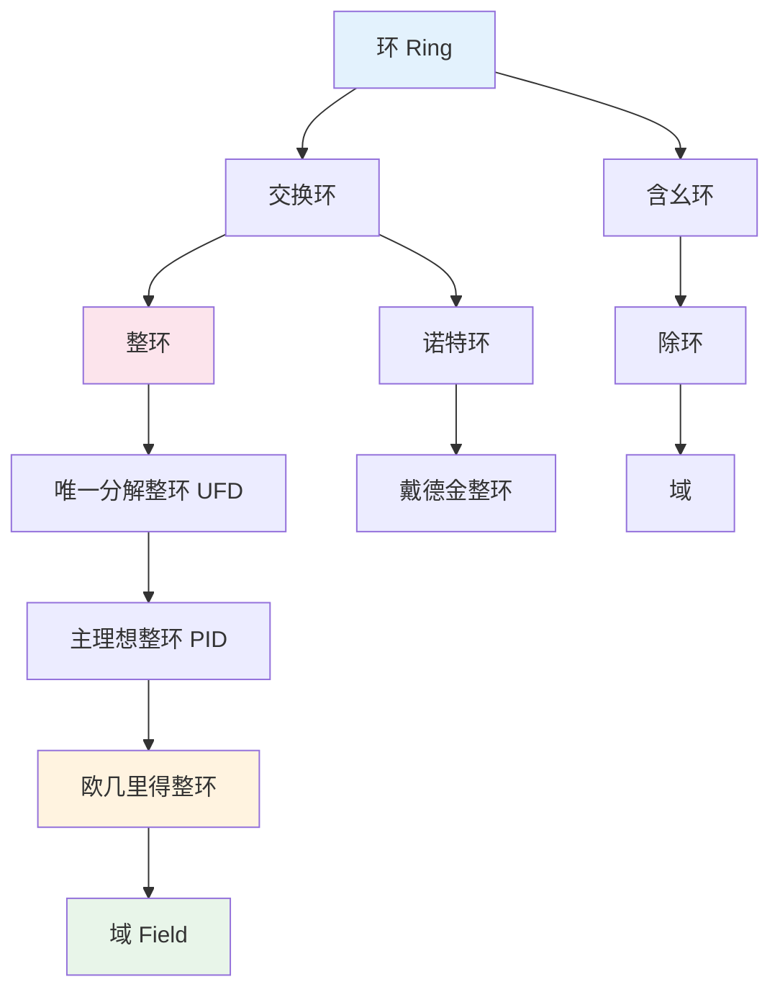

msc_primary: "13Axx"
msc_secondary: ['16Axx']
concept_type: "概念可视化"
visualization_type: "层次结构图"
---

# 环论结构层次图

## 描述

本可视化展示环论中各类代数结构的层次关系，从环到交换环、整环、域等，以及理想的结构。

## 数学概念

环是具有两个二元运算（加法和乘法）的代数结构，推广了整数和多项式的代数性质。

## 可视化代码



```

环的结构层次
═══════════════════════════════════════════════════════════════

基本定义链:
───────────────────────────────────────────────────────────────
环 R: (R, +, ·)
  • (R, +) 是Abel群
  • 乘法结合律
  • 分配律

交换环: 乘法交换 (ab = ba)
  ↓
整环: 无零因子，1 ≠ 0
  ↓
UFD: 唯一分解整环
  ↓
PID: 主理想整环
  ↓
欧几里得整环: 带除法算法
  ↓
域: 非零元可逆

理想结构:
───────────────────────────────────────────────────────────────
理想 I ⊂ R
  ├── 素理想: ab ∈ I ⇒ a ∈ I 或 b ∈ I
  ├── 极大理想: I ⊂ J ⊂ R ⇒ J=I 或 J=R
  └── 主理想: I = (a) = aR

```

## 参考

1. Dummit, D. S., & Foote, R. M. (2004). Abstract Algebra.
2. Atiyah, M. F., & Macdonald, I. G. (1969). Introduction to Commutative Algebra.
